# Phase 11: Wall Opening and Door Operations - Specification

**Status:** Draft for user review
**Date:** 2026-07-28
**Depends on:** Phases 7, 8, 9, 09.1 and 10 through 10.5
**Requirements:** OPS-01, OPS-02
**Decision record:** [11-CONTEXT.md](11-CONTEXT.md)

## 1. Problem

The production IFC repair pipeline currently exposes one geometry mutation
family: `add_window_with_opening_to_wall`. Common orchestration is already
registry-driven, but several request, projection, generated-Type, damage,
comparison and prompt paths still contain Window-specific assumptions.

Door shares the same Wall–Opening–Filling topology but cannot be modeled as a
renamed Window:

- IFC2X3 opening behavior is carried by `IfcDoorStyle.OperationType`;
- handedness is relative to Door local placement and therefore needs a
  viewpoint, not just the word “left” or “right”;
- Door style may own lining, panel, representation, material and property
  facts;
- an exact Type name is not equivalent to a formal `OperationType`;
- a damaged file may retain an empty Opening after the Door is lost;
- clear-passage, leaf, rough-opening and overall-opening dimensions are not
  interchangeable.

Phase 11 must add Opening and Door operations without weakening the public
authority boundary, copying the Window implementation, or asking the Provider
to generate unsupported IFC structures.

## 2. Goal

Given an IFC2X3 file and an authorized natural-language request, the system can
produce one bound atomic ChangeSet that:

1. creates an opening without a filling element;
2. creates a Door and its Opening in a straight Wall;
3. restores a Door into one surviving empty Opening;
4. reuses an explicitly selected existing `IfcDoorStyle` unchanged or creates
   one supported dedicated system style;
5. authors only explicit or deterministic Door semantics;
6. publishes only after reopened-IFC L1, Door L2, occurrence fidelity and
   global preservation succeed.

The complete path remains:

```mermaid
flowchart LR
    U["IFC2X3 + user text"] --> S1["Stage 1<br/>RepairIntent + routing"]
    S1 --> PB["Program selects<br/>operation prompt profiles"]
    PB --> R["Clarification + deterministic<br/>target/type/property resolution"]
    R --> S2["Stage 2<br/>bounded ChangeSet draft"]
    S2 --> B["Deterministic binder"]
    B --> A["Atomic IfcOpenShell application"]
    A --> V["Reopen + L1/L2/fidelity/<br/>preservation validation"]
    V --> P["Published IFC + evidence"]
```



## 3. Scope

### 3.1 New registered operations

| Operation | Bound target | Creates | Does not create |
|---|---|---|---|
| `add_opening_to_wall` | `IfcWall` | Opening and voids relation | Door or fills relation |
| `add_door_with_opening_to_wall` | `IfcWall` | Opening, Door, voids, fills, containment and Type binding | Space boundary |
| `fill_existing_opening_with_door` | empty `IfcOpeningElement` | Door, fills, containment and Type binding | a second Opening or voids relation |

The existing generic `set_occurrence_properties` operation remains applicable
to `IfcDoor`; it is not reimplemented as a Door-only property operation.

### 3.2 Supported Wall and Door geometry

- IFC schema: IFC2X3.
- Host: straight `IfcWall` supported by the existing wall geometry adapter.
- Generated Door styles:
  - `SINGLE_SWING_LEFT`;
  - `SINGLE_SWING_RIGHT`;
  - `NOTDEFINED` only after the user explicitly states that opening direction
    is not required.
- Existing valid `IfcDoorStyle` objects may be reused for complex doors without
  modifying or regenerating them.

### 3.3 Explicitly out of scope

- curved, segmented or free-form hosts;
- generated double, sliding, folding, revolving or rolling Door styles;
- existing Door replacement, deletion, repositioning or resizing;
- automatic scaling or mirroring of an incompatible existing Type;
- new `IfcRelSpaceBoundary` objects;
- manufacturer-level geometry and hardware;
- project-coordinate or inferred grid-intersection placement;
- L3 identity and authoring exactness.

## 4. Stage 1 routing and prompt profiles

### 4.1 RepairIntent routing field

RepairIntent advances to a version after 0.4 and adds one required
`routing_intent` to every operation:

```json
{
  "component_family": "door",
  "action": "add",
  "operation_profile": "door.add-with-opening",
  "source": {
    "source_kind": "user_request",
    "reference": "request:/text",
    "excerpt": "新增一道单扇右开门"
  }
}
```

The routing group belongs to each operation so a single request may contain
Door, Window and Opening work. Stage 1 receives a compact family/action/profile
catalog, classifies each requested action and preserves partial facts. It does
not receive all operation-family few-shots.

The runtime cross-checks:

```text
component_family
    ↔ operation_profile
    ↔ operation_type
    ↔ target IFC class
    ↔ registered capability
```

A mismatch is `OPERATION_PROFILE_MISMATCH`; Provider output never registers a
new capability.

### 4.2 Prompt profile contract

Each registered operation exposes a versioned prompt profile with:

- family and action labels;
- one-line classification terms;
- required user slots;
- conditionally required slots;
- optional user slots;
- program-derived slots;
- forbidden inferences;
- supported and unsupported variants;
- versioned few-shot IDs and hashes.

After Stage 1, clarification and Stage 2 receive only the union of profiles
referenced by the RepairIntent. A mixed request receives Door and Window
profiles; a Door-only request does not carry Beam, Column or Window examples.
Prompt artifacts record profile IDs, few-shot IDs, versions and hashes.

### 4.3 Required Door few-shots

Each Door geometry operation has bounded examples for:

1. a complete request;
2. a partial request that produces clarification;
3. exact Type reuse;
4. an unsupported requested feature.

Examples are structural and use sentinel identities; their GUIDs, names,
dimensions and values are never reusable public facts.

Stage 2 does not classify again. It receives resolved Door operations and may
emit only the registered ChangeSet draft shape. The binder remains the sole
authority for identifiers, derivations and semantic assignments.

## 5. Public input semantics

### 5.1 Door dimensions

Stage 1 preserves both value and meaning:

```json
{
  "value_mm": 900,
  "meaning": "overall_opening"
}
```

Supported meanings are:

- `overall_opening`;
- `clear_passage`;
- `door_leaf`;
- `rough_opening`;
- `unknown`.

Explicit wording is not reconfirmed. “Door width/height” without a reliable
Type or explicit meaning produces one clarification. Clear-passage, leaf and
rough-opening dimensions are not converted to overall-opening dimensions
unless a registered deterministic formula has all authorized inputs.

For a new opening, overall width and height are required before binding.
For `fill_existing_opening_with_door`, the existing Opening supplies overall
position and dimensions when the user requests `fit_existing_opening=true`.

### 5.2 Position along a Wall

Public position intent supports:

1. opening center offset from a named Wall end;
2. nearest opening edge offset from a named Wall end;
3. Wall midpoint;
4. an exact existing Opening.

“Distance from the south end” without saying center or edge is ambiguous.
Named cardinal ends are resolved against the Wall axis. All successful forms
are deterministically canonicalized to the existing bound representation:

```json
{
  "reference": "wall_local_start",
  "center_offset_mm": 1050
}
```

The conversion formula and source anchor are recorded. Project coordinates are
not accepted. Grid may constrain Wall retrieval but is not converted to a Door
position unless formal grid geometry is implemented in a later phase.

### 5.3 Swing and viewpoint

A generated single-swing Door requires:

- panel operation;
- hinge side;
- the side from which left/right is observed;
- swing destination or direction.

Preferred user wording is:

> From the corridor looking toward Room 101, hinges are on the right and the
> leaf opens into Room 101.

Space identities may resolve the viewpoint and Wall side. Existing formal
space-boundary evidence is preferred; otherwise a deterministic Space geometry
side test may be used. Failure to prove opposite sides produces clarification.
The Provider never computes Door transformation matrices.

An exact reused DoorStyle supplies its formal operation. If the user also
requests incompatible swing semantics, the system asks whether to preserve the
Type or cancel reuse and generate a new supported Type.

### 5.4 Clarification policy

All currently missing blocking slots for one operation are asked in one
bounded clarification turn. Optional unstated facts are not included.

| Situation | Result |
|---|---|
| Required value missing | Clarification |
| Dimension kind ambiguous | Clarification |
| Left/right viewpoint ambiguous | Clarification |
| Exact valid Type and compatible request | No clarification |
| Multiple Type/target candidates | Clarification |
| Optional fact absent | Omit |
| Requested supported fact | Bind and validate |
| Requested unsupported feature | Programmatic unsupported result |

## 6. Target, Opening and Space resolution

Door Wall targets retain the Phase 7 selectors:

- exact GUID;
- exact/unique Name or Tag;
- Type name;
- Storey;
- Space;
- grid label when present;
- cardinal direction;
- geometry capability.

`fill_existing_opening_with_door` targets an `IfcOpeningElement`. The Opening
must:

- exist with reliable identity;
- participate in exactly one valid `IfcRelVoidsElement`;
- be hosted by one supported straight Wall;
- have no `IfcRelFillsElement`;
- expose measurable position and dimensions;
- belong to the resolved Storey through its host.

Zero or multiple candidates clarify. An already-filled Opening fails with
`OPENING_ALREADY_FILLED`; the system does not replace its element.

Space is evidence for target and viewpoint only. The new Door is contained in
the host Wall's `IfcBuildingStorey`. Phase 11 does not create or modify
`IfcRelSpaceBoundary`.

## 7. Door Type policy

### 7.1 Explicit reuse

Exact GUID or exact unique Type name may bind an existing `IfcDoorStyle`.
Similarity may retrieve candidates but cannot authorize one. Explicit reuse:

- binds the exact object;
- reuses its RepresentationMaps and Type-owned facts;
- does not modify OperationType, ConstructionType, lining, panel, Psets,
  materials or classifications;
- does not create a corrected or derived copy.

`IfcDoorStyle.Name` is a label. A name containing “right-handed” does not
replace formal `OperationType=NOTDEFINED`.

### 7.2 Compatibility

The resolver compares requested/existing Opening dimensions and formal
operation evidence against the selected Type and surviving typed occurrence
cohort. A material size or operation mismatch clarifies. Phase 11 never
automatically scales mapped geometry, including Types declaring
`Sizeable=TRUE`.

### 7.3 Generated Type

When no Type reuse is requested, the compiler creates one dedicated,
deterministically identified `IfcDoorStyle` for the operation. It uses:

- the authorized left/right/`NOTDEFINED` operation;
- explicit ConstructionType when supplied, otherwise `NOTDEFINED`;
- compiler-owned boolean policy;
- a versioned `text2ifc-door-single-swing-template/0.1`;
- one formal swinging-panel description where supported;
- deterministic mapped representation.

The visual template creates repeatable simplified Door geometry from opening
dimensions, wall thickness, swing and placement. Internal visualization
parameters are provenance-bearing compiler policy, not user-authorized
construction facts. Explicit supported leaf/lining facts override the visual
template only through a registered compiler path.

## 8. Optional facts and occurrence reuse

### 8.1 Omission rule

Unstated optional facts are neither generated nor clarified:

- material;
- FireRating, AcousticRating or SecurityRating;
- transom, threshold, casing or glazing;
- hardware and closer;
- accessibility, smoke or self-closing flags;
- classification;
- custom Psets.

If requested and supported, a fact enters the exact Phase 10.1/10.2 property
resolution and occurrence authoring path. If requested but unsupported, the
runtime returns a stable capability error before Stage 2 or application.

### 8.2 Type versus occurrence authorization

Wording such as “reuse the Type” or “same appearance as Door D-01” authorizes
Type reuse only. Wording such as “same properties”, “same complete
configuration” or explicitly named facts may authorize an occurrence package.

An authorized occurrence package may contain supported scalar Psets,
quantities, material and classification. It excludes or recomputes:

- GUID and STEP identity;
- Name and Tag unless explicitly requested;
- Wall, Opening, Storey, Space and placement;
- unique room, asset or instance identity;
- dimensions inconsistent with this operation.

Bundle expansion creates isolated operation-local Psets and quantities. It
does not share mutable occurrence relations.

## 9. Deterministic authoring

### 9.1 Program-derived facts

The Provider does not emit the following low-level decisions:

- deterministic IDs and technical Name/Tag;
- `sill_height_mm=0` for a normal new Door opening;
- canonical Wall-relative center;
- Storey containment;
- voids, fills and Type relationships;
- `OverallWidth` and `OverallHeight`;
- Width, Height and Area base quantities;
- `PanelOperation=SWINGING` for generated single-swing styles;
- formal `NOTDEFINED` values where the user supplied no optional enum;
- geometry matrices and mapped representation nodes.

`Pset_DoorCommon.IsExternal` is derived only when the host has reliable
`Pset_WallCommon.IsExternal` evidence. Absence or conflict is not guessed.

### 9.2 Atomic application

All operations in one request remain one ChangeSet transaction:

1. validate source and request fingerprints;
2. validate every target and Type binding;
3. validate per-operation and cross-operation opening conflicts;
4. apply into a temporary IFC;
5. author isolated semantics;
6. serialize and reopen;
7. run all blocking evaluation;
8. publish only if every operation passes.

Any failure suppresses the repaired IFC publication and leaves the source
bytes unchanged. Same-Wall Door/Window openings may coexist only when their
2D regions do not overlap.

### 9.3 Modification scope

For each operation, the L1 authorization enumerates created and modified roles.
`fill_existing_opening_with_door` may reference but does not modify or recreate
the existing voids relationship. Existing shared Types are referenced, never
modified. Replacement/deletion requests fail before application.

## 10. Evaluation contract

### 10.1 Opening-only L1/L2

`add_opening_to_wall` requires:

- Opening exists and reopens;
- Opening voids exactly the selected Wall;
- position and dimensions match;
- opening region lies within the Wall;
- no unauthorized filling element exists;
- Wall and unrelated model facts are preserved.

Opening Psets/quantities are conditional on explicit or deterministic
authority. There is no invented Door semantic requirement.

### 10.2 Door L1

Door operations require, as applicable:

- correct created/existing Opening identity;
- one Wall–Opening void relationship;
- one Opening–Door fill relationship;
- Door containment in the correct Storey;
- requested overall dimensions and placement;
- compatible mapped/generated geometry within the Opening;
- correct Door local orientation and swing evidence;
- no overlapping sibling Opening;
- no unauthorized Wall, Opening, Type or unrelated-model mutation.

### 10.3 Door L2

Required facts:

- `relationship:type`;
- `relationship:host`;
- `relationship:storey`;
- `attribute:OverallWidth`;
- `attribute:OverallHeight`;
- formal operation semantics for generated or explicitly requested operation;
- Width, Height and Area base quantities;
- every explicit/deterministically derived semantic assignment.

Conditional facts:

- `Pset_DoorCommon.IsExternal`;
- ConstructionType;
- lining/panel facts beyond registered generated essentials;
- material and classification;
- ratings and other Psets;
- occurrence-reuse package facts;
- Name and Tag when explicitly supplied.

A reused Type with `OperationType=NOTDEFINED` is reported honestly. It is
acceptable when exact Type reuse is the request and no contradictory formal
operation was required; it cannot satisfy an explicit right/left operation
fact by name inference.

### 10.4 Occurrence fidelity and L3

Door and Opening supported effective occurrence Psets and quantities use the
Phase 10.5 classifications:

- `matched`;
- `not_in_user_text`;
- `unsupported_authoring`;
- `wrong_value`;
- `ownership_only`.

Geometry/relationship, semantic and occurrence statuses remain independently
visible. GUID, STEP, serialization, representation-node count, exact mapped
graph and ownership-only differences remain diagnostic authoring exactness.

## 11. Stable failures

At minimum Phase 11 defines:

| Code | Meaning |
|---|---|
| `OPERATION_PROFILE_MISMATCH` | RepairIntent routing conflicts with the registered operation |
| `DOOR_DIMENSION_MEANING_REQUIRED` | Width/height meaning is ambiguous |
| `DOOR_VIEWPOINT_REQUIRED` | Left/right has no stable observation side |
| `DOOR_OPERATION_REQUIRED` | Generated Door lacks operation and `NOTDEFINED` was not accepted |
| `DOOR_GENERATED_STYLE_UNSUPPORTED` | Requested generated style is outside the single-swing set |
| `DOOR_REQUESTED_FEATURE_UNSUPPORTED` | Requested Door construction feature has no registered authoring path |
| `DOOR_TYPE_DIMENSION_CONFLICT` | Explicit Type and Opening dimensions are incompatible |
| `DOOR_TYPE_OPERATION_CONFLICT` | Explicit Type formal operation conflicts with the request |
| `OPENING_ALREADY_FILLED` | Existing Opening cannot accept a second filling |
| `OPENING_HOST_INVALID` | Opening does not void exactly one supported host |
| `DOOR_REPLACEMENT_UNSUPPORTED` | Existing filled Door replacement/deletion is deferred |
| `SPACE_SIDE_UNRESOLVED` | Room viewpoint cannot be deterministically mapped to Wall sides |

Unsupported or ambiguous paths produce no successful IFC. Validation feedback
may correct Provider shape errors but cannot invent missing project facts.

## 12. Acceptance matrix

### 12.1 Deterministic tests

1. Registry contracts and prompt-profile cross-validation for all three new
   operations.
2. RepairIntent family/action routing, mixed-family routing and mismatch
   rejection.
3. Complete, ambiguous and unsupported Door few-shots.
4. All supported position forms and their canonical derivation evidence.
5. Dimension-meaning and viewpoint clarification.
6. exact GUID/name Type reuse, ambiguity, semantic conflict and size conflict.
7. generated left/right/explicit-`NOTDEFINED` styles.
8. empty Opening success and already-filled Opening failure.
9. single and batch conflict/rollback.
10. requested Door occurrence Psets/quantities and explicit occurrence reuse.
11. reopened IFC2X3, L1/L2/occurrence fidelity and preservation.

### 12.2 Dataset acceptance

| Case | Damage/request | Required proof |
|---|---|---|
| LargeBuilding single Door | remove Door and Opening; exact Type reuse | full topology, Type, Psets/quantities and private comparison |
| vvo surviving Opening | remove Door and fills only | existing Opening retained; left/right Door restored |
| generated single Door | no Type intent | dedicated correct system Type and deterministic geometry |
| five-Door batch | five independent targets | one ChangeSet; independent L1/L2; injected failure rolls back all |
| mixed Door/Window | at least two of each | profile dispatch, non-overlap and one atomic publication |
| AdvancedProject | one Door operation in the large model | complete preservation within existing 180 s / 4 GiB limits |

Every success-case report lists removed Door names, IDs, Types and damage
scope, and packages original, damaged, repaired, request, RepairIntent,
ChangeSet, comparison and validation evidence.

### 12.3 Real DeepSeek UAT

- one complete Door request reaches successful publication without fallback;
- one incomplete request receives one bounded clarification and then succeeds;
- one unsupported complex generated style is rejected programmatically and
  never reaches a misleading Stage 2 success;
- prompt evidence proves that only referenced operation profiles/few-shots were
  loaded.

## 13. Requirements

### OPS-01 — Opening-only operation

The user can add one rectangular Opening to a supported straight Wall without
creating a filling element. The operation has its own target, parameter,
authorization, application, L1/L2 and private-comparison contracts and remains
atomic in mixed requests.

### OPS-02 — Door creation and restoration

The user can either add a Door with a new Opening or fill one surviving empty
Opening. Exact existing DoorStyle reuse, generated single-swing style,
viewpoint-aware operation semantics, occurrence properties, batch/mixed
atomicity and independent L1/L2 are supported without Type mutation, silent
fact invention or Provider-generated IFC code.

## 14. Completion criteria

Phase 11 is complete only when:

1. all three geometry operations are registered and no common orchestration
   dispatcher requires a Door/Window branch;
2. RepairIntent routing and selected prompt profiles are versioned,
   fingerprinted and fail closed;
3. every dataset case in Section 12.2 passes or has an honest blocking report;
4. real DeepSeek complete and clarified paths produce successful reopened IFC
   files with no synthetic fallback;
5. unsupported complex generation is rejected by program capability logic;
6. full repository and proof-collection validation pass;
7. a scoped Git checkpoint separates Phase 11 from unrelated historical
   changes.
