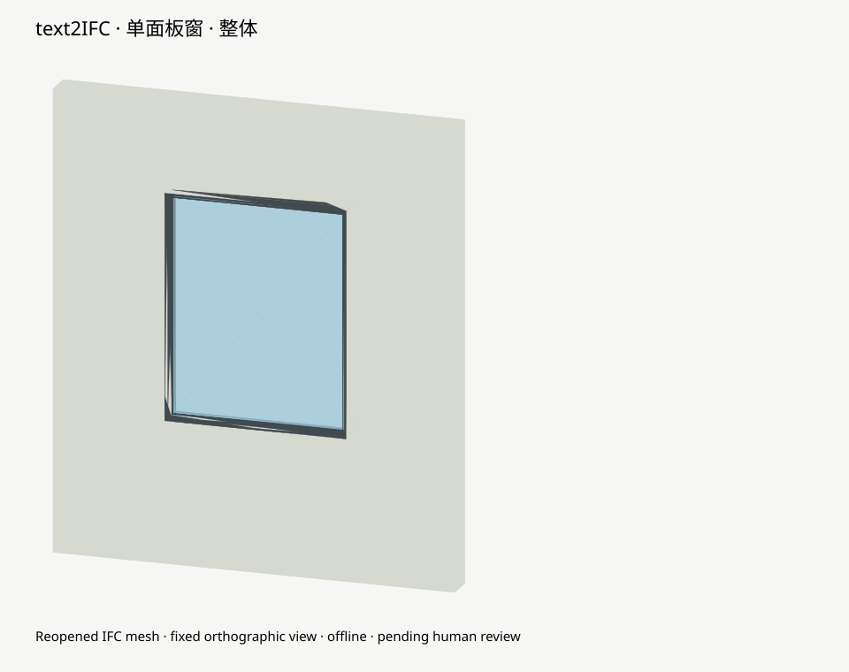
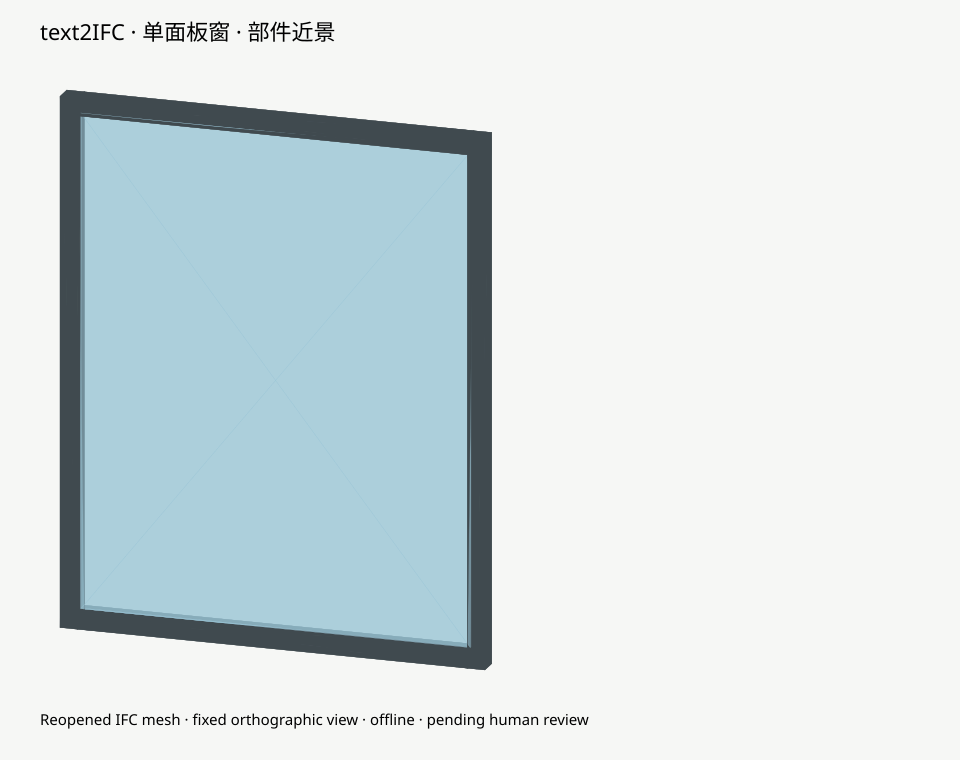

# 单面板窗：离线语义与外观示例

状态：离线自动检查通过；人工视觉审查待进行。不是真实 Provider 运行或 accepted Proof。

生成单面板窗，宽1200毫米、高1500毫米，墙及开口深200毫米，默认协调风格；不指定材料和性能属性。

| 项目 | 请求 | IFC 重读结果 |
|---|---|---|
| 名义宽高 | 1200 × 1500 mm | 1200 × 1500 mm |
| Type | 无共享要求 | 未创建；门为按实例创建的构造附件 |
| 材料 | 未指定 | 0 个，不从颜色补写 |
| 性能属性 | 未指定 | 未创建 |
| 颜色 | 默认协调风格 | neutral-architectural；框与玻璃/门扇按部件分色 |
| 几何 | 框与面板，开口保持 | 分部件重读网格、体积及尺寸检查通过 |

模板：`window-single`，版本 `text2ifc/basic-filling/1.0`。

| 参数（长度 mm） | 有效值 | 来源 |
|---|---:|---|
| frame_width | 50.0 | text2ifc/basic-filling/1.0:window-single |
| frame_depth | 60.0 | text2ifc/basic-filling/1.0:window-single |
| panel_thickness | 6.0 | text2ifc/basic-filling/1.0:window-single |

[请求](request.txt) · [BIM JSON](candidate.json) · [IFC](output.ifc) · [独立检查记录](evidence.json)

图由最终重读 IFC 三角网格投影；固定相机、背景，不能代替实际 viewer 人工审查。
