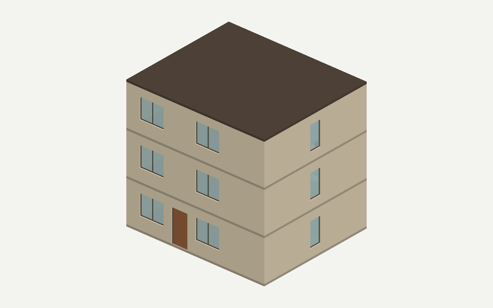
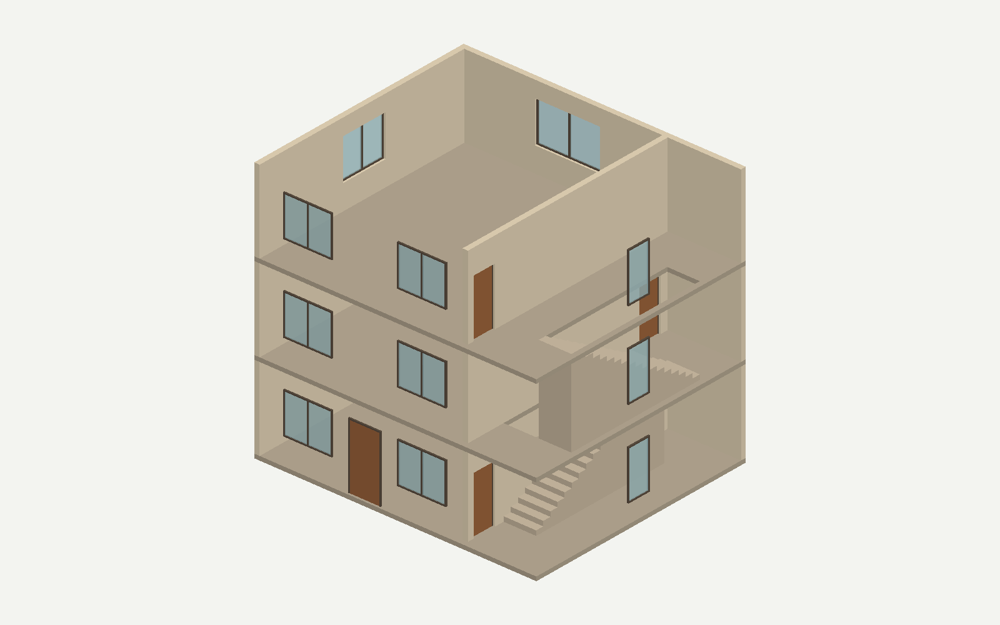
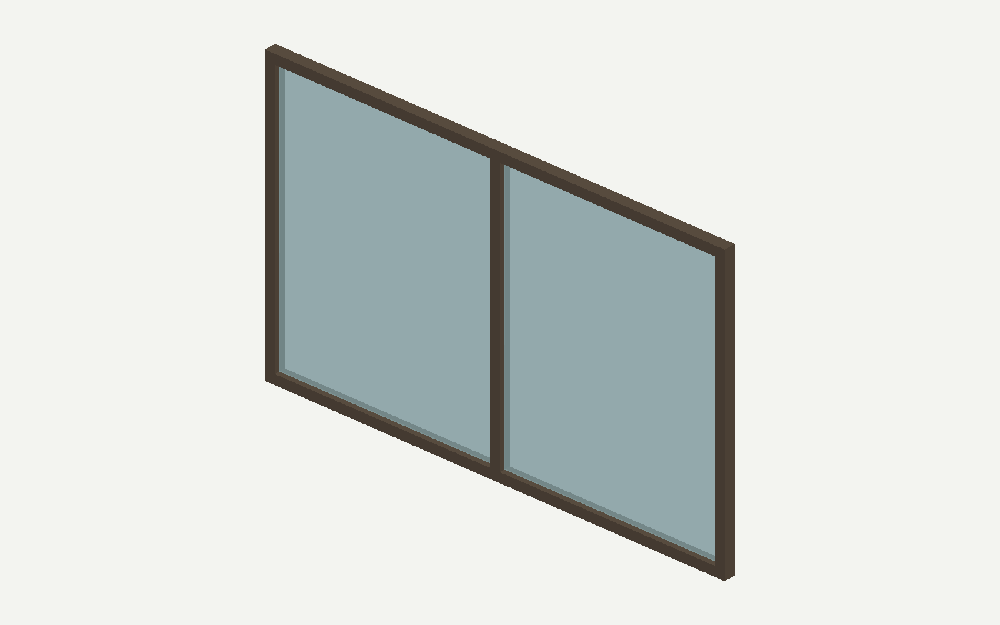
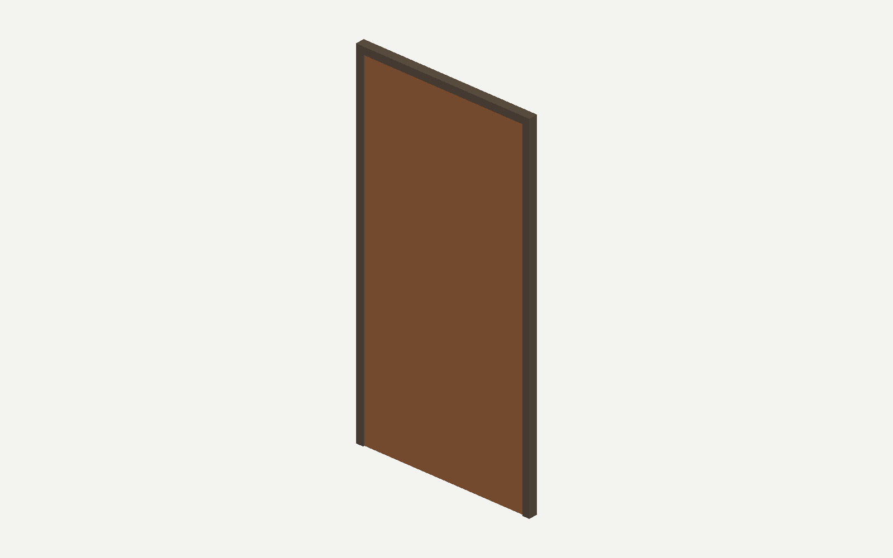

# text2IFC A/B 重跑报告：A 材料语义失败，B 暂停

状态：**未完成 A/B 验收，未登记 Proof。** A 的生产状态为 compiled、Audit accepted，但独立检查不通过；B 尚未启动。本次按用户“遇到问题随时停下”的边界停止后续真实调用。

## 先看输入与实际文件

- A：[中文原始输入](A-revise/request.txt)、[已批准澄清](A-revise/clarification.txt)、[完整输入对话](inputs/A-revise/conversation.json)。
- A：[实际输出 IFC](A-revise/generated.ifc)、[290项独立检查](A-revise/independent-ifc-check.json)、[楼梯间隙采样](A-revise/clearance.json)。IFC仅供诊断查看，尚不是合格交付。
- B：[中文输入](inputs/B-retain/request.txt)、[强硬保留原设计的澄清](inputs/B-retain/clarification.txt)。**本轮没有B输出IFC，也没有B Provider调用。**

两分支都属于Generation；原参考IFC不变，不是Repair的original/damaged/repaired三元组。对话使用用户已批准的三轮脚本，不声称是现场自发澄清。

## 本轮结果

| 项目 | A 实际结果 |
|---|---|
| 新运行 | 4927c3df4028e515；重新生成Brief与候选，只继承预算消费 |
| 真实 Provider | api.deepseek.com / deepseek-v4-flash |
| 本轮调用 | 5次：Brief、Generator、Audit、ChangeSet、Audit |
| 本轮消费 | 353826 token，445.859秒活动时间 |
| A任务累计 | 11次，698521 token，962.282秒；上限32次/200万token/3600秒 |
| 机器结果 | compiled / Audit accepted / changeset_applied |
| 独立请求检查 | 288/290通过；wall_materials和slab_materials失败 |
| 外观与门窗 | 19扇门窗分色、15扇窗玻璃面板检查通过；无整件appearance覆盖 |
| 几何与网格 | 40个实体网格化成功；108点楼梯竖向间隙采样最小约3米，零间隙0处 |
| 人工状态 | 尚未验收；未安装或登记Proof |

A把两梯段平面分开、三层分隔墙西移300毫米、洞口和内门随之调整，外轮廓及楼层高度保留。B仍应忠实保留原布局与已知零净空问题，但本轮没有执行B，不能给出新的B结论。采样不包含完整疏散、结构、栏杆或规范审查。

## 问题出在哪里

原始用户输入明确要求“墙体物理材料为砖；地坪、两块层间楼板和屋面物理材料为混凝土”。Brief也在自由文字 `material_and_attribute_policy` 中保留了这句话，但**没有生成结构化semantic_requirements**。

链路把“没有这份清单”解释成“没有语义要求”，生成了空预期。初始Generator候选已经含正确材料，却被标记为19项UNREQUESTED_MATERIAL；随后ChangeSet清空15面墙和4块板/屋面的材料，第二次Audit接受了这个结果。独立重读从冻结用户预期出发，才发现最终IFC丢失材料。

[材料前后对照](material-cleanup-trace.json)可逐构件检查；[旧/新实现局部重放](baseline-projection-comparison.json)显示af45478e和6dd98ae4均把同一Brief投影成0条预期并产生19项材料清理诊断。因此这是此前已存在、被新的Brief写法触发的语义权威缺口，不能归因于这次外观修复改变了材料编译。

## 已完成的通用修复

外观覆盖现在必须来自冻结请求，候选自报user来源不能授权整件颜色或透明度。ChangeSet 1.1只在精确诊断、请求和范围共同授权时允许撤销可选的/appearance；不使用null或空对象，不扩大到几何、身份或整构件删除。旧Schema/Prompt保持原字节，新Generator v2.4、ChangeSet v1.7已注册。

新阶段离线准入为**580 passed，0失败/错误/跳过**：331项seam、129项公共链路、120项IFC重读。另有原失败A的离线撤销重放，290项IFC检查通过。这些是Bug修复和回归证据，不是系统能力提升指标，也不能掩盖本次新发现的材料问题。本轮真实ChangeSet执行的是旧材料清理路径，不是新/appearance撤销操作；后者目前由离线完整链路验证。

## 下一步修复方案（尚未实施）

1. 区分“明确无语义要求”“已完整结构化”“尚未提取完成”。缺少字段不能产生删除授权。
2. 缺规范清单时退回Agent校正Brief，冻结已确认几何和用户决定；不把Agent格式返工交给用户重新回答。
3. 用新版本合同统一材料/Type/属性/外观权威入口，再验证澄清、恢复及原子保全。不能为本案例增加自由文字字段别名，也不能放任真正未请求的材料。

[20项离线复现](semantic-authority-reproduction.json)覆盖Wall/Beam/Door/Slab和不同自由文字位置：12项仍错误授权删除；8项显式空清单/结构化要求对照符合预期。[复现脚本](semantic-authority-reproduction.py)不调用Provider。这个新问题尚未修好，需先完成相应离线修复，再决定继续真实A/B；此前消费继续累计。

## 实际 IFC 视觉检查

以下图片来自本轮IFC原始网格和样式，未用概念图替代。整体暖色、立面对齐，深框/玻璃及门框/门扇有区分；切开图隐藏了屋顶和南、东外墙，IFC本身没有改变。美观检查不能证明砖和混凝土附件存在。

## 证据与执行边界

[运行记录](A-revise/execution.json)、[原始机器证据](A-revise/runtime/runs/4927c3df4028e515/)、[准入](admission.json)、[暂停原因](RUN-HOLD.json)、[授权范围](authorization.json)。RUN-HOLD已阻止本包再次启动Provider；准入是在新缺陷出现前通过的，现在不能据此放行下一次调用。没有发送原IFC/private Gold，没有Full Preflight，没有Proof验收或push。

提交：6dd98ae4为外观修复，d01cf0ef保存上一轮A外观失败及预算继承证据。本报告和本轮新失败证据另行提交，保持原始运行状态和文件不变。
