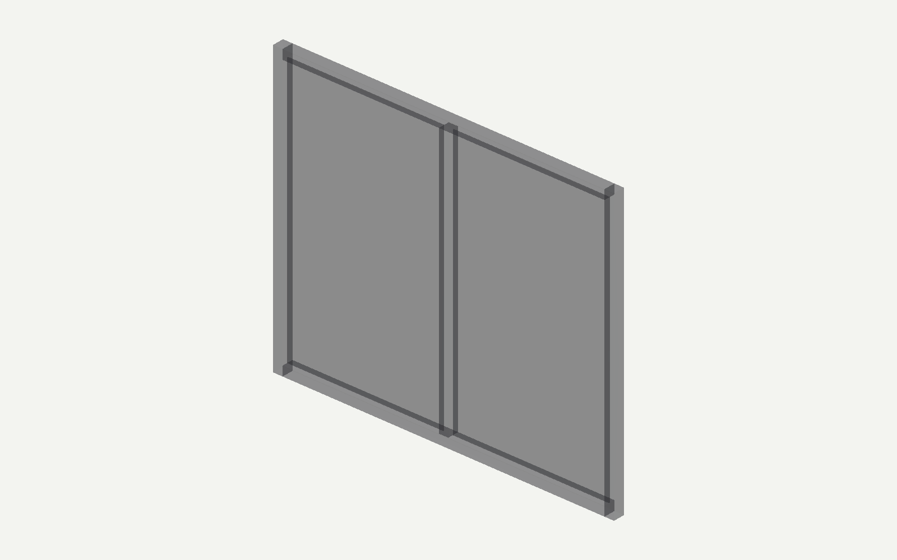
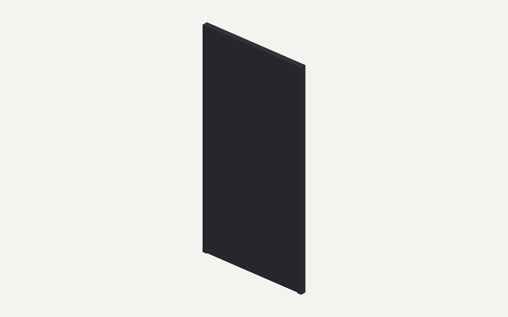

# A 外观独立检查失败，B 暂停

状态：生产链路 compiled / Audit accepted；独立 IFC QA 不通过，尚未人工验收，未登记 Proof。

本轮 A 从冻结中文请求和已批准澄清重新生成 Brief 与候选；没有接用旧 Brief 或 IFC。只继承前次3次调用的预算消费。本轮真实3次调用（Brief、Generator、Audit），A累计6次、344695 token、516.423秒活动时间；B本任务尚未调用。

## 可读输入与实际产物

- [A 原始输入](inputs/A-revise/request.txt)、[已批准澄清](inputs/A-revise/clarification.txt)、[对话记录](inputs/A-revise/conversation.json)。
- [本轮实际生成 IFC](A-revise/generated.ifc)。这是失败诊断产物，不能当作合格交付。
- [独立290项检查](A-revise/independent-ifc-check.json)、[楼梯净空采样](A-revise/clearance.json)。
- [原始运行及模型输出](A-revise/runtime/runs/25a7dcb4706b8bf4/)、[累计预算](A-revise/runtime/runs/25a7dcb4706b8bf4/generation-budget.json)。

## 结果与原因

尺寸、位置、关系、材料等256项通过；19项部件分色和15项玻璃面板检查失败。108点楼梯竖向间隙采样最小约3米、零间隙0处。该采样不是完整安全或规范审查。

模型没有添加额外Type，但自行给15面墙及19扇门窗写了实体appearance。冻结Brief只有warm-residential主题，没有这些整件覆盖值。编译器遵循现有优先级，将整扇窗（包括窗框）设成统一深灰和0.7透明度，门框和门扇也没有分色。检查器读到了真实Body样式，近景与之相符。

## 修复边界

[RUN-HOLD.json](RUN-HOLD.json) 阻止本包后续 transport。先回到离线授权门禁与受限可选字段撤销修复，之后新建运行并继续累计预算，不覆盖本次真实响应/IFC/生产状态。原参考IFC及历史运行保持不变。

本轮调用前已有阶段487项证据及122项相关复核；本轮新发现说明这些自动检查尚不能防止该外观覆盖错误。离线fake/replay与测试通过数均不代表系统能力提升。B的原始强硬保留设计与已知问题仍按原冻结合同处理。

无Full Preflight、无人工验收、无Proof安装、无push。
