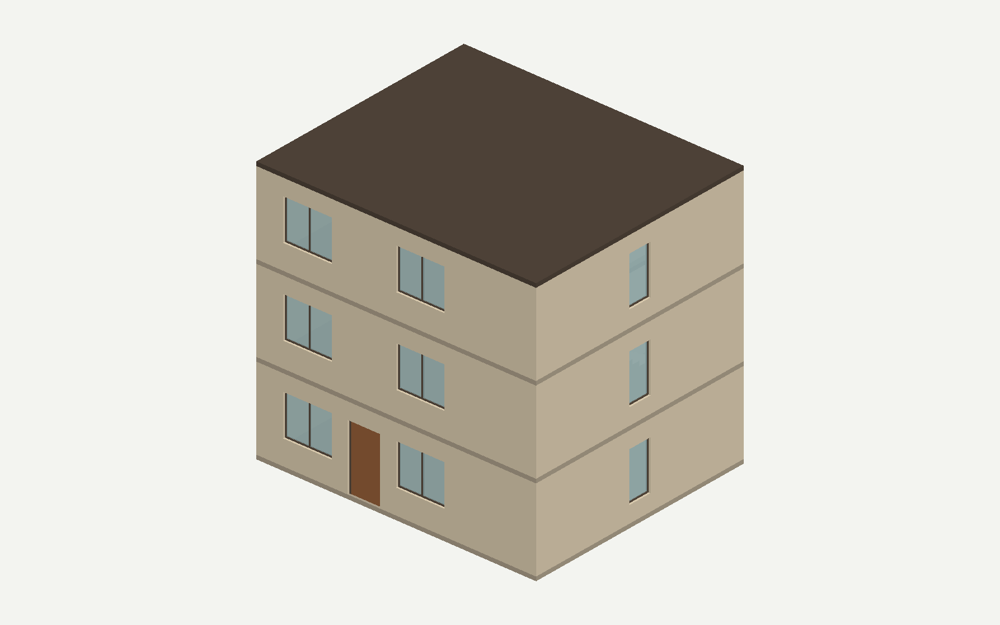

# 三层 Generation：真实链路与独立检查报告

**生成链路已通过，本次修复点得到新案例验证；建筑整体仍需工程复核，不登记成功 Proof。**

真实公共 CLI 首次生成了完整 IFC2X3，Audit 接受，最终状态为 `compiled`，没有进入 Repair／ChangeSet 循环。独立重读后，290 项请求符合性检查通过。不过，额外视觉与网格检查发现：本次输入把两段反向楼梯安排在同一平面，接近二层平台处的上方梯段间隙降到零。该布局由 Codex 编写测试输入时引入，现有门禁和 Audit 未覆盖此类行走净空问题；不能把“忠实生成输入”理解为“建筑设计可直接使用”。

## 直接查看

- [中文输入](request.txt)：三层社区阅读活动楼，室内10×8.4米，6个空间、15面墙、15扇窗、4樘门、两段楼梯及两个层间洞口。没有 GUID 定位。
- [完整 IFC](generated.ifc)、[完整候选 JSON](model.json)：原始真实输出的逐字节副本，未手改模型。
- [整体图](views/overall.png)、[剖看图](views/cutaway.png)、[双面板窗近景](views/window-double.png)、[入口门近景](views/door.png)。剖看图仅隐藏屋面、南墙和东墙，隐藏墙上的门窗仍可见；IFC 未改变。
- [运行前冻结预期](frozen-expectations.json)、[原始公共运行报告](runtime/runs/cbb2e16af86672ce/report.md)、[当前复核状态](review-status.json)。

## 修复是否有效

| 核对点 | 本次证据 | 结论及边界 |
|---|---|---|
| 明确墙界保留 | 三层 Brief 均保留 X=7600～7800、Y=0～8400；重读 IFC 的三面分隔墙均为完整长度 | 本例未再出现上一组墙界丢失／按局部平台缩短的问题 |
| 洞口身份、宿主及实际切口 | 两个洞口分别穿透二层、三层楼板，绑定不同宿主，实际网格切口通过 | 本例使用显式身份；没有触发派生名称兼容分支，该分支证据仍来自上一批失败族及旧例原样复验 |
| 跨层位置与构件细节 | 0／3150／6300标高、两段楼梯方向、全部门窗尺寸／位置／窗台、门向和模板检查通过 | 本例证明相关请求到 IFC 的传递可行 |
| 材料与属性 | 墙为砖，楼板／屋面为混凝土；没有给其他构件补物理材料或未请求性能属性 | IFC 原生关联与属性检查通过 |
| 纠错循环 | 此次首次候选即通过，无修复调用 | 本例不能证明 live loop 修复成功率；停止门禁争议回退的证据是已有离线公共路径测试 |

各构件逐项布尔结果、GUID、世界包围盒及有效样式见[独立 IFC 检查](independent-ifc-check-v2.json)。未使用 Agent 的 represented 标签作为正确值证据。[Brief 事实核对](brief-fact-check.json)记录了候选返回前观察到的三层墙界和洞口事实。

## 真实运行

默认策略 `legacy_full`，模型 `deepseek-v4-flash`。本案例使用新的公共会话 `cbb2e16af86672ce`，原双层运行和预算未改。

| 阶段 | 真实响应 ID | reported token | Provider 活动时间 | 结果 |
|---|---|---:|---:|---|
| Design Brief | `9e1c7dc4-395a-45f1-b8d4-5d634be2a660` | 48,928 | 242.125秒 | ready，无额外澄清 |
| Generator | `a820a123-42a3-4c4f-9af7-40574d8f1fa5` | 93,171 | 376.375秒 | Formal、0项合同错误 |
| Audit | `a12e441a-9216-48f7-b529-8224d35b45fb` | 41,730 | 47.422秒 | accept、non-blocking |

共3次完成调用，reported token **183,829**；没有 Repair／ChangeSet 调用或合成回退。活动时间合计约665.922秒，包装运行墙钟时间约700.679秒。[预算原始记录](runtime/runs/cbb2e16af86672ce/generation-budget.json)保留预留与实际结算，未把两者相加。[Final Acceptance](runtime/runs/cbb2e16af86672ce/acceptance-metrics.json)为 valid；生产 secret scan 为0项发现。自动审批首次拒绝发生在 transport 前，用户具体批准后才执行，不计作一次 Provider 失败。

## 验证与检查器修正

- 同阶段聚焦补充准入：本轮106项回归通过；复用上批洞口80项、墙合同46项和未变化的基础阶段证据。各组有重叠，不累计成独立成功率。见[准入](admission.json)。未执行 Full Preflight。
- 生产编译、重读、语义、几何及最终发布通过；楼层名称一致性门禁因未提供多个显式名称而不适用，楼层标高与构件归属另有实际检查。
- 独立检查首轮[288通过／2失败](independent-ifc-check.json)。失败来自脚本对 `3.8` 与 `3.8000000000000003`、`0.7` 与 `0.7000000000000001` 作精确比较。保留[原检查器](check_ifc.py)，新增[检查器v2](check_ifc_v2.py)，只将混合表格中的数值比较改为绝对误差1e-9、相对误差0；没有改变冻结输入、预期或生产几何门禁。
- v2重算本例 **290项通过**；同样重算旧双层负例仍被拒绝。比较器边界检查覆盖浮点噪声、1毫米位置偏差、方向不同、数量不同、NaN及尺寸偏差，见[修正记录](evaluator-correction.json)。这是评估脚本修正，不是模型经修复变好。
- 40个实体构件全部网格化。整体立面上下对齐，暖色墙、深色框及玻璃协调，门窗具有真实部件细节；采用与上一例相同的简单渲染，不是 AI 补画。

## 新发现：楼梯行走净空未被检查

剖看后对原 IFC 两段楼梯作垂直射线测量。在 X=8.8米处，第一段踏步顶面到第二段梯段下表面的间距，在 Y=4.0米处约1.575米、Y=6.0米处约0.35米、Y=6.75米处为0。见[原生网格诊断](stair-clearance-diagnostic.json)。这些是几何采样值，不是完整规范校核。

原因分两层：测试输入本身选择了不合理的同平面反向叠放；当前 pipeline 检查尺寸、方向、关系和洞口，但没有覆盖行走路径上方的净空，Audit 也没有提出问题。因此自动接受的事实保留，工程复核状态单独标为 `needs_design_revision`，不覆盖机器记录，也不晋升成功 Proof。

建议下一步先将测试楼梯改为互不遮挡的并排双跑，或同向叠放并补明确侧通道／平台；输入修订后另立版本、保留本次运行。随后按有限范围增加“行走面→上方实体”的净空诊断，覆盖跨层梯段、楼板及梁，不靠一个样例的坐标特判。本轮按“简单收尾＋三层检查”的范围止于报告，不扩展光庭或静默修改原模型。

## 状态与可复现性

机器状态 `compiled / accepted`；请求符合性检查通过；工程复核需要设计修订；人工尚未验收；未登记 Proof。该例与上一例同属相关场景，仅是开发可行性证据，不能宣称系统稳定性或纠错成功率提高。

IFC：246,275字节，SHA-256 `756cf1ad4b8175ecb2571ce09483bd6ab83edfd562ae2f66c33a650b9e610d63`。请求、候选、报告图片及证据入口绑定见[FILES.json](FILES.json)。离线重读命令：`.venv/Scripts/python.exe <本目录>/check_ifc_v2.py <本目录>/generated.ifc <新的结果路径>`；出图使用本目录的 `export_mesh.py` 和 `render_png.py`，输出路径必须是新的目录／文件。
