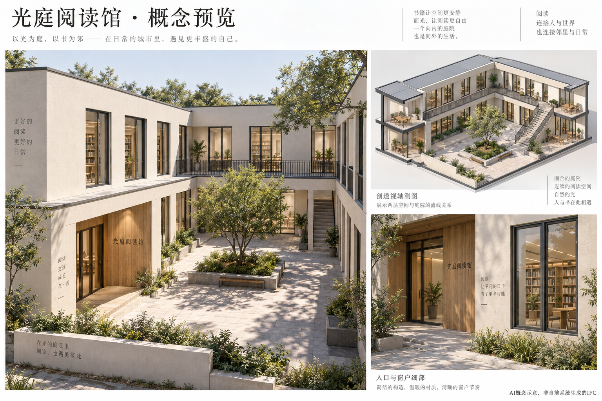

# 光庭阅读馆：概念预览

AI 生成的设计方向示意，非 text2IFC 当前产出，非 IFC、Proof 或能力证据。图中 U 形围合、回廊防护、绿化、家具、跨层玻璃与精细光照需分别确认工程表达或展示范围；不因画面存在就视为已实现。多视图不是同一三维模型的投影，细节可能不完全一致。

建议提取浅暖灰主体、深色细框、有限木色与光庭层次；实施模型仍以已批准的有界构件及独立 IFC 验收为准。
