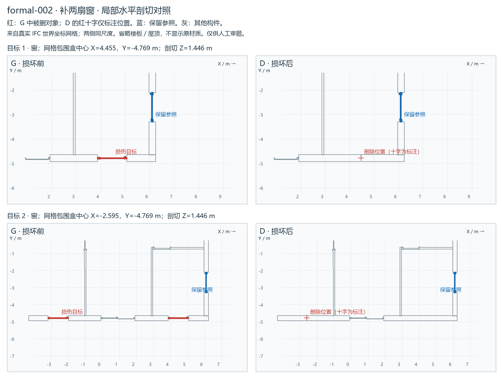

# formal-002：补两扇窗

**待人工审阅（pending_human_review）**。五题测试先检查输入与损伤；未调用模型，不是模型成绩。

[局部剖切图](REVIEW.png) · [打开 G/D 同步视角查看器](VIEW.html) · [格式校验](IFC-VALIDATION.md) · [许可与修改说明](private/SOURCE-LICENSE.md)

## 公开请求

地面标高为0的这一层，Y约-4.780米的外墙上少了两扇窗。请在这面墙上补两扇宽1200毫米、高1200毫米的窗：平面中心的X分别为4.455米和-2.595米，窗洞底距本层地面850毫米。窗框截面、玻璃、开启形式、材质和表面外观以同层平面坐标约（6.095，-2.690）米的现有窗为准；按各自所在墙的方向安装，开出匹配的窗洞。其余门窗和墙的其他部分保持原样。这里的坐标均为模型全局坐标，单位为米。

## 损伤及私有核对

|删除构件 STEP ID|类别|保留洞口|世界包围盒中心（m）|
|---|---|---|---|
|58630|IfcWindow|否|4.4547, -4.7692, 1.4465|
|58644|IfcWindow|否|-2.5953, -4.7692, 1.4465|

主目标 2 个；S2 / same_type。独立 schema＋EXPRESS：G 与 D 均零诊断。

## 审阅要点

请核对定位是否唯一、尺寸／参照是否清楚、损伤是否合理，以及其余对象是否原位保留。门开向不是必答项。本批都是信息充分题；必要澄清题随后另选。

修复需生成实际构件及相应洞口／宿主／楼层成员关系。允许新身份和等价序列化，不能只补数量、移动参照、重复补建或误改其他对象。具体容差与指标随后确认。

private/ 和查看器只供审题／评估；被测环境只获得 public/ 的两个文件。
