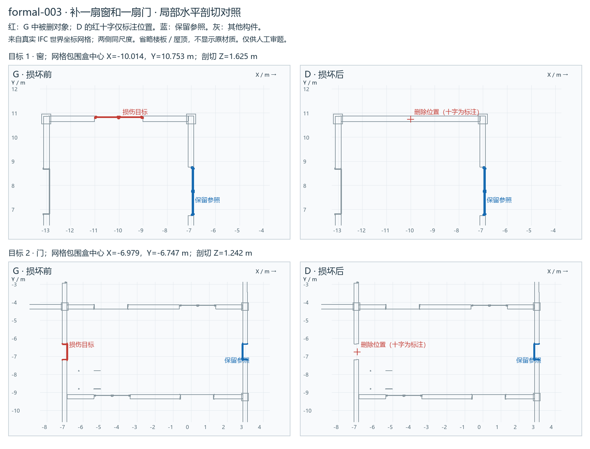

# formal-003：补一扇窗和一扇门

**待人工审阅（pending_human_review）**。五题测试先检查输入与损伤；未调用模型，不是模型成绩。

[局部剖切图](REVIEW.png) · [打开 G/D 同步视角查看器](VIEW.html) · [格式校验](IFC-VALIDATION.md) · [许可与修改说明](private/SOURCE-LICENSE.md)

## 公开请求

地面标高为0的这一层需要补一扇窗和一扇门。窗位于Y约10.753米的外墙上，平面中心X为-10.014米；请补一扇宽2010毫米、高1260毫米的双扇窗，窗洞底距本层地面1000毫米，框、玻璃、分格和表面外观以同层平面坐标约（-7.014，7.753）米的现有窗为准，并开出对应窗洞。门补在平面坐标约（-7.014，-6.747）米的现有空门洞内，宽885毫米、高2360毫米，门框、门扇、材质和表面外观以同层门洞平面中心约（2.986，-6.747）米处的现有门为准。两者沿各自墙体安装，门底与现有洞口底对齐；其余门窗和墙体保持原样。这里的坐标均为模型全局坐标，单位为米。

## 损伤及私有核对

|删除构件 STEP ID|类别|保留洞口|世界包围盒中心（m）|
|---|---|---|---|
|1428|IfcWindow|否|-10.0141, 10.7531, 1.6250|
|5152|IfcDoor|是|-6.9791, -6.7469, 1.2422|

主目标 2 个；S2 / mixed。独立 schema＋EXPRESS：G 与 D 均零诊断。

## 审阅要点

请核对定位是否唯一、尺寸／参照是否清楚、损伤是否合理，以及其余对象是否原位保留。门开向不是必答项。本批都是信息充分题；必要澄清题随后另选。

修复需生成实际构件及相应洞口／宿主／楼层成员关系。允许新身份和等价序列化，不能只补数量、移动参照、重复补建或误改其他对象。具体容差与指标随后确认。

private/ 和查看器只供审题／评估；被测环境只获得 public/ 的两个文件。
