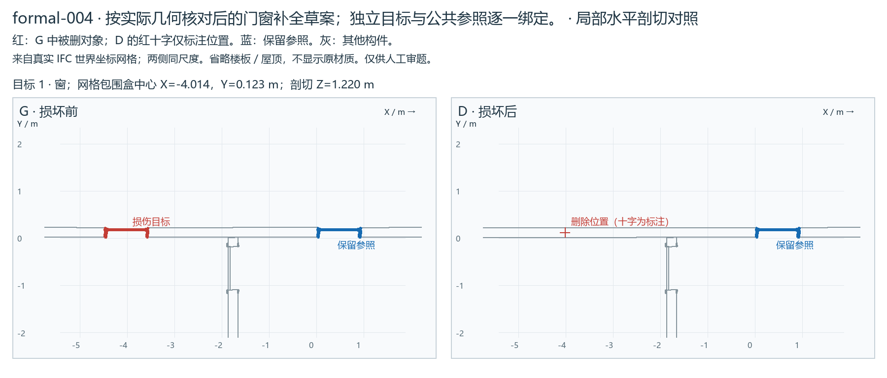
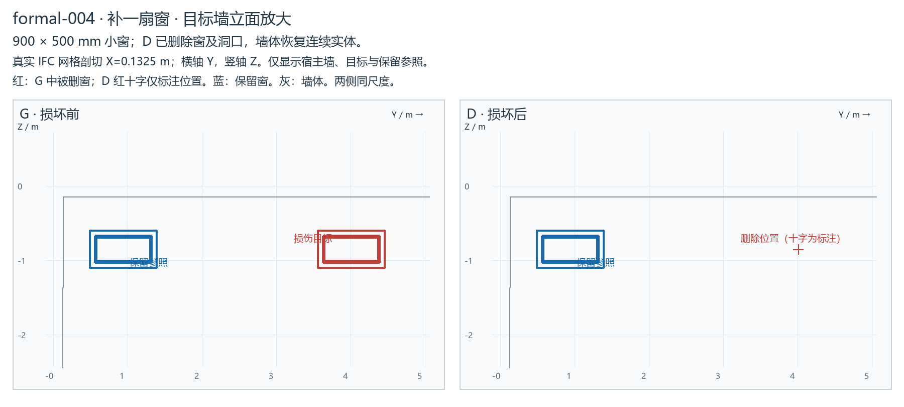

# formal-004：补一扇窗

**待人工审阅（pending_human_review）**。五题测试先检查输入与损伤；未调用模型，不是模型成绩。

[局部剖切图](REVIEW.png) · [打开 G/D 同步视角查看器](VIEW.html) · [格式校验](IFC-VALIDATION.md) · [许可与修改说明](private/SOURCE-LICENSE.md)

这是一扇地下小窗，整栋视图中损伤较小。下图沿目标墙作 Y/Z 立面剖切，直接显示 900×500 毫米窗及洞口在 D 中消失；红十字只是定位标注。宿主墙体积由 6.09075 增至 6.22575 立方米，差值 0.135 立方米对应原洞口，不是仅隐藏显示。

## 公开请求

地下层地面标高为-2.900米，X约0.150米的长外墙上缺了一扇小窗。请在这面墙上Y为4.005米处补一扇宽900毫米、高500毫米的窗，窗洞底距地下层地面1800毫米。窗框、玻璃、分格、材质和表面外观以同墙Y约0.940米处的现有小窗为准，朝向与它一致，开出匹配的窗洞。其他窗和墙的其他部分保持原样。这里的X、Y为模型全局平面坐标，单位为米。

## 损伤及私有核对

|删除构件 STEP ID|类别|保留洞口|世界包围盒中心（m）|
|---|---|---|---|
|268439642|IfcWindow|否|0.1325, 4.0050, -0.8500|

主目标 1 个；S1 / single。独立 schema＋EXPRESS：G 与 D 均零诊断。

## 审阅要点

请核对定位是否唯一、尺寸／参照是否清楚、损伤是否合理，以及其余对象是否原位保留。门开向不是必答项。本批都是信息充分题；必要澄清题随后另选。

修复需生成实际构件及相应洞口／宿主／楼层成员关系。允许新身份和等价序列化，不能只补数量、移动参照、重复补建或误改其他对象。具体容差与指标随后确认。

private/ 和查看器只供审题／评估；被测环境只获得 public/ 的两个文件。
