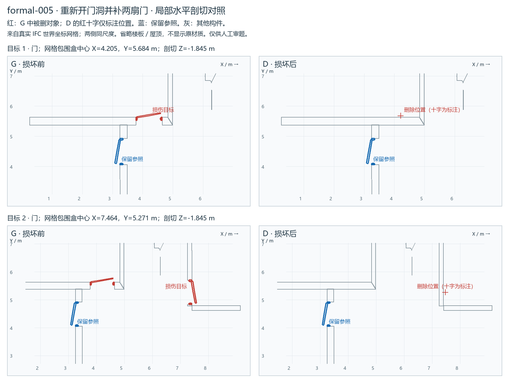

# formal-005：重新开门洞并补两扇门

**待人工审阅（pending_human_review）**。五题测试先检查输入与损伤；未调用模型，不是模型成绩。

[局部剖切图](REVIEW.png) · [打开 G/D 同步视角查看器](VIEW.html) · [格式校验](IFC-VALIDATION.md) · [许可与修改说明](private/SOURCE-LICENSE.md)

## 公开请求

地下层地面标高为-2.850米，需要在两面内墙上恢复两扇单扇门。第一处门洞的平面中心约为（4.205，5.505）米，第二处约为（7.330，5.271）米；这两处现在都是完整墙面。请分别开出宽870毫米、高2010毫米的门洞，洞底与地下层地面齐平，并各安装一扇门。门框、门扇、材质和表面外观均以同层门洞平面中心约（3.367，4.488）米处的现有门为准；两扇门沿各自墙体安装，左右开启均可。其余门窗及墙的其他部分保持原样。这里的坐标均为模型全局坐标，单位为米。

## 损伤及私有核对

|删除构件 STEP ID|类别|保留洞口|世界包围盒中心（m）|
|---|---|---|---|
|268448036|IfcDoor|否|4.2053, 5.6843, -1.8450|
|268456366|IfcDoor|否|7.4643, 5.2713, -1.8450|

主目标 2 个；S2 / same_type。独立 schema＋EXPRESS：G 与 D 均零诊断。

## 审阅要点

请核对定位是否唯一、尺寸／参照是否清楚、损伤是否合理，以及其余对象是否原位保留。门开向不是必答项。本批都是信息充分题；必要澄清题随后另选。

修复需生成实际构件及相应洞口／宿主／楼层成员关系。允许新身份和等价序列化，不能只补数量、移动参照、重复补建或误改其他对象。具体容差与指标随后确认。

private/ 和查看器只供审题／评估；被测环境只获得 public/ 的两个文件。
