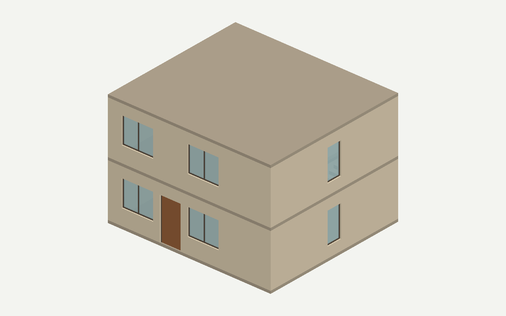
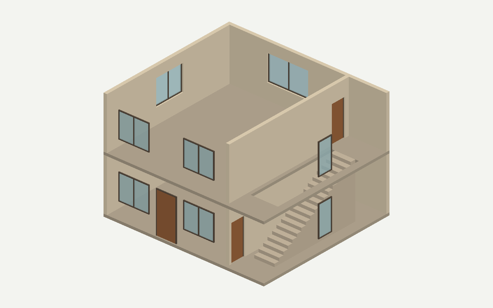
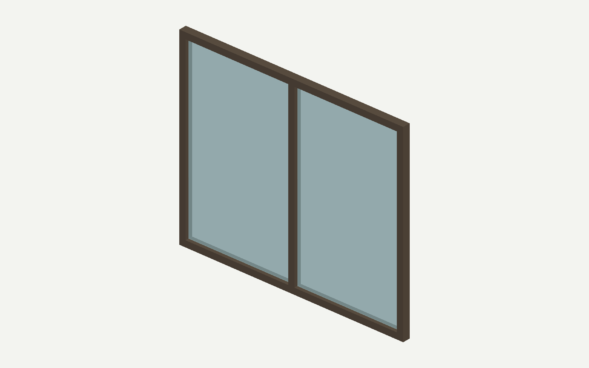
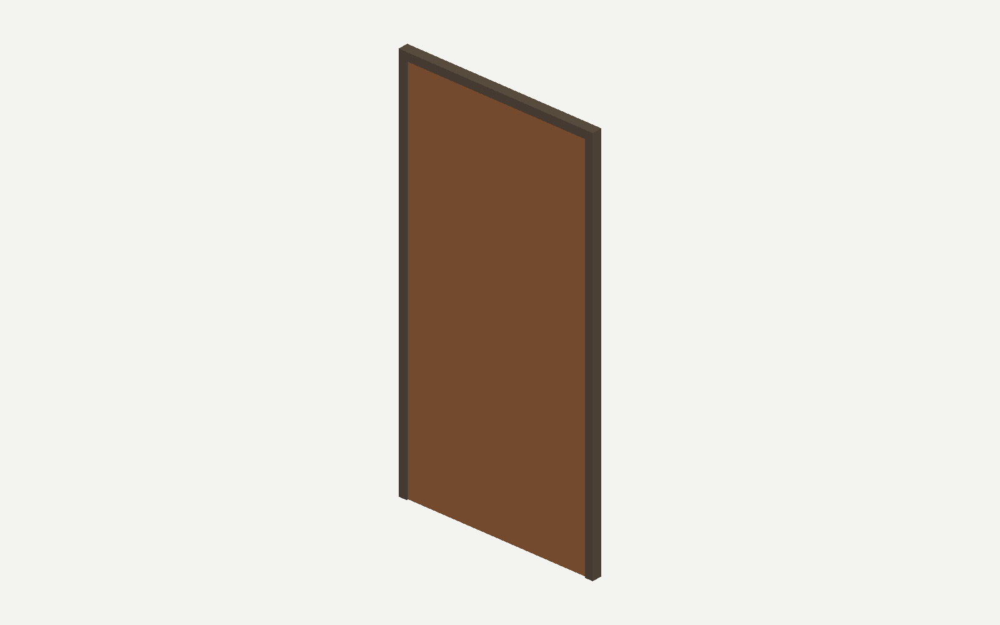

# 社区阅读活动楼：人工验收记录

**人工验收已通过；工程验收仍阻断。** 用户已检查本模型并明确认可。此状态依据真实人工反馈记录，不覆盖正式门禁失败，不将中断的运行补写为成功。

## 文件入口

- [实际中文输入](request.txt)，完整原文也在本页末尾。
- [完整模型 IFC](generated.ifc) · [生成模型 JSON](model.json)
- [人工验收记录](human-review.json) · [文件哈希](FILES.json)
- [完整过程证据](evidence/README.md)

## 模型和检查结果

| 内容 | 实际结果 |
|---|---|
| 建筑 | 两层社区阅读与活动楼，西侧大厅、东侧直跑楼梯 |
| 结构与空间 | 2 层、4 空间、10 墙、3 板、1 跑楼梯及真实层间洞口 |
| 门窗 | 10 窗、3 门，基础窗框／玻璃／门框／门扇、单面板与双竖面板窗 |
| 风格 | 暖色墙面、深色框、浅色玻璃，门窗立面有序 |
| 语义 | 墙体砖、楼板及屋面混凝土；没有自动补写未请求的性能属性 |
| IFC | IFC2X3，毫米；独立检查器重新打开同一 IFC，167 项通过、0 失败 |
| 视图 | 27 个实体构件网格化成功；图片与 IFC 的来源哈希一致 |
| 人工检查 | 用户于 2026-09-09 验收通过 |

## 保留的工程问题

正式 geometry gate 报告楼梯洞口身份未绑定及两处隔墙预期不足；Audit 返回 blocking=true / revise。两次后续 ChangeSet 返回因草案地址不合法被拒，第 3 次只有预留记录；运行没有完成终端发布。这些是下一步通用工程修复的对象，人工认可模型外观不意味着它们已经消失。

同任务累计 6 次已完成真实响应（Brief 1、Generator 2、Audit 1、ChangeSet 2），331,538 reported token；另有 1 次 ChangeSet 预留 172,003 token，结果和实际用量未知。原始尝试全部保留；没有在本次收纳中重新调用 Provider。

工程修复和下一例设计方向供用户另行审核，见[当前计划](../../../../../../../docs/architecture/semantic-appearance-plan.md)。修复后必须建立新验收记录，不能覆盖本次真实历史。

## 实际模型图片

剖看图仅隐藏屋面与南／东墙方便观察楼梯，悬空门窗是显示效果；完整 IFC 保留墙体。

本例依实际请求不含栏杆、家具、机电和复杂五金。图片是实际 IFC 网格视图，没有生成式补画建筑内容。

## 实际发送的中文请求

请设计并生成一栋两层的小型社区阅读与活动楼，提供完整 IFC2X3 文件，单位毫米。首层是接待阅览厅，二层是安静的多功能活动厅，东侧设置独立楼梯间。希望它看起来像一栋完整的小建筑：立面门窗上下对齐、间距均衡，墙体、门窗框和门扇配色协调，有真实的窗框、玻璃、门框、门扇与楼梯踏步。采用 warm-residential 风格，玻璃透明；不要求家具、机电、栏杆、复杂五金或外伸装饰。

建筑内部净尺寸为东西 9 米、南北 8 米，外墙厚 200 毫米。首层完成面标高 0，二层完成面标高 3150，每层室内净高 3000。地坪和二层楼板厚 150；平屋面底标高 6150、厚 150。地坪、楼板和屋面覆盖外墙外边界；二层楼板须留实际楼梯洞口，不能用整块楼板封住楼梯。各层外墙独立，不能跨楼层复用。

以首层室内西南角为原点，向东为 X、向北为 Y、向上为 Z。每层西侧大厅净范围为 X=0～6800、Y=0～8000；分隔墙占 X=6800～7000，东侧楼梯间净范围为 X=7000～9000、Y=0～8000。首层在分隔墙南端开一樘门，中心距室内南边 600；二层在分隔墙北端开一樘门，中心距室内南边 7300，两樘门均宽 900、高 2100，右单开，底面与本层地坪齐平。只生成这一道分隔墙，不把大厅与楼梯間的边界重复建成两道墙。

楼梯沿北向直跑，从首层完成面 0 升到二层完成面 3150，属于首层并连接二层。净宽 1200，平面范围 X=7400～8600、Y=1200～6600，18 级、每级高 175、踏步进深 300。首层南端保留 1200 深的进梯区域，二层北端保留 Y=6600～8000 的平台。二层楼梯洞口范围为 X=7200～8800、Y=1200～6600，洞口穿透楼板。首层为阅览厅和楼梯间各建一个空间，二层为活动厅及北端楼梯平台各建一个空间；洞口不得当成房间。

主入口位于首层南墙，中心距室内西边 3400，宽 1200、高 2400，左单开，门底与地坪齐平。南立面每层各有两扇双竖面板窗，中心距室内西边分别为 1500、5300，均宽 1800、高 1500、窗台高 900；上下层窗中心对齐，首层入口在两窗之间。每层北墙在西侧大厅中部各有一扇宽 2400、高 1500 的双竖面板窗，中心距西边 3400、窗台高 900。每层西墙中央各有一扇宽 1800、高 1500 的双竖面板窗，中心距南边 4000、窗台高 900。每层东墙中央各有一扇宽 900、高 1800 的单面板窗，中心距南边 4000、窗台高 600。窗台高度均从所属楼层完成面算起。总计 3 樘门、10 扇窗，每个开口必须与门窗名义宽高相同并穿透自己的宿主墙，门窗均置于相应楼层。

墙体材料为砖；地坪、二层楼板和屋面材料为混凝土。其他构件不指定物理材料，不要由颜色推断木材或玻璃材料。未提供强度、耐火、承重或热工性能，也没有共享 Type 的要求，不要自动补写这些属性或强制合并 Type。尺寸及空间关系必须满足以上要求；如果有真实冲突，请明确指出，不要静默改变。
