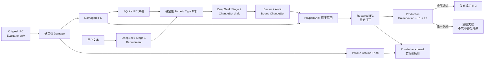

# Window IFC Repair 成功案例总览

## 1. 当前已经证明了什么

当前链路已经在三种不同尺度上完成真实 Window 修复：

- 单个 Window 的 Type、材料、分类、关系和有效属性恢复；
- 一段文本同时描述 5 个 Window，并输出一个统一、原子的 ChangeSet；
- 在 770,172 实体的大型 IFC 上完成全模型 preservation 和逐 operation
  L1/L2 验证。

这些结果证明的是“受约束的 IFC repair pipeline”，不是让 LLM 直接编写 STEP
文件。LLM 负责语义解析和 ChangeSet draft；目标解析、授权、IFC 写回和发布
判定由确定性代码负责。

## 2. 统一输入输出链路

Ground Truth 不进入 Agent Prompt。Production L2 的事实来自用户授权、damaged
IFC 的 surviving facts、正式 Type/Prototype 绑定和 operation policy。
Ground Truth 只在离线 benchmark 中判断修复产物与原对象的差异。

## 3. 三个案例横向比较

| 指标 | LargeBuilding 单窗 | vvo 五窗 | AdvancedProject 五窗 |
|---|---:|---:|---:|
| 原始实体数 | 20,735 | 48,935 | 770,172 |
| damaged 实体数 | 20,673 | 48,807 | 769,814 |
| repaired 实体数 | 20,750 | 49,046 | 770,044 |
| 原始 Window | 42 | 23 | 263 |
| damaged Window | 41 | 18 | 258 |
| repaired Window | 42 | 23 | 263 |
| ChangeSet | 1 | 1 | 1 |
| Window operation | 1 | 5 | 5 |
| Provider | DeepSeek | DeepSeek | DeepSeek saved output |
| Preservation | passed | passed | passed |
| L1 | 1/1 passed | 5/5 passed | 5/5 passed |
| L2 | 1/1 passed | 5/5 passed | 5/5 passed |
| 发布 | true | true | true |

实体总数不要求恢复到原文件的精确数值。系统可能使用新的 relationship、
PropertySet 或 representation 实体表达相同有效语义。当前 L1/L2 要求关系、
几何、授权语义和非目标 preservation 正确；L3 才涉及作者工具级实体组织。

## 4. 每个案例解决的不同问题

### LargeBuilding：单窗有效语义复刻

用户明确指定 Window Type，并在文本中授权 16 项 occurrence 属性。修复结果
与 Ground Truth 的 60 项 effective properties 完全一致。原 Window 中 10 项
direct 属性在 repaired Window 上由同一 Type 继承，因此没有重复写入
occurrence。

### vvo：五窗原子批次

Stage 1 一次生成 5-operation RepairIntent，Stage 2 一次生成统一 ChangeSet。
第 4、5 个 Window 共用一面宿主墙，系统按本批洞口体积总和验证宿主变化。
任何一个 operation 失败都不会发布部分成功 IFC。

### AdvancedProject：大型模型闭环

该案例使用 44 MB、770,172 实体的 IFC。保存的真实 DeepSeek ChangeSet 在
Comparator 0.2 和最小 evaluator alignment 修复后重新应用，无需再次调用
Provider。全模型 preservation、5 项 L1、5 项 L2 和发布全部通过。

## 5. 当前不能从案例中推出什么

这些案例尚不能证明：

- Door、Opening-only、Beam、Column 已经可写；
- 曲面或自由曲面墙已经支持；
- 任意 Pset 类型都可 author，目前主要是 `IfcPropertySingleValue`；
- 系统能够自动修改共享 Type；
- 新实体必须复用原 GlobalId、Name、Tag 或 STEP 编号；
- 任意自然语言都不需要澄清即可唯一定位目标。

## 6. 进入 Door/其他构件前建议完成的收尾

### 必须完成

1. **冻结 Window Proof 合同 0.1。**
   将本目录的文件结构、准入规则和 `manifest.json` 字段作为后续 operation
   family 的共同基线。
2. **建立 Proof 自动校验。**
   自动检查文件存在、SHA-256、JSON 可解析、IFC 可重新打开、operation 数和
   `successful_artifact_publishable=true`，防止手工复制后索引漂移。
3. **形成版本检查点。**
   Phase 7-10.4 的代码、测试、计划和本 Proof 集目前应形成一次清晰的 Git
   checkpoint，再进入 Door，避免 Window 与 Door 改动混在同一批差异中。
4. **保留 Window 回归矩阵。**
   Door 扩展后仍必须运行单窗、vvo 五窗和 AdvancedProject 五窗，证明 Registry
   扩展没有破坏已有 Window handler。

### 建议完成

1. 对 AdvancedProject repaired IFC 做一次人工可视化抽查，记录 5 个窗口的
   位置、尺寸、朝向和窗框观感；
2. 将 overlap、错误 Wall、损坏 IFC、Type 歧义和批次局部失败整理成负例索引；
3. 在 Phase 11 SPEC 中明确 Door 的宿主墙、Opening、Fills/Voids、Type、
   OperationType、朝向/开启方向和 L2 属性边界；
4. 第一批 Door 测试仍从单个直线墙案例开始，再增加 Window + Door 混合事务。

上述收尾不要求继续扩展 Window 功能。重点是冻结现有成功基线，让 Door 的新增
风险可以被独立观察。
