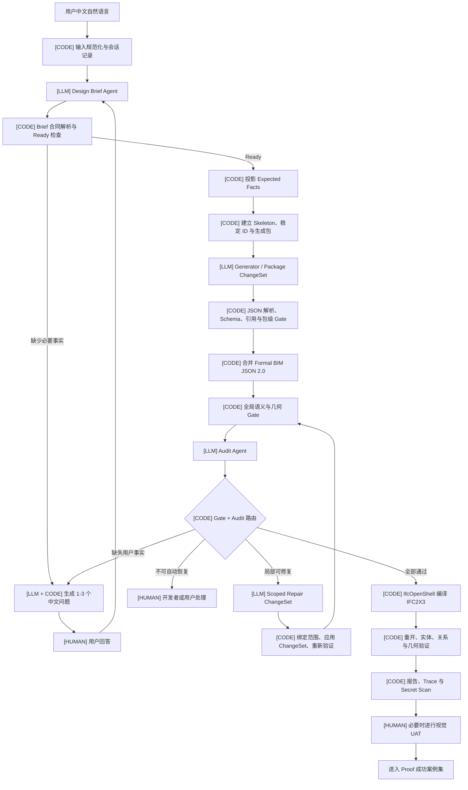

# Text2IFC 生成链路

## 1. 一句话说明

系统不是让大模型直接编写 IFC 文件，而是让 LLM 理解用户语义并输出受约束的结构化候选，再由确定性代码解析、校验、修复约束和编译为 IFC2X3。

整个链路有三种执行者：

- `[LLM]`：通过模型 Provider 接口完成语义理解、BIM JSON 候选生成、语义审核和受限修复建议。
- `[CODE]`：普通 Python 代码、JSON Schema、规则 Gate 和 IfcOpenShell，负责解析、验证、应用变更、编译和重开 IFC。
- `[HUMAN]`：用户补充缺失事实，并在复杂空间关系或视觉效果需要判断时进行最终 UAT。

确定性代码拥有最终放行权。LLM Audit 不能覆盖 Schema、Gate 或 IFC 编译失败。

## 2. 总体流程



## 3. 哪些地方调用 LLM 接口

真实运行通过 Provider 层调用外部 LLM。模型地址、模型名和密钥从环境变量读取；代码、报告和 Proof 不保存密钥或私有 URL。测试时可换成 fake/file provider，但 fake/file 结果不能证明真实模型质量。

### 3.1 Design Brief Agent

**执行者：** `[LLM]`

**发送给模型的内容：**

- 用户的原始中文输入；
- 已有多轮对话；
- Design Brief 输出合同；
- 选中的 few-shot 示例和能力上下文；
- 不允许编造尺寸、位置、楼层、空间和宿主关系的规则。

**要求模型返回：**

- 已确认的建筑事实；
- 尚缺失或互相冲突的事实；
- Draft 或 Ready 状态；
- 必要时需要向用户提出的问题。

这里可以理解为“专家 Agent 的语义整理”，但它不能偷偷润色出用户没有提供的建筑事实。语言可以更清楚，事实不能增加。

### 3.2 BIM JSON Generator

**执行者：** `[LLM]`

**发送给模型的内容：**

- Ready Design Brief；
- 由代码生成的 Expected Facts；
- BIM JSON 2.0 Schema 或与当前包相关的 Schema 子集；
- 允许使用的 `ifc_class` 和语义能力；
- 当前 Skeleton、稳定实体 ID、生成包边界；
- 与墙、门窗、楼板、楼梯、栏杆等相关的 few-shot。

**要求模型返回：**

- `legacy_full` 路径下的 Formal BIM JSON 2.0 或 Draft；
- `staged` 路径下只针对当前包的结构化 ChangeSet。

模型不能返回原始 STEP 文本，也不能生成 `IfcCartesianPoint`、`IfcDirection`、`IfcOwnerHistory` 等编译器级实体。

### 3.3 Audit Agent

**执行者：** `[LLM]`

**发送给模型的内容：**

- 原始用户输入和会话；
- Ready Design Brief；
- 最终 BIM JSON 候选；
- Expected Facts；
- 确定性 Gate Bundle；
- 修复记录、指标和证据路径。

**要求模型返回：**

- 语义是否满足原始意图；
- 是否存在确定性规则不容易识别的遗漏或矛盾；
- `accept`、`revise` 或 `reject` 等结构化审核结论；
- 问题应回到 Design Brief、Generator、Repair 还是人工处理的建议。

Audit 只提供语义判断。只要确定性 Gate 失败，即使 Audit 说“可以接受”，系统也不能发布 IFC。

### 3.4 Scoped Repair / ChangeSet Agent

**执行者：** `[LLM]`

**发送给模型的内容：**

- 结构化 Issue；
- 当前候选的哈希和 revision；
- 允许修改的实体 ID、JSON 路径和操作类型；
- 与问题有关的局部候选内容；
- 修复专用 few-shot。

**要求模型返回：**

- 一个范围受限、可由代码验证和应用的 ChangeSet。

模型不能整份重写 BIM JSON，也不能修改范围外实体。每轮修复后，完整候选必须重新经过 Schema、Gate、Audit 和 IFC 验证。

## 4. 哪些地方由代码解析和执行

### 4.1 Provider 请求和结构化响应解析

**执行者：** `[CODE]`

代码将 Prompt、输出合同、Schema 片段和示例组装成模型请求。模型回复后，代码提取 JSON 对象并执行严格解析。

因此，模型并不是因为用户自然语言中写了“输出 JSON”才碰巧返回 JSON。输出格式来自系统 Prompt、Agent Prompt 和结构化合同；普通代码还会在响应返回后再次验证。无法解析或不满足合同的响应会被拒绝、记录或进入有限重试。

### 4.2 Draft、Ready 与多轮状态

**执行者：** `[CODE + LLM + HUMAN]`

- LLM 识别和表述可能缺失的语义事实；
- 代码验证必填字段、问题数量和状态转换是否合法；
- 每轮最多向用户显示 1-3 个关键问题；
- 用户不知道答案或必要事实仍缺失时，代码保持 Draft；
- Phase 5/6 不使用默认模板静默填值。

### 4.3 Expected Facts 投影

**执行者：** `[CODE]`

Ready Design Brief 被确定性投影为 Expected Facts，例如楼层数量、空间、构件、尺寸、宿主关系和明确的位置约束。它是本次任务的验收清单，不是第二套 BIM JSON Schema。

### 4.4 Skeleton、稳定 ID 与分包

**执行者：** `[CODE]`

代码建立项目、场地、建筑、楼层等稳定骨架，为实体分配可追踪 ID，并根据楼层或跨楼层关系建立生成包。LLM 只能在指定包和指定 ID 边界内补充语义构件。

### 4.5 BIM JSON Schema 与语义验证

**执行者：** `[CODE]`

代码负责：

- JSON 语法和 Agent 输出合同；
- BIM JSON 2.0 JSON Schema；
- `ifc_class`、属性、位置与 Representation 结构；
- 引用、归属、宿主、洞口和跨楼层关系；
- Expected Facts 覆盖；
- Draft 与 Formal 的隔离。

JSON Schema 是 BIM JSON 的唯一结构真相。

### 4.6 ChangeSet 绑定和应用

**执行者：** `[CODE]`

代码检查 ChangeSet 是否绑定正确的 base revision、candidate hash、Issue、实体 ID 和允许路径，然后才将变更应用到候选文档。越权、过期或结构错误的 ChangeSet 会被拒绝。

### 4.7 确定性 Gates

**执行者：** `[CODE]`

Gate 检查适合精确计算的问题，包括：

- Schema 和语义合同；
- 楼层、空间和构件数量；
- 实体引用和稳定 ID；
- 门窗与洞口宿主关系；
- 墙体闭合、端点间隙和异常重叠；
- 楼梯与楼板洞口、墙体碰撞；
- 栏杆位置和所保护的洞口；
- 几何尺寸、局部位置和楼层标高；
- IFC 编译、重开和实体保留；
- 产物机密信息扫描。

Gate 应根据 Expected Facts 和候选动态检查，不能只写死某一个房间模板。

### 4.8 BIM JSON 编译为 IFC2X3

**执行者：** `[CODE]`

只有通过 Formal 验证的 BIM JSON 2.0 才进入编译器。IfcOpenShell 和项目编译代码负责生成：

- STEP 实体和编号；
- `IfcLocalPlacement`；
- `IfcCartesianPoint` 和 `IfcDirection`；
- Owner History；
- Shape Representation；
- 空间分解、包含、洞口和填充关系；
- 最终 IFC2X3 文件。

这些底层 IFC 对象由代码生成，不交给 LLM。

### 4.9 编译后验证和报告

**执行者：** `[CODE]`

代码重新打开 IFC，检查 Schema、实体数量、几何、空间关系、洞口、宿主、楼梯、栏杆和文件完整性，并生成机器可读 JSON、Markdown 报告、Trace 和 Secret Scan。

## 5. 放行逻辑

最终 IFC 只有同时满足以下条件才可标记为成功：

```text
Formal BIM JSON 2.0
AND Schema 通过
AND Expected Facts 与语义 Gate 通过
AND Audit 无 blocking finding
AND IFC2X3 编译成功
AND IFC 能重新打开
AND 编译后关系与几何 Gate 通过
AND Secret Scan = 0
AND 必要的人工 UAT 已接受
```

其中：

- LLM 负责提出候选和语义意见；
- 代码负责判断候选是否合法、能否编译和是否满足硬约束；
- 人工负责当前算法仍难可靠判断的视觉与设计合理性。

## 6. 一个成功案例实际留下什么

一次完整运行通常会留下：

- 原始输入和会话；
- `design-brief.json`；
- `expected-facts.json`；
- `candidate.json`；
- ChangeSet、revision 和 feedback 记录；
- `gate-summary.json`、几何检查和 preservation 指标；
- Audit、route decision 和 issues；
- `ifc-verification.json`；
- `secret-scan.json`；
- `report.md`；
- 最终 `.ifc`。

Proof 集只复制最便于展示的原始自然语言输入和最终 IFC，同时用 `provenance.json` 指回完整运行证据。这样既方便查看，又不会丢失调试和审计链。

## 7. 失败时回到哪里

| 失败类型 | 负责判断 | 下一步 |
| --- | --- | --- |
| 用户没有提供必要事实 | LLM 识别，代码确认状态 | 保持 Draft，向用户问 1-3 个问题 |
| Design Brief 误解用户 | Audit 建议，代码路由 | 回到 Design Brief Agent |
| Generator 漏构件或关系 | Gate/Audit 发现，代码路由 | 生成受限 ChangeSet 或重新生成对应包 |
| ChangeSet 越权或过期 | 代码 | 拒绝 ChangeSet |
| Schema、引用或宿主错误 | 代码 Gate | 阻断并返回结构化 Issue |
| IFC 编译或重开失败 | 编译器/代码 Gate | 阻断，不进入 Proof |
| Gate 规则疑似误判 | Audit 可提出质疑，代码保持阻断 | 交给开发者审核 Gate |
| 视觉和设计合理性不确定 | 人工 | 人工 UAT 后决定是否接收 |

## 8. Proof 准入

Stable 01 的三组案例和三个历史成功案例已经按以上原则集中。后续 Stable 02、Stable 03 只有在完整链路通过后才复制进入相应目录；仅仅“成功写出一个 `.ifc` 文件”不等于成功案例。
