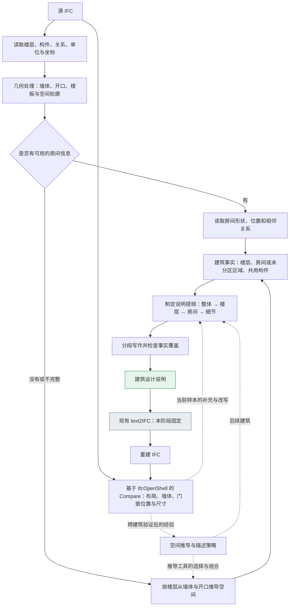

# IFC2Text：从建筑模型到可重建的设计说明

更新：2026-09-16。研究路线阶段性确定，Phase 1 可解释往返基线已开始实施；当前尚未进行新的真实 Provider 往返调用。当前分支：`codex/bim2text-research`。

### 门窗部件扩展：计划 v1.0

[唯一实施计划](text2ifc-component-plan-v1.0.md)已合并部件设计、窗结构问答与 IFC 表示调查。采用自然语言可表达的参数化部件；先测单门和单窗，再测安装与整栋。不支持项返回人工交互，新旧合同显式选择并验证回退。当前仅完成计划，未实施；研究目标与文本独立重建原则仍以本文为准。

## 1. 研究从哪里开始

> “现在我手头的 text2IFC 系统是可靠的，但是也可以进行改进，后续改进吧。”

现有 text2IFC 作为可靠的正向建模基础，本阶段保持其生成流程不变，集中研究 IFC2Text。我们要让系统读懂一栋已有建筑，写出建筑师能够理解和修改的说明，再交给 text2IFC 重建。正向系统的进一步优化留到后续，当前不把双向同时训练设为前提。

> “手头有一个 IFC，让它转换为 text，再从 text 转换为 IFC，然后做两个的 compare，尽可能一致。”

这确定了首个实验：**源 IFC → 设计说明 → 重建 IFC → 比较。** 先不修改文字，检验建筑信息经过语言之后能保留多少；再研究人改文字后的设计变化。源 IFC 供描述端读取，并作为最后的比较标准；重建端只收到生成的说明。

说明按**整体概况—楼层—房间—构件细节**展开。首轮就覆盖墙体、门窗等主要构件的位置与尺寸，不能只写面积、房间数量或“这里有几扇窗”。同时保留自然语言的可读性，让人能看懂建筑怎样组织。

缺少 IfcSpace 时，优先从墙体和开口推导房间；暂时无法可靠划分房间的区域，仍然描述其墙体位置和门窗。房间推导是希望补上的能力，不应成为整栋 IFC 无法输出说明的原因。

研究先使用 API，微调作为后续选择。底层解析和几何计算保持固定，**空间推导与描述组织的策略可以迭代改进**：前者研究怎样从构件理解空间，后者研究怎样把这些空间讲清楚。本稿区分已有工具、建议采用的技术路线和仍待验证的方法假设。

本阶段不生成或使用平面图、剖面图、三维视图作为模型输入，也不引入视觉模型。采用 IfcOpenShell 读取和测量 IFC，在此基础上进行程序化比较。检验程序与差异报告由后续开发工作负责，不把逐栋人工看图设为流程前提。

## 2. IFC2Text 系统的大致流程

采用“几何与关系解析＋分层语言生成”。程序负责测量和组织建筑事实，语言模型负责选择叙述顺序、概括重复部分、表达空间关系。输入以 IFC 提取的结构化事实为基础，尺寸从 IFC 读取或计算，不使用视图辅助。



图中有两个不同的改进过程：当前模型的差异帮助重新检查空间解释和说明；多个模型上的有效结果，才有机会形成下一轮 IFC2Text 的空间推导与描述策略。后者是第 6 节要讨论的自进化机制。

### 2.1 楼层优先适合做主结构，但需要交代公共部分

按楼层阅读最接近建筑图纸与设计说明的习惯。每层先讲平面轮廓、定位基准、层高、走廊和楼梯，再逐个房间说明位置、形状、尺寸及门窗。这样读者先有全层的认识，再理解局部细节。

纯粹把全部内容塞进房间段落，会遇到三个问题：两间房共用一面墙，可能被重复描述；走廊和楼梯连接多个房间，容易在局部叙述中丢失；跨层构件不能只归入一个房间。因此，内部保留构件与空间之间的关系，文本则按下面的顺序展开：

```text
建筑整体：层数、总体轮廓、方位与标高约定
├─ 一层
│  ├─ 楼层概况：轮廓、层高、交通空间、公共墙体与楼板
│  ├─ 房间 A：位置和轮廓 → 尺寸 → 门窗与其他主要构件
│  ├─ 房间 B：位置和轮廓 → 尺寸 → 门窗与其他主要构件
│  └─ 未分区区域：直接说明墙体布置与开口
├─ 二层：同样展开，并明确与一层的差异
└─ 跨层部分：楼梯、中庭、通高空间及相关连接
```

共用墙只给出一次完整几何描述，相关房间用“与东侧房间共用的隔墙”等自然表达引用。相邻关系也只说明实际共享或连接，不把“隔墙相邻”写成“可以直接通行”。房间净尺寸、墙体厚度和定位基准要区分，避免不同段落的尺寸相互冲突。

可比较三种组织方式，楼层优先作为默认：

| 组织方式 | 适合什么建筑 | 在方案中的位置 |
|---|---|---|
| 楼层 → 房间 → 细节 | 大多数多层住宅、办公建筑 | 默认结构，便于逐层核对 |
| 楼层 → 走廊／交通核心 → 房间组 | 宿舍、酒店、走廊组织明显的办公楼 | 楼层内部的可选写法，保留每间房的具体信息 |
| 楼层 → 墙体与构件布置 | 缺少房间对象、开放空间或尚不能确定房间划分的模型 | 可独立工作的替代路径；也作为重建基线 |

“标准层＋差异”是一种可选压缩方式，首轮不默认省略整层细节。系统必须先识别真实重复部分；一层多一扇窗、局部墙体偏移，都需要展开说明。是否采用这种写法，后续由重建结果和阅读效果共同判断。

### 2.2 一段说明应该具体到什么程度

下面仅示范构件段落，不是完整建筑说明。假设源模型已给出方位与标高依据：

> 一层北侧外墙东西向布置，长 12 米、厚 240 毫米，高 3 米。以墙西端为起点向东量，两扇窗的中心分别位于 3 米和 9 米处；窗宽均为 1.5 米、高 1.2 米，窗底距本层基准标高 0.9 米。西侧房间的入口设在南侧隔墙，门洞中心距隔墙西端 1.2 米，宽 0.9 米、高 2.1 米。

这段话交代了定位起点、方向、尺寸和标高。没有真实北向时，改用建筑局部坐标或轴线方向；没有完成面依据时，就说明相对于哪一个楼层基准，不自动把楼层标高解释成完成面。

最终输出可以较长。第一目标是内容完整，再研究同等重建质量下怎样写得更紧凑。不能为了简洁把需要重建的门窗细节删掉。

## 3. 技术路径与可行性

### 3.1 先建立建筑事实，再生成文字

IFC2Text 需要一份面向描述的中间表示，包括楼层、空间轮廓、构件几何、尺寸和相互关系。它可以存在于内存或 JSON 中，作用是为语言模型提供明确事实。生成 text2IFC 时仍只传设计说明，不把这份表示作为额外答案传过去。

[IfcOpenShell 的空间结构工具](https://docs.ifcopenshell.org/autoapi/ifcopenshell/util/element/index.html)支持读取构件所在楼层、空间分解以及门窗所填充的开口；[几何处理工具](https://docs.ifcopenshell.org/ifcopenshell-python/geometry_processing.html)可以把不同 IFC 几何表达转换为可计算的形状，并提供批量处理和缓存。这些是解析路线可落地的依据，不等于项目已经具备完整的房间推导。

| 环节 | 建议怎么做 | 可行性与主要工作 |
|---|---|---|
| 楼层与坐标 | 读取空间层级、构件归属、局部坐标变换与单位；统一测量坐标 | 常规读取可复用；跨层构件需结合实际几何覆盖的高度判断 |
| 墙体与楼板 | 能读取原有参数时直接读取；复杂表示转为几何后求轮廓、方向和厚度 | 常见直墙容易起步；曲墙、组合墙与复杂截面需专门表达 |
| 门窗与开口 | 优先沿填充和开洞关系找到墙体，提取宽高、位置和底部标高 | 关系完整时较直接；关系缺失时需几何匹配，不能只选最近的一面墙 |
| 房间与连接 | 优先读空间对象及其围合关系；不足时进行楼层几何分析 | 已有空间信息的模型较容易；无空间对象的推导是新增工作重点 |
| 分层写作 | 先安排全层和房间提纲，再写局部说明，最后检查遗漏与冲突 | API 可实现；重点是长文本覆盖、共享构件和跨层信息 |
| 往返比较 | 源模型与重建模型按楼层、类别、几何和关系匹配 | 不能依赖两次生成的 GUID 相同，也不能只比较总构件数 |

墙的世界坐标包围盒不能普遍充当墙厚和长度：斜墙需要沿墙方向测量。门窗整体宽高、开口尺寸和外框尺寸也应分别识别，不混成同一个数字。

### 3.2 缺少 IfcSpace，如何推导房间

建议采用两条可以汇合的路径。

**有空间信息：** 读取 IfcSpace 的形状、名称、楼层及可用关系，再检查它与墙、门窗的实际位置是否一致。IFC 的空间关系能够表示物理和虚拟的分隔，因此不能把所有空间分隔都当作实体墙。具体字段按源文件的 IFC 版本读取，参见 [buildingSMART 的空间关系定义](https://standards.buildingsmart.org/IFC/DEV/IFC4_3/HTML/lexical/IfcRelSpaceBoundary.html)。

**没有空间信息：** 按楼层提取墙体平面几何，在楼层范围内寻找被围合的空间。识别分区时临时封闭已知门洞，得到房间区域；随后把门洞恢复成区域之间的连接。这里是分析中的处理，不修改源 IFC。对墙段的小间隙需要结合建模精度判断，不能把真正的开放区域随意封成房间。

单一高度的水平切片可能漏掉矮墙、门洞或特殊窗洞，拟结合多个切片高度、墙体投影和开口记录交叉判断。实现可利用现成的几何剖切、平面布尔运算与多边形处理；具体算法需要在代表性模型上比较，尚未在本项目验证。

几何能给出围合和形状，却不一定能推断用途。没有功能信息时写“空间 A”，不凭长宽猜它是卧室。开放大厅内的功能区、复杂错层和通高空间可能无法仅凭墙体唯一划分；这些区域采用墙体／构件布置描述，保留可读出的信息。

因此起步顺序是：带空间信息的 golden 帮助核对解析；无 IfcSpace 的常见封闭空间检验推导；复杂区域仍可输出构件说明。前两类可以并行覆盖，不必等自动房间划分解决所有情况。

推导可以有多个候选。例如同一层分别尝试墙体投影、多高度切片加门洞分析，再检查得到的围合区域是否对应实际墙面、门洞是否连接合理的区域。几何工具执行不变，系统可以学习在什么模型条件下调用哪组工具、采用什么参数范围、如何处理局部失败。这是允许自进化的空间推导策略；它不能通过移动源墙体或虚构隔墙获得更好看的房间。

### 3.3 LLM 与程序检验分别负责什么

语言模型主要承担内容规划和表达：决定每层先讲什么、怎样把房间放回全层布局、哪些重复内容可以合并、哪些差异必须展开。数值计算与 IFC 关系读取由工具完成。

空间推导策略也基于提取的构件事实和几何工具结果选择下一步操作，不要求视觉输入。本阶段不建设视图生成与视觉审查流程。

IfcOpenShell 提供几何转换、坐标处理和 IFC 关系读取，作为检验基础；项目需要补充源模型与重建模型之间的构件匹配、误差计算和报告。库能成功打开文件，不代表两栋建筑一致，也不能代替对房间用途和文本可读性的判断。几何与关系采用程序检验，文本另行检查表达和事实覆盖，分别报告结果。

分层生成后，还需要核对每层房间、墙体与门窗是否都有对应说明，检查数值、方向及共用构件的叙述是否相互一致。这里检查的是描述内容，不能用润色替代缺失数据的读取。

### 3.4 当前架构可以复用到哪里

| 现有资产 | 复用方式 | IFC2Text 新增工作 |
|---|---|---|
| [提取器](../../src/text2ifc_extractor/extractor.py)、[几何解析](../../src/text2ifc_extractor/geometry.py) | 单位、坐标、实体及已有参数解析 | 通用几何读取与面向描述的空间表示；当前提取入口限 IFC2X3，映射体、BRep 等不能直接沿用其挤出提取路径 |
| [关系提取](../../src/text2ifc_extractor/relationships.py)、[修复索引](../../src/text2ifc_ifc_repair/indexer.py) | 复用门窗、开口、宿主及楼层等读取逻辑 | 房间—墙体、房间—门、跨层关系与几何补充 |
| [文本配对](../../src/text2ifc_text/pairs.py) | 配对记录、模板对照和已有数据组织 | 当前模板以数量、名称、属性名为主，需要完整分层说明 |
| [Generation 编排](../../src/text2ifc_agent/interactive_cli_flow.py)、[编译器](../../src/text2ifc_compiler/compiler.py) | 直接作为固定的 text2IFC 重建端 | 接收说明并回收重建结果，不在本阶段重写正向流程 |

IFC2Text 的读取表示不必强制先转成可编译的 BIM JSON。这样可以读取外部 IFC 中现有提取器尚不能完整转译的几何，同时保留原来的生产路径。解析范围与往返实验范围分别记录：能描述的外部几何，不一定都属于当前重建任务范围。

## 4. 文献收口：已有工作做到了哪一步

检索截至 2026-09-16，使用 IFC2Text、BIM-to-text、building descriptor、natural language generation、BIM description 和 captioning 等关键词，并追查直接论文的作者与机构页面。结论是：**存在直接的 BIM→自然语言研究，当前查到的完整重建及跨建筑迭代证据较少。** 这是本轮检索结论，不是“从未有人做过”的证明。

### 4.1 直接描述与 IFC 解析

**Automated Natural Language Building Descriptor for Building Information Models，EC3 / CIB W78，2025。**
[出版页](https://ec-3.org/publication/ec32025_310/)，[全文](https://ec-3.org/wp-content/uploads/2025/10/EC32025_310.pdf)，重点为 Method、Validation 和 Results。

这是最直接的先例。它在 Revit / Rhino.Inside 环境中提取房间形状、面积及门窗楼梯连接，用 TETI 判断连接，整理为 JSON，再让 o1 和 DeepSeek-R1 写多层建筑说明。四个项目的实验检查房间覆盖、面积和连接描述，报告了形状与方向误读。其提示已经要求支持重建；论文未报告实际的文本→BIM 往返重建或跨建筑策略更新实验。

**数据公开情况（核查至 2026-09-16）：** 论文使用四个项目 A–D，分别为住宅、两个办公项目和宿舍，提取环境为 Revit 2025 / Rhino.Inside.Revit。在全文、出版页、[TUM 论文记录](https://portal.fis.tum.de/en/publications/automated-natural-language-building-descriptor-for-building-infor/)和[第一作者页面](https://www.cee.ed.tum.de/ccbe/team/suhyung-jang/)中，未找到这四个项目的公开 RVT／IFC 下载或数据仓库，也未找到明确的按申请提供数据声明。论文中的 JSON 中间数据不等于公开的建筑源模型数据集。因此，目前将其作为方法参考，不列入可下载数据来源；如需复现实验模型，还需向作者询问文件格式、获取方式与使用许可。这个结论是未找到公开发布证据，不是断言作者不能提供。起步实验可以使用手头已有 IFC，不依赖这四个项目。

我们的比较应从这一流程出发：描述不仅包含空间组织，还保留主要构件的定位与尺寸，并实际重建验证。把 Revit 换成 IFC、增加楼层标题，都不足以单独构成方法创新。

**IfcLLM，2026。**
[作者全文](https://arxiv.org/html/2605.13236v1)。

将属性和几何组织为关系表示、空间关系组织为图，让 LLM 查询和迭代获取答案；作者在三个 IFC、30 类查询场景中评价。它提供 IFC 空间信息读取的参考，但问答只需找到问题相关的事实，完整建筑说明还要主动覆盖没有被问到的空间和构件。包围盒关系可帮助找候选邻接，不能直接代表通行。

**BIM Information Extraction Through LLM-based Adaptive Exploration，2026。**
[作者全文](https://arxiv.org/html/2605.01698v1)。

Agent 根据问题编写并执行读取代码，再利用结果继续探索。作者用 ifc-bench v2 的 1,027 个任务、37 个模型、21 个项目评价。对本项目的启示是复杂 IFC 可能需要按需探索；但逐问查询能否稳定组成完整设计说明，仍需单独检验。可把“按提纲连续提问读取”作为空间解析方案的对照。

### 4.2 模型—文本配对与正向生成

**Text2CAD，2024。**
[作者全文](https://arxiv.org/html/2409.17106v1)。

从 DeepCAD 模型的视觉外观和草图／拉伸序列生成不同详细程度的描述，再训练文本到参数化 CAD 序列的模型，报告约 170K 模型、660K 文本标注。它证明反向标注服务正向生成是一条已有路线；我们的工作需要在建筑空间与构件描述、重建反馈上推进，不能把“模型自动生成 caption”本身作为新方法。

**Text2MBL，2025。**
[作者全文](https://arxiv.org/html/2509.23713v1)。

用模块、住宅单元和房间的层次化代码表示模块化布局，以 198 个设计、每个两份人工描述起步，配合合成文本微调 Qwen2.5，输出可在 Revit 执行的动作。实验比较输出表示及扩充方式，也观察到扩充越多并非越好。我们的区别是从既有 IFC 反向提取建筑事实，并用实际重建结果改进配对文本；它是数据与生成部分的重要对照。

**Text2BIM。**
[作者 v2 全文](https://arxiv.org/html/2408.08054v2)。

多 Agent 将需求转成建筑方案和工具代码，通过执行与检查反馈修订建筑；v2 比较 25 个提示、三种模型、各三次运行。其生成—检查—修改与已有 text2IFC 都说明任务内返工不是新贡献。本项目当前复用自己的正向系统，重点检验反向描述与跨建筑学习。

**BIM-Edit，2026。**
[作者 v3 全文](https://arxiv.org/html/2606.20146v3)。

输入已有 IFC 和编辑指令，评价增改删任务的几何、语义和拓扑表现，包含 324 个任务。它为后续改写设计说明的实验提供参考，但首个实验仍是未经修改的文本往返重建，不能把研究重新收缩为局部 repair。

### 4.3 API 下如何积累经验，以及哪些思路已经有人做过

**GEPA，2025，2026 年修订。**
[论文](https://arxiv.org/abs/2507.19457)，[作者实现](https://github.com/gepa-ai/gepa)。

通过执行轨迹和自然语言反馈提出、测试、选择提示候选，并组合不同候选的优势。论文报告六项任务的实验；本次核查摘要和官方方法说明，没有复核其全部实验表。它可以作为现成优化器，也必须成为对照：我们要证明建筑差异如何帮助学习，不能把提示自动优化重新命名为创新。

**ExpeL: LLM Agents Are Experiential Learners，AAAI 2024。**
[作者全文](https://arxiv.org/html/2308.10144v3)。

从训练任务中的成功／失败经验抽取自然语言经验，并检索成功轨迹帮助新任务，全程不更新模型权重。在 HotpotQA、ALFWorld 和 WebShop 等任务上验证。它直接支持 API 经验学习的可行性，也说明“失败总结＋示例库”已有先例；本项目需要增加建筑任务特有的差异定位和可检验的描述改动。

**Dual Learning for Machine Translation，2016。**
[论文](https://arxiv.org/abs/1611.00179)，[作者机构说明](https://www.microsoft.com/en-us/research/publication/dual-learning-machine-translation/)。

以英法两个翻译方向相互提供反馈，通过翻译后再翻译回来的结果学习。可借鉴往返监督，但建筑模型与设计说明并非信息量天然等价的两种语言，不能直接照搬句子重建目标。当前固定 text2IFC，因此并不声称已经进行双向联合训练。

**Self-Alignment with Instruction Backtranslation，2023。**
[作者全文](https://arxiv.org/html/2308.06259v2)。

从少量种子示例与大量现有网页文本反向生成指令，筛选配对数据并微调，再迭代改善筛选。它解释了如何利用“已有答案”构建输入—输出对。现有 IFC 同样可以作为已有结果，但我们仍要证明所生成的说明是否支持建筑重建，以及重建反馈是否比一次性标注更有用。

[Scan2BIM-Data](https://www.mds-lab.de/theses/scan2bim-data-automated-ifc-generation/)也提出空间描述与 IFC 配对方向，但所核查页面为开放 thesis topic，不能计为已完成的实验结果。

## 5. Golden 起步与比较方式

两条链路都可以用少量 golden 配对起步：源模型 M，以及经过核对的一份完整说明 T*。T* 是正确表达的一种写法，不是唯一标准答案。现成说明可以直接核对；没有说明时，可以生成初稿后人工校订。

当前主要使用三种比较：IFC2Text 的说明是否准确覆盖源模型；golden 说明与自动说明经固定 text2IFC 重建后分别有什么差异；完整往返结果与源建筑有多接近。golden 在这里提供起步示例和解释结果的参照，不把重新评估整个 text2IFC 系统变成前置任务。

Compare 按三个层次报告：

| 层次 | 看什么 | 避免漏掉什么 |
|---|---|---|
| 楼层与布局 | 轮廓、层数、标高、房间位置和形状、连通 | 总面积接近但房间排列错误 |
| 墙体与构件 | 墙体位置、方向、厚度，门窗所在墙面、宽高、沿墙位置与标高 | 只匹配成功构件，漏报缺失或多出的门窗 |
| 说明质量 | 事实覆盖与正确性、读者能否理解布局、长度 | 重建分数提高但文本变成难读的坐标堆积 |

程序检验以 [IfcOpenShell 几何处理](https://docs.ifcopenshell.org/ifcopenshell-python/geometry_processing.html)和[形状测量工具](https://docs.ifcopenshell.org/autoapi/ifcopenshell/util/shape/index.html)为基础，读取源模型与重建模型的楼层、统一坐标下的构件形状及开口关系，再按楼层、类别、几何位置与关系匹配构件，不要求 GUID 保持一致。比较结果应给出缺失／多余构件、位置偏差、尺寸偏差和连接差异，并定位到具体楼层与构件，便于回到描述中修改。构件匹配与误差报告属于需要新增的 Compare 逻辑，不是调用一个库函数就完成全部评估。

本阶段不依赖截图或视觉模型打分。对能够从 IFC 明确读取或测量的事实进行自动核对；缺少可靠参照的房间用途等信息标记为未核验。文本可读性通过单独的文本审阅判断，不把 IfcOpenShell 的几何结果解释为语言质量分数。这里定义的是后续检验方案，尚未执行模型往返实验。

房间推导不成功的区域仍比较墙体与门窗，不把“没有房间结果”伪装成房间误差为零。源模型也缺少房间标签时，可对部分 golden 人工标出空间用于检验推导；其余样本不能拿同一套推导结果自证正确。

几何比较区分源坐标与建筑内部布置；若任务不要求保留绝对地理坐标，可以事先约定整体刚体对齐，但不逐个移动构件来提高分数。具体容差按模型精度和需求制定，尚未填写任意阈值。

人修改文字的实验随后加入。目标变化与其余设计的保持分别评价，例如窗宽改为 1.5 米是期望变化，不应仍按源宽度计算错误。

## 6. 自进化：系统每一轮究竟学到什么

建议把机制定义为：**从固定的 IFC 几何事实出发，利用空间核对与 text2IFC 重建结果，学习怎样推导空间、怎样描述建筑。** API 模型权重暂时不变，更新的是空间推导工具的使用策略，以及内容提纲、定位表达和示例；不是每次碰到新 IFC 都由人重新写提示。

### 6.1 固定什么，学习什么

| 层次 | 固定的部分 | 可以改进的部分 |
|---|---|---|
| 原始解析与几何计算 | IFC 读取、单位与坐标变换、墙体和门窗测量、剖切与平面运算工具的代码 | 工程缺陷另外修正，不作为自进化动作 |
| 空间推导 | 源几何事实与可调用工具 | 选择投影还是多切片、切片和间隙参数的适用范围、门洞辅助分区、候选空间的选择及失败后的替代方法 |
| 建筑描述 | 需要表达的源事实 | 房间分组、叙述顺序、定位方式、重复部分和差异的展开、示例选择 |
| 正向生成与比较 | 现有 text2IFC 和既定比较程序 | 本阶段不更新 |

这里学习的是空间推导的决策过程，不要求模型自动改写几何内核。能够选择的工具和参数范围需要先通过 golden 确定；后续若新增几何工具，先作为工程扩展单独比较。

可以把 IFC2Text 写成两个连续模块：空间推导得到 S，再由描述策略把 S 与原始构件事实写成 T。先分别观察“只改空间推导”和“只改描述”的收益，再讨论交替更新二者，生成端始终保持不变。

### 6.2 三种机制的取舍

| 机制 | 改变什么 | 判断 |
|---|---|---|
| 单模型反复改写 | 当前建筑的说明 | 能提高该文本质量，可作为内层步骤；单独不足以称为持续学习 |
| 空间推导、描述策略与示例迭代 | 后续建筑使用的工具调用方案、写法和示例 | 当前采用的研究方向，适合 API；要证明新建筑首轮结果也改善 |
| 描述模型微调 | IFC2Text 模型参数 | 待配对数据和反馈有效后考虑；当前不要求实施 |

推荐的路线包含前两种：先通过空间核对与真实重建找到更好的解释和说明，再将有效做法归纳并验证。解析程序固定，空间推导策略与描述策略均可更新；具体工具范围仍需通过起步案例讨论，不预设所有空间都能自动解释。

### 6.3 一轮更新的具体过程

1. **起步推导和描述。** 固定原始几何事实，用当前推导策略得到空间解释，再生成楼层—房间—细节说明。记录所用推导步骤及段落对应的事实，便于定位问题。
2. **重建并获得差异。** 现有 text2IFC 生成新模型。Compare 返回“二层北墙的窗少一扇”“西侧房间整体偏移”等定位到区域和构件的差异，而非只给总分。
3. **分别提出空间候选或文本候选。** 如果空间被错误合并、门连接不合理，先尝试不同的推导工具组合；如果空间解释正确但说明遗漏、定位不清，候选改写补充事实、明确定位起点、拆开重复概述或调整叙述顺序。一次尽量只改变一种因素，所有事实仍来自源 IFC。
4. **比较改写的实际效果。** 尽量一次改变一个表达因素；每个候选仍通过完整重建评价，既看目标误差，也看全楼是否出现新误差。估计段落改动的效果，不将一次随机更好的结果当成确定因果关系。
5. **从结果中提炼策略。** 保存有效的空间推导方案、前后描述对及对应差异。提炼“哪些输入条件适合哪种工具组合和写法”，而不是保存这栋楼的具体尺寸让下一栋照抄。空间策略包含适用条件、工具顺序与参数选择方式；描述策略包含分组、叙述和定位方法。
6. **在其他建筑上选择策略。** 对候选策略使用独立的验证建筑，保留总体有效的版本。之后在未参与选择的建筑上检验，观察首轮描述能否产生更好的重建，以及达到相似质量需要多少次改写。

空间推导需要额外的判断依据：没有 IfcSpace 的源模型中，同一组墙体可能对应多种功能分区，仅凭重建外形相似，不能证明推导的房间正确。起步使用少量人工空间标注或可信空间对象，分别比较空间轮廓、分区与门连接；没有此类参照的样本，报告几何复现和推导结果，不宣称房间语义已经验证。不会用同一个推导器的输出充当其自身正确答案。

为了把学习因素与计算预算分开，固定原始解析器、生成端和 Compare 方法。空间推导与描述的更新分别做消融；新增底层几何算法等工程改进单独记录。

### 6.4 两个具体例子

**空间推导的改进。** 一个没有 IfcSpace 的模型中，单高度切片经过门洞，使走廊和房间合成一个大区域。系统调用已有的开口读取和多切片工具，尝试“先用门洞信息恢复分区，再建立门连接”。如果这一方案在 golden 空间核对及其他相似模型上更好，就保留“何时需要结合开口分析”的策略。底层剖切代码和墙体几何没有改变。若错误来自真实开放空间，则不能套用这条策略强行分房。

**描述表达的改进。**

假设一层与二层大部分相同，但二层东侧房间的窗数量和位置不同。初始说明把二层概括为“同一层”，导致重建复制了错误窗布置。

系统可以提出三种改写：单独列出二层差异；完整展开二层房间；保留重复概述但逐项写清门窗。它用源 IFC 的真实信息填充这些候选，再比较重建结果及文本长度。

如果“相同部分概括、差异构件明确展开”在其他部分重复的建筑上也表现好，就形成一条带适用条件的描述策略。面对下一栋类似建筑，系统在第一遍就主动说明各层差异。这才是希望得到的跨建筑改善。若只改好了原来的二层窗，结果只能说明当前样本得到优化。

这只是拟议例子，尚未运行，不能预设它一定优于完整逐层描述。


### 6.5 怎样证明它不只是多试几次

需要区分三项收益：当前文本通过重试变好；更好的样本作为示例有用；抽取出的策略能够迁移。建议逐步比较：

- 固定的楼层—房间说明，与完整构件清单：确定分层表达的起点。
- 只更新空间推导、只更新描述、交替更新两者：确定空间理解和语言表达分别带来多少收益，仍使用同一个 text2IFC。
- 同预算的单模型反复改写：检查单靠多次尝试能改善多少。
- 只检索有效示例的版本：检查经验库自身的作用。
- 通用 GEPA／ExpeL 思路，与加入建筑差异定位及局部候选比较的版本：检查方法增量。
- 移除差异定位、局部候选比较或跨建筑策略筛选：判断哪一步真正贡献收益。

API 和总重建预算相同，记录文本长度，避免只是写得更多或调用得更多。报告未见建筑首轮重建质量、限定次数后的最好结果、调用成本和失败情况；同一建筑的多个描述、旋转或近似版本不算独立建筑。

学习阶段每次 Compare 都可使用对应源 IFC，这是该任务的正常输入。最终评测时，测试建筑不用于更新跨建筑策略；如果允许它在自身任务内改写，要另报为多轮结果。

## 7. 当前值得推进的创新点与论文故事

本阶段的中心问题可以写成：

**既有建筑模型中的哪些信息应该怎样组织成自然语言，才能让可靠的 text2IFC 尽可能复现建筑；这种表达方式能否从重建结果中持续改善？**

建议围绕两个相连的贡献展开。

**第一，面向重建的 IFC 分层设计说明。** 以楼层—房间为主线，把空间组织与墙体、门窗的定位尺寸放进同一份可阅读说明；在没有空间对象时，尝试几何推导，并保留构件描述路径。具体要证明：与空间概述、扁平构件清单相比，同等详细程度下，这种组织更利于重建和阅读。楼层层次、几何提取和自然语言生成分别都是已有技术，贡献应来自它们怎样共同保留建筑信息及相应实验证据。

**第二，空间核对与重建差异驱动的 IFC2Text 策略学习。** 将模型差异定位到空间推导和描述表达，分别比较候选推导方案或局部改写，再将有效做法用于其他建筑。研究增量集中在“建筑误差怎样指导空间理解与语言表达的改进”：源几何保持不变，系统学习更合适的工具组合、定位表达、共享构件与重复楼层写法。GEPA 等现成优化器可以复用，不宣称重新发明通用自进化算法。

IFC–文本配对数据是两项工作的共同产物，人改设计说明后再生成建筑是后续应用验证。数据数量、API 经验库或往返流程本身，都不单独包装为算法创新。

这一故事仍有需要实验回答的部分：完整构件清单可能已经足够好，策略学习可能只适应某个生成器，跨建筑更新也可能没有额外收益。若结果如此，就相应收缩方法主张，保留实际成立的描述系统、数据与重建评测贡献。

当前路线阶段性确定：固定底层解析与现有 text2IFC，以楼层—房间—构件组织说明，首轮覆盖墙体和门窗定位尺寸；无 IfcSpace 时尝试空间推导，困难区域保留构件描述；不使用视图，以 IfcOpenShell 为基础完成往返比较，再研究空间推导与描述策略的跨建筑改进。Phase 1 已按这一方向开始实现，当前先完成确定性事实、固定描述基线、GUID 无关 Compare 和真实样本抽取；新的真实 Provider 往返仍须按 Generation 的准入与预算合同单独执行。

## 8. 2026-09-16 Phase 1 实施状态

当前已新增独立 `src/text2ifc_ifc2text/` 基线模块，保持现有 text2IFC Generation 行为不变。已实现：面向描述的建筑事实抽取、直墙与门窗/开口测量、IfcSpace 读取、无 IfcSpace 的保守封闭区域推导、楼层优先固定说明、只接收说明文本的 text2IFC 公共路径桥接，以及不依赖源/重建 GUID 一致的楼层—构件 Compare。

首轮确定性比较器测试已经覆盖：相同设计的独立 IFC 可匹配；门缺失能报告 missing；窗位移和尺寸变化能报告 deviation。真实样本已覆盖有 IfcSpace 的三层建筑、多层带楼梯建筑、无 IfcSpace 的可推导正例和推导失败反例。无 IfcSpace 时只把闭合结果称为几何推导区域，不推断用途；无法闭合的楼层继续回退到墙体和门窗布置。

下一步描述端采用版本化的“提纲 → 分段写作 → 程序合并”路径。默认采用总—分—总：开头交代建筑整体基准，中间按楼层/空间/构件展开，结尾只总结跨层组织与明确限制。汇总阶段不重新改写已经完成的 section 正文，避免最后一次模型调用再次改变尺寸、坐标或漏掉构件。对应 Prompt 从 `ifc2text-outline.v0.1`、`ifc2text-section-writer.v0.1` 和 `ifc2text-merge.v0.1` 起步，并登记到现有 `prompts/agent/registry.json`；每次行为变更新增版本，不覆盖历史版本。详细实施记录见 `docs/reports/ifc2text-phase1-implementation-2026-09-16.md`。

2026-09-17 的第一阶段 v0.3 调整：按楼层—房间—构件位置—材料展开，内容数量不设硬上限，按文本长度分批并受累计调用预算约束。为先得到完整、数值受控的往返基线，程序提供层次与事实句，`ifc2text-hierarchical-writer.v0.3` 只组织段落，程序原样合并；这属于受限描述基线，不宣称模型已经自由理解和撰写全篇。文本坐标使用米、两位小数，原始事实精度不变；材料保留直接/类型继承来源。简短决定与防复发记录见 [实施决策](../reports/ifc2text-phase1-decisions-2026-09-17.md)。

2026-09-18 Phase 1 基线收尾采用 v0.6：最终文本由通用 Narrator Agent 写短导读，程序将房间/候选区域、构件定位、材料及未确认项作为不可改写明细合入；坐标统一为 mm、一位小数，底层事实仍保留原精度。三个不同模型 hxp、i5n、1px 均完成 IFC→Text；长度分别 8255、6929、12687 字符，较复杂模型不通过删构件强行压到统一长度。hxp 进一步完成真实 Design Brief→Generator→IFC，候选可由 IfcOpenShell 重开，但 Generation 的 Geometry Expectation/Audit 未放行，因此只作为诊断产物。独立诊断 Compare 对支持类别全局一对一匹配 66/66 个对象，无 missing/extra，仍记录 12 个几何超差、5 个材料内容差异和 3 个楼层 containment 差异。该结果完成“可解释往返基线”的第一阶段目标，同时明确证明当前文本/正向链仍存在可定位的信息损失；详情与后续优先级见 [实施决策](../reports/ifc2text-phase1-decisions-2026-09-17.md)。
