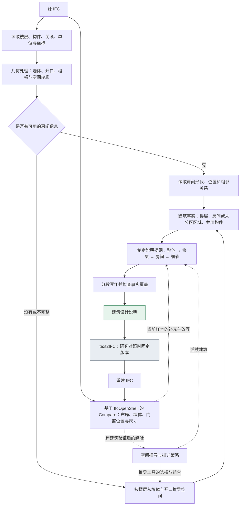

# IFC2Text：从建筑模型到可重建的设计说明

本文件负责研究问题、技术路线和待验证假设。当前实现与运行状态统一见[IFC2Text 入口](../validation/ifc2text/README.md)；门窗扩展只有一份[计划 v1.0](text2ifc-component-plan-v1.0.md)。

2026-09-28 整理：已有分层描述、参数化门窗及两栋建筑的文本往返验证；自进化和跨建筑策略学习尚未实现。下文空间推导策略搜索、示例更新和论文实验均为研究方案，不能当作已完成能力。

## 1. 研究从哪里开始

> “现在我手头的 text2IFC 系统是可靠的，但是也可以进行改进，后续改进吧。”

现有 text2IFC 作为正向建模基础，本阶段集中研究 IFC2Text。我们要让系统读懂一栋已有建筑，写出建筑师能够理解和修改的说明，再交给 text2IFC 重建。往返实验揭示的具体正向缺陷按证据修复，例如空间字段衔接和多边形墙支持；这不改变当前以 IFC2Text 为主、暂不同时训练双向模型的研究安排。

> “手头有一个 IFC，让它转换为 text，再从 text 转换为 IFC，然后做两个的 compare，尽可能一致。”

这确定了首个实验：**源 IFC → 设计说明 → 重建 IFC → 比较。** 先不修改文字，检验建筑信息经过语言之后能保留多少；再研究人改文字后的设计变化。源 IFC 供描述端读取，并作为最后的比较标准；重建端只收到生成的说明。

说明按**整体概况—楼层—房间—构件细节**展开。首轮就覆盖墙体、门窗等主要构件的位置与尺寸，不能只写面积、房间数量或“这里有几扇窗”。同时保留自然语言的可读性，让人能看懂建筑怎样组织。

缺少 IfcSpace 时，优先从墙体和开口推导房间；暂时无法可靠划分房间的区域，仍然描述其墙体位置和门窗。已有基础围合区域推导，更复杂的房间推导仍待验证，不应成为整栋 IFC 无法输出说明的原因。

研究先使用 API，微调作为后续选择。底层解析和几何计算保持固定，**空间推导与描述组织的策略可以迭代改进**：前者研究怎样从构件理解空间，后者研究怎样把这些空间讲清楚。本稿区分已有工具、建议采用的技术路线和仍待验证的方法假设。

本阶段不生成或使用平面图、剖面图、三维视图作为模型输入，也不引入视觉模型。采用 IfcOpenShell 读取和测量 IFC，在此基础上进行程序化比较。检验程序与差异报告由系统生成，不把逐栋人工看图设为流程前提。

## 2. IFC2Text 系统的大致流程

采用“几何与关系解析＋分层语言生成”。程序负责测量和组织建筑事实，语言模型负责选择叙述顺序、概括重复部分、表达空间关系。输入以 IFC 提取的结构化事实为基础，尺寸从 IFC 读取或计算，不使用视图辅助。


```mermaid
flowchart TB
    A["源 IFC"] --> B["读取楼层、构件、关系、单位与坐标"]
    B --> C["几何处理：墙体、开口、楼板与空间轮廓"]
    C --> D{"是否有可用的房间信息"}
    D -->|有| E["读取房间形状、位置和相邻关系"]
    D -->|没有或不完整| F["按楼层从墙体与开口推导空间"]
    F --> G["建筑事实：楼层、房间或未分区区域、共用构件"]
    E --> G
    G --> H["制定说明提纲：整体 → 楼层 → 房间 → 细节"]
    H --> I["分段写作并检查事实覆盖"]
    I --> T["建筑设计说明"]
    T --> J["text2IFC：研究对照时固定版本"]
    J --> K["重建 IFC"]
    A --> L["基于 IfcOpenShell 的 Compare：布局、墙体、门窗位置与尺寸"]
    K --> L
    L -. 当前样本的补充与改写 .-> H
    L -. 跨建筑验证后的经验 .-> P["空间推导与描述策略"]
    P -. 推导工具的选择与组合 .-> F
    P -. 后续建筑 .-> H
    style J fill:#e8edf2,stroke:#6b7785
    style T fill:#e6f4ec,stroke:#37865c
```

图中有两个不同的改进过程：当前模型的差异帮助重新检查空间解释和说明；多个模型上的有效结果，才有机会形成下一轮 IFC2Text 的空间推导与描述策略。后者是第 6 节要讨论的自进化机制。

### 2.1 楼层优先适合做主结构，但需要交代公共部分

按楼层阅读最接近建筑图纸与设计说明的习惯。每层先讲平面轮廓、定位基准、层高、走廊和楼梯，再逐个房间说明位置、形状、尺寸及门窗。这样读者先有全层的认识，再理解局部细节。

纯粹把全部内容塞进房间段落，会遇到三个问题：两间房共用一面墙，可能被重复描述；走廊和楼梯连接多个房间，容易在局部叙述中丢失；跨层构件不能只归入一个房间。因此，内部保留构件与空间之间的关系，文本则按下面的顺序展开：

```text
建筑整体：层数、总体轮廓、方位与标高约定
├─ 一层
│  ├─ 楼层概况：轮廓、层高、交通空间、公共墙体与楼板
│  ├─ 房间 A：位置和轮廓 → 尺寸 → 门窗与其他主要构件
│  ├─ 房间 B：位置和轮廓 → 尺寸 → 门窗与其他主要构件
│  └─ 未分区区域：直接说明墙体布置与开口
├─ 二层：同样展开，并明确与一层的差异
└─ 跨层部分：楼梯、中庭、通高空间及相关连接
```

共用墙只给出一次完整几何描述，相关房间用“与东侧房间共用的隔墙”等自然表达引用。相邻关系也只说明实际共享或连接，不把“隔墙相邻”写成“可以直接通行”。房间净尺寸、墙体厚度和定位基准要区分，避免不同段落的尺寸相互冲突。

可比较三种组织方式，楼层优先作为默认：

| 组织方式 | 适合什么建筑 | 在方案中的位置 |
|---|---|---|
| 楼层 → 房间 → 细节 | 大多数多层住宅、办公建筑 | 默认结构，便于逐层核对 |
| 楼层 → 走廊／交通核心 → 房间组 | 宿舍、酒店、走廊组织明显的办公楼 | 楼层内部的可选写法，保留每间房的具体信息 |
| 楼层 → 墙体与构件布置 | 缺少房间对象、开放空间或尚不能确定房间划分的模型 | 可独立工作的替代路径；也作为重建基线 |

“标准层＋差异”是一种可选压缩方式，首轮不默认省略整层细节。系统必须先识别真实重复部分；一层多一扇窗、局部墙体偏移，都需要展开说明。是否采用这种写法，后续由重建结果和阅读效果共同判断。

### 2.2 一段说明应该具体到什么程度

下面仅示范构件段落，不是完整建筑说明。假设源模型已给出方位与标高依据：

> 一层北侧外墙东西向布置，长 12 米、厚 240 毫米，高 3 米。以墙西端为起点向东量，两扇窗的中心分别位于 3 米和 9 米处；窗宽均为 1.5 米、高 1.2 米，窗底距本层基准标高 0.9 米。西侧房间的入口设在南侧隔墙，门洞中心距隔墙西端 1.2 米，宽 0.9 米、高 2.1 米。

这段话交代了定位起点、方向、尺寸和标高。没有真实北向时，改用建筑局部坐标或轴线方向；没有完成面依据时，就说明相对于哪一个楼层基准，不自动把楼层标高解释成完成面。

最终输出可以较长。第一目标是内容完整，再研究同等重建质量下怎样写得更紧凑。不能为了简洁把需要重建的门窗细节删掉。

## 3. 技术路径与可行性

### 3.1 先建立建筑事实，再生成文字

IFC2Text 需要一份面向描述的中间表示，包括楼层、空间轮廓、构件几何、尺寸和相互关系。它可以存在于内存或 JSON 中，作用是为语言模型提供明确事实。生成 text2IFC 时仍只传设计说明，不把这份表示作为额外答案传过去。

[IfcOpenShell 的空间结构工具](https://docs.ifcopenshell.org/autoapi/ifcopenshell/util/element/index.html)支持读取构件所在楼层、空间分解以及门窗所填充的开口；[几何处理工具](https://docs.ifcopenshell.org/ifcopenshell-python/geometry_processing.html)可以把不同 IFC 几何表达转换为可计算的形状，并提供批量处理和缓存。这些是解析路线可落地的依据，不等于项目已经具备完整的房间推导。

| 环节 | 建议怎么做 | 可行性与主要工作 |
|---|---|---|
| 楼层与坐标 | 读取空间层级、构件归属、局部坐标变换与单位；统一测量坐标 | 常规读取可复用；跨层构件需结合实际几何覆盖的高度判断 |
| 墙体与楼板 | 能读取原有参数时直接读取；复杂表示转为几何后求轮廓、方向和厚度 | 常见直墙容易起步；曲墙、组合墙与复杂截面需专门表达 |
| 门窗与开口 | 优先沿填充和开洞关系找到墙体，提取宽高、位置和底部标高 | 关系完整时较直接；关系缺失时需几何匹配，不能只选最近的一面墙 |
| 房间与连接 | 优先读空间对象及其围合关系；不足时进行楼层几何分析 | 已有空间信息的模型较容易；无空间对象的推导是新增工作重点 |
| 分层写作 | 先安排全层和房间提纲，再写局部说明，最后检查遗漏与冲突 | API 可实现；重点是长文本覆盖、共享构件和跨层信息 |
| 往返比较 | 源模型与重建模型按楼层、类别、几何和关系匹配 | 不能依赖两次生成的 GUID 相同，也不能只比较总构件数 |

墙的世界坐标包围盒不能普遍充当墙厚和长度：斜墙需要沿墙方向测量。门窗整体宽高、开口尺寸和外框尺寸也应分别识别，不混成同一个数字。

### 3.2 缺少 IfcSpace，如何推导房间

建议采用两条可以汇合的路径。

**有空间信息：** 读取 IfcSpace 的形状、名称、楼层及可用关系，再检查它与墙、门窗的实际位置是否一致。IFC 的空间关系能够表示物理和虚拟的分隔，因此不能把所有空间分隔都当作实体墙。具体字段按源文件的 IFC 版本读取，参见 [buildingSMART 的空间关系定义](https://standards.buildingsmart.org/IFC/DEV/IFC4_3/HTML/lexical/IfcRelSpaceBoundary.html)。

**没有空间信息：** 按楼层提取墙体平面几何，在楼层范围内寻找被围合的空间。识别分区时临时封闭已知门洞，得到房间区域；随后把门洞恢复成区域之间的连接。这里是分析中的处理，不修改源 IFC。对墙段的小间隙需要结合建模精度判断，不能把真正的开放区域随意封成房间。

单一高度的水平切片可能漏掉矮墙、门洞或特殊窗洞，拟结合多个切片高度、墙体投影和开口记录交叉判断。实现可利用现成的几何剖切、平面布尔运算与多边形处理；具体算法需要在代表性模型上比较，尚未在本项目验证。

几何能给出围合和形状，却不一定能推断用途。没有功能信息时写“空间 A”，不凭长宽猜它是卧室。开放大厅内的功能区、复杂错层和通高空间可能无法仅凭墙体唯一划分；这些区域采用墙体／构件布置描述，保留可读出的信息。

因此起步顺序是：带空间信息的 golden 帮助核对解析；无 IfcSpace 的常见封闭空间检验推导；复杂区域仍可输出构件说明。前两类可以并行覆盖，不必等自动房间划分解决所有情况。

推导可以有多个候选。例如同一层分别尝试墙体投影、多高度切片加门洞分析，再检查得到的围合区域是否对应实际墙面、门洞是否连接合理的区域。几何工具执行不变，系统可以学习在什么模型条件下调用哪组工具、采用什么参数范围、如何处理局部失败。这是允许自进化的空间推导策略；它不能通过移动源墙体或虚构隔墙获得更好看的房间。

### 3.3 LLM 与程序检验分别负责什么

语言模型主要承担内容规划和表达：决定每层先讲什么、怎样把房间放回全层布局、哪些重复内容可以合并、哪些差异必须展开。数值计算与 IFC 关系读取由工具完成。

空间推导策略也基于提取的构件事实和几何工具结果选择下一步操作，不要求视觉输入。本阶段不建设视图生成与视觉审查流程。

IfcOpenShell 提供几何转换、坐标处理和 IFC 关系读取，作为检验基础；项目已有源模型与重建模型之间的构件匹配、误差计算和报告。库能成功打开文件，不代表两栋建筑一致，也不能代替对房间用途和文本可读性的判断。几何与关系采用程序检验，文本另行检查表达和事实覆盖，分别报告结果。

分层生成后，还需要核对每层房间、墙体与门窗是否都有对应说明，检查数值、方向及共用构件的叙述是否相互一致。这里检查的是描述内容，不能用润色替代缺失数据的读取。

### 3.4 当前架构可以复用到哪里

| 现有资产 | 复用方式 | IFC2Text 新增工作 |
|---|---|---|
| [提取器](../../src/text2ifc_extractor/extractor.py)、[几何解析](../../src/text2ifc_extractor/geometry.py) | 单位、坐标、实体及已有参数解析 | 通用几何读取与面向描述的空间表示；旧提取入口限 IFC2X3；新增 IFC2Text 部件路径处理受支持映射与参数几何，任意 BRep 仍不能保证重建 |
| [关系提取](../../src/text2ifc_extractor/relationships.py)、[修复索引](../../src/text2ifc_ifc_repair/indexer.py) | 复用门窗、开口、宿主及楼层等读取逻辑 | 房间—墙体、房间—门、跨层关系与几何补充 |
| [文本配对](../../src/text2ifc_text/pairs.py) | 配对记录、模板对照和已有数据组织 | 当前模板以数量、名称、属性名为主，需要完整分层说明 |
| [Generation 编排](../../src/text2ifc_agent/interactive_cli_flow.py)、[编译器](../../src/text2ifc_compiler/compiler.py) | 直接作为固定的 text2IFC 重建端 | 接收说明并回收重建结果，不在本阶段重写正向流程 |

IFC2Text 的读取表示不必强制先转成可编译的 BIM JSON。这样可以读取外部 IFC 中现有提取器尚不能完整转译的几何，同时保留原来的生产路径。解析范围与往返实验范围分别记录：能描述的外部几何，不一定都属于当前重建任务范围。

## 4. 文献收口

逐篇方法、实验、局限与可借鉴内容见[文献分析](../reports/ifc2text-literature.md)，检索截止日保留为 2026-09-16。已有直接 BIM→自然语言工作；本项目需要验证的是构件细节经过文本后能否重建，以及描述／空间推导策略能否在其他建筑上改善，不能把反向标注本身称为新方法。

## 5. Golden 起步与比较方式

两条链路都可以用少量 golden 配对起步：源模型 M，以及经过核对的一份完整说明 T*。T* 是正确表达的一种写法，不是唯一标准答案。现成说明可以直接核对；没有说明时，可以生成初稿后人工校订。

当前主要使用三种比较：IFC2Text 的说明是否准确覆盖源模型；golden 说明与自动说明经固定 text2IFC 重建后分别有什么差异；完整往返结果与源建筑有多接近。golden 在这里提供起步示例和解释结果的参照，不把重新评估整个 text2IFC 系统变成前置任务。

Compare 按三个层次报告：

| 层次 | 看什么 | 避免漏掉什么 |
|---|---|---|
| 楼层与布局 | 轮廓、层数、标高、房间位置和形状、连通 | 总面积接近但房间排列错误 |
| 墙体与构件 | 墙体位置、方向、厚度，门窗所在墙面、宽高、沿墙位置与标高 | 只匹配成功构件，漏报缺失或多出的门窗 |
| 说明质量 | 事实覆盖与正确性、读者能否理解布局、长度 | 重建分数提高但文本变成难读的坐标堆积 |

程序检验以 [IfcOpenShell 几何处理](https://docs.ifcopenshell.org/ifcopenshell-python/geometry_processing.html)和[形状测量工具](https://docs.ifcopenshell.org/autoapi/ifcopenshell/util/shape/index.html)为基础，读取源模型与重建模型的楼层、统一坐标下的构件形状及开口关系，再按楼层、类别、几何位置与关系匹配构件，不要求 GUID 保持一致。比较结果应给出缺失／多余构件、位置偏差、尺寸偏差和连接差异，并定位到具体楼层与构件，便于回到描述中修改。构件匹配与误差报告属于需要新增的 Compare 逻辑，不是调用一个库函数就完成全部评估。

本阶段不依赖截图或视觉模型打分。对能够从 IFC 明确读取或测量的事实进行自动核对；缺少可靠参照的房间用途等信息标记为未核验。文本可读性通过单独的文本审阅判断，不把 IfcOpenShell 的几何结果解释为语言质量分数。已完成的往返实验及其测量范围见验证入口，文本质量仍需独立评价。

房间推导不成功的区域仍比较墙体与门窗，不把“没有房间结果”伪装成房间误差为零。源模型也缺少房间标签时，可对部分 golden 人工标出空间用于检验推导；其余样本不能拿同一套推导结果自证正确。

几何比较区分源坐标与建筑内部布置；若任务不要求保留绝对地理坐标，可以事先约定整体刚体对齐，但不逐个移动构件来提高分数。当前线性几何差不超过 1 mm 接受，数量、拓扑和材料单独判断；未评估项不得计作通过。

人修改文字的实验随后加入。目标变化与其余设计的保持分别评价，例如窗宽改为 1.5 米是期望变化，不应仍按源宽度计算错误。

## 6. 自进化：系统每一轮究竟学到什么

建议把机制定义为：**从固定的 IFC 几何事实出发，利用空间核对与 text2IFC 重建结果，学习怎样推导空间、怎样描述建筑。** API 模型权重暂时不变，更新的是空间推导工具的使用策略，以及内容提纲、定位表达和示例；不是每次碰到新 IFC 都由人重新写提示。

### 6.1 固定什么，学习什么

| 层次 | 固定的部分 | 可以改进的部分 |
|---|---|---|
| 原始解析与几何计算 | IFC 读取、单位与坐标变换、墙体和门窗测量、剖切与平面运算工具的代码 | 工程缺陷另外修正，不作为自进化动作 |
| 空间推导 | 源几何事实与可调用工具 | 选择投影还是多切片、切片和间隙参数的适用范围、门洞辅助分区、候选空间的选择及失败后的替代方法 |
| 建筑描述 | 需要表达的源事实 | 房间分组、叙述顺序、定位方式、重复部分和差异的展开、示例选择 |
| 正向生成与比较 | 现有 text2IFC 和既定比较程序 | 本阶段不更新 |

这里学习的是空间推导的决策过程，不要求模型自动改写几何内核。能够选择的工具和参数范围需要先通过 golden 确定；后续若新增几何工具，先作为工程扩展单独比较。

可以把 IFC2Text 写成两个连续模块：空间推导得到 S，再由描述策略把 S 与原始构件事实写成 T。先分别观察“只改空间推导”和“只改描述”的收益，再讨论交替更新二者，生成端始终保持不变。

### 6.2 三种机制的取舍

| 机制 | 改变什么 | 判断 |
|---|---|---|
| 单模型反复改写 | 当前建筑的说明 | 能提高该文本质量，可作为内层步骤；单独不足以称为持续学习 |
| 空间推导、描述策略与示例迭代 | 后续建筑使用的工具调用方案、写法和示例 | 当前采用的研究方向，适合 API；要证明新建筑首轮结果也改善 |
| 描述模型微调 | IFC2Text 模型参数 | 待配对数据和反馈有效后考虑；当前不要求实施 |

推荐的路线包含前两种：先通过空间核对与真实重建找到更好的解释和说明，再将有效做法归纳并验证。解析程序固定，空间推导策略与描述策略均可更新；具体工具范围仍需通过起步案例讨论，不预设所有空间都能自动解释。

### 6.3 一轮更新的具体过程

1. **起步推导和描述。** 固定原始几何事实，用当前推导策略得到空间解释，再生成楼层—房间—细节说明。记录所用推导步骤及段落对应的事实，便于定位问题。
2. **重建并获得差异。** 现有 text2IFC 生成新模型。Compare 返回“二层北墙的窗少一扇”“西侧房间整体偏移”等定位到区域和构件的差异，而非只给总分。
3. **分别提出空间候选或文本候选。** 如果空间被错误合并、门连接不合理，先尝试不同的推导工具组合；如果空间解释正确但说明遗漏、定位不清，候选改写补充事实、明确定位起点、拆开重复概述或调整叙述顺序。一次尽量只改变一种因素，所有事实仍来自源 IFC。
4. **比较改写的实际效果。** 尽量一次改变一个表达因素；每个候选仍通过完整重建评价，既看目标误差，也看全楼是否出现新误差。估计段落改动的效果，不将一次随机更好的结果当成确定因果关系。
5. **从结果中提炼策略。** 保存有效的空间推导方案、前后描述对及对应差异。提炼“哪些输入条件适合哪种工具组合和写法”，而不是保存这栋楼的具体尺寸让下一栋照抄。空间策略包含适用条件、工具顺序与参数选择方式；描述策略包含分组、叙述和定位方法。
6. **在其他建筑上选择策略。** 对候选策略使用独立的验证建筑，保留总体有效的版本。之后在未参与选择的建筑上检验，观察首轮描述能否产生更好的重建，以及达到相似质量需要多少次改写。

空间推导需要额外的判断依据：没有 IfcSpace 的源模型中，同一组墙体可能对应多种功能分区，仅凭重建外形相似，不能证明推导的房间正确。起步使用少量人工空间标注或可信空间对象，分别比较空间轮廓、分区与门连接；没有此类参照的样本，报告几何复现和推导结果，不宣称房间语义已经验证。不会用同一个推导器的输出充当其自身正确答案。

为了把学习因素与计算预算分开，固定原始解析器、生成端和 Compare 方法。空间推导与描述的更新分别做消融；新增底层几何算法等工程改进单独记录。

### 6.4 两个具体例子

**空间推导的改进。** 一个没有 IfcSpace 的模型中，单高度切片经过门洞，使走廊和房间合成一个大区域。系统调用已有的开口读取和多切片工具，尝试“先用门洞信息恢复分区，再建立门连接”。如果这一方案在 golden 空间核对及其他相似模型上更好，就保留“何时需要结合开口分析”的策略。底层剖切代码和墙体几何没有改变。若错误来自真实开放空间，则不能套用这条策略强行分房。

**描述表达的改进。**

假设一层与二层大部分相同，但二层东侧房间的窗数量和位置不同。初始说明把二层概括为“同一层”，导致重建复制了错误窗布置。

系统可以提出三种改写：单独列出二层差异；完整展开二层房间；保留重复概述但逐项写清门窗。它用源 IFC 的真实信息填充这些候选，再比较重建结果及文本长度。

如果“相同部分概括、差异构件明确展开”在其他部分重复的建筑上也表现好，就形成一条带适用条件的描述策略。面对下一栋类似建筑，系统在第一遍就主动说明各层差异。这才是希望得到的跨建筑改善。若只改好了原来的二层窗，结果只能说明当前样本得到优化。

这只是拟议例子，尚未运行，不能预设它一定优于完整逐层描述。


```mermaid
flowchart LR
    A["起步配对与空间标注"] --> B["训练建筑：空间推导 → 描述 → 重建"]
    B --> C["Compare 与空间核对：定位问题"]
    C --> D["比较空间推导候选或描述候选"]
    D --> E["有效空间解释、描述对与候选策略"]
    E --> F["其他建筑上验证并选择"]
    F --> G["下一轮 IFC2Text"]
    G --> B
    G --> H["未见建筑：首轮重建质量与所需改写次数"]
```

### 6.5 怎样证明它不只是多试几次

需要区分三项收益：当前文本通过重试变好；更好的样本作为示例有用；抽取出的策略能够迁移。建议逐步比较：

- 固定的楼层—房间说明，与完整构件清单：确定分层表达的起点。
- 只更新空间推导、只更新描述、交替更新两者：确定空间理解和语言表达分别带来多少收益，仍使用同一个 text2IFC。
- 同预算的单模型反复改写：检查单靠多次尝试能改善多少。
- 只检索有效示例的版本：检查经验库自身的作用。
- 通用 GEPA／ExpeL 思路，与加入建筑差异定位及局部候选比较的版本：检查方法增量。
- 移除差异定位、局部候选比较或跨建筑策略筛选：判断哪一步真正贡献收益。

API 和总重建预算相同，记录文本长度，避免只是写得更多或调用得更多。报告未见建筑首轮重建质量、限定次数后的最好结果、调用成本和失败情况；同一建筑的多个描述、旋转或近似版本不算独立建筑。

学习阶段每次 Compare 都可使用对应源 IFC，这是该任务的正常输入。最终评测时，测试建筑不用于更新跨建筑策略；如果允许它在自身任务内改写，要另报为多轮结果。

## 7. 当前值得推进的创新点与论文故事

本阶段的中心问题可以写成：

**既有建筑模型中的哪些信息应该怎样组织成自然语言，才能让可靠的 text2IFC 尽可能复现建筑；这种表达方式能否从重建结果中持续改善？**

建议围绕两个相连的贡献展开。

**第一，面向重建的 IFC 分层设计说明。** 以楼层—房间为主线，把空间组织与墙体、门窗的定位尺寸放进同一份可阅读说明；在没有空间对象时，尝试几何推导，并保留构件描述路径。具体要证明：与空间概述、扁平构件清单相比，同等详细程度下，这种组织更利于重建和阅读。楼层层次、几何提取和自然语言生成分别都是已有技术，贡献应来自它们怎样共同保留建筑信息及相应实验证据。

**第二，空间核对与重建差异驱动的 IFC2Text 策略学习。** 将模型差异定位到空间推导和描述表达，分别比较候选推导方案或局部改写，再将有效做法用于其他建筑。研究增量集中在“建筑误差怎样指导空间理解与语言表达的改进”：源几何保持不变，系统学习更合适的工具组合、定位表达、共享构件与重复楼层写法。GEPA 等现成优化器可以复用，不宣称重新发明通用自进化算法。

IFC–文本配对数据是两项工作的共同产物，人改设计说明后再生成建筑是后续应用验证。数据数量、API 经验库或往返流程本身，都不单独包装为算法创新。

这一故事仍有需要实验回答的部分：完整构件清单可能已经足够好，策略学习可能只适应某个生成器，跨建筑更新也可能没有额外收益。若结果如此，就相应收缩方法主张，保留实际成立的描述系统、数据与重建评测贡献。

研究实验中固定底层解析、text2IFC 与评价器版本，以楼层—房间—构件组织说明，保留墙体和门窗定位尺寸；无 IfcSpace 时尝试空间推导，困难区域保留构件描述。工程往返基础已实现，空间推导与描述策略的跨建筑学习尚待验证。后续真实 Provider 实验仍须按 Generation 的准入与预算合同执行。
