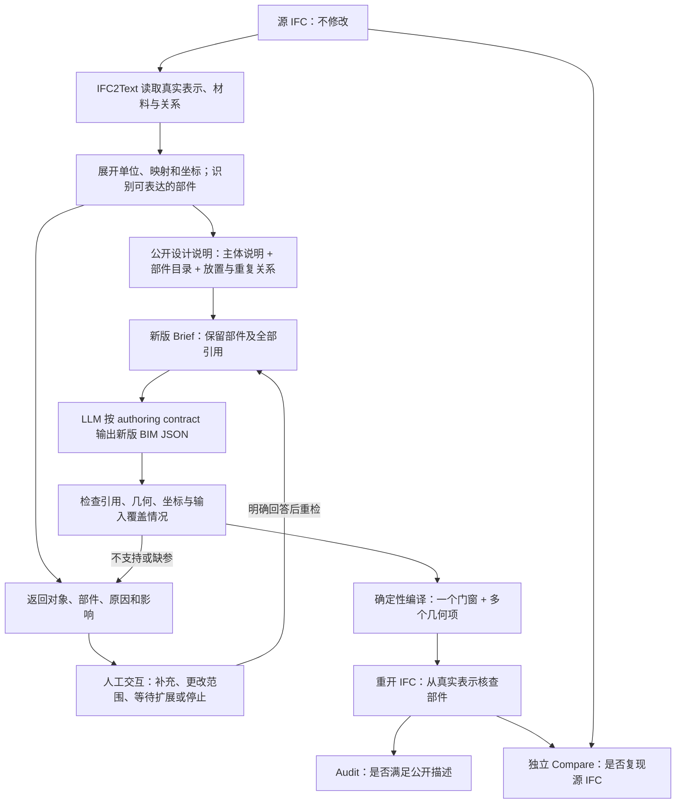

# 门窗按部件描述与重建：设计和实施计划

日期：2026-09-24。文档版本：**v0.3；参数化优先，尚未实施**。以人能够说明的部件、尺寸、截面、位置和排列关系为主；不以覆盖任意 BRep／网格为目标。首版几何、材料分期、人工交互、版本回退及门窗分别验收要求保持不变。当前只更新文档，不启动模型生成或生产代码修改。

版本记录：v0.1 记录首轮方案与三项范围确认，保存于[首轮快照](history/component-described-door-window-plan-v0.1-20260924.md)；[v0.2 快照](history/component-described-door-window-plan-v0.2-20260924.md)记录数据调查、人工交互和回退要求；v0.3 明确自然语言与参数化优先，不推进任意网格／BRep 直接重建。当前权威始终是本文；历史快照不作为执行指令。技术合同版本与本文版本分开管理，见第 6.1 节。

背景入口：[IFC2Text 主文档](bim2text-bidirectional-bridge-research.md)。实际窗结构、完整示例与问答：[一扇百叶窗在 IFC 中怎样组成](../reference/ifc-window-components-and-semantics.md)。本计划补充[既有语义与外观方案](semantic-appearance-plan.md)，不改写其已完成历史，也不扩大 Repair 范围。

## 1. 想做到什么

先说明一扇门／窗的整体身份、安装位置和尺寸，再单独说明框、门板、百叶或把手，最后用引用说明这些部件属于谁、怎样放置。LLM 根据这份语义输入和明确的 schema 输出部件几何，编译器据此创建真实实体。

> “不走模板，而是按照语义输入和一个 schema 做一个输出。”

这里“不走模板”针对详细描述的特殊门窗。保留现有简单模板作为另一种建模方式；不继续为横百叶、竖百叶、每种把手各加一种专用模板。系统也不需要先有某个名称的 IFC Type 才能建模。

已确认的粒度是：**部件独立描述和引用，IFC 中仍是一扇门／窗**。部件不是独立 IfcBuildingElementPart，也不额外计算为建筑构件。门窗父对象承担建筑身份、宿主开口和楼层关系；部件承担形状、局部位置与已知外观。

本轮目标是可行性和详细计划。首版几何与材料范围已在讨论中确认。遇到不支持对象时，再带具体缺项讨论是否需要部分模型；未获确认不自动省略或替代。实施时须先通过确定性合同和编译试验，才能承诺整栋重建效果。

### 1.1 最新范围决定：自然语言可表达，参数化优先

> “首先支持人类自然语言能支持的描述，参数化描述优先……支持应该支持的，不支持的说清楚即可。”

据此，当前目标是基本且能用明确构造参数说明的门窗，而非把所有源模型的每个面都搬进文字。优先表达“带孔窗框＋十四片等距斜板”“门板＋圆柱形部件及其位置”，不要求人或 LLM 列举上千个面和顶点。首版仍限已确认的矩形、圆形、含孔多边形截面挤出及放置／重复，不因一种形状能用一句话命名就承诺支持其重建。

支持判断分成三项：描述足以确定几何；当前合同能表达该构造；编译与独立检查能够验证。可读但不充分的“精致的弯曲把手”需要尺寸和构造信息；信息充分但尚未实现的扫掠仍返回不支持。缺参数和缺能力分别说明。

源表示名称不直接决定支持与否。简单棱柱即使存成 BRep，只要已有受验证的识别路径能还原截面、长度与放置，并独立核对几何，就可以归入参数化表达；不能证明转换等价时返回不支持。此规则不授权开展任意 BRep 逆向工程，也不因支持部分可读而自动略去其余部分。

不以“面数多”认定来源是 GLB，不以“来自工程软件”认定其参数一定可恢复。保持源记录，反馈无法支持的具体形状和阶段。任意网格、一般自由曲面与逐面 BRep 生成不进入当前实施路线；后续只有出现明确需求并再次讨论，才考虑扩大范围。

## 2. 当前证据说明了什么

现有重放候选有 66 个匹配构件，无缺失或多余；固定 **≤1 mm 接受** 后仍有 14 个几何超差。真实 Audit 已完成并接受，但 Audit 证明的是满足公开文本与 Brief，不证明源文件细节都被保留。

只替换三个开口几何的独立离线诊断使差异 14→10，剩余为 7 门、3 窗。这不是新一轮 LLM 自动重建结果。详细依据见[几何与 Audit 报告](../reports/ifc2text-geometry-audit-2026-09-22.md)。

| 源对象 | 实际构造 | 对本计划的意义 |
|---|---|---|
| N001–N003 百叶窗 | 各十四片挤出叶片＋带孔框 | 多挤出、带孔轮廓与坐标变换有直接适用样例 |
| D001–D002 双扇玻璃门 | 各五个挤出实体 | 单扇模板无法复现双扇构造；不能只补总宽高 |
| D003–D006 木门 | 各十个挤出实体，含圆和任意闭合轮廓 | 需要读取实际截面；不能凭实体形状直接断言某块一定是把手 |
| D007 推拉门 | 八个 faceted BRep；五个已证明可转正棱柱，三个未证明 | 首版多挤出不能宣称覆盖整扇门；需要明确 unsupported 分支 |

可行性判断：源已经明确保存的矩形、圆形或含孔轮廓挤出体，适合做第一批。任意 BRep 转参数化部件和未知部件语义识别难度更大，不应在同一首版承诺里混为“已支持”。

## 3. 三条路径的比较

本节保留三种总体方向；本轮进一步调查见[IFC 表示调查报告](../reports/ifc-representation-survey-2026-09-24/README.md)。读取八份文件，七份可打开，一份 IFC2X2 未评估；这是定向选样，不能推断全部数据集比例。另有两份包含相同门窗 GlobalId 集合，独立评估时必须按来源分组。

| 路径 | 收益 | 代价／问题 | 建议 |
|---|---|---|---|
| 每种样式新增系统模板 | 常见窗写法短，固定样式稳定 | 样式持续增长，模板参数仍遗漏不规则细节 | 不采用作为特殊门窗主线，符合已明确的选择 |
| 部件语义＋有限几何原语 | 可解释、可单独修改，多个样式共用同一编译能力 | 要扩展 schema、解析、编译和比较 | **推荐，本文据此展开** |
| 直接传完整网格／BRep | 可保存更广泛的表面形状 | 文本体积大、编辑含义弱；若只传文件引用会改变“文本独立重建”实验 | 当前不推进；保留为调研对照，重新讨论前不进入实施 |

首版已接受的几何范围：矩形、圆形、含孔多边形截面；直线挤出；旋转和重复排列。具体合同建议采用刚体放置和有限等距重复。它们是描述形状的方法，不是窗型模板。弯曲扫掠、自由曲面、一般布尔构造和不能证明可转换的 BRep 先报告具体不支持项，不能偷偷转成长方体。

### 3.1 其他文件证明了什么

- hxp 的三扇窗合计 45 个挤出体；七扇门合计 50 个挤出体和八个 faceted BRep。它支持“先把多挤出表达做好”的判断。
- Renga 导出的 House 有 23 窗、19 门，均经映射使用 FaceBasedSurfaceModel；一扇窗的一个面模型可包含 58 个面，不能把表示项直接等同为框、把手等语义部件。
- Revit TallBuilding 的一扇门含 39 个 BRep；其窗则每扇四个挤出体。不能为整栋建筑规定唯一几何生成方式。
- 两份 GNI IFC4 样本的门窗主要采用 PolygonalFaceSet。它们有工程来源，但当前 IFC2X3 编译器不能直接输出这种 IFC4 实体。
- SketchUp 样本的五窗三门直接采用 Brep，没有 Type 关联。Type 的有无与实际几何是否存在是两个问题。

这些是源结构观察，不是本系统生成成功证据，也不能据此恢复原作者在编辑器中的建模历史。

此次调查脚本能打开 IFC4，不代表产品的 IFC2Text→IFC2X3 全链已接受 IFC4 输入。首版不顺带扩大输入版本或迁移输出 schema；不支持的文件版本同样返回 human，说明版本与当前能力，不能自动改 FILE_SCHEMA 或偷偷转换。

### 3.2 更接近工程建模的推荐方式

将“部件怎样组织”和“部件怎样形成形状”分开。上层说明门板、框、百叶及其尺寸与连接位置；下层用明确构造操作生成它们。首版计划只提供截面挤出与放置／重复；以后若有明确需求，再讨论增加扫掠、旋转体等参数化操作。**旋转放置现有几何，不等于绕轴生成旋转体；首版只有前者。**

例如，“把手是沿折线路径形成的圆杆”更适合以后用圆截面扫掠描述，而不是为每种把手增加模板，或让 LLM 输出几百个面。Revit 族编辑器也使用挤出、扫掠、旋转、放样和空体切割，并建议逐步建立和测试参数关系。这里借鉴的是建模方式，不是要求切换到 Revit 后端。[Autodesk 几何工具](https://help.autodesk.com/cloudhelp/2023/ENU/Revit-Customize/files/GUID-478961FB-DD57-445E-831F-5B83E02F0B78.htm)、[增量建模与测试](https://help.autodesk.com/cloudhelp/2022/ENU/Revit-Customize/files/GUID-772026BB-2A3E-4193-A339-75E019AA8DCC.htm)

另一种工程路线是调用 CAD／BIM 软件参数族或引用外部详细构件，能够减少手写几何工作，但增加软件与构件库依赖，且需要证明找到的是对应形状。若将其作为对照，应明确为“文本＋公开资源引用”，不能冒充当前“仅文本重建”。直接 BRep／面集重建保留为调查中的替代方式，按 v0.3 决定不进入当前实施，也不作为完成首版的前置条件。

## 4. 两条链路怎样衔接



重建端仍只接收公开文本。文本中的部件目录、尺寸表与重复规则都是公开输入；不能让 Generator 暗中读取 `source-facts.json`、源 IFC 或私有几何附件。Source→facts→text→Brief→BIM JSON→IFC→Compare 每步保存，才能定位细节在哪一段丢失。

### 4.1 不支持项必须回到人工交互

不能只写日志里的 `unsupported` 就结束，也不能让 LLM 持续重试一个编译器根本没有的能力。发现不支持时，保存当前候选与定位证据，向 human 返回可理解的信息，并保持会话可恢复。已有 `needs_clarification`／unsupported 字段与持久化交互入口可以复用；需要核对其在新链路中的完整传播，不能只加一条错误字符串。

每次反馈至少包括：

| 返回内容 | 例子／作用 |
|---|---|
| 哪个对象、哪个部件 | D007 推拉门；源八个 BRep 中三项未证明可表达为首版挤出 |
| 卡在哪一步 | IFC2Text 识别、Brief 缺参、生成合同不支持或编译失败，分别说明 |
| 已知与缺失的内容 | 已识别五项；其余并不自动视为空白，也不能只返回“门不支持” |
| 对结果有什么影响 | 当前不能完整复现该门，因此不能完成整栋完整重建验收 |
| human 可以选择什么 | 补充已有能力所需的参数；改写要求；讨论增加能力；明确同意部分模型；停止／稍后继续 |

示例交互：

> D007 的八个边界实体中，有三项目前不能转换为本版支持的挤出几何。我保留了原始定位信息，尚未将它们省略或换成普通门。因此当前不能完整重建这扇门。可以先讨论增加相应表示，也可以明确选择仅生成支持部分并标注缺失，或暂停本次任务。

区分两种情况：缺少尺寸时可通过补充信息继续；缺少算法能力时，补一个尺寸或回答“继续”并不会让能力自动出现。后者仍需明确的新实现及对应版本。编译器异常作为故障诊断，不伪装成需要 human 填写建筑参数。

没有回答时保持等待，不默认降级、不发布完整成功、不反复消耗 Provider。回答必须连同对象范围和所选方案持久化；恢复后重新校验相关输入，旧回答不能自动应用到新发现的对象。若 human 明确接受部分模型，产物标明遗漏对象／部件和影响，状态与完整验收分开。首次进入“部分输出”能力也须有合同与验证，不能现场绕过发布流程。

这轮只定义交互，不实际提出对 D007 的删减选择；到它阻断具体试验时，再带证据沟通。

## 5. 拟议数据合同

### 5.1 主体、部件与几何项分开

| 概念 | 例子 | 责任 |
|---|---|---|
| 构件 ID | `N001` | 对应一个 IfcWindow，管理安装、楼层、类型等 |
| 部件 ID | `N001/frame`、`N001/slat-07` | 公开说明中的持续引用，不使用 STEP 行号 |
| 几何项 ID | `N001/frame/solid-01` | 一个具体挤出体；一个部件可引用多个项 |
| 复用定义 ID | `slat-definition-01` | 描述相同截面与长度；实例各自拥有位置和身份 |

建议门窗记录拥有完整的部件表，在同一文档内允许复用纯几何定义；不建立跨项目构件库。跨门窗引用实例、循环引用、重复 ID、孤立几何项、重复拥有同一实体都应给出明确错误。角色只是语义标签，不充当唯一 ID；两个把手可以同为 handle。

首版拟只保证**部件 ID**跨 IFC 重开可识别。几何项 ID 是描述／BIM JSON 内的引用和诊断编号，不承诺恢复为某个固定 STEP 实体；同一部件内部以真实几何集合验证。若以后要独立修改一个部件内的某个实体，需要另外设计持久关联，不能假设 STEP 行号稳定。第一轮局部修改以部件为单位。

父对象作为容器不再另外生成一套完整门窗几何，否则会叠加重复实体。“门主体”若指门板，应是单独部件；若指整个门构件，必须明确它只是容器。

以下字段仅为设计示意，不是已发布 schema：

```text
product N001 : IfcWindow
  placement / nominal_dimensions / opening_ref
  geometry.mode = component_geometry
  parts:
    N001/frame
      role = frame
      geometry = solid-frame
    N001/slat-01 ... N001/slat-14
      role = louvre_slat
      geometry_ref = shared-slat-definition
      placement = 每片独立的局部放置
  geometry definitions:
    solid-frame = 带内孔的轮廓 + 挤出方向 + 长度
    shared-slat-definition = 60×20 截面 + 长度 770
```

`template` 与 `component_geometry` 应是互斥模式，不能同时生效；`type_id` 与两种模式独立。详细部件模式缺参时请求澄清或报告缺失，不通过模板猜出形状。当前未提供详细部件的普通请求是否默认模板，延续既有行为，不在本轮悄悄改变。

### 5.2 坐标与尺寸

每个部件的放置相对于父门窗；几何项放置相对于部件；轮廓使用二维局部坐标；挤出方向与长度写清。世界变换按规定顺序组合一次，不能把世界坐标当局部坐标再次乘父变换。

统一毫米、明确角度单位；定义有限正尺寸、合法正交坐标、闭合轮廓与孔方向。圆用半径解析表达，不能固定转低边数多边形。含孔轮廓检查孔在外环内、孔不相交以及轮廓不自交；挤出方向不得使实体退化。

源 IFC 可能含缩放、反射或嵌套映射。首版建议：读取端只在可证明等价时把它们归一化成允许的几何；否则报告不支持。反射涉及手性和轮廓方向，不能仅把两个方向向量正交化后丢弃镜像。

重复描述先限为计数、起点与等距平移向量；确定性展开后每片有独立 ID。修改某一片使用该实例的明确修改，不修改共享定义后意外改变全部叶片。首版具体数量与复杂度上限需用离线规模试验确定，不能任意设置到刚好容纳 N001。

### 5.3 IFC 输出方式

保留一个 IfcWindow／IfcDoor 与一个父级 ProductDefinitionShape；Body 含多个挤出实体。通过真实 `IfcShapeAspect` 的 ShapeRepresentations 指向对应 Body items，保存部件编号与分组，重开后检查实际关联。不是仅在属性字符串里写一个部件 JSON 就宣称实体对应正确。

现有 ShapeAspect 用 Framing、Lining、Panel、Glazing 表示角色，适合借用关联机制，但不能用角色名定位第七片百叶。需新增可稳定读回的身份约定，并验证同一部件包含多个实体。ShapeAspect 本身不提供 GlobalId，部件编号由项目约定管理。

拟议约定：新模式的 ShapeAspect.Name 保存完整部件 ID，Description 保存版本化的角色说明，ShapeRepresentations 引用真实 Body items。按产品→ShapeAspect→items 重开读取并核查，验证共享归属、重复编号与无关联项；旧模板继续使用原约定，新 reader 显式区分。该方案须在步骤 2 用 IFC2X3 重开实验验证后冻结。

ShapeAspect 没有部件放置字段。编译器应把部件与几何项的局部变换组合到各实体 Position；读回检验最终几何相对于父门窗的等价位置，不承诺仅从 IFC 还原原始的多层参数变换树。可编辑参数层级由保存的 BIM JSON 维护，IFC2Text 重新读取时允许得到另一种等价部件表达。

首版建议不输出共享 RepresentationMap：定义复用在编译前展开成实例几何；IFC Type 继续按现有显式请求创建。Type 材料、属性与形状复用分开检查。这个取舍会使文件略大，但可减少首版的共享几何修改歧义；不妨碍以后专门添加映射复用。

本轮核对标准后保留这个首版取舍：IFC2X3 的 ShapeAspect 只能关联 ProductDefinitionShape，不能直接挂到类型的 RepresentationMap；IfcOpenShell API 也明确这一限制。挂在实例上的真实部件关联适合当前逐部件编辑，而将其改为共享 map 需要另做引用与修改语义设计。[IFC2X3 ShapeAspect](https://standards.buildingsmart.org/IFC/RELEASE/IFC2x3/TC1/HTML/ifcrepresentationresource/lexical/ifcshapeaspect.htm)、[IfcOpenShell API](https://docs.ifcopenshell.org/autoapi/ifcopenshell/api/geometry/add_shape_aspect/index.html)

首版 Body 采用与实际项一致的 `SweptSolid`；以后接入其他表示时不能把 BRep 或面集仍标为 SweptSolid。IFC2X3 的通用 SolidModel 可表达多类实体，但采用混合表示还须核对具体对象与交换视图约束，并做目标软件兼容性测试。本轮不因导出器存在这一选项就默认开启。[IFC2X3 表示规则](https://standards.buildingsmart.org/IFC/RELEASE/IFC2x3/TC1/HTML/ifcrepresentationresource/lexical/ifcshaperepresentation.htm)

输出通过的含义是语义关系、内部形状及尺寸满足要求，不要求生成与源完全相同的 STEP 行号或建模历史。源为一个面模型时，可以重建成经验证等价的多个挤出体；源无法可靠分解时，应报告没有获得可编辑部件，而不是编造名字。

### 5.4 安装、材料和显示

名义宽高、安装洞口和实际实体外廓必须分开。把手可以突出墙面，门套也可能超出洞口；不能扩大洞口或篡改名义尺寸来通过现有模板的整体落洞检查。新模式需要检查主体安装关系及合理的局部构造，不把模板的外廓约束机械套给所有部件。

合同冻结时设置独立安装参考：明确 opening_ref、父门窗安装坐标系、名义尺寸的含义，以及公开说明给出的洞口内偏移／参考轮廓。名义宽高不能从所有部件的并集重新推导。核查实际 Fills／Voids 关系、安装变换与公开参考一致，并按部件预期验证其实际位置；缺少必需参考则进入澄清，不以“某个小部件与墙相交”作为安装通过依据。洞口切割仍与门窗实体分开计算；逐项超出安装参考的几何不自动判错，也不自动忽略其与公开描述的偏差。

材料遵守已有“明确提供才写入”的规则。整体材料清单继续保留；列表不能自动转成每个部件的材料表。颜色和透明度可以按真实几何项赋予，不能作为物理材料归属的替代。

**已确认的材料范围：** 保持单个 IFC 构件时，IfcShapeAspect 不是可直接关联材料的独立建筑构件。IFC2X3 的部件物理材料表达需专门验证适用机制；不能直接使用 IFC4 的 IfcMaterialConstituentSet。按本轮确认，分两步实施：首版保留源整体材料及可确认的逐项显示；“木门板＋钢把手”等明确归属保存在公开说明和缺项记录中，不以材料列表冒充已导出。第二步完成 IFC2X3 导出与读回小试验后，再决定合同与实现方式。

## 6. 严格审查：当前代码需要改哪里

核查基准：2026-09-24，分支 `codex/bim2text-research`，HEAD `e1476982` **加当时工作区修改**。这是静态核查，不是测试通过报告；工作区已有大量独立工作，后续只能按明确文件范围修改。

| 层 | 当前入口和已确认限制 | 计划修改 |
|---|---|---|
| IFC2Text | `src/text2ifc_ifc2text/facts.py`、`compact.py`、`compact_pipeline.py`；当前公开描述未承载完整门窗部件 | 原生读取组件表示，展开完整变换，版本化输出部件目录；未知角色保留中性名称 |
| Brief | `schemas/agent/design-brief/2.8/schema.json`、`design_brief.py`、`brief_plan_constraints.py` | 新版承载部件、引用、形状和缺失项，防止写入后又被投影丢弃 |
| 语义传播 | `semantic_requirements.py`、`semantic_coverage.py`、`expected_facts.py` | 从公开 Brief 建立部件预期；保留每段来源，比较实际输出；不能由候选自行生成全部预期 |
| 正式／Draft schema | `schemas/bim-json/2.5/schema.json`、`draft/1.5/schema.json`、`text2ifc_contract` | 新表示、合法性与互斥检查；Draft 表达缺参，Formal 必须可编译 |
| 作者合同与路由 | `authoring_contract.py`、`generation_contract.py`、Generator、Audit 与 CLI 的版本选择 | 描述可用原语与限制；当前 2.4／2.5 的显式选择仅支持 legacy_full，首版新模式建议沿用此路线 |
| 几何编译 | `text2ifc_compiler/geometry.py`、`basic_filling.py`、bootstrap／compiler | 普通表示当前只有一个挤出体；新模式创建多个几何项、圆、内孔、部件关联；旧模板原义不变 |
| 放置／洞口 | `placement.py`、`polygon_wall.py` | 保留变换顺序；把新模式安装检查与模板外廓约束分开 |
| Type／材料 | `relationships.py`、`materials.py` | 不自动共享 map；保留整体材料，避免误报部件材料已实现 |
| 外观读写 | `text2ifc_presentation/generation.py`、`part_readback.py` | 区分部件 ID 与角色，按真实几何写入和读回；版本覆盖必须一致 |
| Compare | `precision_compare_v11.py` 及独立测量入口 | 发布新比较版本，增加内部形状、孔和部件测量；旧候选按同一新版本重新评分 |
| 持久化与修改 | generation contract、Draft／revision／changeset 消费方 | 固定版本并在恢复时检查；不支持的修改路由须在调用 Provider 前拒绝；不能默认旧 changeset 已支持新结构 |

版本建议为 BIM JSON 2.6、Brief 2.9、Draft 1.6、authoring contract 1.6；当前目录中未发现这些版本。这只是候选编号，实施时再次确认占用，并同步注册表、schema hash、prompt/profile、测试和版本白名单。不能修改已发布 2.5／2.8 来悄悄增加语义。

`authoring_contract.py` 当前将 RepresentationMaps 列为编译器管理字段；继续保持。LLM 输出部件几何，不输出原始 STEP 实体号或自行拼接 IFC 图。

### 单独发现的现有缺陷

`text2ifc_presentation/generation.py` 的 apply 和 verify 两处 `part_appearance` 版本名单仍只有 2.2／2.3，而合同已接受 2.4／2.5。writer 和 verifier 可能一起忽略新版要求，现有 `tests/compiler/test_part_appearance.py` 主要固定 2.2，不能排除此遗漏。

应先建立 2.2–2.5 的红灯／正例矩阵，再独立修复；不能将这个旧缺陷与新部件能力合并后宣称整个外观系统已正确。本轮没有修改或运行复现。

另外，`compiler.py` 的临时文件→重开→检查→原子替换机制可复用，但 builder 当前在 try 外且相关捕获主要针对 OSError；几何内核异常需新增失败用例，保证不替换已有目标文件并给出可理解错误。

### 6.1 版本管理与回退

**新能力采用显式选择，旧版本继续可运行。** 实施前保存一个可复现基线：代码提交、属于本任务的必要未提交改动、版本组合和离线验证结果。当前工作区有大量历史修改，单记 HEAD 不够，也不能把所有修改一起提交。先识别依赖、按明确路径／改动块整理；必要时在隔离分支建立基线，保留原工作区。这里是实施要求，本轮没有提交或切换分支。

| 对象 | 管理方式 | 回退要求 |
|---|---|---|
| schema／prompt／作者合同 | 新增版本，注册 hash；不重写旧版 | 旧版合同、prompt 和适配器可按原版本重放 |
| 编译器与能力选择 | 原模板路径和新部件路径显式区分；试验先选新版本 | 关闭新路径可继续旧任务，但含部件的新请求明确不支持，不能悄悄退成模板 |
| 一次运行的组合 | 记录 Brief、BIM JSON、Draft、作者合同、prompt/profile、编译器和比较器版本 | 恢复时使用同一组合；不能加载半新半旧的合同 |
| 数据与结果 | 新目录写新候选，保留失败、源文件和已接受输出 | 退回代码不删除新实验，也不覆盖旧 IFC／证据 |
| 代码提交 | 按合同、编译、解析、Agent、比较等可理解单元提交；每步保留相关验证 | 仅回退本功能提交，或切换已保存旧基线；不 reset 整个脏工作区 |

拟议版本号仍为 BIM JSON 2.6、Brief 2.9、Draft 1.6、authoring contract 1.6；落地前再次检查占用。版本号不是回退能力的全部：必须验证旧输入＋旧组合可重放，新输入＋旧组合明确报不支持，以及已有会话在版本不匹配时能够说明原因并等待处理。

回退演练放在单门／单窗阶段：运行新组合→保存结果→选择旧组合重放旧用例→比较旧行为；新部件输入不得被旧路径误接受。若引入持久化格式变更，优先新增可选字段；不可逆迁移另行讨论。发现老模板退化、部件静默丢失或发布错误时停止新版本推进，保留现场，再选择修复或回到旧组合。回退解决的是系统可用性，不等于旧版本突然能表达百叶。

## 7. 如何分步实施

以下是设计获确认后的执行顺序，**不是已经开始的工作**。

| 步骤 | 具体产物 | 进入下一步前的检查 |
|---|---|---|
| 0. 确认范围 | 本文更新为确认版，明确几何与材料能力、unsupported 处理 | 未确认项不伪装成默认批准；不创建新窗型模板 |
| 1. 冻结合同样例 | N001、含圆截面门、旋转门、缺部件等公开输入及期望；新版 schema 与版本注册 | Formal 可验证、Draft 能解释缺失；旧合同结果不变；先补外观版本红灯 |
| 2. 确定性编译 | 不经 LLM 的 component_geometry→IFC→重开 | 孔、叶片、把手外伸、部件 ID 和显示与公开输入一致；失败不覆盖输出 |
| 3. IFC2Text 输出 | 源原生几何→公开部件描述；分别保存提取事实和不支持项 | 所有部件有去向；材料与角色不猜测；变换独立核对；重复压缩可逆展开 |
| 4. Agent 传播 | 描述→Brief→BIM JSON→编译的离线 fake／frozen-replay 流程 | 缺失、格式错误、澄清恢复、明确不支持都终止正确；部件不在任一投影中丢失 |
| 5. 独立比较 | 同一比较器下的新旧候选与冻结案例族 | 内部细节错误能检出；1 mm 规则不变；未评估项单列；老模板和墙洞不回归 |
| 6a. 单构件真实调用 | **单窗和单门分别完成**；分别保存所有中间产物和失败 | 两类都通过适用门禁，不能用窗通过代替门；当前阶段准入有效才调用 |
| 6b. 安装小场景 | 门、窗分别放进最小墙＋开口＋楼层场景 | 检查切洞、朝向、放置、外伸和归层，避免单构件通过掩盖集成错误 |
| 6c. 整栋建筑 | 先确认 hxp 未支持对象的处理，再运行整栋 | 6a／6b 均通过且不支持项已人工处理；真实失败先回离线定位，不把部分成功称整栋通过 |
| 7. 描述修改实验 | 只改某片百叶角度、某个把手位置等 | 目标改变，其他部件与宿主关系保持；初次重建未完成前不同时承诺自由编辑 |

相关现有测试入口：`tests/contract_v2/test_geometry.py`、`test_placement.py`、`test_type_family_boundaries.py`、`test_material_list_v25.py`；`tests/compiler/test_v2_geometry.py`、`test_basic_filling.py`、`test_polygon_wall_hosts_v24.py`、`test_part_appearance.py`、`test_coordinated_appearance.py`、`test_compiler_boundary.py`、`test_v2_compilation.py`。新增测试按新合同分组，不用改旧样例的期望来掩盖回归。

首次进入新执行阶段按[Agent 能力验证协议](../validation/agent-capability-evaluation.md)建立离线全公开路径准入，覆盖生成、澄清／恢复、不支持、错误输出、编译、原子发布、重开与证据隔离等适用路径。之后普通修复做相关范围回归。Full Preflight 是单独说明范围并获批准的升级，不在本计划中默认执行。已有 token 额度也不意味着本次讨论要求立即调用模型。

### 7.1 首次试验必须同时覆盖门和窗

第一批只生成目标门窗与合法 IFC 所需的最小项目／空间结构；几何单测可不放整栋建筑，但不能把未做宿主安装校验记为该项已通过。随后以独立的小墙场景覆盖安装。所有样例固定线性容差 ≤1 mm，分别报告窗和门，不能只给平均数。

| 组别 | 初始诊断样例／补充样例 | 检查重点 |
|---|---|---|
| 窗 | hxp N001：带孔框＋十四片百叶 | 内孔、叶片数、角度、间距、深度和逐项显示 |
| 窗 | 旋转／非对称窗；其他建筑的挤出窗 | 坐标、偏移、不同数量／规格；不能固定为 N001 的尺寸 |
| 门 | hxp D001／D002 中至少一扇双扇门 | 多门板与框、五个原生挤出项，不能退成单扇模板 |
| 门 | hxp D003–D006 中至少一扇含圆截面的门 | 十个原生挤出项、圆截面及细部位置；语义角色未知时中性命名 |
| 不支持交互 | D007，或另一份不能转为首版表示的门／窗 | 返回具体缺项、等待 human、持久化回答／恢复；不能静默省略 |
| 回退／兼容 | 四种旧模板、新部件请求、旧版恢复 | 老输入结果保持，新输入在旧版本明确不支持 |

hxp 这些是已见诊断样例。阶段 1 冻结时再选来源隔离的门、窗留出案例；模型相同但路径不同的 GNI／IFC-Bench 样本不能分到两侧。不能通过同一个源模型改几个数字就宣称跨建筑提升。

两条入口均需验证：一是人工完整描述→text2IFC，二是源单门／单窗→IFC2Text→公开文本→text2IFC。前者帮助定位编译／生成能力，后者检查描述链是否漏信息。支持范围内的形状、引用、显示必须同时满足；超出范围的案例以正确人工交互通过流程检查，不计入几何重建成功数。

## 8. 怎样证明不是只把外框做对

比较同时包含父构件和内部几何。线性距离仍按 **≤1 mm 接受、>1 mm 超差**；拓扑／数量／材料等离散错误不能用 1 mm 忽略。面积、体积不能直接套用“1 mm”数值阈值：先报告原单位差值，几何接受以边界距离及拓扑为主；若另设体积判据，需基于 1 mm 几何扰动推导并冻结。

| 案例族 | 必须检出的反例 |
|---|---|
| 百叶重复 | 外框完全相同但少一片；位置次序错；45° 叶片被写成水平板 |
| 带孔窗框 | 外包围盒正确但内孔填实、孔偏移、框边厚度错误 |
| 多实体部件 | 把手底座遗漏；两个把手用了同一个 ID；几何被重复添加 |
| 坐标 | 旋转父对象后部件重复变换；不同单位；源映射原点非零；镜像丢失 |
| 安装 | 允许正确把手外伸，但检出整扇门脱离洞口；不能靠扩大洞口通过 |
| 语义与显示 | “两种材料”被错误归属；一个叶片被错误涂色；未知角色被编造 |
| 修改 | 只改 slat-07，却因共享定义改变所有叶片；宿主墙随之意外改变 |
| 非支持输入 | 一般 BRep 被省掉或转包围盒，却仍报告完整通过 |

用 IfcOpenShell 重开输出，读取真实几何与关系；不只检查自写属性。解析截面、占据形状与独立网格／表面测量相互校验，明确网格精度和测量不确定性，不能让网格误差消耗掉全部 1 mm 容差。不同合法实体分割不必逐一对应 STEP item 数；部件数量只对明确的叶片／把手语义计数，整体几何比较允许等价分割。

部件对应不能只依赖 IFC2Text 自己的拆分结果。评估保留两条独立检查：一条从公开 part_id 与几何预期核查输出的真实关联；另一条直接读取**源父构件的完整 Body**，与输出父构件的完整几何比较。第二条不得先按提取器的部件清单过滤源几何，必须包括未分组项。源 STEP 项到公开部件的映射作为诊断记录，缺项和一对多关系显式报告；几何等价允许合法拆分，明确部件数量、重复实例和重复占据另行检查。这样，解析漏项不能靠“文本和候选都没有这一项”取得通过。

hxp 只用于已知问题诊断。需另有旋转、不同规格、不同部件数及其他场景的冻结样例；报告失败分母和未评估项，不能用 hxp 的单例通过宣称普遍支持复杂门窗。新旧候选必须由同一固定评价器评分，隔离“生成改善”和“比较器改变”。

## 9. 与研究方向的关系

这次是补足“设计说明真正承载可重建构造”的表达能力。可检验的研究问题是：相同输入建筑，用整体尺寸＋模板描述与部件关系描述，内部几何保持程度、重建成功率、文本长度和局部修改效果有何差异。

自进化可以以后在固定解析程序和编译器上，研究怎样组织部件、概括重复规则、选择描述顺序和细节程度，并用冻结的重建误差反馈迭代。不能把每修一个编译器 bug 都称为模型自进化；也不能仅靠模板对照就宣称部件表达本身是新的研究贡献。当前先完成表达能力，再决定是否值得开展策略学习实验。

## 10. 讨论记录与后续决策

本轮三项关键选择已经确认：

1. **对象粒度**：参考十四个叶片挤出实体的做法分开描述，整体仍是单个 IfcWindow／IfcDoor。
2. **几何范围**：接受矩形、圆形、带孔多边形挤出及旋转、重复排列；复杂曲面／不可转换 BRep 先报告，不自动简化。
3. **材料分期**：接受先完成几何和逐项显示，保留整体材料；部件物理材料后续验证再接入。

本版落实进一步要求：不支持项返回 human 并交互；保留可回退的版本组合；单门和单窗都先验收，再进入安装小场景与整栋；调查其他数据集和工程软件的表达方式后再决定扩展。首版范围没有因这次搜索而自动扩大。

v0.3 进一步确认参数化优先：先完成可由明确语言和尺寸表达、且落在已有实施范围内的基本构造。不为吃下任意复杂模型而生成巨大的面／顶点清单；无法可靠转换的部分明确报告不支持。简单 BRep 经已有验证路径可还原参数构造时，不仅因格式名称将它排除。

不支持对象的交付在遇到具体案例时讨论：默认不能声称“整栋完整重建通过”；是否生成标明缺失的部分模型，明确列出对象和缺失内容后再确认。绝不静默丢弃三个 BRep 或用普通门替换。

此外，已明确不为新样式逐个添加模板、固定 1 mm 几何容差、无视图输入、当前只做计划。本文完成后先审阅方案，不自动启动实施。
