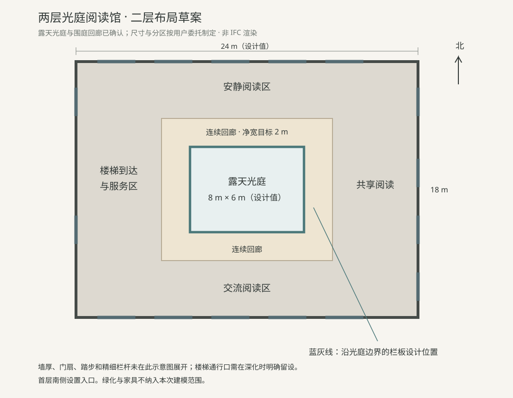

# 两层光庭阅读馆设计

> 2026-09-12 收纳更新：最新第二版已人工验收，见[光庭 Proof](../../dataset/processed/proof/generation/phase6.6/courtyard-library-20260912/REPORT.md)。第一版作为历史参考；下文保留设计/调试时点的叙述。
> 2026-09-12 后续状态：第一版已完成真实 Generator、确定性关系恢复、真实 Audit 和最终 IFC 发布，详见[保留报告](../../dataset/processed/proof/generation/phase6.6/courtyard-library-20260912/evidence/v1/continuation-01/REPORT.md)。用户指出概念偏差并要求保留旧模型，按概念图右上角重新准备。下文为第一版历史设计依据，不再作为下一版的完整围合、封闭楼梯间或整片玻璃栏板要求。用户未验收第一版设计；真实 Audit 的 accept 与人工状态分开。

2026-09-12。状态：按用户授权确定的建模设计方案，尚未完成整栋几何验证。用户确认露天矩形光庭与二层围庭回廊，随后明确“具体没有要求，但是尽可能美观好看，系统支持的能力都要做在里面”，授权本例由 Agent 决定未指定的尺寸、布局和材料搭配。本轮未生成 IFC、未调用 Provider，不改既有 Proof。

本设计承接 [语义与外观计划第16节](semantic-appearance-plan.md#16-下一例-generation-与论文图已批准设计方向)，第18节的一般澄清原则保留；本例新增授权允许 Agent 决定未指定设计自由度，不再逐项询问尺寸、配色或布局。具体参数记录为受委托的设计选择，不伪称用户逐字指定；真实合同冲突和技术范围外的选择仍须说明。当前工作分支是 codex/workflow-dataset-links；与 main 对比，本设计涉及的 Generation、Compiler、Contract 实现没有差异。

## 1. 建筑方案

采用两层正交围合：阅读空间朝外获得采光，交通空间朝向中央露天光庭；二层回廊绕庭连续连接。以空间比例、窗组节奏和真实构件细节形成视觉效果。花草、家具和复杂曲面不纳入本例。

|项目|采用的设计|来源／边界|
|---|---|---|
|形式|两层阅读馆，露天矩形光庭，二层围庭回廊|已确认方向|
|外轮廓|东西24米、南北18米|本例授权设计选择|
|光庭|居中，东西8米、南北6米，上空敞开|露天由用户确认；尺寸为授权设计选择|
|回廊|靠庭侧连续布置，目标净宽2米|授权设计；净宽量至护栏通行侧表面，不能按中心线代算|
|标高|首层0米、二层3.6米；楼板总厚200毫米|授权设计；层高、净高和楼板顶底分别冻结|
|首层|南侧明确入口及接待，北侧安静阅读，东侧共享阅读／小型活动，西侧服务与楼梯|授权设计|
|二层|北／东侧阅读，南侧交流，西侧楼梯到达；四边回廊连通|授权设计|
|楼梯|直跑，放在西侧边跨；平台、梯段、上层洞口和净空一起核对|具体尺寸未冻结；不能为了画面省略通行或防护问题|
|外观|浅暖灰主体、深灰窗框，有限木色强调，窗宽与间距形成重复节奏|既定方向；本页补充配色与材料选择|

平面图是概念分区示意，不包含墙厚、门扇开启包络、楼梯踏步和房间净尺寸，不能直接当作完整生成输入。本例采用有顶半室外回廊：光庭与回廊之间不设通高玻璃围护；回廊与阅读室之间采用墙、门及成组窗分隔。阅读室是室内空间，光庭上空露天。沿庭屋盖只覆盖回廊，不覆盖光庭。该边界是本例授权设计选择。

建议首层入口朝南，经门厅可辨认光庭；首层沿庭也保留交通带。二层回廊内侧形成连续、轻薄的透明护栏线，让人能看到庭院及对侧窗组。屋面围庭形成开口，不用一整块屋顶把光庭盖住。首层光庭地面与上层通空分别表达，不能误删整个首层地面。

## 2. 栏杆：已有能力与缺口

用户记忆正确：系统已支持 IfcRailing，已有从 Brief 的 known_facts.railings 到 Expected Facts products、分包 ownership、编译和重开几何核对的路径。

|范围|实际依据|设计结论|
|---|---|---|
|水平直线栏板|[编译测试](../../tests/compiler/test_v2_railing.py)采用矩形截面拉伸，核对两段不同朝向栏杆的世界坐标和二层归属|可作为四边回廊栏板的起点；整圈组合仍需一次定向核对|
|需求／预期传递|[expected_facts.py](../../src/text2ifc_agent/expected_facts.py)登记 railings → IfcRailing／linear_segment|明确记录每段的位置、长度、高度、厚度、所属楼层|
|分包|[generation_packages.py](../../src/text2ifc_agent/generation_packages.py)接受水平且沿X或Y轴的非零直线段|斜向、曲线和高低端点不能算作现有 staged 支持|
|几何表达|[geometry.py](../../src/text2ifc_compiler/geometry.py)对普通拉伸创建一个 solid；现有栏杆测试外形是整片板|并非已具备立柱＋扶手＋玻璃的参数化栏杆模板|
|材料|[materials.py](../../src/text2ifc_contract/materials.py)支持 IfcRailing／IfcRailingType 单材料；每对象最多一个材料附件|玻璃板可以单独表达玻璃。多种部件分色不等于已经正确表达多材料构造|

2026-09-12 聚焦核对：编译／重开、Brief投影、几何预期、数量和分包关联共 **6 passed，72 deselected，5.05秒**。这不是整座光庭公共链路验证，也不是新 Provider 成功证据。

### 回廊护栏设计

- 第一版使用清晰的水平分段栏板。四角按实体边界交接，避免空隙、重叠和重复段；不跨越光庭封成一块透明板。
- 栏板高度1100毫米、模型厚度20毫米，从完成楼面到栏板顶量取；采用单材料“玻璃”和透明样式。这些是授权的展示模型参数，不表示已经确定夹层构造、固定节点或规范符合性。
- 栏板实体落在楼板可支承的一侧，既不悬在洞口内，也不侵占已确认的回廊净宽。透明度必须来自 IFC 样式，不能只在出图时把实体隐藏。
- 楼梯上端连接回廊的通行口必须留出；洞口其他临边需明确防护。不能仅验证栏杆数量为4，就宣称整圈防护完整。

### 精细栏杆建议：单列小范围扩展

若要达到之前概念图的细节，建议增加“直线玻璃栏板＋细金属扶手／立柱”的受限参数化表达，随后补直跑楼梯斜向扶手。它们尚未实施，也不属于本次设计自动批准的代码扩展。

1. 新模板与几何合同新增版本，不能改写旧 extruded_profile 或 linear_segment 的含义；横向回廊和斜向楼梯分别定义端点、高度基准、厚度与包围盒。
2. 部件数量由限定参数确定，明确立柱间距和端部处理；不让 LLM 逐根随意补件，也不让模板改回廊、楼梯或洞口尺寸。
3. 金属、玻璃需要独立可验证的材料归属。当前单材料附件不能冒充混合构造；先明确部件实体和父栏杆关系的合同，或诚实限定为视觉分色。不能给整个栏杆随意挂多个材料来绕过限制。
4. 分段、旋转、不同楼层、楼梯坡度和缺失护栏必须进入通用检查；实施按小步推进，不扩成任意栏杆系统。

先完成水平回廊的空间与栏板表达。直跑楼梯采用两侧实体围护的楼梯间布局，水平平台临边使用现有栏板；斜向抓握扶手仍是未覆盖细节。精细部件与斜向扶手不伪装成现有能力，也不借“全部支持能力”自动启动任意新模板扩展。

## 3. 光庭空洞与独立检查

普通多边形截面目前只有外环，不应把一个实心楼板的矩形外框当作“有洞”。优先沿用楼板＋IfcOpeningElement＋Voids 的明确关系；楼板洞口与楼梯洞口分别绑定宿主、标高和尺寸。屋面环形表达按适用宿主／合同验证，若现有屋面路径不支持，不得静默封顶或擅自换类别。

本例只需要针对下列组合做聚焦检查，不重新启动全仓 Full Preflight：

- 二层楼板及顶部的光庭范围确实通空；要核对实体／网格，不能仅核对包围盒或 JSON 标签。
- 四边回廊连通，墙、栏板和门扇不会占用已确认的净通行带。
- 栏板实体与洞口临边连续对齐、在正确楼层，转角和楼梯接入口有明确处理；不能用“名称含栏杆”代替几何检查。
- 单材料、样式及基本门窗从冻结请求到重开 IFC 一致；不补写用户未给出的强度、耐火、热工或玻璃性能。
- 请求符合性、基本使用问题与规范符合性分别记录。若设计存在明确冲突，先澄清；用户坚持保留时，Audit 和报告保留问题，不能假称问题解决。

## 4. 材料和出图

采用以下授权设计选择：主体浅暖灰 #D8D4CA、窗框与少量金属构件深灰 #333D40、木门及有限木质饰面 #A87950；玻璃用轻微中性色并保持透明，避免浓蓝色遮挡光庭。总色彩以浅色主体为主，深色线条次之，木色限于入口、门扇和局部阅读室饰面。

物理材料与颜色分开记录：梁柱混凝土；外墙采用20毫米水泥砂浆／200毫米混凝土／20毫米水泥砂浆，总厚240毫米；楼板采用180毫米混凝土＋20毫米砂浆面层，总厚200毫米；木门单材料“木材”；栏板单材料“玻璃”。墙、楼板分层应沿合同允许的局部轴组织，总厚必须与几何一致。

基础窗的窗框、玻璃和门的门框、门扇使用已有部件分色；不能据此宣称基础门窗模板已经实现了逐部件物理多材料关系。构件整体的材料附件只在能真实表达其含义时写入；若需要证明铝框／玻璃分别有物理材料，须先核对部件材料合同，不能把整扇窗标成纯铝或把整扇门的着色当作真实框材。

不填写未提供的强度、耐火、热工等性能，也不为展示属性功能随意造数。

最终优先交付整体三分之四视图、光庭剖轴测和一张栏杆／门窗近景。出图使用同一个最终 IFC，剖切和隐藏屋面需注明；不以生成式补画增添栏杆、家具或材料细节。本页平面图仅用于审阅布局。

## 5. 已有能力的建筑化覆盖

“系统支持的能力都做在里面”按适合本建筑的现有建模能力组织，不把两种生成策略或全部互斥样式硬塞进一座楼。核心能力须进入生成目标；条件项若公共路径不能完整表达，要说明缺口，不能无声丢失。

|能力|在阅读馆中的用途|覆盖要求|
|---|---|---|
|Project／Site／Building／Storey／Space|完整空间树，两层分区及半室外回廊|楼层、名称、空间用途、归属一致|
|墙、楼板、屋面及多边形／洞口|正交围合、环形回廊、露天光庭、独立楼梯开口|实际保留空洞，宿主及楼层正确|
|梁、柱|沿庭与阅读室边界布置规则框架，形成重复节奏|梁柱不能侵占回廊净宽、堵门窗或横穿楼梯净空；此处是建模方案而非结构计算成果|
|单面板窗|服务区及较窄墙段|采用已有基础模板，框／玻璃分色|
|双竖面板窗|主要阅读室成组设置|同层窗头、窗台统一，跨层轴线对应|
|左／右单开门|按房间入口位置选择镜像开启方向|门扇朝向与通行空间协调；入口使用并列单开门时保留各自门洞与合法净距，不冒充双扇门模板|
|楼梯、梯段、楼板开口|西侧直跑楼梯连接两层|梯段、平台和上层洞口一起定位；未解决斜向扶手边界须明示|
|水平直线栏板|二层围庭回廊及楼梯平台临边|玻璃、透明度、四角实体衔接、通行口|
|单材料与分层材料|混凝土梁柱、木门、玻璃栏板、墙／楼板分层|与实例或Type作用域对应，分层厚度和几何一致|
|项目内Type／Style组织|同系列同规格的重复窗、门、栏板及梁柱明确分组共享|本例主动提出共享要求；不同尺寸、开启方向或构造不可错误合并|
|普通属性与数量|名称、楼层、用途、实际尺寸及合同可表达的外部／内部属性|有明确依据才写；数量按最终实体计算并复核，不补性能值|
|协调样式与透明效果|浅暖灰主体、深灰线条、有限木色、通透光庭|纯配色变化不改几何；最终图使用实际 IFC 样式|
|Plate／Covering／Member／CurtainWall等通用构件|可用于入口板式雨篷、有限饰面、局部竖向构件及独立玻璃屏风|属于合同／编译有基础的候选细化，尚不能仅因Schema有类名就宣称细部模板及公共链路已验证；接入不完整时报告，不拿渲染替代|

梁柱优先与墙线和窗间实体对齐，入口设清楚但克制的板式雨篷；不要为了“丰富”增加遮挡主窗的大量装饰。立面以主要阅读窗的重复模数为主，服务窗与门仅在必要处改变节奏。

## 6. 执行顺序与输入来源

下一步由 Agent 在本例授权内深化具体门窗表、梁柱位置、楼梯和平台尺寸，不再要求用户逐个选数。先用小规模光庭／栏板组合确认通空、净宽、护栏和材料关系，再冻结完整人类语言请求及独立检查预期；随后按适用准入执行整栋生成。只在真正无法兼容的要求或需要新增系统能力时停下讨论。

本页的设计数值是 Agent 在用户委托下制定，不伪称用户的逐字原话。后续输入与来源说明应同时保留这次授权和设计参数。已有 legacy_full 默认、staged 显式选择的规则不变；不为覆盖能力强行重复生成同一模型两次。

## 7. 2026-09-12 运行与局部修复状态

第一版已冻结为 [中文请求](../../dataset/processed/proof/generation/phase6.6/courtyard-library-20260912/evidence/v1/request.txt)。首个真实 Brief 完整返回但语义格式不合法，未进入整栋 Generator/Audit。问题不是输出截断：实际71,204 token，finish_reason=stop。

用户批准的小步修复已实施：Brief 2.4 的 Type／实例／材料／模板角色校验；只迁移明确语义叶子的原子恢复；屋盖洞口的身份、分包及重开检查。新增 Prompt v2.16/v2.17 与语义恢复 v1.2，保留旧注册内容及其他 Brief 版本。以实际 IFC 类别和明确身份判断，不按光庭案例名称、坐标或数量特判；不改变既定设计、不扩展栏杆模板。

聚焦离线检查通过；真实重跑、整栋 IFC 和视觉验收仍待完成。完整诊断、历史修复比较、测试失败与通过记录见 [运行报告](../../dataset/processed/proof/generation/phase6.6/courtyard-library-20260912/evidence/v1/REPORT.md)。首次运行准入只代表旧代码快照，重跑需更新局部准入并继承旧预算。

## 8. 第二版开敞光庭：当前执行合同

本节取代上方第一版的闭合围庭、室内楼梯和整片玻璃栏板设计。第一版完整包 `532a4a4c` 已保留；它经过真实 Brief/Generator、确定性关系恢复及后续真实 Audit，不称为全新不中断完整 loop，也未按第二版设计登记 accepted Proof。

用户要求按概念图右上角重新从输入完整运行，排除家具植物，授权必要梁柱及有界栏杆能力。第二版采用两层24×18米、南侧敞开的U形楼板/屋盖、沿庭外露直跑楼梯与上端平台、20柱6梁、14段金属细杆护栏、44双竖面板窗及6单开木门。最新冻结输入和独立预期见 [rerun-01](../../dataset/processed/proof/generation/phase6.6/courtyard-library-20260912/evidence/v2/rerun-01/request.txt)；具体尺寸由Agent在委托范围内制定，不伪称用户逐字原话。

第二版首次真实 Brief 被错误的 full-envelope 声明拦截，78,490 token，未进入 Generator。通用修复 `2cf18d56` 新增 Brief2.7 和独立 wall_layout checks，将轮廓内、不重叠与完整墙环区分，保留旧检查、几何及原子修正边界；303项阶段验证和1项新运行包装器检查通过，均为离线证据。详见 [诊断](../../dataset/processed/proof/generation/phase6.6/courtyard-library-20260912/evidence/v2/brief-envelope-debug/REPORT.md)。跨轮约束来源、替代和有效状态管理仍是后续小步，未宣称已完成。

用户随后委托微调颜色：主体暖米白#E6E0D3、梁柱浅砂#D2C7B3、框/栏杆深青灰#304B4D、门扇暖木#A66F43，玻璃透明度仍0.65。此次仅调整颜色，物理材料、尺寸、位置和构件数量不变，不增加未请求性能。新完整真实 loop 继承10次/828,490 token历史账本及32次/200万token/3600秒累计上限。结果须以本次执行、独立重开与实际视图为准，待用户人工审阅后才能收纳为 accepted Proof。

第二版重跑 d2c21f51c9bb69f6 已真实完成 Brief/Generator/候选修复，但被属性及事实保全门禁阻断，未进入 Audit。后续小步将现有属性合法性校验前移至 Brief2.7，并明确可见楼梯颜色应指向梯段。详见 [属性与外观诊断](../../dataset/processed/proof/generation/phase6.6/courtyard-library-20260912/evidence/v2/property-debug/REPORT.md)。下一次 [rerun-02](../../dataset/processed/proof/generation/phase6.6/courtyard-library-20260912/evidence/v2/rerun-02/request.txt) 保持 rerun-01 输入字节、全部几何和颜色不变，继承13次真实尝试账本。

最终rerun-03（ce8116ce095acdcf）已完成全新真实Brief/Generator/Audit，无候选修复调用，317,533token。正式IFC独立545项通过，实际视觉检查完成，待用户人工验收，不登记accepted Proof。[交付与限制](../../dataset/processed/proof/generation/phase6.6/courtyard-library-20260912/evidence/v2/rerun-03/REPORT.md)；保留HEX评价修订的原始失败/统一重算与Audit文字勘误，不声称施工合规或盲测能力提升。
