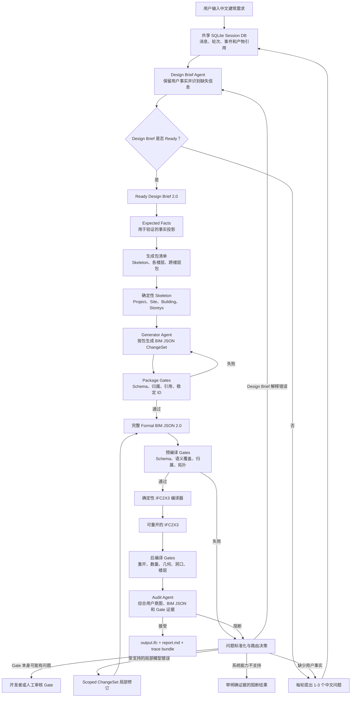

# 当前 text2IFC 工作流与数据流

**更新时间：** 2026-07-13

**目标读者：** 新加入项目的开发者、研究人员、项目审核者和汇报撰写者

**覆盖范围：** 当前项目至 Phase 6.5 的中文自然语言到 IFC2X3 工作流

## 1. 项目概述

text2IFC 的目标是把用户的自然语言建筑需求转换为经过验证的 IFC2X3
模型。系统不会让大语言模型直接编写 IFC STEP 文本，而是让模型生成受约束的
语义中间数据，再由确定性代码完成验证、组合和 IFC 编译。

当前产品链路可以概括为：

```text
中文自然语言
  -> 多轮澄清
  -> Ready Design Brief
  -> Expected Facts 与生成包
  -> Formal BIM JSON 2.0
  -> 确定性验证与 IFC 编译
  -> IFC 重开与几何检查
  -> Audit 语义审核
  -> 验收 IFC 或基于证据的局部返工
```

整个系统最重要的架构规则是：

> BIM JSON 2.0 是自然语言理解与 IFC 编译之间唯一正式的结构化事实来源。

Design Brief、Expected Facts、ChangeSet、Gate 结果和运行报告都是工作流的
辅助数据。它们分别用于理解、生成、验证、返工和解释，但不会建立第二套 BIM
结构模型。

## 2. 为什么需要分阶段处理

用户请求中可能同时存在三类不同问题：

1. 用户尚未提供必要事实，例如墙厚、楼层高度或窗户的宿主墙。
2. 模型理解了需求，但生成的 BIM JSON 不满足 Schema 或空间关系要求。
3. BIM JSON 在结构上合法，但编译后的 IFC 几何仍然偏离用户意图。

如果把理解、生成、检查和修复全部交给一个 Prompt，很难稳定区分这些问题，
也很难判断应该向用户提问、修改 Design Brief，还是只修某个构件。因此当前
系统把语言理解、结构生成、确定性检查、语义审核和局部返工拆成独立阶段。

## 3. 端到端工作流



## 4. 每个阶段具体做什么

### 4.1 用户交互与 Session DB

交互式 CLI 接收用户的初始中文需求和后续回答。每次会话都有独立的
`session_hash`，但所有会话可以保存在同一个 SQLite 数据库中。数据库记录：

- 用户和 Agent 的每条消息；
- 每次模型调用及其响应引用；
- 阶段开始、结束和状态变化；
- Design Brief、BIM JSON、IFC 和报告等产物的路径。

Session DB 是运行记忆和审计证据，不是 BIM 模型。会话可以停留在 Draft、继续
追问、恢复、查询和导出，也可以在需求 Ready 后继续生成 IFC。

主要实现：
[`repl_chat.py`](../../src/text2ifc_agent/repl_chat.py) 和
[`session_store.py`](../../src/text2ifc_agent/session_store.py)。

### 4.2 Design Brief Agent

Design Brief Agent 把自然语言对话整理为结构化的用户意图，记录已知事实、缺失
事实、歧义、澄清问题和信息来源。

它只允许产生两类状态：

- **Ready：** 已具备当前受支持范围内生成 BIM 所需的事实。
- **Draft：** 仍需要用户决定，或者用户明确表示某些信息未知。

Design Brief Agent 不负责生成 BIM JSON 实体，不得输出低层 IFC 对象，也不得
自行补充用户没有提供的尺寸、位置或关系。

数据合同：
[`schemas/agent/design-brief/2.0/schema.json`](../../schemas/agent/design-brief/2.0/schema.json)

当前 Prompt：
[`prompts/agent/design-brief-v2.1.md`](../../prompts/agent/design-brief-v2.1.md)

### 4.3 Expected Facts

Expected Facts 是从 Ready Design Brief 中确定性提取的“验收事实清单”，例如：

- 应有多少层以及各楼层标高；
- 应有哪些空间、墙、门、窗、楼板和楼梯；
- 门窗应属于哪一面墙；
- 构件应属于哪一层；
- 哪些尺寸和空间关系必须被满足。

Expected Facts 有三个主要用途：

1. 给 Generator 提供稳定语义目标和实体 ID 约定。
2. 生成分阶段的 Package Manifest。
3. 让 Gate 比较“用户要求了什么”和“系统实际生成了什么”。

Expected Facts 不是另一套 BIM Schema。它只保留生成控制与结果验证所需要的
事实，不负责完整描述 IFC 模型。

主要实现：
[`expected_facts.py`](../../src/text2ifc_agent/expected_facts.py)。

### 4.4 多楼层分包生成

复杂建筑不会再交给模型一次性生成完整 JSON。当前编排按有限范围组合模型：

1. 确定性 Skeleton 创建 `IfcProject`、`IfcSite`、`IfcBuilding` 和根据输入动态
   发现的 `IfcBuildingStorey`。
2. 每个楼层包负责本层空间、墙、门、窗、洞口和楼层归属关系。
3. 跨楼层包负责楼梯、层间楼板、屋面、竖向洞口和连接楼层的关系。

每个包必须先经过 Package Gate，才能应用到内部工作区。部分工作区不能称为
Formal BIM JSON，也不能提前编译为 IFC。

主要实现：
[`staged_generation.py`](../../src/text2ifc_agent/staged_generation.py) 和
[`generation_packages.py`](../../src/text2ifc_agent/generation_packages.py)。

### 4.5 Formal BIM JSON 2.0

所有生成包通过并组合完成后，结果必须通过完整 BIM JSON 2.0 Schema 和语义
验证，才能成为 Formal Candidate。这是 IFC 编译器唯一接受的模型输入。

BIM JSON 2.0 表达 IFC 语义类别、稳定实体 ID、关系、局部位置、受支持几何、
尺寸和属性。模型不需要输出 `IfcCartesianPoint`、`IfcDirection`、
`IfcOwnerHistory`、STEP ID 或 STEP 文本；这些底层对象由编译器确定性生成。

合同参考：
[`docs/reference/bim-json-2.0.md`](../reference/bim-json-2.0.md)。

### 4.6 确定性 Gates

Gate 负责回答不应该依赖大模型主观判断的问题，主要包括：

- JSON Schema 与语义合同是否合法；
- Expected Facts 是否得到覆盖；
- 实体 ID、关系引用和稳定身份是否正确；
- 构件楼层归属与 containment 是否一致；
- 空间、墙、楼板、楼梯、门窗、洞口与 filling 关系是否正确；
- IFC 是否成功编译和重开；
- 编译后构件边界、位置和几何关系是否满足要求；
- 产物来源是否完整以及是否存在密钥泄漏。

确定性 Gate 失败后，Audit Agent 无权覆盖失败结果并强行接受。

主要实现包括：
[`dynamic_gates.py`](../../src/text2ifc_agent/dynamic_gates.py)、
[`package_gates.py`](../../src/text2ifc_agent/package_gates.py) 和
[`revision_gates.py`](../../src/text2ifc_agent/revision_gates.py)。

### 4.7 IFC2X3 编译

只有通过必要预编译 Gate 的 Formal BIM JSON 2.0 才能进入编译器。编译器生成
IFC2X3，并使用 IfcOpenShell 重新打开结果，以确认文件可读且基本结构有效。

编译器是忠实的序列化器和几何构造器，不负责重新解释用户需求，也不能为了
让检查通过而改名、猜测尺寸或静默修改模型事实。

### 4.8 Audit Agent

Audit Agent 检查确定性规则难以完全理解的语义问题。它接收：

- 原始用户输入与澄清记录；
- Ready Design Brief；
- BIM JSON 或本轮修订摘要；
- Expected Facts 与实际结果；
- 完整 Gate Bundle；
- IFC 指标与几何证据。

Audit 可以接受、阻断、质疑某项检查是否适用，或者建议再次进行受限修订。但
它不能直接编辑 BIM JSON，不能扩大允许修改的范围，也不能接受仍存在确定性
失败的候选模型。

当前 Prompt：
[`audit-v2.md`](../../prompts/agent/audit-v2.md)

主要阶段实现：
[`live_pipeline.py`](../../src/text2ifc_agent/live_pipeline.py)。

### 4.9 Issue Normalizer 与路由

Gate 和 Audit 的失败会被转换为结构化 Issue。每个 Issue 应记录：

- 问题来自哪一个检查阶段；
- 严重程度和是否阻断；
- 应由哪个角色负责；
- 是否可以重试；
- 期望值、实际值和证据引用；
- 受影响的实体、关系或 JSON 路径；
- 建议进入哪一条返工路线。

控制器根据 Issue 选择下一步：

| 路由 | 含义 | 下一步 |
|---|---|---|
| `ask_user` | 缺少必须由用户决定的事实 | 返回中文追问循环 |
| `revise_design_brief` | 用户事实存在，但 Design Brief 解释错误 | 修订 Brief 并重新绑定 Expected Facts |
| `regenerate_json` | 受支持的 BIM 内容存在局部语义或几何错误 | 生成 Scoped ChangeSet |
| `repair_json` | 候选存在有限的语法或 Schema 错误 | 只修证据授权的路径 |
| `blocked_as_unsupported` | 当前 Schema 或编译器无法表达需求 | 带能力证据停止 |
| `gate_issue` | 确定性检查本身可能错误 | 交给开发者或人工审核 |

路由不能把模型生成的几何错误错误地转成用户问题，也不能把用户没有提供的
信息当作允许模型猜测的理由。

### 4.10 Scoped ChangeSet 局部返工

Phase 6.5 使用局部 ChangeSet 替代失败后的整份 BIM JSON 重写。每个 ChangeSet
必须绑定：

- 精确的 Base Candidate Hash 和 Revision；
- Expected Facts Hash；
- 来源 Issue ID 和证据引用；
- 允许修改的实体、关系和字段路径；
- 显式依赖闭包和禁止触碰的对象。

确定性 Applicator 会在上一版本的副本上应用操作。范围外构件的语义 Hash 必须
保持不变，上一版 Candidate 也必须保持不可变。

修改完成后，完整 Candidate 会重新经过 Schema、局部和全局 Gate、IFC 编译与
重开、后编译几何检查以及 Audit。默认最多允许三轮 ChangeSet 返工。

ChangeSet Schema：
[`bim-json-changeset-1.0.schema.json`](../../schemas/agent/bim-json-changeset-1.0.schema.json)

当前 Prompt：
[`bim-json-changeset-v1.md`](../../prompts/agent/bim-json-changeset-v1.md)

返工循环：
[`scoped_loop.py`](../../src/text2ifc_agent/scoped_loop.py)。

## 5. 主要数据合同

| 数据对象 | 生产者 | 消费者 | 作用 | 是否为结构真相 |
|---|---|---|---|---|
| Conversation Transcript | 用户、CLI、Provider | Design Brief、报告 | 保存原始请求和回答 | 否 |
| Design Brief 2.0 | Design Brief Agent | Expected Facts、Generator、Audit | 结构化用户意图和缺失事实 | 否 |
| Expected Facts | 确定性提取器 | Package Builder、Generator、Gate | 验证投影和稳定目标 | 否 |
| Package Manifest | Orchestrator | Staged Generator | 规定生成顺序和组件所有权 | 否 |
| Change Scope | Router 与范围推导器 | ChangeSet Generator、Applicator | 限制本轮允许修改的内容 | 否 |
| ChangeSet 1.0 | Generator Agent | 确定性 Applicator | 对受限记录执行增删改 | 否 |
| Candidate Revision | Composer 或 Applicator | Gate、Compiler、Audit | 不可变的完整 BIM JSON 快照 | 包含正式模型 |
| BIM JSON 2.0 | Generator 与确定性组合器 | Validator、IFC Compiler | 正式语义 BIM 表达 | **是** |
| Gate Bundle | 确定性检查器 | Router、Audit、报告 | 可机器验证的正确性证据 | 否 |
| Audit Result | Audit Agent | Router、Final Acceptance | 对意图和证据进行语义复核 | 否 |
| IFC2X3 | 确定性编译器 | IFC Gate、最终用户 | 最终 BIM 交付文件 | 最终输出 |
| Session DB 与 Trace | Runtime Observer | CLI 查询、报告、审核者 | 重现运行和追踪来源 | 否 |

## 6. 数据权威顺序

不同阶段的数据发生冲突时，应按以下顺序处理：

1. **用户原始陈述和明确修正**是产品意图来源。
2. **Ready Design Brief**是对用户意图的结构化解释。
3. **Expected Facts**是用于检查的确定性投影。
4. **BIM JSON 2.0**是 IFC 编译的正式结构输入。
5. **Gate Evidence**决定机器可验证的验收结果。
6. **Audit**判断语义一致性，但不能推翻 Gate 失败。
7. **IFC**是编译后的交付物，必须忠实表达已接受 BIM JSON。

后续阶段不得静默覆盖前面阶段的用户事实。任何冲突都必须成为可见 Issue、
澄清问题、修订记录或阻断结果。

## 7. Agent 与确定性代码的职责边界

| 职责 | Agent / 大模型 | 确定性代码 |
|---|---:|---:|
| 理解中文建筑需求 | 是 | 否 |
| 生成澄清问题 | 是 | 约束问题数量和状态 |
| 生成语义 BIM 事实 | 是 | 执行 Schema 验证 |
| 决定 IFC STEP 底层表达 | 否 | 是 |
| 校验引用、楼层归属和 containment | 只能提出意见 | 是 |
| 检查编译后数值几何 | 只能复核证据 | 是 |
| 判断结果是否符合用户意图 | 是 | 提供检查证据 |
| 覆盖失败的确定性 Gate | 否 | 不允许自动覆盖 |
| 事务性应用 ChangeSet | 否 | 是 |
| 保存不可变版本和 Hash | 否 | 是 |

这一边界可以防止“模型说得很像正确答案”被误当成“几何已经验证正确”。

## 8. 运行产物与人工审核入口

机器需要多个 Sidecar 才能重放和调试完整链路，但 `report.md` 应当是人工审核
的主要入口。报告必须从真实 Trace 自动生成，不能手工伪造。

一个完整运行通常包含：

```text
runs/<session_hash>/
  output.ifc
  report.md
  session-export.json
  design-brief/
  expected-facts.json
  generation-packages.json
  revisions/
  gate-results/
  audit/
  provider-traces/
  artifact-manifest.json
```

具体内部文件名可能随 Trace Level 调整，但报告应让审核者无需逐个打开 JSON
即可了解：

- 原始需求与完整澄清对话；
- 最终 Design Brief 与 Expected Facts；
- Prompt ID、Hash、Provider Response ID 和耗时；
- 初始生成以及每次返工路线；
- 标准化 Issue 与允许的 ChangeSet Scope；
- 修改操作摘要和未相关构件保持结果；
- 预编译、重开、几何和 Audit 结果；
- 最终状态与 IFC 路径；
- 产物引用和密钥扫描结果。

## 9. 当前能力边界

当前架构已经覆盖：

- 中文优先的多轮澄清；
- 包括 DeepSeek 配置在内的 OpenAI-compatible Provider；
- Formal 与 Draft 状态转换；
- 不写死楼层数量的分阶段多楼层组合；
- 稳定 ID ChangeSet 和不可变 Candidate Revision；
- 确定性 IFC2X3 编译与重开检查；
- 确定性几何证据与 Audit 语义复核；
- SQLite Session、Trace Bundle 和自动生成报告。

这些能力不代表系统已经能稳定生成任意建筑。Phase 6.5 使用 Easy、Medium 和
Hard 标准案例进行验收。单个成功案例只能证明该路线真实可执行，不能证明它在
所有表达方式和建筑类型上具有统计稳定性。

以下内容仍不属于 Phase 6.5：

- 采用 IFC5 或输出 IFC5/IFCX；
- 编辑或补全一个导入的既有 IFC；
- 不受限制的 IFC2X3 全类别生成；
- 静默修改几何以绕过 Gate；
- RAG、微调和生产 API 服务打包；
- STEP ID 或 IFC 文件字节级完全一致。

## 10. 面向新成员的架构审查

### 10.1 当前设计的优点

- 把自然语言理解与正式 BIM 生成明确分开。
- 概率性模型输出无法绕过确定性验证。
- 稳定 ID、Hash 和不可变 Revision 使局部返工可以审计。
- Package Ownership 降低复杂多楼层模型的跨层漂移。
- Audit 检查用户语义，但不会取代数值和结构 Gate。
- Session DB 与自动报告形成可重现的证据链。

### 10.2 新成员容易混淆的地方

1. 早期 Phase 文档仍有历史价值，但不一定描述当前 Phase 6.5 工作流。
2. **Generator** 既可能表示初始分包生成，也可能表示反馈阶段的 ChangeSet
   生成，因此文档和报告必须同时说明它的输入和输出合同。
3. `repair_json` 与 `regenerate_json` 不相同：前者处理有限的格式或 Schema
   问题，后者通过 ChangeSet 修订受支持的 BIM 语义内容。
4. Expected Facts 看起来像第二套模型，因此必须始终说明它只是验证投影。
5. Gate 和 Audit 都在审核结果，但只有 Gate 负责硬性的确定性验收条件。
6. 当前 Phase 6.5 SPEC 要求每个难度完成一次真实验收，而 AI-SPEC 中仍写有
   `3/3 per canonical case` 的稳定性指标。正式声明可靠性前需要统一口径。

## 11. 新成员推荐阅读顺序

1. 本文：了解完整系统和数据流。
2. [`BIM JSON 2.0 参考`](../reference/bim-json-2.0.md)：了解正式模型合同。
3. [`Phase 6.5 SPEC`](../../.planning/phases/06.5-component-scoped-changesets-and-multistorey-stability/06.5-SPEC.md)：了解当前需求和边界。
4. [`Prompt Registry`](../../prompts/agent/registry.json)：了解当前 Prompt 清单。
5. [`repl_chat.py`](../../src/text2ifc_agent/repl_chat.py) 与
   [`interactive_cli_flow.py`](../../src/text2ifc_agent/interactive_cli_flow.py)：了解运行入口。
6. [`staged_generation.py`](../../src/text2ifc_agent/staged_generation.py) 与
   [`scoped_loop.py`](../../src/text2ifc_agent/scoped_loop.py)：了解分包生成和返工。
7. 阅读一次真实运行生成的 `report.md`，再按需检查完整 Trace Bundle。

## 12. 可直接用于汇报的简版说明

> text2IFC 使用中文优先的多 Agent 工作流，把自然语言整理为 Ready Design
> Brief，再生成满足 Schema 的 BIM JSON 2.0。复杂多楼层建筑按照楼层包和跨楼层
> 包进行有限范围组合。确定性 Gate 检查结构、关系、几何和 IFC 可重开性，Audit
> Agent 再综合原始需求与检查证据进行语义复核。失败结果会被标准化并路由到用户
> 澄清、Design Brief 修订、有限 JSON Repair 或稳定 ID ChangeSet 返工。只有通过
> 全部必要检查的 Formal BIM JSON 才能编译为最终 IFC2X3，同时 SQLite Session、
> 不可变 Revision、Trace 产物和自动生成的报告保存完整证据链。
