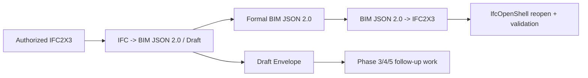

# Phase 2.5 Summary: BIM JSON 2.0 IFC Semantic Graph

This document summarizes what Phase 2.5 completed, what it deliberately left
out, and what Phase 3 must inherit when building the Text-to-JSON dataset and
baseline.

## Conclusion

Phase 2.5 is complete. The project now has an IFC2X3-aligned semantic
intermediate representation: BIM JSON 2.0.

The model target is not raw IFC STEP text. It is not a low-level IFC object
graph containing `IfcCartesianPoint`, `IfcDirection`, `IfcOwnerHistory`, or
STEP line numbers. The model target is validated semantic BIM JSON. The
compiler creates low-level IFC implementation objects deterministically.



## Completed Work

### Official IFC2X3 Knowledge

Phase 2.5 created a local IFC2X3 knowledge base from official sources:

- official IFC2X3 TC1 EXPRESS schema downloaded and hash-verified;
- declaration registry with 980 declarations and 653 entities;
- PSD property-set registry with 317 property sets, 6 complex properties, and
  1850 simple properties;
- capability overlay for all 653 IFC2X3 entities, using `generate`,
  `extract-only`, `compiler-only`, or `unsupported`.

Key artifacts:

- `schemas/ifc/IFC2X3_TC1.exp`
- `schemas/ifc/generated/IFC2X3/declarations.json`
- `schemas/ifc/generated/IFC2X3/property_sets.json`
- `schemas/ifc/capabilities/IFC2X3.json`
- `docs/reference/ifc2x3-generation-profile.md`

### BIM JSON 2.0 and Draft Envelope

Phase 2.5 established two separate document forms:

| Document | Purpose | Can compile to IFC |
|---|---|---|
| Formal BIM JSON 2.0 | Complete, valid, generation-profile semantic BIM document | Yes |
| Draft Envelope | Incomplete, unsupported, extract-only, or loss-aware content | No |

Design points:

- Semantic objects live in `entities` and use explicit `ifc_class` values such
  as `IfcWall`, `IfcWallStandardCase`, and `IfcSpace`.
- User-meaningful IFC relationships live in `relationships`, including
  `IfcRelVoidsElement` and `IfcRelFillsElement`.
- JSON Schema remains the structural truth.
- Registry-backed semantic validation checks IFC2X3 classes, attributes,
  properties, relationships, placement, and geometry.
- Missing or unsupported facts are never silently invented or discarded.

Key artifacts:

- `schemas/bim-json/2.0/schema.json`
- `schemas/bim-json/draft/1.0/schema.json`
- `docs/reference/bim-json-2.0.md`

### Placement, Spaces, Geometry, and Openings

Phase 2.5 added spatial semantics that BIM JSON 1.0 lacked:

- `ObjectPlacement` expresses parent-relative product placement.
- `Representation.position` expresses representation-local geometry
  placement, mapped to `IfcExtrudedAreaSolid.Position`.
- Supported geometry includes rectangle and closed-polygon extrusion profiles.
- `IfcSpace` and `IfcOpeningElement` are represented.
- `IfcRelVoidsElement` and `IfcRelFillsElement` are explicit semantic
  relationships.

`Representation.position` is separate from product `ObjectPlacement`. If it is
missing, the compiler may derive a valid local IFC coordinate system from the
semantic extrusion direction. That derived object is compiler bookkeeping, not
something the model must output.

### IFC2X3 Extraction

Phase 2.5 can deterministically extract supported facts from IFC2X3 sources:

- exact `ifc_class`;
- source `GlobalId`;
- parent-relative placement;
- supported extrusion geometry;
- native attributes;
- standard and custom property sets;
- spaces, openings, void/fill endpoints;
- source provenance and SHA-256;
- explicit loss accounting.

Unsupported source content is not approximated as boxes and not discarded. It
is recorded in Draft Envelope `losses`.

Key artifacts:

- `src/text2ifc_extractor/`
- `scripts/ifc_pipeline_v2/extract.py`

### BIM JSON 2.0 Compilation

Formal BIM JSON 2.0 can compile to reopenable, schema-valid IFC2X3.

Verified behavior:

- generation-profile IFC classes are preserved exactly;
- no `IfcBuildingElementProxy` fallback is used for supported classes;
- exact `IfcWallStandardCase` is preserved;
- IFC2X3-required anonymous `IfcMaterialLayerSetUsage` is generated for
  `IfcWallStandardCase` as low-level schema bookkeeping;
- Draft or invalid Formal input does not compile and does not overwrite an
  existing output file.

Key artifacts:

- `src/text2ifc_compiler/`
- `scripts/bim_json/compile_ifc.py`

## BIMNet Audit Evidence

Phase 2.5 placed all 25 authorized BIMNet IFC2X3 files under local provenance
management.

| Metric | Result |
|---|---:|
| IFC2X3 files | 25 |
| Matterport scene families | 19 |
| Unique SHA-256 files | 25 |
| Current extraction status | 25 Draft |
| Explicit loss records | 8,280 |

All 25 results are Drafts. That is expected. The source IFC contains material,
type reuse, connection topology, mapped geometry, BRep, surface, and other
high-fidelity facts beyond the Phase 2.5 generation profile. Phase 2.5 records
those as losses rather than fabricating formal training labels.

Aggregate accounting:

| Category | Source | Represented | Reported |
|---|---:|---:|---:|
| Entities | 4,296 | 4,290 | 6 |
| Relationships | 16,926 | 11,096 | 5,830 |
| Properties | 17,052 | 15,941 | 1,111 |
| Representations | 6,382 | 4,509 | 1,873 |
| Materials | 2,554 | 0 | 2,554 |
| Types | 1,012 | 0 | 1,012 |
| Connections | 2,263 | 0 | 2,263 |

Key artifacts:

- `dataset/manifests/bimnet-ifc2x3.jsonl`
- `dataset/processed/bim-json-2.0/extraction-audit.json`
- `dataset/processed/bim-json-2.0/scene-families.json`
- `scripts/ifc_pipeline_v2/audit_bimnet.py`

## Verification Evidence

Phase 2.5 final verification passed:

- all 11 Phase 2.5 requirements completed;
- three review findings fixed through RED/GREEN commits;
- all 23 security threats closed;
- final regression: `248 passed in 372.87s`;
- `python -m compileall -q src scripts` passed.

Repeatable verification commands:

```powershell
python scripts/ifc_knowledge/check_registry.py
python scripts/bim_json/generate_reference.py --check
python scripts/bim_json_v2/generate_reference.py --check
python scripts/ifc_pipeline_v2/audit_bimnet.py --check-accounting
python -m pytest tests -q
python -m compileall -q src scripts
```

## Not Completed in Phase 2.5

The following were intentionally deferred:

- natural language to BIM JSON baseline;
- RAG, fine-tuning, and model evaluation;
- multi-turn clarification Agent;
- formal train/validation/test split;
- completing all BIMNet Drafts into full-fidelity Formal labels;
- material layers, type reuse, connection topology, and high-fidelity
  round-trip;
- BRep, tessellation, mapped geometry, and arbitrary geometry reconstruction;
- furnishing, MEP, and structural expansion;
- IFC4 or IFC4X3 output.

## Phase 3 Handoff Constraints

Phase 3 must inherit these constraints:

1. Split by `scene_family` before text generation.
2. Do not use historical `dataset/ifc/train` and `dataset/ifc/test` folders as
   model splits.
3. The Text-to-JSON target is Formal BIM JSON 2.0, not STEP text.
4. Drafts can support clarification or loss-aware research, but cannot be
   scored as complete Formal predictions.
5. JSON-to-IFC compilation remains deterministic.
6. RAG may be evaluated later, but it cannot override schema, capability, or
   semantic validation.

Recommended Phase 3 starting loop:

1. Assign scene-family train/validation/test splits.
2. Create supported-scope Formal targets from Draft `partial_document` values
   only when they validate as BIM JSON 2.0.
3. Keep every omitted source fact in sidecar provenance.
4. Generate deterministic text/JSON pairs.
5. Run a structured-output baseline.
6. Evaluate predictions before deciding on RAG or fine-tuning.
