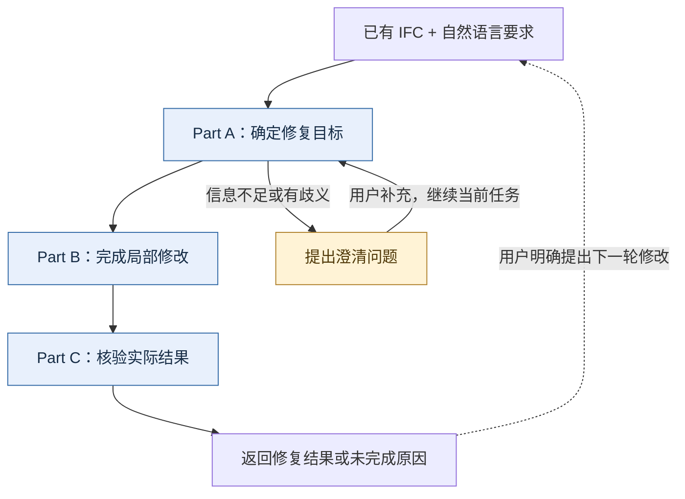
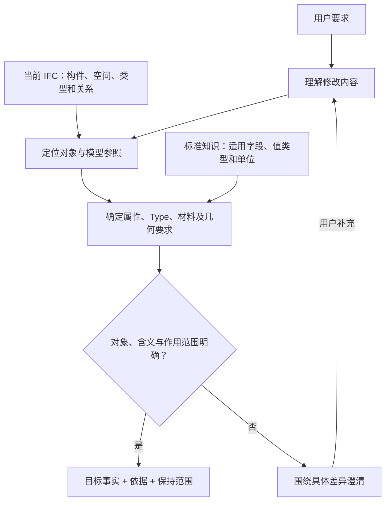
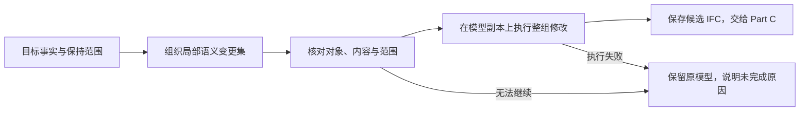
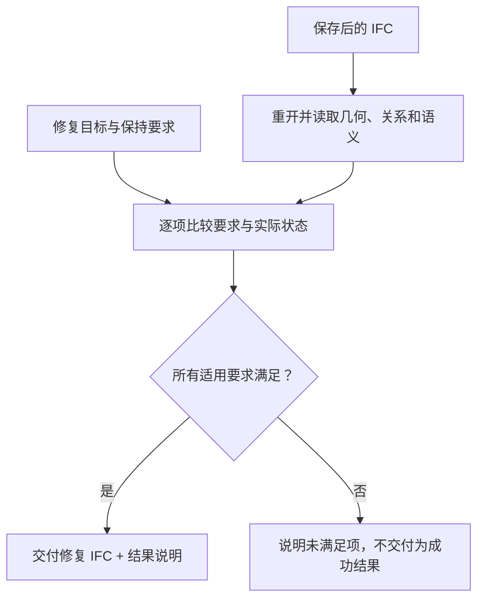
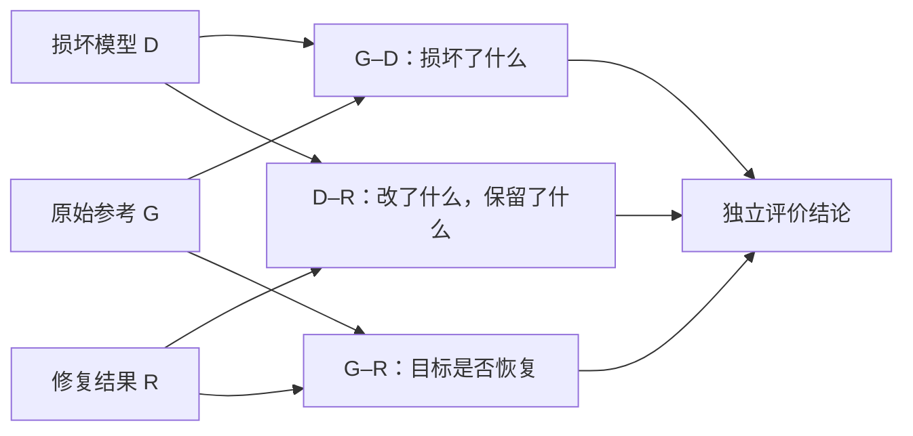

# text2IFC Repair：面向已有 IFC 的局部语义修复方法

> Demo Method｜v0.8｜2026-09-23
> 面向论文讨论与老师汇报。本文说明当前方法、示例及证据范围。

## 1. 我们希望解决什么问题

已有建筑模型的维护，往往只需要修改一部分内容：补回缺失的梁柱，为构件关联正确的材料或 Type，或者修正一个属性。我们的目标是让用户用自然语言提出这些要求，系统在已有 IFC 上完成对应修改，并给出可以核对的结果。

难点不只在于理解一句话。“使用同类型梁”需要明确参照哪个类型；“改成混凝土”需要建立材料关系，不能只改变颜色；“补回梁和柱”需要同时满足位置、尺寸、楼层及非目标保持要求。因此，修复需要连接语言、模型中的具体对象以及修改后的实际状态。

我们采用局部修复思路：先把要求转成有模型依据的修复目标，再组织有限范围的修改，最后检查保存后的 IFC 是否满足这些目标。已有模型提供构件、类型、空间和关系依据；语言模型负责理解要求和选择语义；确定性处理负责落实修改与核对结果。

当前研究聚焦 IFC2X3，覆盖受支持的实例属性修改、门窗与洞口补全、矩形梁柱补全，以及这些操作中的 Type 复用、材料和外观处理。本文以“Type＋材料”和“梁＋柱补全”两类案例展示方法。

## 2. 总体思路：围绕修复目标形成闭环

我们将方法组织为三个 Part：**A 确定修复目标，B 完成局部修改，C 核验实际结果**。三个部分始终围绕同一组问题展开：修改哪个对象，建立什么事实，以及哪些原有内容应当保持。

**图 1｜Repair 总体闭环。**

这个闭环将修复结果反馈给用户：要求明确时继续执行，信息不足时先澄清，完成后说明哪些要求已经满足。用户可以基于结果提出下一轮修改。阶段内部也允许有限次数的输出纠正；当前尚不包含最终模型检查失败后自主反复重修的通用循环。

## 3. Method：三个 Part 如何协同

### 3.1 Part A：确定修复目标

输入是一份已有 IFC 和用户要求，输出是一组明确的目标事实：目标构件、需要改变的内容、依据及修改范围。

**先把语言中的对象定位到模型。** 我们结合构件类别、名称、楼层、空间位置、几何条件和类型关系，判断用户指向哪个现存对象，或希望在哪个位置补回对象。例如，“补回这一层缺失的梁，并沿用旁边的梁型”同时涉及楼层、轴线位置和类型参照。若存在多个合理选择，就向用户询问具体差异。

**再把要求对应到准确的语义。** 对于属性修改，用户给出标准字段时直接核对；只有自然语言表达时，先检索适用候选，再由语言模型在候选范围内选择，最后检查属性适用性、值类型、单位和作用范围。相似度用于找到候选，不能单独决定写入哪个字段。

**图 2｜从自然语言到有依据的修复目标。**

**Type、材料和外观分别处理。** Type 表达构件共享的类型定义，材料表达物理材料关联，外观表达颜色等显示信息。复用某个 Type 不等于可以改动所有共享该类型的实例；颜色相同也不意味着材料相同。系统会检查类型选择与显式要求是否兼容，将需要用户决定的冲突提前暴露。

例如，“沿用现有梁型、使用 C30 混凝土、显示为红色”会形成三个分别可核对的目标：关联指定类型、关联指定材料、设置指定颜色。后面的执行与验证继续使用这些目标，而不是重新解释一次原始要求。

### 3.2 Part B：把目标组织为局部修改

输入是 Part A 确定的目标事实，输出是修改后的候选模型。这里的核心表示是语义变更集（Semantic ChangeSet）：将“改哪个对象、改什么、依据是什么、哪些内容不改”放在一起描述。

**先确定期望状态，再组织修改。** 比如补回一根梁，期望状态不仅包括梁存在，还包括它的位置、截面、类型和材料要求。变更集围绕这些事实组织修改，并检查它们是否仍对应当前模型、是否超出用户要求。语言模型提出修改草案后，由确定性检查确认其目标和范围，再交给受支持的建模操作执行。

**图 3｜从目标事实到局部修改。**

**把一个请求作为一个整体。** 若要求同时补梁和柱，就需要两项都完成，不能把只补好梁的模型作为整个请求的成功结果。修改在副本上进行，原始 IFC 保留；整组执行成功后，仍要经过结果核验才能交付。

**保留修改与依据的对应关系。** 每项修改都能追溯到用户要求或当前模型中的授权参照。这样，结果说明可以回答“为什么采用这个类型”“为什么修改这个构件”“具体建立了哪些关系”，并与后续实际检查对应。这里的失败回滚指不提交未完成的整组修改，不包含成功后任意选择一项编辑进行撤销。

### 3.3 Part C：用实际产物核验修复目标

输入是保存后的候选 IFC 和目标事实，输出是可交付模型及逐项结果，或者明确的未完成原因。我们重新打开文件，读取实际几何、关系和属性，再与目标要求比较。

**图 4｜期望状态与实际状态的核对。**

检查围绕三个问题组织：

| 检查重点 | 要回答的问题 | 示例 |
|---|---|---|
| 几何与关系 | 构件是否在正确位置，具有正确尺寸和关联？ | 梁的轴线、柱的高度、门与洞口的填充关系 |
| 请求相关语义 | 要求是否落实到正确对象上？ | 指定 Type、材料、属性和值，以及单实例或共享类型的作用范围 |
| 非目标保持 | 原本正确的内容是否受到额外影响？ | 其他构件、共享类型定义及原有关系保持不变 |

文件可重新打开、修改对象与请求一致等基础检查贯穿整个过程。只有本次任务的适用要求均成立，才返回成功产物。看到一个形状，或者看到颜色变化，只能说明其中一部分，不能代替对几何、材料和类型关系的分别核验。

这三个 Part 的联系在于同一组目标事实贯穿始终：Part A 解释要求，Part B 落实修改，Part C 从产物确认修改是否成立。由此，修复结果能够对应到具体要求，而不只是一句“已完成”。

## 4. 两个 Demo 案例

### 4.1 案例一：Type 复用与材料修复

**任务。** 在缺失一根梁的模型中补回该梁，复用指定的现存梁型，关联已有的 C_钢筋砼C30 材料，并设置红色外观。这个案例以补梁为载体，重点展示类型、材料和外观如何共同落实。

| 修复前的问题与要求 | 方法如何处理 | 修复后核对什么 |
|---|---|---|
| 缺失梁，需要沿用指定 Type | Part A 在当前模型中确定类型参照；Part B 为新梁建立类型关系 | 新梁是否关联指定 Type |
| 要求使用 C30 材料 | 单独确定材料身份并建立关联 | IFC 中是否存在正确材料关系 |
| 要求显示为红色 | 将颜色作为独立外观要求落实 | 表面颜色是否为请求的 RGB（0.92、0.12、0.18） |
| 其他模型内容应当保持 | 限定修改范围，并在 Part C 比较 | 几何及非目标构件是否符合保持要求 |

**案例说明。** 若梁变红了，但没有关联指定材料，任务仍未完成。该区分在已有运行中确实出现过：早期只改颜色而遗漏材料的尝试被保留为失败；后续成功运行分别完成了类型、材料和外观要求。

**当前结果。** 已有真实语言模型参与的运行，机器检查通过，人工视觉审查待完成。这个案例说明了受支持补梁任务中的语义协调与核验，不代表任意现有构件换材或复杂材料层修复都已经验证。[案例与产物](../../dataset/processed/proof/repair/phase12/presentation-cases/case-02-explicit-color/REPORT.md)

### 4.2 案例二：同时补回 Beam 与 Column

**任务。** 同一模型缺失一根梁和一根柱，需要按指定中心轴和几何参数恢复两者，并保持其他模型内容。这个案例重点展示多构件补全如何作为一次完整修改执行。

| 修复前的问题与要求 | 方法如何处理 | 修复后核对什么 |
|---|---|---|
| 梁缺失 | 依据已确定的轴线、截面和位置补回水平矩形梁 | 位置、长度、截面及适用关系 |
| 柱缺失 | 依据已确定的位置、截面和高度补回竖直矩形柱 | 位置、高度、截面及适用关系 |
| 梁和柱必须同时完成 | 两项修改组成同一个变更集，在副本中执行 | 两个构件均完成，不能仅以其中一个作为整组成功 |
| 原有模型保持 | 核对目标之外的变化 | 是否出现未要求的修改 |

**当前结果。** 梁柱双操作案例已通过确定性执行、结构恢复和非目标保持检查，并已获人工接受。它采用预先绑定的输入，没有真实语言模型调用，因此主要展示 Part B 与 Part C 的执行和核验，不能作为 Part A 语言理解效果的证据。[案例与产物](../../dataset/processed/proof/repair/phase12/plan07-v2/beam-column-atomic/REPORT.md)

另有语言模型参与的混合案例，在同一请求中补回 2 窗、2 门、1 梁和 1 柱，机器检查通过、人工审查待完成。它补充展示三个 Part 的连接，但其任务范围比单独梁柱更大，结果应分别报告。[混合案例与产物](../../dataset/processed/proof/repair/phase12/presentation-cases/case-03-mixed-material-color/REPORT.md)

## 5. 当前 Demo 展示了什么

目前可以展示的是：自然语言要求如何与当前模型建立联系，类型／材料等语义如何转成局部修改，以及结果如何通过真实 IFC 核验。两个案例分别突出语义关系和几何补全，服务于同一条方法主线。

历史验收中，12 个冻结案例均满足各自验收要求，其中 11 个生成修复产物，1 个正确阻断且无输出。这是有限案例集的结果，不是新盲测上的普遍修复成功率。材料／Type 和混合示例还有各自的配置及审查状态，不与历史案例拼成统一成功率。[历史验收记录](../validation/repair-milestone-r1/repair-proof-matrix-2026-09-03.md)

当前边界也较明确：梁柱限于受支持的矩形几何，Type 复用以当前模型中可用的依据为主，材料与外观只在受支持操作中处理。系统尚未覆盖任意几何修复、任意共享类型编辑或自主发现整栋建筑的全部问题。

## 6. 从 Demo Method 到论文验证

Demo 说明方法怎样工作，论文还需要回答它是否有效，以及收益来自哪一部分。我们准备围绕三个问题组织验证：语义解析能否减少对象、字段和作用范围错误；局部修改能否同时完成目标并保持非目标；这些收益对应多少调用、时间和验证成本。

生产检查主要判断“产物是否符合已解析的目标”。如果最初理解有误，执行与检查可能共同沿用错误目标。因此，恢复实验还需要独立于系统解释的任务参考。我们采用原始模型 G、损坏模型 D 和修复结果 R 的三方关系：G–D 确定损坏，D–R 核对修改与保持，G–R 评价恢复。

**图 5｜修复后的独立评价。**

原始参考和损坏记录在实验前确定，只在修复后用于评价，不进入模型的修复输入或重试反馈。公开信息不足时，正确行为可能是澄清；没有生成产物的任务也应按事先规则计入结果。这样才能区分实际恢复、合理阻断和未完成。

局部变更可以减少交给语言模型的无关信息，但系统仍需保存完整 IFC 并执行检查。因此，整体速度、token 和内存优势需要对照实验，不能仅凭变更范围小就得出结论。现有案例支持方法演示，尚不足以建立普遍优越性或独立创新结论。

文献依据继续维护在 [Repair 文献矩阵](../reports/repair-demo/repair-literature-matrix-20260921.md)，候选贡献与实验设计继续维护在 [Claims 与实验设计](../reports/repair-demo/claims-and-experiments.md)。本文作为三份主文档中的展示版 Method，保持原路径更新；沿用[上传原稿](../reports/repair-demo/archive/Text2IFC-Pipeline-Feishu-2026-08-29.md)的路线图、分 Part 和贯穿案例风格，内容按当前方法与证据整理。
