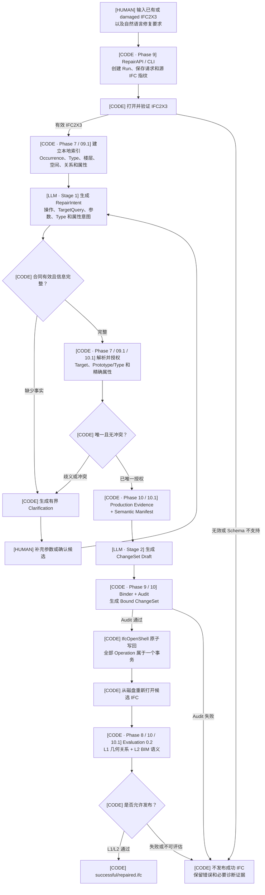

# IFC2X3 修复链路与后续路线

> 状态快照：2026-07-23
> 输入：已有或 damaged IFC2X3 + 用户自然语言要求
> 输出：通过 L1/L2 验证并允许发布的新 IFC

## 1. 一句话说明

系统不是让大模型直接改写 IFC，而是让 LLM 理解用户要修改什么并输出受约束的
RepairIntent 和 ChangeSet Draft，再由确定性代码解析目标、绑定真实 IFC 实体、
调用 IfcOpenShell 写回，并在重新打开 IFC、通过 L1/L2 后才发布结果。

整个链路有三种执行者：

- `[LLM]`：理解自然语言，提取操作、目标描述、参数和属性意图。
- `[CODE]`：验证 IFC、建立索引、解析目标、绑定 ChangeSet、写回、验证和发布。
- `[HUMAN]`：补充缺失信息，确认歧义目标、Type 和属性候选，进行必要的人工 UAT。

确定性代码拥有最终放行权。LLM 返回了合法 JSON，不等于 IFC 修复成功。

## 2. 总体流程

下面是当前已经实现并通过 LargeBuilding 验收的生产链路。图中只画当前可运行的
Phase 7—10.1；尚未完成的能力统一放在 Roadmap。



主线可以概括为：

```text
IFC + 文本
  → 理解和澄清
  → IFC 目标与语义解析
  → 统一 Bound ChangeSet
  → IfcOpenShell 原子写回
  → 重新打开并执行 L1/L2
  → 通过才发布
```

## 3. 哪些地方调用 LLM 接口

当前 Repair Pipeline 有两个正式 Provider 阶段。自动测试可以替换为 fake/file
provider，但 fake 运行不能证明真实模型质量。

### 3.1 Stage 1：RepairIntent

**执行者：** `[LLM]`

**发送给模型：**

- 用户修复要求；
- 当前 Operation 合同；
- RepairIntent Schema；
- Target、尺寸、Type 和属性意图表达规则；
- 不得编造缺失事实的约束。

**要求模型返回：**

- Operation 类型；
- TargetQuery，例如 GUID、Name、楼层、方位或空间描述；
- Width、Height、位置等参数；
- 可选 Type/Prototype 意图；
- 可选精确属性意图；
- 缺失参数。

Stage 1 不负责最终选择 IFC 实体。用户没有提供的尺寸、位置或 GUID 必须进入
Clarification，不能为了满足 Schema 而编造。

### 3.2 Stage 2：ChangeSet Draft

**执行者：** `[LLM]`

**发送给模型：**

- 用户要求；
- 已解析的 Operation；
- 有界 Target/Type 证据；
- Semantic Manifest；
- ChangeSet Draft Schema。

**要求模型返回：**

- 紧凑的 ChangeSet Draft；
- Operation 参数；
- 与 Manifest 对应的语义 assignment。

Stage 2 不生成 STEP，也不直接拥有执行权限。Draft 必须经过 Binder 和 Audit 才能
成为 Bound ChangeSet。

### 3.3 与旧 Text2IFC Generation 的区别

旧链路从文本生成 BIM JSON，再编译整栋 IFC，并包含 Design Brief、Generator 和
Audit Agent。当前 Repair Pipeline 读取已有 IFC，围绕局部 ChangeSet 工作，最终
验证由确定性 Evaluation 0.2 完成。

两条链路共享一个原则：LLM 提供候选，代码决定能否放行。

## 4. 哪些地方由代码解析和执行

### 4.1 输入、Run 和 IFC 索引

**执行者：** `[CODE + IfcOpenShell]`
**对应阶段：** Phase 7、Phase 9、Phase 09.1

`RepairAPI` 是统一行为入口，CLI 只是参数和交互封装。一次 Run 保存源 IFC
fingerprint、用户请求、状态转换、Clarification、Provider trace 和最终证据。

源 IFC 必须能被 IfcOpenShell 打开且 Schema 为 IFC2X3。随后代码建立
`targets.sqlite`，提取：

- occurrence 和 Type；
- GlobalId、Name、Tag 和 Type 名称；
- storey、space 和 containment；
- host、opening、fill 等关系；
- 方位、位置和几何摘要；
- Pset、Qto、material 和 classification。

TargetQuery 可以组合 GUID、Name、方位、楼层、空间和几何条件。Name 可以作为
工程师可读证据，但不能在存在多个候选时被静默当成唯一事实。

### 4.2 Clarification、Target 和 Type

**执行者：** `[CODE + HUMAN]`
**对应阶段：** Phase 7、Phase 09.1

以下情况会暂停同一个 Run：

- 缺少 Width、Height 或位置；
- Target Wall 不唯一；
- Prototype/Type 有多个候选；
- 属性需要确认。

用户回答绑定 `clarification_id` 和 `state_version`，过期回答不能应用。

Occurrence 和 Type 分开记录。当前只允许：

- 解析用户明确指定或确认的 Type；
- 将相似 Type 作为候选，而不是自动授权；
- 用户未指定 Type 时创建独立系统模板 Type；
- 绑定和读取共享 Type，但不修改共享 Type。

这可以防止修复一个 Window 时影响所有共享同一 Type 的 Window。

### 4.3 精确属性

**执行者：** `[CODE + HUMAN]`
**对应阶段：** Phase 10.1

当前属性入口是精确标量：

```text
Pset.Property + value + IFC value type + unit（适用时）
scope = target occurrence
```

标准属性从本地 IFC2X3 Registry 精确查询，并检查 applicable class、template、
value type 和 unit。未知属性会成为 custom candidate，要求用户确认后进入同一
写回和 L2 链路。

当前不进行中文别名、拼写纠正或向量检索；这些属于 Phase 10.2。

### 4.4 Production Evidence 与 Semantic Manifest

**执行者：** `[CODE]`
**对应阶段：** Phase 10、Phase 10.1

Production Evidence 只使用：

- 当前 IFC 中仍然存在的事实；
- 用户文本和确认；
- 已授权 Type；
- Operation Registry 的确定性 policy。

Semantic Manifest 声明本次 Operation 必须写入并由 L2 检查的事实，例如 host、
Opening、Window Type、storey、用户指定 Pset，以及适用的 material、
classification 和 quantity。

Manifest 同时约束写入和验证，避免编译器与 L2 使用两套成功定义。

### 4.5 Binder、Audit 和原子写回

**执行者：** `[CODE + IfcOpenShell]`
**对应阶段：** Phase 9、Phase 10

Binder 将 Provider Draft 绑定到源 IFC fingerprint、真实目标 GUID、已授权 Type
和 Manifest。Audit 再检查 Schema、引用、Scope、指纹和 Operation policy。

整个 Run 只有一个统一 ChangeSet。多个修改会成为多个 Operation，但仍属于一个
事务；任一 Operation 失败时整批回滚。

Audit 通过后，IfcOpenShell Applicator 才在 staging 区域生成候选 IFC。源 IFC
不原地修改。

### 4.6 重新打开、L1/L2 与发布

**执行者：** `[CODE + IfcOpenShell]`
**对应阶段：** Phase 8、Phase 10、Phase 10.1

代码从磁盘重新打开候选 IFC 后再验证。

L1 检查：

- Window 尺寸、位置和 host Wall；
- Opening 与 void/fill 关系；
- storey 和修改范围；
- non-target preservation；
- IFC 是否可重新打开。

L2 检查：

- Type/Prototype；
- occurrence 与 Type 属性来源；
- 用户指定 Pset 的 value、type 和 unit；
- Manifest 要求的 material、classification 和 quantity。

Material 不是无条件要求。只有当前 IFC、授权 Type 或用户要求中存在相应事实时，
Manifest 和 L2 才要求保留或创建。

Evaluation 0.2 是唯一发布权威：

- 通过：发布 `successful/repaired.ifc`；
- 未通过但存在候选：只保留 diagnostic candidate；
- Provider、Audit 或 Application 提前失败：不伪造 repaired IFC。

## 5. 放行逻辑

正式 repaired IFC 只有同时满足以下条件才可发布：

```text
IFC input valid
AND RepairIntent valid and complete
AND Target / Type / Property uniquely resolved or confirmed
AND Production Evidence and Semantic Manifest available
AND Provider Draft valid
AND Bound ChangeSet Audit passed
AND unified transaction applied completely
AND candidate IFC reopened successfully
AND L1 geometry_relationship_success
AND L2 semantic_fidelity_success
AND successful_artifact_publishable = true
```

L3 authoring exactness 当前不作为 v1.1 发布条件。新 GlobalId、不同 STEP ID、Name、
Tag、OwnerHistory 或序列化顺序可以造成文件大小差异，但不自动表示 L1/L2 失败。

Ground Truth 只用于 benchmark：

```text
original IFC
  → 人为删除目标 Window / Opening
damaged IFC
  → 生产 Repair Pipeline
repaired IFC
  → Private Ground Truth Comparator
```

original IFC、private mutation manifest 和被删除实体 GUID 不得进入 Provider、
Target Resolution 或 Production L2，避免提前读取答案。

## 6. 一个成功 Repair Run 留下什么

一次完整运行通常留下：

- 用户输入、source IFC fingerprint 和 Run transitions；
- `index/targets.sqlite`；
- Stage 1 Prompt、Provider trace 和 RepairIntent；
- Clarification 与用户回答；
- Target、Type 和 Property resolution；
- Production Evidence 和 Semantic Manifest；
- Stage 2 Prompt、Provider trace 和 Draft；
- Bound ChangeSet；
- application report 和 staging candidate；
- reopened L1/L2 Evaluation；
- terminal evidence 和 artifact hash manifest；
- `successful/repaired.ifc` 或 diagnostic candidate。

面向人工汇报的 proof package 可以只复制用户输入、damaged IFC、repaired IFC、
benchmark original 和简明报告，并通过 provenance 指回完整 Run。

## 7. 失败时回到哪里

| 失败类型 | 负责判断 | 下一步 |
|---|---|---|
| IFC 无效或 Schema 不支持 | IfcOpenShell / CODE | `invalid_input`，不调用 Provider |
| 缺少尺寸或位置 | LLM 识别、CODE 验证 | 询问用户并重新执行 Stage 1 |
| Target 不唯一 | Resolution Flow | 展示有界候选，等待用户选择 |
| Type 不唯一 | Type Resolution | 展示人类可读 Type，等待确认 |
| 标准属性不存在 | Property Resolution | 转 custom confirmation 或取消 |
| Provider 或 JSON 合同失败 | Provider Stage | `provider_failed`，不伪造后续成功 |
| Draft 越权、指纹或引用错误 | Binder / Audit | `audit_failed`，不写 IFC |
| 某个 Operation 应用失败 | Applicator | 整个统一事务回滚 |
| IFC 重开、L1 或 L2 失败 | Evaluation | 只保留诊断证据，不发布 |
| 用户取消 | HUMAN / RunStore | `cancelled` |

## 8. 已完成能力与 Roadmap

### 8.1 已完成阶段

| Phase | 状态 | 完成内容 |
|---:|---|---|
| 7 | Complete | IFC Index、TargetQuery、GUID/Name/方位/空间/几何定位 |
| 8 | Complete | L1/L2 Evaluation 0.2、Gold 隔离、fail-closed 发布 |
| 9 | Complete | RepairAPI、CLI、RunStore、双 Agent、Clarification、统一 ChangeSet |
| 09.1 | Complete | occurrence/Type 分离、Prototype 解析和 Type evidence 修正 |
| 10 | Complete | Window Manifest、Bound ChangeSet、原子写回和 reopened L2 |
| 10.1 | Complete | 精确标量属性、自定义确认、Type 复用和模板 fallback |

当前生产 Registry 只注册 `add_window_with_opening_to_wall`，但该 Operation 已覆盖
Target Wall、Window/Opening 几何、void/fill、storey、Type、Pset、条件 material/
classification/quantity、L1/L2 和 fail-closed 发布。

LargeBuilding 已完成 damaged IFC、离线闭环、真实 DeepSeek Stage 1/2、repaired
IFC、L1/L2、属性对比和 IfcDiff 辅助检查。真实 Provider 失败会如实记录，不用
fake 输出替代。

### 8.2 后续路线

```mermaid
flowchart LR
    classDef done fill:#E8F6EC,stroke:#2E7D32,color:#17421A
    classDef current fill:#E8F2FF,stroke:#2670B8,color:#123C65
    classDef planned fill:#F6F6F6,stroke:#777,color:#333
    classDef proposed fill:#FFF4D8,stroke:#C58A16,color:#553A08,stroke-dasharray:5 3

    P7["Phase 7<br/>IFC Index 与 Target"]:::done
    P8["Phase 8<br/>L1/L2 Evaluation"]:::done
    P9["Phase 9<br/>Repair Orchestrator"]:::done
    P91["Phase 09.1<br/>Type Evidence"]:::done
    P10["Phase 10<br/>Window L2"]:::done
    P101["Phase 10.1<br/>精确属性写入"]:::done
    P102["Phase 10.2<br/>属性知识检索"]:::current
    BATCH["批量 Window 专项<br/>拟议 Phase 10.3"]:::proposed
    P11["Phase 11<br/>Opening 与 Door"]:::planned
    P12["Phase 12<br/>Beam 与 Column"]:::planned
    P13["Phase 13<br/>大型 IFC 与 128k"]:::planned

    P7 --> P8 --> P9 --> P91 --> P10 --> P101 --> P102
    P102 --> BATCH
    P102 --> P11 --> P12 --> P13
    BATCH -. "批量事务经验" .-> P11
```



后续阶段各自解决不同问题：

- **Phase 10.2**：用 buildingSMART IFC2X3 PSD、项目属性、alias/keyword/vector
  检索，把“U 值”等表达解析成精确候选；确认后继续使用 10.1 写回与 L2。
- **批量 Window 专项**：同时 damage 和修复 2、5、10 个 Window，验证统一
  ChangeSet、整体回滚、逐对象 L1/L2 和全局 preservation。
- **Phase 11**：独立的 Opening 和 Door + Opening Operation。
- **Phase 12**：Beam 和 Column，证明公共 Pipeline 不依赖 Window。
- **Phase 13**：大型 IFC 索引、上下文、Provider 稳定性和 128k 实验。

Phase 10.2 是当前下一步，但它建立在 Phase 7—10.1 已完成的 Target、Type、
ChangeSet、写回和验证基础上。它不会替换已有链路。

## 9. 详细证据入口

- [单次完整 Repair Pipeline 输入输出](../validation/ifc2x3-changeset/phase10-single-pipeline-input-output.md)
- [Phase 7 Target Retrieval 验证](../validation/ifc2x3-changeset/phase7-validation-report.md)
- [Phase 8 L1/L2 验证](../validation/ifc2x3-changeset/phase8-validation-report.md)
- [Phase 9 Repair Orchestrator 验证](../validation/ifc2x3-changeset/phase9-validation-report.md)
- [Phase 09.1 Type Evidence 验证](../validation/ifc2x3-changeset/phase9.1-validation-report.md)
- [Phase 10 Window L2 验证](../validation/ifc2x3-changeset/phase10-validation-report.md)
- [Phase 10.1 属性写入验证](../validation/ifc2x3-changeset/phase10.1-validation-report.md)
- [LargeBuilding Window 属性对比](../validation/ifc2x3-changeset/phase10.1-largebuilding-window-property-comparison.md)
- [Window 有效属性复刻与 IfcDiff](../validation/ifc2x3-changeset/phase10.1-full-window-replication-and-ifcdiff-report.md)
- [正式 Roadmap](../../.planning/ROADMAP.md)
