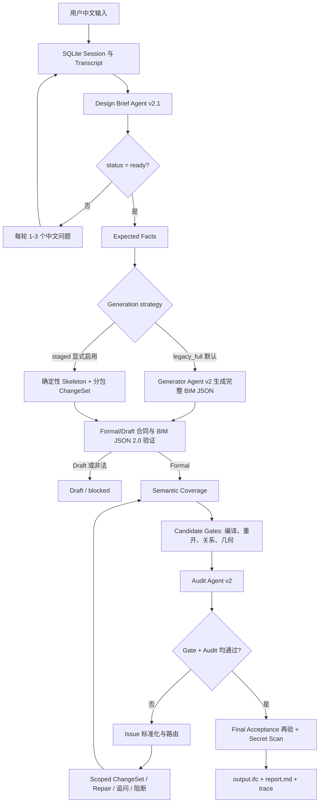

# Main Branch Workflow Code Audit

**审核日期：** 2026-07-16

**审核基线：** `main@67fd3be7`

**目的：** 根据真实入口、实现和代表性测试说明当前 text2IFC workflow，供产品与架构判断。

## 结论先行

当前 `main` 已经实现了真正的多 Agent 链路，不再是早期的单 Prompt demo：

```text
中文自然语言
  -> 多轮 Design Brief Agent
  -> Ready 或 Draft
  -> Expected Facts
  -> BIM JSON Generator / 分包 ChangeSet Generator
  -> Formal BIM JSON 2.0
  -> 确定性 Schema、语义、关系、IFC 与几何 Gate
  -> Audit Agent
  -> 有限轮局部返工
  -> 最终 IFC2X3 + 报告 + Trace
```

架构边界总体合理：模型负责理解、语义生成和语义复核；确定性代码负责
Schema、关系、编译、几何和最终门禁。Audit Agent 无权覆盖确定性失败。

但当前工作区还不能被判断为“生产链路可直接运行”：Prompt registry 中
10/10 个模板哈希与模板实际内容不一致，导致 Prompt、交互生成和 ChangeSet
测试在模型调用前失败。此外，真实 CLI 默认仍使用 `legacy_full`，没有默认启用
复杂建筑更适合的 `staged` 分包生成。

## 真实入口

用户入口是 [`scripts/agent/run_text2ifc_chat.py`](../../scripts/agent/run_text2ifc_chat.py)。
它加载 `.env`，创建 SQLite session store，然后调用
[`run_repl_chat`](../../src/text2ifc_agent/repl_chat.py)。

当前运行方式：

```powershell
python scripts/agent/run_text2ifc_chat.py --live
```

复杂建筑若要走分包生成，当前必须显式传入：

```powershell
python scripts/agent/run_text2ifc_chat.py --live --generation-strategy staged
```

## 端到端工作流



## 各阶段职责

### 1. Session 与多轮澄清

[`repl_chat.py`](../../src/text2ifc_agent/repl_chat.py) 先把问题展示并持久化，
再接收用户回答。用户退出、空回答、每轮模型调用、问题 ID 和状态变化都会进入
SQLite 与运行目录。会话未 Ready 时不会进入 IFC 生成。

Design Brief Agent 使用 `design-brief.v2.1`，输入包括完整对话、Design Brief
Schema、证据目录和 few-shot。它只能输出 Ready 或 Draft 意图记录，不能直接输出
BIM JSON 或 IFC。

主要实现：

- [`interactive_cli_flow.py`](../../src/text2ifc_agent/interactive_cli_flow.py)
- [`clarification.py`](../../src/text2ifc_agent/clarification.py)
- [`session_store.py`](../../src/text2ifc_agent/session_store.py)
- [`context_selection.py`](../../src/text2ifc_agent/context_selection.py)

### 2. Expected Facts

Ready Design Brief 会被确定性投影为 Expected Facts。它是验收清单，不是第二套
BIM Schema。它记录应出现的楼层、空间、构件、宿主、洞口和关系，并为稳定实体
ID、分包生成和后续 Gate 提供目标。

主要实现：[`expected_facts.py`](../../src/text2ifc_agent/expected_facts.py)。

### 3. BIM JSON 生成

系统存在两种策略：

1. `legacy_full`：Generator Agent 一次生成完整 Formal BIM JSON 2.0 或 Draft。
2. `staged`：确定性代码先生成 Project、Site、Building、Storey skeleton，再按
   楼层与跨楼层 package 调用 ChangeSet Agent。每个 package 最多三次尝试，必须
   通过 package scope、Schema 和冻结构件检查后才能合入 workspace。

当前复杂建筑更适合 `staged`，但 CLI 默认是 `legacy_full`。这是实现与目标之间
最明显的策略偏差。

主要实现：

- [`generator.py`](../../src/text2ifc_agent/generator.py)
- [`staged_generation.py`](../../src/text2ifc_agent/staged_generation.py)
- [`changeset_stage.py`](../../src/text2ifc_agent/changeset_stage.py)
- [`package_gates.py`](../../src/text2ifc_agent/package_gates.py)

### 4. Formal BIM JSON 2.0 边界

模型输出先按版本判别为 Formal、Draft 或 Unknown Contract。Formal 只能使用
`bim-json/2.0`，Draft 只能使用 `bim-json-draft/1.0`。两者不能混合。

只有通过 `validate_v2_document` 的 Formal 文档才能进入候选 Gate。低层 IFC
对象、STEP 文本和 STEP ID 不属于模型输出。

### 5. 确定性 Gate 与 IFC 编译

Candidate Gate 会执行：

- BIM JSON Schema 与语义验证；
- Expected Facts 覆盖；
- ID、引用、楼层归属、void/fill 与聚合关系检查；
- BIM JSON 到 IFC2X3 的确定性编译；
- IfcOpenShell 重开；
- 构件数量、包围盒、墙向、空间闭合、门窗洞口、楼层与楼梯几何检查。

编译入口是 [`compile_document`](../../src/text2ifc_compiler/compiler.py)，实体、
几何和关系分别由 `bootstrap.py`、`geometry.py`、`relationships.py` 处理。

### 6. Audit Agent

Audit Agent v2 接收原始用户输入、完整对话、Ready Design Brief、终态 BIM JSON、
确定性 Gate、revision evidence、repair route、metrics 和证据路径。它负责判断结果
是否忠实表达用户意图。

Audit 可以接受、要求修订或拒绝，但不能：

- 修改 BIM JSON；
- 生成 IFC；
- 扩大 ChangeSet 范围；
- 覆盖任何确定性 Gate 失败。

因此审核由 Agent 参与是合理的，但它是语义审核层，不是唯一真相。

### 7. 反馈与局部返工

失败会被规范化为带 owner、route、expected、actual 和 evidence 的 Issue。当前
反馈预算最多三轮。支持的主要路由包括：

- 缺少用户事实：回到中文澄清；
- Design Brief 理解错误：重做 Brief；
- 局部候选错误：生成受限 ChangeSet；
- Schema/合同错误：有限 Repair；
- 当前能力不支持：明确阻断。

ChangeSet 绑定 base revision、candidate hash、expected facts hash、Issue 与允许
路径。Applicator 在副本上执行，并检查无关构件保持率，避免整份 JSON 重写。

主要实现：

- [`route_decision.py`](../../src/text2ifc_agent/route_decision.py)
- [`scoped_loop.py`](../../src/text2ifc_agent/scoped_loop.py)
- [`changeset_apply.py`](../../src/text2ifc_agent/changeset_apply.py)
- [`revision_gates.py`](../../src/text2ifc_agent/revision_gates.py)

### 8. 最终验收

最终 IFC 被标为 accepted 必须同时满足：

- 候选来源允许 live acceptance；
- Audit 输出合同合法且结论为 accept；
- 确定性 Gate 全部通过；
- IFC 编译和重开成功；
- 几何检查成功；
- Secret scan 无发现。

系统允许 deterministic scaffold 帮助诊断或生成未验收 IFC，但它会被标记为
`live_acceptance_eligible: false`，不能成为最终 live accepted 结果。

## Prompt 与 Few-shot 管理

Prompt 已集中在 [`prompts/agent/registry.json`](../../prompts/agent/registry.json)，
每次调用记录 template ID、hash、渲染输入、渲染后 Prompt、原始响应、解析响应、
验证结果和 metrics。Design Brief、Generator、ChangeSet 与 Audit 都有独立 Prompt。

few-shot 也确实进入真实调用：Design Brief 通过 context selection 选择示例；
staged/repair ChangeSet 使用墙、依赖构件、楼层包、跨楼层和楼梯示例。

当前问题是 registry 没有显式 `active_profile`，历史 Prompt 与生产 Prompt 混在同一
列表中；更严重的是 10 个 registry hash 全部与当前模板不匹配，运行时会直接拒绝。

## 数据与运行产物

每个完整 run 通常包含：

- `input.txt`、`conversation.json`、`design-brief.json`；
- `expected-facts.json`；
- `generator/` 或 `generator-staged/` 的 Prompt 与模型证据；
- `candidate.json`、revision 与 component preservation；
- `ifc-verification.json`、`geometry-feedback.json`、`gate-summary.json`；
- `audit/audit-report.json`；
- `issues.json`、route decision 与 feedback rounds；
- `output.ifc`、`report.md`、secret scan 与 session export。

这些数据分成 deterministic fixture、replay、live provider 和 human accepted，不应
混为同一种证据。人工认可入口见
[`dataset/processed/agent-demo/ACCEPTED_OUTPUTS.md`](../../dataset/processed/agent-demo/ACCEPTED_OUTPUTS.md)。

## 本次验证结果

代表性测试共运行 41 项：20 通过，21 失败。失败均被 Prompt registry 首个哈希
不匹配阻断，并连带影响 Prompt、交互生成和 scoped ChangeSet 测试。

单独复测 IFC 编译、IFC 关系和 generated IFC quality：7/7 通过。

这说明当前问题位于 Prompt 治理与编排入口，不是 IFC2X3 编译器基础能力。

## 架构判断

合理且应保留：

- BIM JSON 2.0 是唯一正式语义中间层；
- 澄清、生成、审计职责分离；
- 确定性 Gate 高于 LLM Audit；
- 有限轮、有证据、按 ID 和路径约束的局部 ChangeSet；
- 最终 IFC 必须重开、过几何检查和 secret scan。

需要优先调整：

1. 修复 Prompt registry 哈希漂移，并增加 CI 漂移检查。
2. 增加显式 production prompt profile，避免历史模板被误用。
3. 对复杂建筑把 `staged` 提升为默认或按复杂度自动选择。
4. 将 deterministic scaffold 在 CLI 中明确显示为诊断 fallback。
5. 更新已落后到 Phase 1 的根 README，并修复现有中文 workflow 文档乱码。

在前两项完成前，不宜宣称 live 多 Agent workflow 已可稳定部署。
