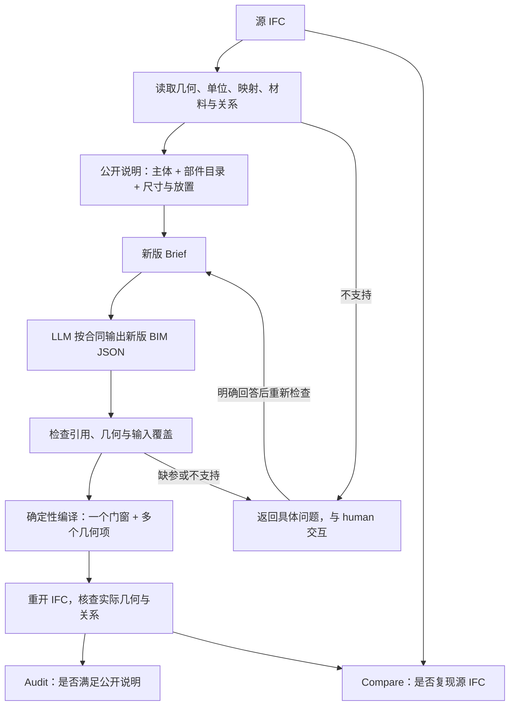

# text2IFC 参数化门窗部件扩展计划 v1.0

日期：2026-09-28 整理。状态：本轮批准的开发范围已完成；本文件保留范围、合同和验收约定。实际结果、未覆盖项及预算只在[结果与证据](../validation/ifc2text/component-v26/README.md)维护。S6 局部修改只有离线公开链证据。

本文合并原部件计划、窗结构问答和 IFC 表示调查，是本次扩展的唯一计划。稳定的 IFC 结构解释与源表示调查现拆到[门窗参考](../reference/ifc-window-components.md)，不另设实施计划。合并前内容保存在 Git 提交 `e8a926b0`，不再保留独立旧稿；原始调查 JSON 保留为证据附件。文档版本与产品 schema 版本分开管理。

## 1. 具体要做什么

让 text2IFC 根据自然语言描述，创建由**框、门板、百叶、把手等部件**组成的门窗。整体仍是一个 `IfcDoor`／`IfcWindow`，部件分别描述、编号和定位。

1. 扩展 Brief 和 BIM JSON，完整传递部件的几何、位置和引用。
2. 扩展编译器，把参数化部件生成真实 IFC 几何。
3. 扩展 IFC2Text，把支持的源构造写成可读、可重建的说明。
4. 不支持时返回具体内容，与 human 交互后再继续。
5. 分别测试单门和单窗，再测宿主安装，最后测完整建筑。

不为每种窗型增加模板，不以覆盖任意 BRep／网格为目标。旧模板保留为明确选择的简单建模路径。已获授权进入 Goal 开发；真实模型调用仍须完成对应阶段的离线准入。

2026-09-26 增补决定：明确批准支持 i5n_1 揭示的直线多边形凹口墙。BIM JSON 2.6 路径保留完整截面和材料层，用真实多边形交集检查墙与开口／填充物相交；旧版本仍维持既有范围。新作者合同 1.7、Generator 2.11／Repair 2.8 说明该能力，旧合同和提示版本保留。仅缺重复终点的合法截面可执行有记录的精确闭合恢复，不移动或删减已有顶点；自交、材料矛盾等其他错误继续拒绝。

## 2. 已确认的范围

| 内容 | 首版决定 |
|---|---|
| 构件与部件 | 一个门窗内包含多个几何项，部件不是独立建筑构件 |
| 几何 | 矩形、圆形、含孔多边形截面；直线挤出；平移、旋转放置；有限等距重复 |
| 材料与显示 | 保留已有整体材料；支持逐项颜色／透明度；部件物理材料后续单独验证接入 |
| Type | 按明确需求创建，与模板、几何分开；满足 IFC2X3 导出的实际合法性要求 |
| 输入不足 | 缺尺寸等信息时请求补充，不猜测细节 |
| 不支持 | 逐项列出对象、原因与影响，再由 human 选择“排除列明内容后继续”或“暂停”；前者产出其余部分并附拒绝清单，后者不生成；未明确选择时等待 |
| 精度 | 线性几何差 ≤1 mm 接受；数量、拓扑和材料错误单独判断 |
| 验证 | 门和窗都做；无视图输入，以 IfcOpenShell 读取和检查 |
| 比较实现 | IfcOpenShell 负责 IFC 解析、单位、变换和真实几何；优先复用成熟几何库，允许自行补充容差比较。IfcDiff 辅助交叉检查，不代替 1 mm 测量；未覆盖项明确报告 |
| 暂不做 | 一般扫掠、旋转体、自由曲面、任意布尔、逐面 BRep／网格生成、外部构件库、IFC4 输出迁移 |

**自然语言可表达、参数化优先。** “带孔窗框＋十四片等距斜板”适合本路线；“精致的弯曲把手”只有名称，没有足够构造信息。支持必须同时满足：输入足以确定几何、合同能够表达、编译和独立检查能够验证。

旋转现有部件的放置，与绕轴生成旋转体不同，首版只有前者。简单 BRep 经已有且受验证的识别路径能恢复为允许的参数构造时，可以转换；不能证明等价则报告不支持，不开展任意 BRep 逆向工程。很多面不证明来自 GLB，工程软件导出的文件也可能不保留原建模参数。

## 3. 总体流程


```mermaid
flowchart TB
    S["源 IFC"] --> P["读取几何、单位、映射、材料与关系"]
    P --> T["公开说明：主体 + 部件目录 + 尺寸与放置"]
    T --> B["新版 Brief"]
    B --> J["LLM 按合同输出新版 BIM JSON"]
    J --> V["检查引用、几何与输入覆盖"]
    V --> C["确定性编译：一个门窗 + 多个几何项"]
    C --> R["重开 IFC，核查实际几何与关系"]
    R --> A["Audit：是否满足公开说明"]
    R --> Q["Compare：是否复现源 IFC"]
    S --> Q
    P -->|不支持| H["返回具体问题，与 human 交互"]
    V -->|缺参或不支持| H
    H -->|明确回答后重新检查| B
```

重建端只收到公开文本，包括部件目录、尺寸表和重复规则；不得暗中读取源 IFC、`source-facts.json` 或私有几何附件。保存源→事实→文本→Brief→BIM JSON→IFC→Compare，区分解析、描述、传播和编译问题。

人工完整描述→text2IFC 与源 IFC→IFC2Text→text2IFC 都要测试。前者检查生成与编译，后者检查描述链是否丢失信息。

## 4. 数据合同与 IFC 输出

### 4.1 主体、部件、几何项

| 层级 | 示例 | 作用 |
|---|---|---|
| 构件 ID | `N001` | 一个 IfcWindow，负责楼层、宿主、类型与名义尺寸 |
| 部件 ID | `N001/frame`、`N001/slat-07` | 描述与局部修改对象，需跨 IFC 重开可识别 |
| 几何项 ID | `N001/frame/solid-01` | 描述／BIM JSON 内引用，一个部件可有多个实体 |
| 几何定义 ID | `slat-definition-01` | 复用截面和长度，各实例仍有独立位置及部件 ID |

父门窗不额外生成一套完整几何，避免重复叠加。“主体”若指门板，应作为部件。角色不充当唯一 ID，两个部件均可为把手。STEP 行号如 `#2380` 只定位源文件，不作为稳定编号。

首版稳定引用到部件层，不承诺几何项 ID 在 IFC 中逐一恢复；部件内部按真实几何集合验证。错误跨门窗引用、循环、重复 ID、孤立几何项、重复所有权都要报错。重复先限数量、起点与等距平移向量，编译前确定性展开；修改 slat-07 不得改变全部叶片。资源上限已用离线规模探针验证；以后扩容需重新验证，不能按单例随意放大。

层级示意（不是可直接提交的 JSON；正式字段以 [BIM JSON 2.6](../../schemas/bim-json/2.6/README.md) 为准）：

```text
N001 : IfcWindow
  placement / nominal_dimensions / opening_ref
  geometry.mode = component_geometry
  parts:
    N001/frame -> 带孔截面 + 挤出方向与长度
    N001/slat-01 ... N001/slat-14
      -> 共用叶片定义 + 各自局部放置
```

`template` 与 `component_geometry` 互斥，`type_id` 独立。部件模式缺参不能自动转成普通窗模板。LLM 输出受支持参数，RepresentationMaps 和 IFC 实体创建由编译器管理。

### 4.2 坐标、截面与安装

部件相对父门窗、几何项相对部件，轮廓在二维局部平面内；明确挤出方向和长度。统一毫米、声明角度单位，变换只组合一次。检查有限正尺寸、合法正交坐标、轮廓闭合、孔位于外环内、孔不相交和轮廓不自交；圆保留解析半径，不默认改成低边数多边形。

处理映射原点、映射目标、产品及几何项放置。缩放／反射仅在可证明等价时归一化，不能通过正交化丢失镜像手性；无法处理则明确报告。

名义宽高、安装洞口和实际外廓分开。把手和门套可外伸，不能扩大洞口或改名义尺寸来通过旧模板检查。安装参考包括 opening_ref、安装坐标系和公开说明中的偏移／参考轮廓；检查实际 Fills／Voids 关系和各部件位置。不能从实体并集重新推导名义尺寸，也不能以“小部件与墙相交”认定正确安装。

### 4.3 几何、身份和显示

输出一个门窗及其 ProductDefinitionShape，Body/SweptSolid 包含多个挤出实体。使用真实 IfcShapeAspect 将部件关联到 Body items：Name 存部件 ID，Description 存版本化角色说明。旧模板原约定不变，新 reader 显式区分。重开按产品→ShapeAspect→实际几何核查，不能只检查自写属性 JSON。

ShapeAspect 没有独立放置字段。编译时把部件和几何项变换合入实体 Position；重开验证等价位置，不承诺恢复原参数变换树。可编辑参数层级由保存的 BIM JSON 维护。

首版不输出共享 RepresentationMap，复用定义先展开为实例几何。IFC2X3 ShapeAspect 关联 ProductDefinitionShape，不能照搬 IFC4 挂到 RepresentationMap。以后增加表示时，RepresentationType 必须匹配 Items，并核查交换视图兼容性，不能将 BRep 标为 SweptSolid。

颜色／透明度写入真实几何并读回。整体“木材、钢材”清单不能冒充“木门板、钢把手”的归属；明确部件材料需求保存在公开说明与缺项记录中，首版不宣称完成该语义。部件物理材料方案另行验证，不能直接使用 IFC4 的 IfcMaterialConstituentSet。

## 5. 不支持时如何与 human 交互

返回对象／部件、失败阶段、已知与缺失内容、结果影响及处理选择：补参数、修改需求、讨论扩展、明确接受部分模型、停止或稍后继续。

> D007 的八个边界实体中，有三项目前不能可靠转换为本版支持的挤出几何。尚未省略或替换它们，因此不能完整重建这扇门。可以讨论扩展能力，明确选择标注缺失的部分模型，或者暂停。

复用既有澄清／unsupported 字段和 SessionStore 交互入口，核查问题返回、等待、回答保存与恢复。缺参数可以补充，缺算法能力不能靠回答“继续”变为支持。编译异常进入故障诊断，不让 human 猜填建筑参数。

无回答时不降级、不发布完整成功、不持续调用 Provider。回答关联具体对象范围，新问题不能沿用旧授权。部分模型须明确同意且其输出路径已有合同与验证，标明全部缺项，与完整验收分开。文件版本不支持也应返回，不能改 FILE_SCHEMA 假装兼容。

## 6. 修改模块与版本

| 层 | 入口 | 变更 |
|---|---|---|
| IFC2Text | `facts.py`、`compact.py`、`compact_pipeline.py` | 原生读取部件、展开变换、输出公开目录；未知角色中性命名 |
| Brief | `design_brief.py`、`brief_plan_constraints.py`、schema | 保留部件、几何、引用、缺失项和来源，防止投影丢失 |
| 预期／覆盖 | `semantic_requirements.py`、`semantic_coverage.py`、`expected_facts.py` | 从公开 Brief 建立预期，不用候选自报内容作为全部真值 |
| 正式／Draft 合同 | `text2ifc_contract`、BIM JSON／Draft schema | 部件模式与校验；Formal 可编译，Draft 能说明缺失 |
| Agent 路由 | `authoring_contract.py`、`generation_contract.py`、Generator／Audit／CLI | 版本、能力说明和恢复；首版用 legacy_full，不默认支持 staged／旧 changeset |
| 编译 | `geometry.py`、`basic_filling.py`、bootstrap／compiler | 多实体、圆和内孔、ShapeAspect、重开与原子输出 |
| 安装／显示 | `placement.py`、`polygon_wall.py`、presentation／part_readback | 坐标、外伸检查，按部件 ID 写入和读取显示 |
| 比较 | `precision_compare_v13.py` 及独立测量 | 新版增加内部形状、孔和部件，新旧候选统一重评分 |

已接入 **BIM JSON 2.6、Brief 2.9、Draft 1.6**；authoring contract 从 1.6 扩展至 1.7，加入凹口墙说明。新增而不改写旧合同，同步 schema hash、registry、prompt/profile、消费者白名单和测试。调查脚本能打开 IFC4 不等于产品全链支持 IFC4，不顺带扩大输入版本。

实施中已修复 2.4／2.5 部件配色漏接与几何异常终端处理；回归入口见[故障定位与回归](../validation/ifc2text/maintenance.md)。

## 7. 实施顺序与验收

**2026-09-25 比较实现修订：**采用“库解析，再进行容差比较”。IfcOpenShell 负责实体解析、单位、世界坐标变换、实体布尔并集和网格生成；Compare 1.2 在这些结果上计算双向表面采样距离、拓扑和体积，并按固定 1 mm 判断。现有经过边界测试的距离计算继续保留，允许自行补充库未覆盖的比较，不因工具名称改动已验证算法。采样距离不是连续表面 Hausdorff 上界证明；网格线性偏差设为 0.1 mm，未支持几何明确记为未评估。后续若更换测量算法，应发布新比较版本，并用同一版本重测两侧，不能把评价器变化当作建模提升。

IfcDiff 0.8.5 用作附加检查：四个单构件均未报告几何变化，但其形状摘要比较不等于最大表面误差 ≤1 mm，且不能覆盖完整材料／外观。官方工具结果和 Compare 1.2 的测量分别记录。当前没有确认到比该组合更适合的特定 IFCcompare 实现，不以名称相近推断其功能。

| 阶段 | 内容 | 通过条件 |
|---|---|---|
| S0 基线与合同 | 固定当前代码／必要未提交改动、版本、案例及预期，冻结新 schema | 旧输入保持；部件身份、几何、缺参与 unsupported 可验证，先建立相关红灯 |
| S1 编译 | 不经 LLM 的部件 JSON→IFC→重开 | 单门、单窗均通过圆、孔、数量、位置、显示、身份和失败原子性检查 |
| S2 描述与传播 | IFC2Text→文本→Brief→BIM JSON，先 fake／frozen-replay | 部件均有去向；错误、澄清和人工恢复正确，源不变、无隐藏源输入 |
| S3 单构件真实实验 | 单窗、单门分别运行完整链路，保存全部尝试 | 两类均通过，不能以窗代门；真实调用前阶段准入有效 |
| S4 安装小场景 | 门、窗分别放进最小墙＋开口＋楼层 | 朝向、切洞、外伸、放置和归层正确 |
| S5 整栋 | 先处理 hxp 未支持项，再运行建筑 | 不支持项有人工决定；部分输出不算整栋完整成功 |
| S6 局部修改 | 只改某片百叶或某个部件 | 目标改变，其余部件、墙和关系保持 |

单构件 IFC 包含合法项目所需的最小结构；未测宿主时安装项标为未评估。首批必须有 N001 百叶窗、旋转／不同规格窗、D001／D002 双扇门至少一扇、D003–D006 含圆截面门至少一扇、D007 不支持交互和四种旧模板回归。hxp 是已见诊断集，另冻结来源隔离的门、窗留出案例，同源派生文件不得跨集合。

比较同时保留两条路径：公开部件预期→输出真实部件关联；源父构件的**完整 Body**→输出完整几何。第二条不能按提取器已识别清单过滤源实体，防止解析、描述与比较一起漏项。

必须检出：外框相同但少百叶、叶片角度错、内孔填实、把手遗漏、重复实体、镜像丢失、父变换重复、单改一片却全部变化。允许等价几何分割，不要求 STEP 实体数相同；语义部件数量与重复占据另查。

线性误差 ≤1 mm。数量／拓扑不适用距离容差，面积／体积不能直接套“1 mm”。使用真实几何与独立截面／表面测量交叉检查，明确网格精度和未评估项；旧新候选使用同一评价器，不把评价器变化当作生成提升。

复用合同的 geometry／placement／type-family 测试，编译的 v2_geometry、basic_filling、polygon_wall_hosts_v24、part_appearance、coordinated_appearance、compiler_boundary、v2_compilation，以及材料清单相关测试。遵循 [Agent 能力验证协议](../validation/agent-capability-evaluation.md)：新阶段先完成适用离线全公开链路准入；普通修复做相关范围回归；Full Preflight 另行说明并获批准。真实失败回到离线定位并计入分母。Audit 通过不等于源模型保真，单例通过不等于普遍支持。

## 8. Git、版本与回退

合并前文档基线为 `e8a926b0`，计划合并提交为 `c612e8e8`。旧稿可用 `git show e8a926b0:<原路径>` 查看，不保留多个活动计划。开发开始前已备份相关未提交文件；依赖的 2.4／2.5 schema、墙体和材料修复单独保存为代码基线 `4ff01db5`。

后续开发继续建立可复现代码基线：存在未提交改动时，不能只记 HEAD。识别依赖后按明确文件／改动块整理，必要时建立隔离分支并保留原工作区。按合同、编译、解析、Agent、比较等单元提交和推送 `codex/` 分支，不自动合入 main。

每次运行固定 Brief、BIM JSON、Draft、作者合同、prompt/profile、编译器和比较器版本。新路径显式选择、旧路径可重放；新部件请求送旧版本应明确不支持，不能降级成模板。恢复不得半新半旧，不可逆存储迁移另行讨论。

S1–S3 回退演练：新组合运行并保存→旧组合重放旧案例→验证旧行为→确认旧版不误接受新部件输入。必要时切换旧组合或回退本功能提交，不 reset 脏工作区，不删源文件、旧输出和失败证据。回退保证旧能力可用，不会让旧版获得部件能力。


IFC 实体引用、窗框／叶片示例、Type 与 RepresentationMap 的关系、材料与显示的区别，以及源数据表示调查统一见[门窗参考](../reference/ifc-window-components.md)。
