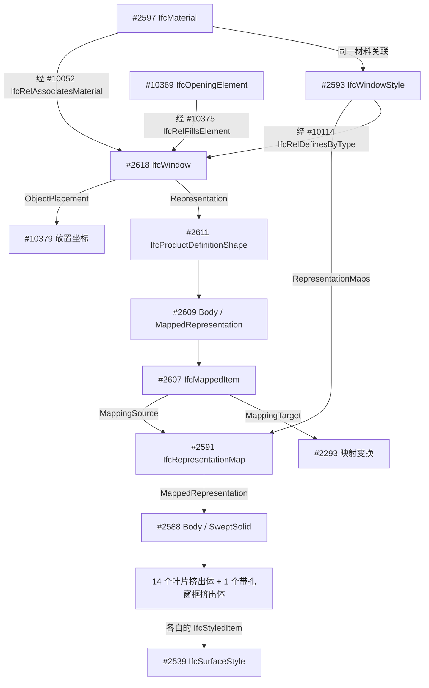

# 一扇百叶窗在 IFC 中怎样组成

记录日期：2026-09-24。本文记录当前讨论和源文件实查结果；后续扩展见[门窗部件描述计划](../architecture/component-described-door-window-plan.md)。本文中的新描述格式尚未实现。

## 已经确定的想法

> “描述成组件关系，比如说门，先描述主体，然后再说关联到了……门把手，建立一个单独的对象指引，也就是分开描述。”

> “类似于……14 个叶片挤出实体……单独来做描述……实体应该还是 IFCwindow 或 IFCdoor。”

因此，一扇门／窗仍是一个建筑构件；框、门板、百叶、把手分别描述，拥有可引用的部件编号，最终组成这个构件的几何。不会因为描述了十四片百叶，就生成十四个独立建筑构件。一个有意义的部件也可能由多个几何实体组成，例如弯折把手的底座、杆和连接头。

不为每种新窗型增加专用系统模板。现有简单模板可作为明确选择的默认建模方式；详细描述的特殊门窗走部件几何表达。IFC Type 是否建立，与是否用系统模板是两回事。没有专用 Type 不必然产生形状误差；把百叶替换成玻璃面板才会改变形状。

随后确认首版支持矩形、圆形、带孔多边形挤出及旋转、重复排列；复杂曲面／不可转换 BRep 明确报告后讨论。材料分两步，先做部件几何和逐项显示，保留已有整体材料，部件物理材料后续验证再接入。

后续补充：不支持项要真正返回 human，说明对象、部件、原因与影响，并保存回答后恢复；版本保留回退方式；第一次试验必须同时覆盖单门和单窗，再进入整栋建筑。细则见[计划 v0.2](../architecture/component-described-door-window-plan.md)。

## 源文件与证据

- 源文件：[hxp.ifc](../../dataset/external/bimnet/hxp.ifc)，IFC2X3。
- SHA-256：`31f8f5a05b1965e2ab11122559385203229f316a4ea8fe15feec31c86d80d942`。
- 示例窗：实验编号 N001，STEP 实体 `#2618`，GlobalId `1N$DqFwUP2Cfj_f4x$_L4e`。
- Name：`单扇百叶窗:高1100宽850:28872`；ObjectType：`单扇百叶窗:高1100宽850`；Tag：`28872`。
- 以下尺寸统一为 mm。STEP 的 `#2618` 等编号只在这份文件中有效，不作为新描述的稳定部件编号。

## 实际字段和引用关系

IFC 是实体与关系的图，不是“窗下面先放 Type，Type 下面再放材料”的单一目录。几何、类型、材料、外观各自通过不同引用连接。

| 内容 | 源文件怎样保存 | 含义 |
|---|---|---|
| 构件身份 | `IfcWindow` 的 GlobalId、Name、ObjectType、Tag | 这是哪一扇窗，不等于形状本身 |
| 名义尺寸 | OverallWidth=850、OverallHeight=1100 | 名义宽高；不能据此推导百叶数、把手或实际厚度 |
| 位置 | ObjectPlacement=#10379 | 窗相对于其他坐标系的放置，要沿引用链计算 |
| 实际形状 | Representation→Body→MappedItem→RepresentationMap→15 个实体 | 真正决定框和百叶在哪里、是什么形状 |
| 类型 | `IfcRelDefinesByType` 指向 #2593 `IfcWindowStyle` | IFC2X3 的窗类型对象；不是显示颜色的 Style |
| 材料 | `IfcRelAssociatesMaterial` 指向 #2597 | 材料名为“金属漆_冷灰”；名称不能证明底层合金或涂层厚度 |
| 外观 | 各实体的 StyledItem→SurfaceStyle→SurfaceStyleRendering | 颜色、透明度、高光等渲染信息 |
| 安装关系 | 窗填充 #10369 开口，开口属于 #842 墙 | 窗、洞口和宿主墙是不同对象 |
| 楼层与属性 | 独立的空间包含关系和属性集关系 | 不是仅凭几何 Z 坐标或 Type 推测 |

源窗 OwnerHistory=#41，Description 为空。类型 Name=`高1100宽850`，ConstructionType、OperationType 都是 `NOTDEFINED`，ParameterTakesPrecedence=False，Sizeable=False。`#2592 IfcWindowLiningProperties` 的几何参数为空，不能拿空参数重建框形。

实例属性含 `Pset_WindowCommon.IsExternal=True`、Reference=`高1100宽850`；`Pset_QuantityTakeOff.Reference` 同上；Manufacturer 字段为空。应区分“源文件未填写”和“已知没有”。

源窗被包含在 #132“标高 3”（标高 40 mm），宿主墙在 #126“地板标高”（标高 −1140 mm）。这是源关系不一致；当前实验采用副本中随宿主归层的策略。说明必须记录这个处理，不能称源文件本来就是同一楼层。

## RepresentationMaps 不是勾选后自动生成形状

`RepresentationMaps` 是类型上的可选引用列表。每个 `IfcRepresentationMap` 保存基准坐标 `MappingOrigin` 与可复用表示 `MappedRepresentation`。实例要在自己的 Representation 中放入 `IfcMappedItem`，实际引用这个 map，并指定 `MappingTarget`，才沿该路径使用它。

因此，“两个窗关联同一个 Type”不足以证明“两个窗显示相同几何”。还需检查实例的表示到底引用了什么、采用什么变换以及放置位置。直接在实例上写几何也能构成合法表示，具体类型约束另行满足。

N001 的 #2590 MappingOrigin 和 #2293 MappingTarget 都为单位变换，比例为 1；它实际复用了 #2591 对应的十五个实体。类型 Sizeable=False 也不能解释为任意改变实例 OverallWidth 就能自动缩放几何。尺寸字段不会替编译器重画叶片。

当前 text2IFC 的 Type 关系写入明确关闭自动映射几何（`should_map_representations=False`）。计划中的“部件定义复用”也不等于首版就输出共享 RepresentationMap。

## 外观与材料分别是什么

源窗十五个实体均通过各自 StyledItem 连接同一个 #2539 IfcSurfaceStyle。其 #2538 IfcSurfaceStyleRendering 保存 RGB≈(0.24706, 0.27843, 0.30196)，对应约 (63,71,77)，Transparency=0，SpecularColour=0.5，SpecularExponent=64，ReflectanceMethod=NOTDEFINED。

物理材料则由 #10052 关联 #2597“金属漆_冷灰”，该关系同时包含窗实例、类型及其他对象。这里没有提供每个叶片的不同材料，也没有证明框体是铝、钢或某种合金。

给一个实体涂灰色，不等于赋予钢材；列出“木材、钢材”两种材料，也不等于明确门板是木、把手是钢。后者需要真正的部件材料归属，不能从排列顺序猜测。

## 这扇窗可以怎样逐个部件描述

以下是根据源几何写出的**拟议公开描述**，不是当前系统已支持的输入合同。它足以表达本例的主要形状与空间位置；不宣称保留所有 STEP 行号、历史记录或字节级数值表示。

> **窗 N001**：一扇单扇百叶窗，名义宽 850、高 1100。窗仍作为一个 IfcWindow。局部 X 沿宽度，Y 沿深度，Z 向上。局部原点在世界坐标 (6196, 3439.305336082839, −285)；局部 X 指向世界 (0,−1,0)，Y 指向 (1,0,0)，Z 指向 (0,0,1)。它填充源 #10369 开口，宿主墙为 #842“基本墙:墙240:7073”。
>
> **N001/frame，窗框**：在局部 XZ 平面定义外矩形 X=0…850、Z=0…1100；内孔 X=40…810、Z=40…1060。沿局部 +Y 挤出 240，范围 Y=0…240。这样得到框边宽 40、有贯穿内孔的窗框。
>
> **N001/slat-01 至 N001/slat-14，百叶片**：十四片同规格叶片，每片由居中的 60×20 矩形截面沿 +X 挤出 770。截面中心起点为 (40,120,zₖ)，其中 zₖ=90+k×920/13，k=0…13；因此叶片横跨 X=40…810。截面 60 边的单位方向为 (0,−1/√2,+1/√2)，20 边的方向为 (0,−1/√2,−1/√2)。这同时说明倾斜方向、厚度、间距和第一片位置，不只写“倾斜 45 度”。
>
> **材料与显示**：窗整体关联源材料“金属漆_冷灰”；十五个几何项采用上述冷灰色、不透明显示。源没有更具体的物理材料归属，不补写。类型信息记为 IFC2X3 IfcWindowStyle“高1100宽850”，其分类参数为 NOTDEFINED；本例形状以部件描述为准。

源叶片为 #2380、#2390……#2510，窗框为 #2536。叶片排列规则与源解析结果的最大数值残差约 `1.38×10⁻¹¹ mm`；这是对源数据规律的验证，**尚不是新编译器的往返验证**。

“挤出”就是把一个二维截面沿指定方向拉伸给定距离。矩形拉伸得到长方体；带内孔的矩形轮廓拉伸得到空心框；圆形拉伸得到圆柱。并非所有门把手或曲面都能用一次挤出表示。

重复部件可以先写一个定义，再列数量与位置规则，避免十四次重复长段落。编译前须展开成十四个可区分实例；之后单独修改 slat-07，不应改变其他叶片。任意重复公式不是首版目标，可先限制为固定数量与等距平移。

## 问答结论和当前能力

| 问题 | 本次结论 |
|---|---|
| 多个实体之后还叫 IfcWindow 吗？ | 是。本方案一个 IfcWindow 的 Body 包含多个几何项；它们不是十四扇窗。 |
| IFC 限定只有几种窗外形吗？ | 分类枚举不穷尽形状。几何表示可承载更多外形，但本项目编译器只实现其中一部分。 |
| 缺少专用 Type 为什么重建不了百叶？ | 关键障碍是当前语义合同和编译路径没有接收这些叶片几何；Type 名称不会生成叶片。 |
| “单玻璃窗，850×1100，框宽 40”已能表达百叶吗？ | 不能。现有单玻璃模板与“窗框加十四片板”的部件描述是两条不同路径。后一条尚待实施。 |
| 默认模板还能用吗？ | 可以保留，须明确走默认或模板建模。详细部件不能被默认模板静默覆盖。 |
| Type 可以 optional 吗？ | 应允许不请求专用共享类型；IFC2X3 导出所需的最低合法类型结构由编译器按实际规则处理，不能把 optional 理解为绕过标准约束。 |
| 为什么复杂门窗难？ | 源可能有嵌套映射、任意截面、孔、旋转、多个实体乃至 BRep。宽高和包围盒不能恢复这些细节，当前模板也没有对应自由度。 |
| 文本会不会长很多？ | 会增加部件和关系信息，但可用定义＋引用＋规则压缩重复内容。是否更容易重建、增加多少 token，须在实现后测量。 |

当前 `basic_filling/1.0` 有 `window-single`、`window-double-vertical`、`door-left`、`door-right` 四种模板。它们内部确实创建多个实体，但实体由固定模板计算，并不表示已支持上述任意部件描述。当前材料清单也不提供每个部件的材料映射。

本轮进一步查看其他来源 IFC 后，确认 N001 只是其中一种保存方式：House 的窗是面模型，TallBuilding 有一扇门由 39 个 BRep 组成，GNI IFC4 门窗使用多边形面集。**一个几何项不一定等于一个语义部件，BRep 也不必然比挤出更不准确。** 源表示、参数化编辑能力和重建精度需要分别判断。[数据与标准调查](../reports/ifc-representation-survey-2026-09-24/README.md)记录了具体文件和实体例子。

## BRep、网格与工程师的描述

BRep 是 boundary representation（边界表示），描述包围实体的面、面边界及连接关系，并非只有顶点集合。立方体也是 BRep 可表达的对象：六个面就能围成它。我们在 hxp 看到的 IfcFacetedBrep 属于平面多边形面形式；更一般的 BRep 还可含曲面，并不必然是密集三角网格。[IfcFacetedBrep](https://standards.buildingsmart.org/IFC/RELEASE/IFC4_3/HTML/lexical/IfcFacetedBrep.htm)、[IfcAdvancedBrep](https://standards.buildingsmart.org/IFC/RELEASE/IFC4_3/HTML/lexical/IfcAdvancedBrep.htm)

GLB／glTF 常用顶点属性和索引表达供渲染的网格。它与平面 BRep 都可能出现大量点和面，但“面很多”无法证明 IFC 是 GLB 转换得到的。此次调查只查到导出应用与实际表示，没有建立 GLB 转换来源证据。[Khronos 网格说明](https://github.com/KhronosGroup/glTF-Tutorials/blob/main/gltfTutorial/gltfTutorial_009_Meshes.md)

工程师可以先画截面、标尺寸，再挤出、扫掠、切孔、阵列并装配。软件负责计算最后的面和连接关系。比如“850×1100 的框，框边 40，深 240”，比逐面描述窗框更便于设计和修改；但从导出的 BRep 反推原参数，是另一个未必容易的问题。[Autodesk 构造工具](https://help.autodesk.com/cloudhelp/2023/ENU/Revit-Customize/files/GUID-478961FB-DD57-445E-831F-5B83E02F0B78.htm)

本轮确认：**人能清楚说明的参数化构造优先**，不推进任意逐面生成。简单 BRep 可经受验证的转换路径恢复参数；无法可靠恢复、或构造超出当前编译能力的，反馈具体不支持项并进入人工交互。不是见到 BRep 一律拒绝，也不是一句形状名称就足够精确重建。

## 标准依据

- [IFC2X3 IfcWindow](https://standards.buildingsmart.org/IFC/RELEASE/IFC2x3/TC1/HTML/ifcsharedbldgelements/lexical/ifcwindow.htm)：实例、几何与安装关系。
- [IFC2X3 IfcWindowStyle](https://standards.buildingsmart.org/IFC/RELEASE/IFC2x3/TC1/HTML/ifcsharedbldgelements/lexical/ifcwindowstyle.htm)：类型参数、共享表示和缩放约束。
- [IfcRepresentationMap](https://standards.buildingsmart.org/IFC/RELEASE/IFC4_3/HTML/lexical/IfcRepresentationMap.htm)、[IfcMappedItem](https://standards.buildingsmart.org/IFC/RELEASE/IFC4_3/HTML/lexical/IfcMappedItem.htm)：共享表示与实例映射；此处概念参考 IFC4.3，实际编译以仓库 IFC2X3 声明为准。
