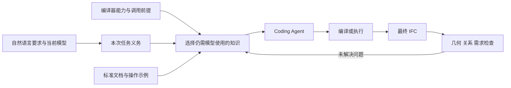

# text2IFC：研究主线与实验草案

> **历史材料，2026-09-16已整合。** 当前方向与实验统一见[研究方案](research-plan.md)，文献统一见[简版](literature-review-short.md)和[完整版](literature-review-full.md)。下文保留调查时的结论与编号，不再作为当前优先级。

> 状态更新（2026-09-15）：本文保留前轮“编译器分工与知识供给”假设。用户随后要求扩大方法创新调研，优先当前模型但不限于知识库；当前方向与优先级见 [方法创新候选](novelty-directions.md)，配套见 [逐项实验](novelty-experiments.md) 与 [扩展论文矩阵](novelty-literature-addendum.md)。下文的“优先级更高/建议主线”仅表示当时讨论位置，不再代表已选定方向。

日期：2026-09-15。目标：**现有 Generation 为主，少量补强，先争取 WWW / AI Demo，保留方法论文空间。**

证据入口：[论文矩阵](paper-matrix.md)。这是全文核查后的研究草案，不是已经验证的创新声明；本轮没有运行新实验。相较此前讨论，本稿优先级更高：不再把 JSON、Agent loop、RAG、编译验证分别当作三项创新。

**建议的一条主线：研究如何根据编译器承担的建模工作，为 Coding Agent 提供完成当前空间任务所需的知识，在有限预算内生成满足要求的 IFC。**

简单说：让模型决定设计，让可靠工具执行能确定执行的规则；上下文保留模型仍需要判断的内容，并用最终 IFC 检验这份分工是否有效。真正待研究的是“怎么分、怎么选、缺了会怎样”，不是流程图里的模块数量。

## 1. Motivation

### 1.1 我们要解决的实际问题

用户说“在二层外墙增加三扇等距窗，宽度为 1.2 米”。一个可执行的脚本或者合法 JSON，只证明我们得到了能处理的表示。任务还涉及对象数量、楼层与宿主选择、相对位置、尺寸，以及适用建模约定下的洞口和填充关系。最终还要能打开、显示和检查。

这些要求分属不同来源：

| 信息 | 谁能提供 | 为什么不能混在一起 |
|---|---|---|
| 用户的设计意图 | 请求、澄清和允许的设计自由度 | 标准不能推导用户未给出的窗宽或房间功能 |
| IFC 标准知识 | 指定版本的权威 schema / 文档 | 类型合法不等于符合当前任务 |
| 当前模型事实 | 实际 IFC / 生成中的状态 | 不能从示例或隐藏参考模型猜出对象身份 |
| 接口的执行保证 | 编译器、工具实现及其测试 | 只在前提满足和支持范围内有效 |
| 示例与经验 | 检索库、已核实操作示例 | 示例中的数值和对象不能当成本次事实 |

项目已有 [IFC 知识来源约定](../../reference/ifc2x3-knowledge-sources.md)。IFC 是领域数据模式与模型实例体系；本项目 BIM JSON 是建模中间表示。二者都不应被笼统称作“独立编程语言知识库”。更准确的说法是：**IFC 建模是一个拥有结构化领域知识、可执行接口和空间约束的 Coding Agent 任务。**

### 1.2 与传统 Coding 的区别应怎样说

共同点很多：普通程序也有跨模块依赖、隐含规格、类型、测试、回归和局部修改。不能把这些说成 IFC 独有。

IFC 场景的研究价值在于：**同一份结果同时具有几何、对象语义与关系结构，而且任务允许多个合理空间答案。** 仅比较代码文本或单一目标模型很容易误判。对象看起来相同，关系可能不同；文件结构合法，布局仍可能违背要求。这为研究“知识供给—执行接口—产物正确性”的关系提供了明确、可观测的环境。

Python + IfcOpenShell 可以生成 IFC，通用 Coding Agent 也可以生成我们的 BIM JSON。因此论文不应问“LLM 能不能写 IFC”，而应问：**拥有相同工具和知识来源时，专门组织知识是否仍然有价值？**

对未来 Coding 的意义也限于这个可检验问题：接口已经可靠承担一部分工作后，Agent 还需要看到多少实现知识，哪些依赖不能省？仅在 IFC 上成功，尚不能声称改进了通用软件工程。

### 1.3 文献真正留下了什么问题

下面都是已读正文支持的约束，不以“别人做得不严谨”为新颖性前提。

| 已有工作 | 已经做到的事 | 对本研究的影响 |
|---|---|---|
| [Text2BIM](literature-evidence/bim-authoring.md#a03)、[Text2MBL](literature-evidence/coding-knowledge-and-control.md#d01)、[栈桥建模](literature-evidence/bim-authoring.md#a05) | 高层操作、工程知识、关系抽象或执行反馈；部分已有知识消融 | 不能只证明“加入知识比不加入好” |
| [MCP4IFC](literature-evidence/coding-knowledge-and-control.md#d02)、[IFC-Agent](literature-evidence/ifc-evaluation.md#b08)、[Cobbie](literature-evidence/ifc-evaluation.md#b12) | IFC 工具、schema 探索、文档检索、缓存或经验工具 | “IFC 专用 Agent＋按需 RAG”不够；强模型可能不需要额外增强 |
| [ATLAS](literature-evidence/coding-knowledge-and-control.md#d04)、[Event-B Agent](literature-evidence/structured-generation.md#c12) | 编译/约束承担结构正确性，验证剩余义务，按失败选修复知识 | 编译器和 Agent 分工已有近邻，必须比较具体知识选择与成本 |
| [RepoGraph](literature-evidence/coding-knowledge-and-control.md#d11)、[Repoformer](literature-evidence/coding-knowledge-and-control.md#d10)、[LongLLMLingua](literature-evidence/coding-knowledge-and-control.md#d14) | 依赖图、选择性检索、任务相关压缩 | 子图、预算和压缩本身不是新算法 |
| [MANSION](literature-evidence/structured-generation.md#c06) | 关系组、确定性空间求解、保持既成拓扑 | “空间关系交给 solver”也不能单独称首创 |

还有两项关键缺口：[Model Slicing](literature-evidence/structured-generation.md#c09) 与 [Dual-Layer IFC Encoding](literature-evidence/ifc-evaluation.md#b10) 尚未取得完整方法和实验。它们与上下文选择/压缩直接相邻；**缺少全文不会增加我们的新颖性。**

因此，当前尚可测试的窄问题是：**必要上下文是否取决于具体编译接口的能力，而不仅取决于请求与文档的相似度？显式利用这种依赖，能否提高同预算下最终模型的成功率？** 现有核查没有证明它已被解决，也没有证明本项目已解决。

### 1.4 成本动机来自真实记录，但目前只有个例

现有光庭成功 run `ce8116ce095acdcf` 的 Brief、Generator、Audit 三次调用合计 317,533 token；其中 Audit 输入为 110,763。来源和计算见 [现有成本记录](coding-agent-knowledge-direction.md)。这是一个 run，不包含此前失败尝试，不能当平均成本或压缩收益。

它提示应研究完整过程：知识上下文、重复状态、生成表示和审核输入都可能产生成本。减少最终 JSON 长度未必减少总成本；省去信息后增加重试，也可能更贵。

## 2. Novelty

### 2.1 方法候选：随编译能力调整知识供给

先把本次任务需要成立的条件列清，称为“任务义务”。这里只是易理解的名称，不暗示形式化定理已成立。例如：数量为三、宽度正确、宿主明确、满足所选接口需要的关系前提。

对每项义务，区分三种情况：

1. **工具可保证的结果：** 在调用前提成立时，编译器确定性完成。上下文保留接口用法和前提，可不反复注入内部实现细节。
2. **Agent 必须决定的内容：** 对象、数值、空间关系、设计选择等。提供相应知识及相关状态，不能因为 token 紧张而省略。
3. **仍未知的事实：** 用户需求不明确、模型信息不存在或工具不支持。澄清、说明设计假设或报告不支持；不能把未知转成知识库里的默认答案。

随后按义务选择知识，成组保留完成操作所需的依赖，再压缩重复说明和无关示例。验证反馈只补充尚未解决的问题所需信息。每次更新都保留“为什么选择这些知识”的简短记录，便于实验分析。

这是拟补强的机制图，不能解释为每个方框都已接入当前产品。

一个小例子：假设某个窗操作已经可靠创建洞口与相关关系，模型仍须提供正确宿主、尺寸和位置，但不一定需要完整的底层关系构造代码。如果换成低层 IfcOpenShell 接口，这些细节又可能成为必要上下文。**“哪些知识可以省”应跟随接口能力变化。** 这个例子中的自动关系保证需逐条核实，不能凭示意图认定当前编译器已提供。

首版可用明确的操作规则和依赖表实现：输入任务义务、工具契约与知识项，输出有依赖覆盖的上下文。先做确定性策略，不必立即训练选择器。若必要信息超预算，分阶段补充或说明无法在预算内完成；不能静默删除条件后宣布成功。

这里有两条严格边界：

- 检查器可以确认“已登记依赖有没有遗漏”，但不能证明自然语言意图已被完整理解，也不能证明知识登记表本身完备。
- 集合覆盖、图闭包、工具卡和需求列表都是已有技术。潜在贡献在于具体的契约建模、选择策略与可重复的效果，不是把这些组合换一个名字。

### 2.2 三项贡献怎样围绕一条主线写

先把实现状态分开：

| 内容 | 当前证据与状态 |
|---|---|
| 需求处理、BIM JSON、IFC 编译与检查 | 有现有实现及案例基础；具体任务范围以能力登记和代码为准，不能据一个案例外推 |
| 关键词选择类别、schema 和示例 | [context_selection.py](../../../src/text2ifc_agent/context_selection.py) 已实现；门窗已有部分关系扩展，不是本轮新增机制 |
| 按编译器保证划分义务、依赖覆盖下选知识 | 本稿提出的补强，尚未实现成通用选择策略；需核实 [compiler.py](../../../src/text2ifc_compiler/compiler.py) 的真实保证与前提 |
| 固定预算、强 Coding Agent 的成对实验 | 本稿给出方案，尚无新测量；现有验收检查不能替代它 |

以下是可继续发展的三项贡献槽位，**只有第一项是当前重点方法候选**；不是预先宣布三个新算法。

| 贡献 | 目前可写的基本版本 | 投稿前还需要什么 |
|---|---|---|
| **知识选择机制** | 我们研究一种依据建模接口的执行保证和任务关系依赖来选择上下文的方法 | 明确算法；与同编译器的普通检索、结构切片和通用压缩比较；排除收益只来自去重 |
| **交互生成系统** | 我们构建从自然语言要求到可检查 IFC 的交互流程，使用户能查看生成结果及未满足要求 | 确认真实端到端可操作；演示正常、纠错、澄清/不支持；不能把尚未接入的 Repair 算进去 |
| **研究证据与任务集** | 我们用强 Coding Agent 和独立产物检查，分析接口、知识与预算如何影响生成结果 | 建筑家族隔离、明确分母、冻结评估器、完整成本；实验发现有了以后才能写具体增益 |

可以用于草稿的一段话：

> text2IFC 面向自然语言驱动的 IFC 建模。系统利用可执行的建模接口，并根据当前任务和接口能力选择领域知识。我们重点研究：减少重复上下文时，如何保留模型仍需要判断的空间条件与关系依赖。通过相同工具条件下的 Coding Agent 对照，评价最终模型是否满足要求，以及完成任务所需的总成本。

暂定 Demo 标题：*text2IFC: Interactive IFC Generation with Task-Guided Domain Knowledge*。

暂定后续方法问题：*How Much Domain Knowledge Does a Coding Agent Need When the Compiler Already Knows the Rules?* 这是研究问题式工作标题，不是已成立结论。

### 2.3 哪些说法现在不能用

| 不采用的说法 | 原因 / 合理改法 |
|---|---|
| 首次把自然语言转成 BIM/IFC | 已有大量直接工作；说清支持的任务和差异 |
| Agent loop 是核心创新 | CodeAct、RepairAgent、Text2BIM、Self-Verification 已有；比较具体控制策略 |
| JSON 天然更省 token、更可靠 | Python 的循环/函数可能更简洁；可靠性主要取决于接口和验证 |
| 我们的知识库更大，所以效果更好 | 更多上下文也可能干扰；用相同来源、相同预算测试 |
| 完整语义无损、最小充分上下文、形式化保证 | 目前没有相应证明；只说对登记依赖的覆盖和观察到的结果 |
| 工程实现更 solid，所以比 Text2MBL 更有创新 | 系统完整度与任务、方法、实验贡献不同；需要可比较证据 |
| 没有发现同样系统，因此方法新颖 | 多篇关键近邻全文仍有缺口；即使组合不同也不自动构成方法创新 |

当前判断：**有合理的 Demo 研究方向；方法新颖性还不能定案。** 如果同编译器强 Agent 已经达到相同结果，论文应诚实聚焦接口与交互系统价值。如果知识选择的增益仅来自删掉重复 schema，那是优化结果，尚不足以支撑独立方法论文。

### 2.4 Repair 与 WWW 应怎样接入故事

Generation 与 Repair 可以共享知识、检查和对象表示，但任务不同：前者构造新模型，后者还需保护已有模型中不应变化的内容。当前先研究 Generation 内部候选修订；独立 Repair 可以作为 Demo 的另一个入口，接入和评价完成后再写成统一系统。

若未来合并为方法论文，较好的共同问题是“满足新要求，同时保全仍有效的约束”，而不是“系统同时有两个功能”。需要分别冻结生成任务与修复任务，再证明共享机制确有增益；修复前的私有原始真值不得进入 Agent。

WWW 需要真实的 Web 关联：可交互访问、结构化建筑信息的消费/检查和结果共享应形成用户价值。仅把桌面生成器放进网页不足以解释选题契合。作为参考，[WWW 2026 Demo 官方要求](https://www2026.thewebconf.org/calls/demos.html)强调已实现、已测试、可现场交互，并与 Web 研究主题相关；这里引用既往要求，不代表下一届征稿已确定。AI Demo 可更聚焦领域 Agent 的可观察行为。当前不以增加 Web 功能为由扩大产品开发范围。

## 3. Evaluation and Experiments

### 3.1 每个实验回答一个问题

| 问题 | 最关键对照 | 主要指标 | 什么结果会削弱候选主张 |
|---|---|---|---|
| RQ1：专门接口有没有价值？ | 同一 Coding Agent：Python/IfcOpenShell vs 本项目 JSON/编译器 | 最终任务成功、各类失败、成本 | 相同支持范围下无收益，或只因一侧工具/文档不足 |
| RQ2：知识选择有没有独立价值？ | **同一 Agent、同一编译器，仅替换知识策略** | 成功率—预算曲线、全部尝试总成本 | 普通检索或机械去重已取得全部收益 |
| RQ3：收益是否来自正确保留依赖？ | 保留/移除关系依赖、使用/不使用编译器契约的消融 | 关系失败、知识覆盖、对象保全 | 覆盖变化与最终效果无关联；额外 token 就能解释全部差值 |
| RQ4：完整系统能否实际交互使用？ | 完整 text2IFC vs 同工具的固定生成—验证流程 | 完成率、澄清、时间、重试和用户操作 | 自由循环没有帮助，或 Demo 依赖预写答案/隐藏人工修正 |

### 3.2 必须设置的 Coding Baseline

| 编号 | 允许的能力 | 实验用途 |
|---|---|---|
| B1 | 通用 Coding Agent＋Python/IfcOpenShell＋官方文档检索＋执行与公开检查反馈 | 真实通用建模对照；允许函数、循环及调试 |
| B2 | 同一 Coding Agent＋本项目 BIM JSON/编译器＋同一知识来源和检查接口 | **排除编译器本身造成的混淆** |
| B3 | B2 仅替换为候选知识策略 | 测机制的独立增量 |
| B4 | 完整 text2IFC 的 Brief、生成、审核与适用修订 | 测系统使用价值及全部成本 |
| B5 | 与 B2/B3 同工具的固定生成—验证流程 | 检查 Agent 自主选择是否值得其成本 |

直接生成 STEP 可作补充压力测试，不能作为唯一 baseline。B1 与 B2 的接口内置知识不同，差值归于接口条件，不能归为模型推理能力提升。全系统对照和机制消融分开报告，不画成一个能自动归因的梯形排行榜。

同编译器的知识策略至少包括：

- 完整可用上下文；若超窗口，另列“不可容纳”，同时提供合理的按需浏览方案，不能任意截断造弱对照。
- 当前关键词选择；另加**机械去重版本**，隔离现有冗余。
- BM25/向量 top-k 检索；共享知识来源和预算。
- 按操作类型/依赖邻域提供的结构切片，作为结构先验对照。
- 通用文本压缩（可选 LLMLingua/LongLLMLingua 的可运行版本）。
- 候选策略，以及去掉“编译器分工”或“依赖覆盖”的消融。

不必把所有策略同时跑全任务。先用开发集筛查，再为正式比较冻结少量有解释力的设置；不能在测试集选最佳策略后把同一测试集当未见证据。若改写别人方法为 IFC 版本，应标为“受该方法启发的适配对照”，不冒称原论文复现。

### 3.3 任务集：保留可比较的空间问题

| 任务层 | 例子 | 检查重点 |
|---|---|---|
| 构件与关系 | 墙—洞口—窗，指定宿主、尺寸和相对位置 | 对象、类型、关系端点、尺寸及可见几何 |
| 组合与重复 | 多窗等距、多层复用、房间与楼层组合 | 数量、复用语义、跨构件/跨层关系 |
| 建筑级生成 | 在支持范围内的多房间/多楼层请求 | 需求覆盖、空间包含、几何一致和可导入性 |
| 生成过程内修订 | 修改一项条件，保留已满足条件 | 新要求成功、旧要求退化、未受影响内容 |
| 边界输入 | 信息不足、矛盾要求、不支持构件 | 澄清或明确失败；不凭空补事实 |

先冻结所有方法共同支持的核心任务。扩展能力另报覆盖率，不能只删掉本系统做不出的任务再宣传普遍优势。模糊题需预先规定允许的设计自由或澄清协议；可判定失败不等同产品坏结果。

[外部数据登记](../../../dataset/external/GENERATION_DATASETS.md)仍是可用目录入口。BIM-Edit/BIBIMBAP 适合原子与编辑切片，不能直接当整栋生成集；Text2MBL 适合共同支持的模块布局；已有 external IFC 可以提供合法几何和场景模板，但不是现成的自然语言—生成金标准。自动生成的描述应人工检查遗漏，不能默认与模型可逆。

同一建筑的变体、同一模板的数值替换、同一修改的三种表述应分到同一组。训练/示例库、开发集与测试集按建筑/模板家族隔离；重复运行不增加独立建筑数。

### 3.4 最终评分必须读 IFC

不要用本系统生成的 Brief 当唯一评分标准，否则漏掉的用户要求可能同时从生成与评测消失。公开执行检查可以给 Agent 反馈；最终评价需求和测试应独立冻结，并在所有方法上使用同一版。

建议分别报告：

1. **可处理性：** 能否解析、重新打开，以及适用的 schema 检查。
2. **几何：** 必需构件是否可生成几何，尺寸、位置、碰撞/间距等任务条件是否满足。
3. **关系和语义：** 类型、宿主、洞口/填充、空间包含、属性等适用条件。
4. **需求满足：** 所有必需任务条件同时成立的比例；允许多个合理布局，不能把目标 IFC 逐字相等当正确性。
5. **修订保全：** 目标变更完成，同时原本应保留的几何、关系和属性没有退化。
6. **边界行为：** 该澄清、拒绝或报告失败时是否处理正确；单列，不能用大量拒绝提高正常生成成功率。

每项规则都要说明适用范围；不能把可选 IFC 关系一概变成全局必需项。检查数不是任务数。现有 545 项检查或 111 个 mesh 不能当 545/111 个独立成功样本。

结构化缺陷可用独立程序检查；难以自动评价的空间意图由盲于方法的人审，报告一致性和分歧。生成器与评估器不能共用一套错误实现后自证正确。Reference IFC、私有 Gold、损伤配方只进入评测，不进入生成上下文。

### 3.5 成本、公平性与统计

同时保留两条评价线：**从同一自然语言出发的端到端比较**，以及**从同一冻结任务说明出发的机制控制实验**。后一条若提供了更明确的条件，要标注其辅助条件，不能替代前者。

每个任务计入全部生成、检索选择、审核、失败和修订调用；输入、输出、缓存、reasoning 的计数语义分别写清，避免重复相加。还需记录压缩/检索计算、墙钟时间及固定价格表下的费用，不能用 token 直接替代美元。

预算应在实验前规定，至少比较几个可承担的预算点；记录因预算不足终止的任务。避免只在成功子集上计算平均成本。可报告全任务平均成本，以及“全部尝试总成本 / 成功任务数”；若零成功，后者记为不可定义，不省略失败。

控制模型版本、推理档位、上下文上限、知识源、工具和公开反馈；检索器/选择器额外用的 LLM 也计费。接口实验允许内部知识差异，但应明示；知识机制实验固定编译器和控制器。

正式结果按任务家族报告，给出成对差值和不确定性；例如按建筑/模板组进行 bootstrap。预算允许时对同一任务重复，以估计运行波动；不能把这些重复当完全独立样本。小规模实验不显著或区间宽就如实报告，不预先承诺某个 N 一定足够。

### 3.6 下一步执行顺序与停止条件

| 顺序 | 最小必要工作 | 决策 |
|---|---|---|
| 1. 诊断 | 从已有日志区分知识缺口、需求遗漏、表示冗长、编译缺陷和审核开销；逐条登记少量真实接口保证 | 若主要是确定性缺陷，先修缺陷，不能称知识方法提升 |
| 2. 强基线小试 | 可先准备约 12 个开发任务，比较 B1、B2 和现有系统 | 确认专门系统在哪些任务上仍有可解释增量 |
| 3. 单机制原型 | 同编译器下比较去重、top-k、结构切片与候选策略 | 普通去重已足够则降为系统优化；无收益保留负结果 |
| 4. 冻结正式比较 | 根据小试方差与预算选择规模；36–60 个任务可作为资源估算起点，不能当统计保证 | 按家族隔离、统一评分、全部失败入分母 |
| 5. Demo | 少量代表任务可现场更改参数并重跑，显示模型及未满足条件；测实际交互延迟 | 现场演示与离线评测分开；录制回放明确标识 |

若第一轮发现“强 Agent＋编译器”已经足够，优先完成有价值的 Demo，不硬造一个新 Agent。如果候选机制在不同家族/预算上持续有效，再扩展到更多操作、第二种接口或独立 Repair，争取方法论文。

真实 Provider 实验须遵守 [Agent 能力评测协议](../../validation/agent-capability-evaluation.md) 和当前阶段准入。本文只完成研究设计，没有因此自动取得实验准入，也没有触发 Full Preflight 或改变已接受的证据。
