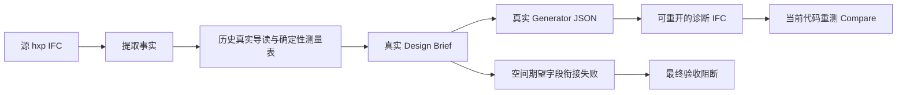

# IFC2Text 当前能力与往返失败证据复核

日期：2026-09-22。复核代码基线 `a8386690`，分支 `codex/bim2text-research`。本轮新增诊断脚本和独立实验输出，未修改生产实现、Prompt、Schema 或源 IFC，未调用 Provider。

## 1. 结论

IFC2Text 已有可运行的事实提取、分层说明、公共 text2IFC 桥接和比较管线。历史上三栋建筑完成了真实写作，hxp 完成了真实 Brief、Generator、编译和诊断比较，但整栋仍未通过最终验收。后续单墙通过不等于整栋通过。

目前同时存在描述端的信息遗漏、正向字段衔接缺陷、正向表示能力限制，以及比较器尚未统一接入的问题。因此不能把全部问题归给 IFC2Text，也不能全部归给 Generator 或 IFC 编译器。

本次已用当前代码重新测量历史真实源/重建 IFC，重放整栋编译阻塞，并完成空间字段投影和门框深度的单因素离线实验。这里的“完整证据链”指能追溯历史真实输入、响应、中间表示、诊断 IFC 和本次独立测量；**没有声称本轮重新调用模型生成了新的完整建筑**。

## 2. 已实现与尚欠缺

| 部分 | 当前代码已有 | 尚欠缺 |
|---|---|---|
| IFC 事实提取 | 楼层、墙、门窗、开口、空间、楼梯；扩展楼板、覆盖层、材料和空间投影 | 任意复杂几何、完整构件范围和稳定的细节表示尚未证明 |
| 空间推导 | 直墙轴线延长并 polygonize，输出用途未知的围合候选 | 仅整层没有 IfcSpace 时运行；部分空间缺失、多高度剖切、通行关系和复杂空间推导未完成 |
| 设计说明 | 整体—楼层—空间—构件—材料；真实 LLM 短导读与确定性测量表组合 | 主要仍是工程数据说明，尚非完整的建筑师式空间叙述 |
| 特殊墙 | v07/v08 能提取并显式描述竖直拉伸多边形，包含闭合点 | 主要在专项脚本接入，普通 compact 入口没有自动使用这些增强 |
| 正向桥接 | 仅把描述传入公共 Design Brief 和 Generation 路径 | 整栋忠实重建及最终验收未完成 |
| Compare | 几何、缺失/多余、关系和材料诊断；新增全局匹配与墙体 0.1 mm 检查 | 普通 campaign 仍调用旧 roundtrip_compare；诊断版本尚未统一；部分几何仍未评估 |
| 自进化 | 版本化提示、预算、重试和实验记录 | 未实现“误差→更新策略→在其他建筑验证”的学习循环 |

主要代码入口：

- [facts.py](../../src/text2ifc_ifc2text/facts.py:342)：围合候选推导；第 528 行附近决定是否启用。
- [observation.py](../../src/text2ifc_ifc2text/observation.py:119)：扩展建筑观测。
- [compact_pipeline.py](../../src/text2ifc_ifc2text/compact_pipeline.py:18)：普通准备与写作流程。
- [text2ifc_public.py](../../src/text2ifc_ifc2text/text2ifc_public.py:13)：文本到正向系统的公共桥。
- [compact_campaign.py](../../scripts/ifc2text/compact_campaign.py:147)：仍使用旧比较入口。
- [diagnostic_review.py](../../src/text2ifc_ifc2text/diagnostic_review.py:19)、[wall_compare_v09.py](../../src/text2ifc_ifc2text/wall_compare_v09.py)：专项诊断比较。

## 3. 本次核实的证据链



主证据：[chain-audit-v02.json](../../dataset/processed/experiments/ifc2text-evidence-audit-20260922/chain-audit-v02.json)。其中登记源文件、事实、文本、原始 Brief/Generator 响应、候选、IFC、Audit 和终态的路径与 SHA-256。

本次核实：

- 事实文件记录的源 SHA-256 与当前源 IFC 一致。
- 8255 字符的历史说明与 Brief 的 `original_request` 完全一致。
- 原始 Generator 响应中的 JSON 与 `parsed-output.json` 一致；parsed output、Generator candidate 和最终编译 candidate 也一致。
- 原 IFC 和历史证据在复核前后字节不变。
- 历史终态为 `blocked_after_compile`、`diagnostic_not_accepted`，没有 Final Acceptance。历史 `feedback round 0 already exists` 异常仍原样保留；不能因其后来已有代码修复，改写旧运行终态。

源模型：[hxp.ifc](../../dataset/external/bimnet/hxp.ifc)。历史输入：[设计说明](../../dataset/processed/experiments/ifc2text-phase1-20260917/compact-campaign-v06/hxp/design-description.md)。历史输出：[诊断 IFC](../../dataset/processed/experiments/ifc2text-phase1-20260917/compact-campaign-v06/hxp/reconstruction-128k/runs/de4932f1dad7a868/output.ifc)。

本次重新比较得到：66 匹配、0 缺失、0 多余、12 几何超差、5 材料内容差异、3 关系差异；另有 41 材料元数据差异和 34 条墙本征尺寸未评估。内容与元数据分开统计；34 条未评估均来自测量方法改变，不代表 34 面墙已通过。该表重现历史诊断口径，不能作为新的 0.1 mm 墙体验收结论。

## 4. 问题定位与实验

### 4.1 空间已经写进 Brief，验收端却读不到

五个空间在 Brief 和 Expected Facts 中都有 `polygon`、`z_mm`。但 [semantic_coverage.py](../../src/text2ifc_agent/semantic_coverage.py:78) 读取 `bounds` 和 `height_mm`，高度缺失时退到楼层 `net_height_mm`，没有完成这组字段的转换。

只在独立 Expected Facts 副本中，将既有 polygon 转为 XY 范围、既有 z_mm 转为高度，不增加源 IFC 的隐藏事实：可构造空间期望 **0→5**，未解决项 **8→3**。仍剩三条楼层净高问题。

结论：这是正向期望构建的字段衔接缺陷。修复还需处理房间标高、非矩形轮廓和真实楼层需求，不能简单把房间高度复制为所有楼层净高。该反事实只证明包围范围可以构造，不证明精确空间形状和用途已通过。

### 4.2 特殊墙先在描述端丢失截面

W011、W013、W015 源为多边形截面，旧说明只保留轴线、厚度等信息，重建成为矩形。关闭洞口扣除后，主要范围差仍为约 **77.73、109.23、81.52 mm**，排除了“全是扣洞错误”的解释。

当前 v08 描述增强已能补充这类轮廓。本次直接从原 hxp 重新提取并生成 [9760 字符的确定性说明](../../dataset/processed/experiments/ifc2text-evidence-audit-20260922/current-description/description-v08-deterministic.md)，含 11 面墙的显式轮廓，源文件不变。它没有经过本轮 LLM，也没有送入正向重建。

缺口：增强还需要接入一般入口，并在完整建筑文本中验证。不能用专项 W013 单墙成功代表全部墙已修复。

### 4.3 正确多边形放回整栋，被两个正向合同拒绝

本次用旧整栋真实 JSON 和后来真实生成的 W013 多边形，重放既有离线组合实验。仅换 W013 的 Representation，保留原对象放置和关系。原整栋 JSON 可编译，组合后的图稳定出现：

| 拒绝 | 实际原因 |
|---|---|
| W013：`MATERIAL_LAYER_THICKNESS_MISMATCH` | [materials.py](../../src/text2ifc_contract/materials.py:46) 只对矩形读取 profile.y；polygon 得到 None，也被报告为层厚不匹配。本例不能据此认定真实层厚错误。 |
| N003：`BASIC_FILLING_CONSTRAINT_CONFLICT` | [basic_filling.py](../../src/text2ifc_contract/basic_filling.py:113) 明确只支持矩形宿主与开口，且不允许 Representation.position。 |

这是正向合同兼容性缺口，不是新一次 LLM 失败，也不能靠增大误差容差解决。输入坐标换算已核对，但由于没有生成集成 IFC，扣洞后的实体和非目标构件保全仍未通过。

[本次集成报告](../../dataset/processed/experiments/ifc2text-evidence-audit-20260922/wall-context/summary.json)。该专项实验沿用此前归属整理副本作参考；主链比较仍用原 hxp。两种参考不混算，不把整理源文件视为算法改善。

### 4.4 D001 的 40 mm 深度损失定位到模板参数

本次补充的单因素实验：源门的 Y 范围为 [-960,-860] mm，文本与 Brief 均保留了这个 100 mm 实体深度。Generator 选择 basic_filling，未填写参数；[resolve_basic_filling](../../src/text2ifc_contract/basic_filling.py:68) 使用默认 `frame_depth=60`，实际编译范围成为 [-940,-880] mm。

仅在独立生成图副本中，将 D001 的 `parameters.frame_depth` 设为 Brief 已有的 100 mm，其他图内容不变，再调用原编译器：编译及重开成功，Y 范围恢复至 [-960,-860]，三轴包围盒坐标最大差 **0.044 mm**，与公开文本坐标舍入相符。

结论：这个实例的实体深度在文本和 Brief 阶段没有丢失，损失发生于 Generator 的模板参数表达；编译器按默认参数执行。100 mm 是本例从已有事实计算的诊断值，不应硬编码为所有门的默认值。外包范围恢复也不证明门扇细节和源映射几何相同。其余门窗及开口差异仍需逐例核对，不能全部归为同一原因。

[反事实 IFC](../../dataset/processed/experiments/ifc2text-evidence-audit-20260922/chain-audit-v02-door-counterfactual.ifc)仅供诊断，**不是新的真实生成成功或正式修复产物**。

### 4.5 材料列表与窗归属仍是独立问题

- 五扇门的材料名存在于说明，但 BIM JSON 2.3 不支持非分层 material_list。仅改 Prompt 不能补足该表示能力。
- 三扇窗的源登记层为 S02、宿主墙登记层为 S01，Brief 改按宿主层归属。源登记、宿主和几何放置需要分开处理；原任务的保真目标和后来明确整理源副本的目标不能混淆。
- 普通 campaign 仍使用旧比较器，可能把归属差异误报为缺失/多余；新版全局诊断与 0.1 mm 墙比较尚未统一到一般流程。

## 5. 验证与复现

本次聚焦测试 **25 passed**：wall_context_v09、attribution_probe_v01、diagnostic_review、offline_public_bridge。无跳过；有 pytest cache 写权限警告，测试 XML 已保存。未运行 Full Preflight，也没有新增 Provider 调用或重置历史账本。

从仓库根运行；复现时将以下根目录统一换成一个尚不存在的新目录，历史文件不覆盖：

```powershell
.\.venv\Scripts\python.exe scripts/ifc2text/attribute_roundtrip_v01.py --out dataset/processed/experiments/ifc2text-evidence-audit-20260922/attribution
.\.venv\Scripts\python.exe scripts/ifc2text/check_wall_context_v09.py --out dataset/processed/experiments/ifc2text-evidence-audit-20260922/wall-context
.\.venv\Scripts\python.exe scripts/ifc2text/audit_evidence_chain_v01.py --evidence-root dataset/processed/experiments/ifc2text-evidence-audit-20260922 --report-name chain-audit-v02.json --require-clean
```

最后一条本次实际退出 **1**：`roundtrip_clean=false`、`spaces_before_after=[0,5]`、`integrated_compiles=false`、`inputs_unchanged=true`。这是刻意保留的失败判据，表示当前模型链没有达到一致，不能把脚本成功执行误写成模型通过。

## 6. 下一步建议

先统一一般入口的描述与比较版本，避免专项修复无法用于下一栋建筑；随后优先修空间期望字段衔接，再分别处理门窗模板的已知尺寸传递和多边形墙与材料、开口的兼容。非分层材料列表需要明确的新版本合同支持。

这些局部缺陷在离线证据已足够明确时，应先修复和回归，再做一次完整建筑真实复验。此前重建调用次数已到授权上限 14/14；本轮不因剩余 token 额度自行增加次数。新的真实整栋试验需确认适用准入与调用预算，而不是继续为已知确定性失败付费。

完成同一建筑的真实整栋复验后，再在另一栋独立建筑上检验；空间理解增强和自进化都应建立在这条可解释基线之上。
