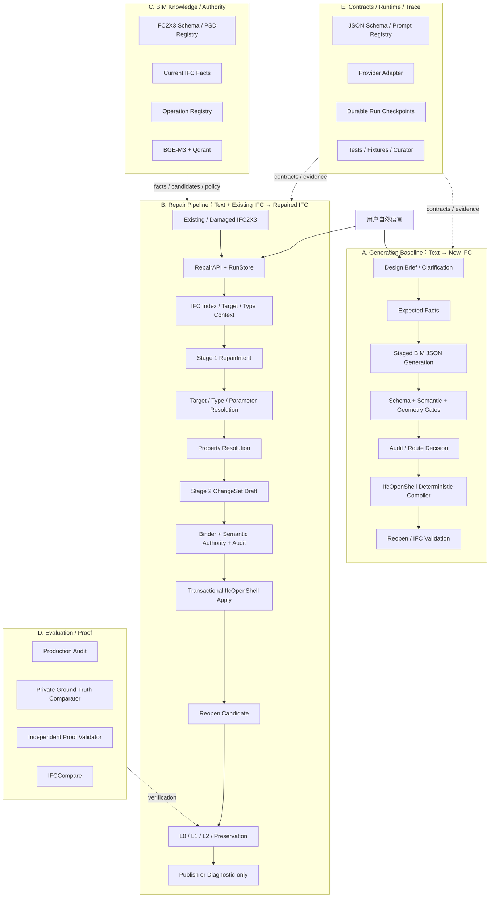
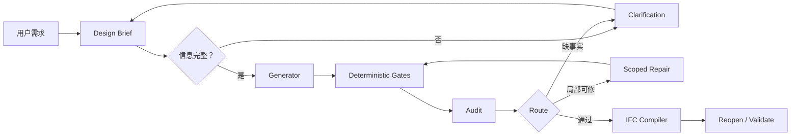
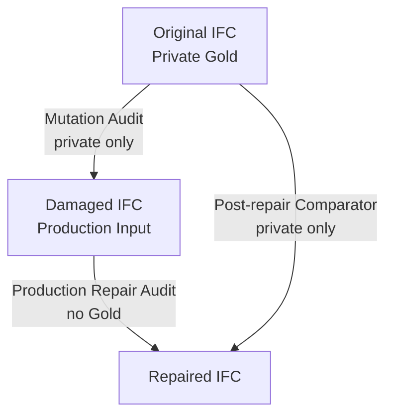
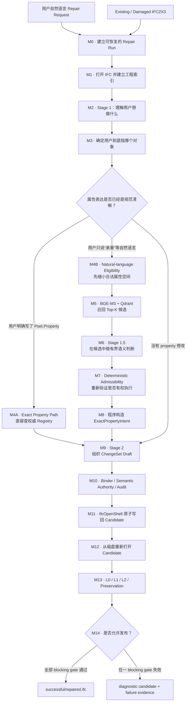
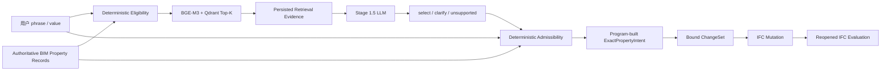
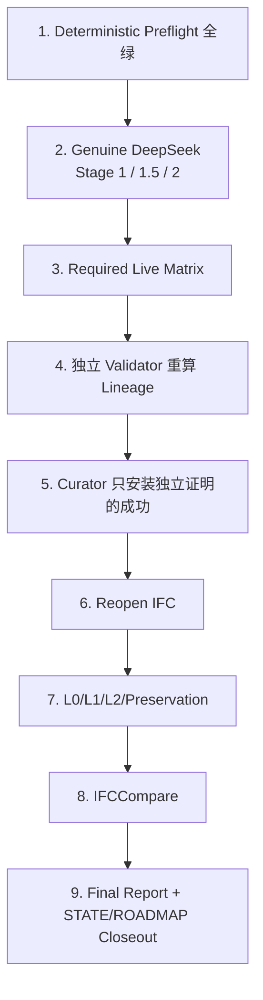
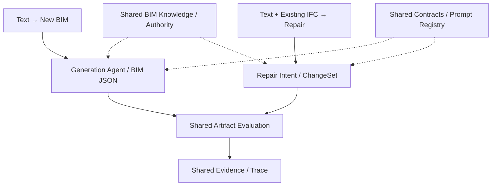
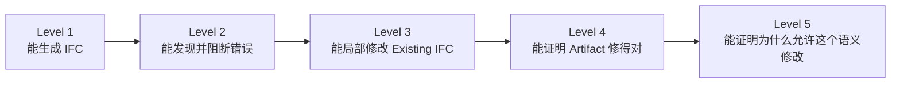
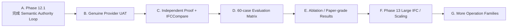
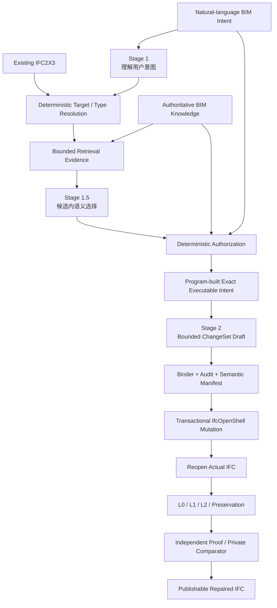

# Text2IFC Pipeline：系统架构、开发演进与后续路线

> **文档目的**：解释 Text2IFC 从早期 Text-to-IFC 生成系统，逐步发展到当前 IFC Repair + Semantic Authority Loop 的完整技术路线。  
> **适用场景**：项目交接、阶段汇报、研究讨论、论文方法梳理、后续开发规划。  
> **状态日期**：2026-08-27  
> **主要仓库分支**：`codex/workflow-dataset-links`  
> **说明**：本文以仓库当前 Context Pack、Repair Roadmap、Door 审计、Phase 12.1 Plan/Validation 等材料为主要依据。  
> 其中 2026-08-23 的仓库快照与后续 2026-08-27 对话更新分开标注，避免把“已实现”“已验证”“正在收口”混为一谈。

---

## 1. 项目当前应该如何理解

Text2IFC 最初要解决的是：

> **自然语言能不能稳定地变成结构化 BIM，并最终生成可打开、可验证的 IFC。**

经过前期开发，项目已经形成两条相关但独立的主线：

1. **Generation Baseline**  
   将自然语言建筑需求整理为 Design Brief / Expected Facts，生成 BIM JSON，再由确定性代码编译 IFC2X3。

2. **IFC ChangeSet Repair Pipeline**  
   输入已有或 damaged IFC2X3 与自然语言修改要求，在不读取 private Gold 的前提下解析目标、形成受约束 ChangeSet、写回 IFC，并通过重新打开与 L0/L1/L2 评估后决定是否发布。

当前研究重点已经进一步发生变化。

早期问题：

```text
Text
  ↓
BIM JSON
  ↓
IFC
```

Repair 初期问题：

```text
Text + damaged IFC
  ↓
RepairIntent
  ↓
ChangeSet
  ↓
repaired IFC
```

当前更核心的问题：

```text
用户自然语言
  ↓
BIM authoritative knowledge
  ↓
retrieval evidence
  ↓
bounded semantic decision
  ↓
deterministic authorization
  ↓
transactional IFC mutation
  ↓
artifact-level evaluation
  ↓
independent Proof
```

因此，Text2IFC 当前真正要证明的已经不只是：

> “LLM 能不能生成或修改 IFC？”

而是：

> **LLM 做出的每一个会改变 BIM artifact 的语义决定，是否有合法、可追踪、可复核的证据来源；程序是否只在证据充分时授权执行；最终 IFC 是否能独立证明修改确实正确。**

这构成当前项目最重要的 **Semantic Authority Loop**。

---

# 2. Text2IFC 总体架构

当前项目可以理解为两个 Product Flow 加上三个横向支撑层。



### 2.1 Generation 和 Repair 的关系

两条链路共享同一个基本思想：

> **LLM 负责语义候选，确定性代码负责结构、执行和放行。**

但二者处理的问题不同。

| 维度 | Generation | Repair |
|---|---|---|
| 输入 | 自然语言建筑需求 | Existing / damaged IFC + 修改需求 |
| 中间表示 | BIM JSON 2.0 | RepairIntent + Bound ChangeSet |
| LLM 主要任务 | Design / generation / audit | intent / semantic selection / draft |
| 确定性代码 | Schema / Gate / IFC compiler | target / authority / apply / evaluation |
| IFC 行为 | 从零创建 | 局部、受约束修改 |
| 主要风险 | 缺实体、关系、几何、信息不足 | 找错目标、越权修改、语义漂移、破坏 non-target |
| 当前研究重心 | 已形成 baseline | 当前主要研究方向 |

---

# 3. 开发历程：项目是如何走到现在的

## 3.1 第一阶段：先解决“Text 能不能变成结构化 BIM”

### Phase 1：BIM JSON Contract

最早的工作不是直接让 LLM 输出 IFC，而是先定义：

> 什么样的结构化输出才是 Text2IFC 可以接受的 BIM 表示？

因此建立了：

- BIM JSON 1.0；
- JSON Schema；
- 严格 validator；
- 非法结构拒绝机制。

这一阶段解决的是：

```text
Natural Language
      ↓
什么样的 JSON 才算“合法 BIM 表达”？
```

---

## 3.2 第二阶段：解决“结构化 BIM 能不能可靠变成 IFC”

### Phase 2：BIM JSON → IFC2X3

核心工作：

- 使用 IfcOpenShell 创建 IFC；
- 生成 Project / Site / Building / Storey；
- 生成基础墙、门窗等构件；
- 写出 IFC 后重新打开；
- 把低层 STEP / placement / owner history 等实现交给 deterministic compiler。

核心原则从这里确定：

> **LLM 不直接生成 STEP。**

---

## 3.3 第三阶段：解决“BIM JSON 与真实 IFC 的表达差距”

### Phase 2.5：BIM JSON 2.0

这一阶段开始显式考虑：

- `ifc_class`；
- semantic relations；
- Draft；
- capability；
- loss accounting；
- IFC2X3 schema；
- 信息是否能被当前中间表示完整表达。

因此项目从：

```text
Text → 一个可编译 JSON
```

发展为：

```text
Text
→ 受约束的 BIM semantic representation
→ 编译
→ loss / unsupported 明确记录
```

---

## 3.4 第四阶段：建立数据、Baseline 和生成质量评估

### Phase 3–4

主要内容：

- IFC → BIM JSON extraction；
- Text / JSON pair；
- scene-family split；
- structured-output baseline；
- generated IFC correctness gates；
- topology / relation / property / geometry fidelity；
- roundtrip / report / metrics。

这一阶段的重要变化是：

> **“IFC 能打开”开始不再等于“生成正确”。**

---

## 3.5 第五阶段：从单次 Prompt 变成 Agent Workflow

### Phase 5–6

加入：

- Design Brief Agent；
- 中文多轮 Clarification；
- Generator；
- Repair；
- Audit；
- deterministic Gate；
- route decision；
- report / trace；
- fake/file/live Provider；
- session DB；
- interactive CLI。

核心工作流逐步演化为：



这一时期已经开始形成 closed-loop 思想，但主要对象还是 **新 IFC generation**。

---

# 4. Repair Pipeline 的建立：从 Window Proof-of-Concept 开始

## 4.1 为什么单独建立 Repair Pipeline

Generation 解决的是：

> 从自然语言生成一个新模型。

但实际 BIM 使用中还有另一类很重要的问题：

> 已经有 IFC，只需要修复或修改其中一部分。

因此 Repair Pipeline 被单独建立，并且刻意避免：

```text
Existing IFC
→ 转成完整 JSON
→ LLM 重写整栋建筑
→ 再重新生成 IFC
```

因为这种做法：

- 修改范围过大；
- 容易破坏 non-target；
- 很难证明哪些内容是必要修改；
- 很难形成严格 benchmark。

Repair 因此采用 **local semantic ChangeSet**。

---

## 4.2 Phase 7–10.1：Window Vertical Slice

到 2026-07-23，Repair 已经完成以下基础：

| Phase | 主要内容 |
|---|---|
| Phase 7 | IFC Index、TargetQuery、目标定位 |
| Phase 8 | L1/L2 Evaluation、Gold 隔离、fail-closed publication |
| Phase 9 | RepairAPI、CLI、RunStore、Clarification、统一 ChangeSet |
| Phase 09.1 | occurrence / Type 分离、Prototype / Type evidence |
| Phase 10 | Window Semantic Manifest、Bound ChangeSet、transactional apply |
| Phase 10.1 | 精确标量属性、Type reuse、自定义属性确认 |

这一阶段形成了 Repair 的第一条完整 vertical slice：

```text
existing IFC
+ repair text
    ↓
RepairIntent
    ↓
Target / Type
    ↓
Semantic Manifest
    ↓
ChangeSet
    ↓
IfcOpenShell apply
    ↓
reopen
    ↓
L1 / L2
    ↓
publish
```

Window 阶段的意义并不只是“支持 IfcWindow”。

它真正建立了后续 Repair Pipeline 的骨架。

---

# 5. 2026-07-29 Door 审计：项目评价体系的一次关键转折

Door 阶段曾经出现过一个重要问题：

> 系统生成了 repaired IFC，也恢复了对象和部分关系，因此初步被判断为成功。

但三方比较：

```text
01-original.ifc
02-damaged.ifc
03-repaired.ifc
```

发现实际存在：

- Door 几何错位；
- Door Storey containment 错误；
- occurrence-level Pset / Qto / material semantics 不完整；
- IFC relationship 存在，但几何上 Door 并没有正确安装到 Opening 中。

这次失败让项目明确认识到：

> **“文件生成成功”“对象数量恢复”“关系存在”都不足以证明修复成功。**

于是 Repair evaluation 被重新明确为：

```text
L0 — File / schema integrity
L1 — Geometry + relationship correctness
L2 — BIM semantic fidelity
L3 — Authoring exactness
```

其中：

```text
publishable =
L0 pass
AND L1 pass
AND L2 pass
AND no blocking finding
```

而 GlobalId、STEP ID、Name、Tag、OwnerHistory、serialization 等差异属于 L3，不应该掩盖真实的 L1/L2 失败。

---

# 6. Ground Truth Isolation：Repair Benchmark 的核心原则

Door / Window benchmark 进一步建立了三种完全不同的比较。



## 6.1 Mutation Audit：original → damaged

目的：

- 证明 benchmark 到底破坏了什么；
- 记录 private mutation truth。

**禁止进入 production repair path。**

---

## 6.2 Production Repair Audit：damaged → repaired

目的：

- 检查系统实际改了什么；
- 是否越过 operation scope；
- 是否破坏 non-target；
- candidate 是否可 reopen；
- production L1/L2 是否通过。

这一过程：

> **不允许读取 original IFC。**

---

## 6.3 Private Comparator：original → repaired

只允许在修复完成以后进行。

用途：

- 测 restoration quality；
- 检查几何；
- semantic correspondence；
- authoring difference。

核心原则：

> private Gold 是 evaluator 的 authority，不是 repair agent 的 authority。

---

# 7. Phase 11–12：从 Window 扩展为通用 Repair Framework

Door 修复问题经过重新审计和修正后，Phase 11 最终完成 Door / Opening closure。

随后 Phase 12 引入：

- `add_beam`
- `add_column`

并继续使用公共：

- RepairAPI；
- target/type resolution；
- operation registry；
- semantic manifest；
- Bound ChangeSet；
- transactional apply；
- reopen；
- L0/L1/L2。

这一步的研究意义是：

> **证明 Repair Pipeline 不是 Window/Door 专用脚本，而是在向 operation-plugin based framework 演化。**

截至 2026-08-23 仓库快照，当前 Operation Registry 已包含：

```text
add_window_with_opening_to_wall
add_opening_to_wall
add_door_with_opening_to_wall
fill_existing_opening_with_door
add_beam
add_column
set_occurrence_properties
```

`set_occurrence_properties` 支持已有：

- IfcWindow；
- IfcDoor；
- IfcWall；
- IfcWallStandardCase；
- IfcBeam；
- IfcColumn。

当前没有 `add_wall`，Wall 在 Phase 12.1 中仅支持 property editing。

---

# 8. 当前 Repair Pipeline：不要把它理解成 15 个孤立模块

前面的开发历程回答了“系统为什么会演化成今天这样”。从这一节开始，需要换一个阅读方式：

> **不要把 M0–M14 当成一串类名或服务名，而要把它们理解成一条逐步收紧自由度、逐步增加证据的执行链。**

在 Repair Pipeline 中，越靠前的阶段越接近自然语言，信息更模糊；越靠后的阶段越接近真实 IFC，信息必须更精确。LLM 的自由度也随之下降：

```text
自然语言阶段
自由度高、语义模糊
        ↓
候选与解析阶段
自由度被候选集和 IFC 上下文约束
        ↓
授权阶段
只允许确定性、可复核的 executable fact
        ↓
IFC 写回阶段
不再做语义猜测，只执行已授权 ChangeSet
        ↓
评价阶段
不相信“执行成功”声明，只检查磁盘上的真实 IFC
```

为了让第一次接触 Text2IFC 的读者能够真正看懂，后面统一使用两个贯穿案例。

### 贯穿案例 A：自然语言属性修改

用户输入：

```text
“把二层东侧这根梁设置为承重。”
```

对人来说这句话很简单，但程序真正要执行时至少要回答：

1. “二层东侧这根梁”到底是哪一个 `IfcBeam`？
2. “承重”对应 IFC2X3 的哪个 Property？
3. 值应该是什么 IFC 类型？
4. Property 应写在 occurrence 还是 Type？
5. 当前候选是否真的适用于 `IfcBeam`？
6. LLM 是否只是“觉得像”，还是有权让这个 Property 被写入 IFC？
7. 最终保存后的 IFC 中是否真的出现了正确事实？

### 贯穿案例 B：Door 修复

用户输入类似：

```text
“把二层这个门洞缺失的门补回来。”
```

这个例子用来解释几何、Storey、Opening/Wall relationship 与 L1/L2 evaluation。2026-07-29 的 Door 审计已经证明：即使对象数量恢复、Type 正确、`IfcRelFillsElement` 也存在，Door 仍然可能放错楼层或在几何上没有真正落入 Opening，因此不能只靠“关系存在”判断成功。

下面的 M0–M14 就围绕这两个例子展开。

---

## 8.1 一张图先看懂整条 Repair 链



这里最容易误解的是两点：

1. **Stage 1、Stage 1.5、Stage 2 不是三个“让 LLM 想三遍”的步骤。**  
   三个阶段拥有完全不同的权限：Stage 1 负责理解请求；Stage 1.5 只在受限候选中做语义选择；Stage 2 只组织已经解析完成的 ChangeSet Draft。

2. **M5 的向量检索和 M6 的 LLM 选择都不是最终 authority。**  
   真正能进入 IFC 的精确事实必须经过 M7，并由 M8 的程序重新构造。

这条“先理解、再找证据、再判断、再授权、再执行、最后独立验证”的链，正是当前 Text2IFC Repair 与普通 RAG Agent 最大的区别。

---


## 8.2 概念简介

后文会反复使用几个 IFC / Agent 术语。这里不展开标准定义，只说明它们在本项目中的实际含义。

| 术语 | 在本文中的含义 |
|---|---|
| **Occurrence** | IFC 中一个真实出现的构件实例，例如“二层东侧这一根梁”或“这个具体的 Door”。 |
| **Type / Prototype** | 多个 occurrence 可能共享的类型定义，例如同一种门型或梁型。修改 Type 可能同时影响多个 occurrence，因此必须和单个实例修改区分。 |
| **Pset.Property** | IFC Property Set 与具体属性的 canonical 标识，例如 `Pset_xxx.SomeProperty`。 |
| **Canonical** | 已经精确落到系统认可的标准/项目字段，不再只是“承重”“外窗”这种自然语言表达。 |
| **Authoritative record** | 当前系统允许作为 BIM 事实来源的记录，例如 IFC2X3 PSD/Registry 或当前项目中的确定性事实。 |
| **Candidate** | 检索后提供给 Stage 1.5 的有限候选。Candidate 是“可能答案”，不是“已授权答案”。 |
| **Evidence** | 能说明一个决定为什么发生的可持久化证据，例如 query、Top-K、Prompt、raw response、admissibility result。 |
| **Provenance** | 一个最终事实来自哪里，例如来自用户原话、哪个 authoritative record、哪个候选以及哪次确认。 |
| **Fail closed** | 当证据不足、运行时不可用或合同不满足时停止执行，而不是用默认值、alias 或 fallback 猜一个结果继续。 |
| **Publishable** | 不只是“生成出了 candidate”，而是 candidate 重新打开并通过规定的 L0/L1/L2 与 preservation gate 后，才允许进入 successful artifact。 |

读完整条链以后，可以再回来看这些词。它们实际上对应 Text2IFC 的一组核心责任边界：**实例是谁、事实从哪里来、谁只负责提出候选、谁有权授权执行，以及怎样证明最终 IFC 真正满足了这些事实。**


# 9. M0：RepairAPI / RunStore —— 先把一次修改变成“可追踪的事务” 暂存的一个事务

如果只看代码名，`RepairAPI` 很容易被理解成一个普通接口。但在当前系统中，它更重要的作用是：

> **把一次自然语言修改请求变成一个有身份、有版本、有状态、有证据、可以暂停和恢复的 Repair Run。**

这一步看似和 BIM 语义关系不大，却决定了后面所有证据能否连起来。

## 9.1 为什么不能收到一句话就直接开始改 IFC

假设用户说：

```text
“把二层东侧这根梁设置为承重。”
```

如果程序只是：

```python
repair(ifc_path, text)
```

然后中间出现歧义：

```text
二层东侧有两根梁，到底是哪一根？
```

系统就需要暂停，向用户提问，然后以后继续。

如果没有 RunStore，就会出现几个问题：

- 下一次用户回答无法证明对应哪一次请求；
- 上一次检索到的候选可能已经丢失；
- 用户可能回答的是旧问题，但系统把它应用到新候选；
- Stage 1.5 重试后候选集发生变化，却继续沿用旧选择；
- 最终 Proof 无法说明这份 IFC 来自哪一组 Prompt、候选和确认。

所以 M0 首先创建一个 durable run，并保存源 IFC 指纹、用户请求与状态转移。

概念上：

```text
Run R-001
├── source IFC fingerprint
├── original public request
├── current state
├── Stage 1 artifacts
├── clarification generation
├── property candidate set
├── Stage 1.5 decision
├── admissibility result
├── Stage 2 draft
├── Bound ChangeSet
├── application evidence
└── evaluation / terminal result
```

这不是为了“日志更完整”，而是为了后面能够证明：

> 最终写进 IFC 的事实，确实来自这一轮用户请求和这一轮候选，而不是某个旧缓存、旧 alias 或另一轮对话。

## 9.2 Source IFC 为什么必须保持 不可变的

Repair Pipeline 不在源文件上直接修改。

正确关系是：

```text
source.ifc
   │
   ├── 只读、记录 fingerprint
   │
   ↓
staging / candidate copy
   │
   ↓
apply ChangeSet
   │
   ↓
repaired candidate
```

原因有三层：

第一，失败时必须可以回滚。  
第二，后续 preservation evaluation 需要比较“修改前”和“修改后”。  
第三，benchmark 中需要明确证明 production path 并没有偷偷改变或读取 private Gold。

因此 M0 的基本边界可以概括为：

```text
source IFC = immutable production input
candidate IFC = temporary mutable artifact
successful IFC = candidate 通过 release gate 后的 promotion
```

## 9.3 Clarification 为什么也属于 Run 的一部分

如果 M3 或 M6 发现歧义，系统不是重新开启一次全新生成，而是暂停同一个 Run。

例如：

```text
系统：
二层东侧找到两根候选梁：
A. Beam-201
B. Beam-204
请选择目标。

用户：
B
```

这个回答不能只是字符串 `"B"`。

它必须和至少这些信息绑定：

```text
run_id
operation_id
clarification_id
state_version / generation
offered candidates
```

这样系统才能拒绝“过期回答”。

例如，如果后来索引更新，候选从 A/B 变成 C/D，那么旧的 `"B"` 不能再被静默应用。

## 9.4 M0 的输出是什么

M0 不输出“修复结果”。

它输出的是一个可以安全继续执行的 **Run Context**：

```text
validated source reference
+ source fingerprint
+ public user request
+ durable run identity
+ current state
```

之后 M1–M14 的所有 artifact 都必须挂在这个 Run 上。

---

# 10. M1：IFC Validation + Index —— 把一个复杂 IFC 变成 Agent 能安全使用的工程上下文

LLM 不能直接可靠地操作一个大型 IFC 文件，也没有必要把整份 STEP 文本放进 Prompt。

因此 Repair Pipeline 的第一项真正 BIM 工作，是由确定性代码打开 IFC，并建立索引。

## 10.1 为什么需要索引，而不是直接问 LLM

一个 IFC 中同样可能存在：

```text
IfcBeam #102
IfcBeam #148
IfcBeam #201
IfcBeam #204
...
```

用户不会说：

```text
把 GlobalId=3Fh... 的 IfcBeam 改成...
```

用户通常说：

```text
“二层东侧这根梁”
“客厅北侧的窗”
“这个门洞”
```

这需要把自然语言描述和 IFC 中的真实实体连接起来。

索引就是这个桥。

当前索引会提取并组织诸如：

- IFC class；
- GlobalId；
- Name / Tag；
- occurrence 与 Type；
- Building Storey；
- Space / containment；
- host / opening / fill 关系；
- 位置、方向与几何摘要；
- Pset / Qto；
- material；
- classification。

这些不是给 LLM“自由浏览”的原始信息，而是之后 deterministic resolver 可以查询的工程事实。

## 10.2 用贯穿案例理解索引

用户说：

```text
“把二层东侧这根梁设置为承重。”
```

索引可能让程序得到：

```text
{
  "target_resolution": {
    "query": {
      "ifc_class": "IfcBeam",
      "storey": "Level 2",
      "spatial_hint": "east"
    },
    "initial_candidates": 2,
    "eligible_candidates": 1,
    "selected": {
      "global_id": "2QfM6q7xD8HfR1aBc9K001",
      "ifc_class": "IfcBeam",
      "name": "B-2F-07",
      "type_name": "RC Beam 300x600",
      "storey_name": "Level 2",
      "centroid_world_mm": [18450.0, 6250.0, 4500.0]
    },
    "resolution": "unique",
    "evidence": [
      "ifc_class == IfcBeam",
      "storey == Level 2",
      "east_zone == true"
    ]
  }
}
```

那么“二层 + 东侧 + 梁”就可以转换为确定性的过滤条件，而不是交给 LLM凭印象猜一个 GUID。

Door 案例同样如此。

要恢复一扇已经删除但 Opening 仍保留的 Door，索引必须能回答：

```text
这个 Opening 属于哪个 host wall？
host wall 属于哪个 Storey？
Opening 的 world placement 是什么？
当前是否已有 Door 填充它？
有哪些可授权的 Door Type / prototype？
```

这些事实决定后面的几何与 relationship 是否能正确恢复。

## 10.3 M1 还承担输入合法性 Gate

如果源文件：

- 不能被 IfcOpenShell 打开；
- Schema 不是当前支持的 IFC2X3；
- 关键引用损坏到无法安全解析；

正确行为不是“让 LLM试试看”，而是直接：

```text
invalid_input
→ terminal failure
→ 不调用 Provider
```

因为后续所有 semantic decision 都建立在“当前 IFC 是可信可读的 production input”这个前提上。

## 10.4 M1 的输出

可以把它理解为两层：

```text
A. validated source IFC
B. queryable engineering index
```

到这一阶段为止，系统还没有决定“要改谁”，只是把真实 IFC 世界转换成后续可以严格查询的上下文。

---

# 11. M2：Stage 1 —— 只理解“用户想做什么”，不决定“最终怎么写 IFC”

Stage 1 是 Repair Pipeline 的第一个 LLM Provider 阶段。

它的设计目标不是让模型给出完整修复方案，而是把自然语言请求整理成一个 **RepairIntent**。

## 11.1 Stage 1 为什么需要 LLM

因为用户表达可能是：

```text
“把二层东边那根梁弄成承重的。”
```

也可能是：

```text
“给这个已有的洞口补一扇 900 宽的门。”
```

代码很难仅靠规则完整理解：

- operation 是新增、填充、属性修改还是其他；
- 用户描述了什么 target；
- 哪些参数是明确给出的；
- 哪些是自然语言 property phrase；
- 是否存在缺失事实；
- 请求是否超出当前 operation registry。

这里正是 LLM 擅长的部分：语言理解和结构化抽取。

## 11.2 Stage 1 实际上应该输出什么

以梁为例：

```text
用户：
“把二层东侧这根梁设置为承重。”
```

Stage 1 应该抽取出类似：

```text
operation:
  set_occurrence_properties

target query:
  ifc_class = IfcBeam
  storey = Level 2
  spatial_hint = east

property claim:
  property_phrase = “承重”
  raw_value = true
  scope = occurrence
```

这里有意保留 `"承重"` 这个自然语言 phrase。

它**不应该**擅自改成：

```text
Pset_BeamCommon.LoadBearing
IFCBOOLEAN
```

原因是后一组字段不是语言事实，而是 BIM technical authority。

## 11.3 Stage 1 明确不负责什么

Stage 1 不负责：

- 决定目标 GUID；
- 决定哪个 vector candidate 正确；
- 发明 canonical Pset.Property；
- 修改 IFC；
- 直接生成 STEP；
- 读取 private original / mutation truth；
- 因为缺信息就自己补默认值。

这条边界非常重要。

如果 Stage 1 同时做“语言理解 + IFC target 选择 + property authoring”，那么即使结果最终正确，也很难判断：

> 是模型真正依据当前 IFC 和标准做出的，还是模型记忆/猜测出来的？

## 11.4 Unsupported 也是正确输出

如果用户要求：

```text
“给所有柱子做结构受力分析并自动优化截面。”
```

而当前 Repair Registry 不支持 structural analysis，那么 Stage 1 应该暴露：

```text
unsupported
```

而不是为了满足用户强行映射到 `add_column` 或 `set_occurrence_properties`。

Fail-closed 的一个重要含义就是：

> **承认当前系统不知道/不能做，也比构造一个看似合理的 IFC 修改更正确。**

---

# 12. M3：Target / Type / Parameter Resolution —— 把“那个东西”绑定到真实 IFC 实体

Stage 1 结束后，系统已经知道用户“想做什么”，但仍然不知道这个请求是否已经具有执行资格。

M3 开始进行第一轮 deterministic authorization。

## 12.1 Target Resolution：从描述到真实 occurrence

贯穿案例：

```text
target query:
IfcBeam + Level 2 + east
```

Resolver 会在 M1 的索引中查找候选。

### 情况 A：唯一候选

```text
Beam-201 only
```

则可以授权：

```text
target_guid = Beam-201.GlobalId
```

### 情况 B：多个候选

```text
Beam-201
Beam-205
```

系统不能悄悄选 similarity 更高的一个。

应该进入 clarification：

```text
“二层东侧找到两根符合描述的梁，请确认：
A ...
B ...”
```

### 情况 C：没有候选

则需要判断：

- 用户描述是否缺信息；
- operation 是否不适用；
- 当前模型是否真的没有该对象。

不能通过编造 GUID 继续执行。

## 12.2 为什么 target resolution 必须 deterministic

LLM 可以告诉我们：

> “用户似乎在说东侧的一根梁。”

但只有代码读取当前 IFC 后才能确定：

> 当前模型里到底哪一个实体满足这些条件。

因此这里的边界是：

```text
LLM:
interpret description

CODE:
authorize actual entity
```

即：

> **Language interpretation ≠ IFC entity authorization。**

## 12.3 Type / Prototype Resolution

新增 Window、Door、Beam、Column 时还可能涉及 Type / Prototype。

系统必须区分：

```text
Occurrence
vs
Type
```

因为 IFC Type 可能被多个 occurrence 共享。

如果修改一个 Window 时直接修改共享 Type，就可能把所有同 Type 的窗一起改掉。

所以当前策略是：

- 用户明确指定/确认 Type 时才绑定；
- 相似 Type 可以作为候选，但不能自动授权；
- 没有指定 Type 时按 operation policy 使用安全的独立模板/策略；
- 读取共享 Type 可以，未经授权修改共享 Type 不可以。

## 12.4 Parameter Resolution

对于新增构件，还要检查：

```text
width
height
placement
host
opening
storey
```

例如：

```text
“在这个墙上加一扇门。”
```

如果当前 operation 要求 width，但用户没有给，系统不能因为 Schema 必填就自己填 `900 mm`。

正确行为是：

```text
missing_fact
→ clarification
→ resume same Run
```

## 12.5 M3 的结果

只有当 target / type / required parameters 达到当前 operation 的确定性要求后，operation 才会继续。

如果没有 property claim，下一步可以进入 Stage 2。

如果存在 property claim，就进入 M4。

---

# 13. M4：Property Resolution 分流 —— “LoadBearing”与“承重”不是同一类输入

这是 Phase 12.1 最容易看不懂、但也最关键的地方。

当前系统把 Property 输入分成两类。

---

## 13.1 M4A：Exact Canonical Property Path

假设用户或上游系统明确给出：

```text
Pset_BeamCommon.LoadBearing = true
```

此时不存在“承重到底对应哪个 property”的语义问题。

程序直接查询 IFC2X3 / project Registry，并验证：

1. `Pset_BeamCommon.LoadBearing` 是否存在；
2. 是否适用于 `IfcBeam`；
3. template 是否是当前支持的 scalar/single-value；
4. IFC value type 是否正确；
5. `true` 是否能被规范化为合法值；
6. unit 是否适用；
7. scope 是否允许写 occurrence。

如果这些条件都满足，就形成 exact property resolution。

这里**不使用**：

- keyword matching；
- alias；
- BGE；
- Qdrant；
- Stage 1.5。

原因很简单：

> 已经有精确 canonical identifier 时，再做语义猜测只会增加不确定性。

---

## 13.2 M4B：Natural-language Property Path

更常见的是用户只说：

```text
“承重”
“外窗”
“防火等级”
“U 值”
```

这时系统面对的是语义映射问题：

```text
natural-language phrase
→ ?
→ canonical IFC property
```

自然语言 path 被重新设计成 M4B → M5 → M6 → M7 → M8。

---

# 14. M4B + M5：Eligibility + BGE-M3/Qdrant —— 先找“可能的合法答案”，不是直接找“答案”

自然语言 property resolution 不是一上来就在所有 IFC 字段里做向量搜索。

首先要做 **eligibility filtering**。

## 14.1 为什么要在向量检索前过滤

假设 IFC property knowledge 中有几千条记录。

用户目标是：

```text
IfcBeam
scope = occurrence
value = true
```

那么明显不应该把：

- 只适用于 IfcWindow 的 property；
- quantity；
- complex/list property；
- 当前不能 author 的 template；
- unit/value type 明显不兼容的记录；

全部交给向量模型。

因此先由 deterministic code 根据当前 target 与 claim 构造 **authorable candidate universe**。

概念上：

```text
All authoritative property records
        ↓
target class filter
        ↓
template / authorability filter
        ↓
scope filter
        ↓
value / unit compatibility filter
        ↓
Eligible Records
```

然后才做 semantic retrieval。

## 14.2 Authoritative Records 从哪里来

当前 PropertyKnowledgeRuntime 的权威记录主要来自：

- IFC2X3 PSD / generated registry；
- current-project property records。

这意味着 BGE 检索的对象不是网上随便搜来的 BIM 文档，而是当前系统认可的、可追踪的 property record。

## 14.3 BGE-M3 和 Qdrant 分别做什么

简单理解：

- **BGE-M3**：把用户 phrase 与 property records 转成 embedding；
- **Qdrant**：存储/搜索这些 embedding，返回相似候选。

例如：

```text
query:
“承重”

Top-K:
1. candidate_01 ...
2. candidate_02 ...
3. candidate_03 ...
```

默认策略最多提供有限数量的候选（当前 Context Pack 记录为 Top-K 最大 5）。

这样做的目的不是“让向量模型决定答案”，而是把：

```text
几百 / 几千条 authoritative records
```

缩小成：

```text
最多几个可供进一步判断的候选
```

## 14.4 为什么 Top-1 不能直接写 IFC

这是整个 Phase 12.1 的核心原则之一：

```text
similarity score
≠ semantic truth
≠ authorization
```

原因很现实。

例如用户说“外窗”，两个候选在 embedding space 中都可能很接近：

```text
candidate A: IsExternal
candidate B: Reference / Type related term
```

Top-1 只能说明：

> 在当前 embedding 和索引里，它最相似。

不能说明：

> 它已经具有执行权。

所以 M5 的正式输出应该理解为 **Retrieval Evidence**：

```text
query
+ vector runtime health/version
+ candidate set
+ candidate order
+ candidate scores
```

而不是 ExactPropertyIntent。

---

# 15. M6：Stage 1.5 —— 让 LLM 只做它真正擅长的“候选内语义判断”

Stage 1.5 是为了填补一个很具体的缺口：

> Vector retrieval 可以召回相似 property，但相似度无法可靠处理自然语言语义、上下文和候选间细粒度差异。

因此加入一个单独的 LLM semantic decision stage。

## 15.1 Stage 1.5 看到什么

它看到的不是整个 IFC，也不是完整 operation。

核心输入是：

```text
1 个 property query
+ 已持久化的 bounded candidate set
+ decision schema
+ 必要的 validation feedback
```

例如：

```text
query:
“承重=true”

candidate_01: ...
candidate_02: ...
candidate_03: ...
```

## 15.2 它只能做三种决定

### 1. Select

```text
select(candidate_02)
```

表示：

> 在你给我的这些候选中，candidate_02 最符合用户表达。

### 2. Clarification

例如两个候选在当前信息下都合理：

```text
“你是指结构构件的 LoadBearing，还是其他语义？”
```

系统暂停 Run，向用户提问。

### 3. Unsupported

表示：

> 当前 authoritative candidate space 中没有足够证据支持安全映射。

这不是失败设计，而是正确的 fail-closed 行为。

## 15.3 为什么不能让 Stage 1.5 返回 Pset.Property

如果允许模型直接返回：

```text
Pset_BeamCommon.LoadBearing
```

那么即使这个字段根本没在 retrieval candidates 中，程序也可能被模型“带出去”。

因此当前 contract 禁止 Stage 1.5 直接提供 executable fields，包括：

- canonical Pset；
- canonical Property；
- IFC value type；
- unit；
- scope；
- authoring values。

LLM 返回的核心是：

```text
candidate_id
```

而不是：

```text
executable BIM fact
```

这就是 bounded semantic decision 的含义。

## 15.4 为什么 Stage 1.5 必须是独立 Stage

如果把它悄悄塞回 Stage 1 中：

```text
用户文本
→ Stage 1 一次性决定 operation + target + property
```

就无法单独评价：

- retrieval 是否把正确答案召回；
- LLM 在正确答案已出现时是否选对；
- unoffered selection 是否发生；
- clarification 是否合理。

拆成独立 Stage 后，后续 60-case evaluation 才能分别测：

```text
Retrieval Recall
Selection Accuracy
Authorization Error
```

而不是只有一个模糊的“最终准确率”。

---

# 16. M7：Deterministic Admissibility —— LLM 选了 candidate，也还没有执行权

这是最容易被普通 Agent 设计省略的一步。

很多 RAG 系统会在：

```text
retrieve
→ LLM selects
```

之后直接：

```text
execute
```

Text2IFC 当前不这样做。

## 16.1 为什么 LLM 选中候选后还要重新检查

假设 Stage 1.5 返回：

```text
candidate_02
```

程序必须重新读取 authoritative record，而不是直接相信 Stage 1.5 Prompt 中那份候选文本。

然后检查：

### A. Offered-set membership

```text
candidate_02 是否真的属于本次 persisted candidate set？
```

防止 unoffered selection。

### B. Record equality / authority

```text
candidate_02 对应的权威记录现在是否仍然和提供给 LLM 的一致？
```

### C. Class applicability

```text
这个 property 是否真的适用于 IfcBeam？
```

### D. Template / authorability

```text
是否为当前支持的 scalar/single-value property？
```

### E. Value compatibility

用户值：

```text
true
```

是否能合法转成该 property 的 IFC value type？

### F. Unit compatibility

如果用户说：

```text
“U 值设为 1.2 W/(m²·K)”
```

unit 是否兼容？

### G. Scope

当前请求是否允许：

```text
occurrence
```

而不是误改共享 Type？

### H. Retrieval floor / conflict

当前 evidence 是否满足 frozen policy 的最低条件，是否仍有 unresolved conflict？

只有这些 gate 全部通过，才能得到：

```text
admissible = true
```

## 16.2 这一步真正解决的研究问题

Stage 1.5 回答：

> “哪个候选语义上更像用户说的？”

M7 回答：

> **“即使它语义上最像，我们是否真的允许它成为 IFC 修改事实？”**

这两件事情必须分开。

这也是 Semantic Authority Loop 中：

```text
Decision
→ Authorization
```

的边界。

---

# 17. M8：ExactPropertyIntent —— 最终可执行事实必须由程序重新构造

通过 M7 后，系统已经知道：

```text
candidate_02 是被选中的
且它通过 deterministic admissibility
```

但最终仍然不直接把 LLM response 交给 Stage 2。

程序根据 authoritative record 和原始用户 claim 构造 **ExactPropertyIntent**。

## 17.1 ExactPropertyIntent 中不同字段来自不同 authority

概念上：

```text
canonical Pset / Property / IFC type
        ← authoritative candidate record

normalized value / unit
        ← original user claim + deterministic normalization

target GUID / scope
        ← deterministic target resolver

provenance / candidate ID / policy
        ← persisted evidence lineage
```

例如最终可以得到：

```text
target: Beam-201
property: [来自 authoritative record]
value: true
scope: occurrence
evidence:
  query: “承重”
  selected_candidate: candidate_02
  admissibility: pass
```

## 17.2 为什么一定要“程序重建”

这相当于切断了下面这条危险路径：

```text
LLM output text
→ directly serialized
→ IFC
```

替换成：

```text
LLM only chooses stable candidate ID
        ↓
CODE reopens authority
        ↓
CODE validates
        ↓
CODE constructs exact executable intent
```

因此即使 LLM response 中附带了多余描述，那些描述也不应成为 IFC authoring authority。

---

# 18. M9：Stage 2 —— 现在才开始组织真正要执行的 ChangeSet

经过前面的解析，Stage 2 得到的是已经“收紧”的 operation。

对于贯穿案例 A：

```text
目标梁已经唯一
property 已经 exact
value/scope 已经授权
```

对于 Door 案例：

```text
retained opening 已经确认
host wall 已经确认
storey/context 已经解析
Type/prototype policy 已经确认
```

此时 Stage 2 的任务是把这些已解析事实组织成一个受 Schema 限制的 **ChangeSet Draft**。

## 18.1 Stage 2 为什么还需要 LLM

有些 operation 可能包含多个相关动作。

例如新增 Window with Opening 可能需要一个更高层的语义组合：

```text
create opening
create/fill window
bind host
set dimensions
set authorized semantics
```

Stage 2 可以基于 operation-specific profile/few-shot 组织 Draft。

但它不应该重新推翻前面的 authority。

## 18.2 Stage 2 明确不能重新决定什么

不能重新决定：

- target；
- Type authority；
- property canonical mapping；
- private Gold；
- 已确定的 user value；
- 当前 operation scope。

也就是说：

> Stage 2 是“组织已授权动作”，不是“第二次自由规划整个修复”。

## 18.3 为什么 Stage 1 与 Stage 2 使用不同 Prompt 内容

Stage 1 只需要 compact operation catalog，因为它负责 routing 和 extraction。

Stage 2 才加载选中 operation 的完整 profile / few-shot。

这样做有两个好处：

1. 减少 Stage 1 上下文和错误诱导；
2. 只有已经确定的 operation 才获得对应的详细 authoring instruction。

---

# 19. M10：Binder + Semantic Authority + Audit —— 把 LLM Draft 变成真正可执行的 Bound ChangeSet

Stage 2 返回的仍然只是 Draft。

程序不会因为 JSON Schema 合法就立即写 IFC。

## 19.1 Binder 在绑定什么

Binder 会把 Draft 与当前 Run 的真实状态绑定起来，例如：

```text
source fingerprint
target GlobalId
operation ID
resolved Type
ExactPropertyIntent
Semantic Manifest
scope
version
```

这一步使 Draft 从：

```text
“修改一个 Beam”
```

变成：

```text
“在 source fingerprint X 上，
只允许对 GlobalId Y，
按 operation Z，
执行这些已经授权的事实。”
```

## 19.2 为什么需要 source fingerprint

如果 Draft 是针对旧 IFC 生成的，而 source 已经变化，就不能继续执行。

否则可能出现：

```text
Prompt 基于模型版本 A
Apply 却发生在模型版本 B
```

Binder 相当于阻断这种 stale ChangeSet。

## 19.3 Semantic Manifest 的意义

尤其在 Window / Door 等 operation 中，不只是要“创建一个实体”。

还要明确这次成功必须具备哪些 semantic facts，例如：

```text
Door
→ fills retained Opening
→ Opening voids intended Wall
→ correct Storey
→ authorized Type
→ required Pset/material/classification
```

Semantic Manifest 同时服务于：

```text
写入要求
+
L2 evaluation 要求
```

这样 applicator 和 evaluator 不会各自使用两套“什么算成功”的定义。

## 19.4 Audit 关注什么

Audit 要检查：

- Draft 是否超出 allowed operation；
- 是否引用不存在/未授权的 GUID；
- 是否尝试修改共享 Type；
- 是否违背 scope；
- 是否缺 mandatory semantic fact；
- 是否与当前 source fingerprint / Run version 冲突。

因此：

```text
valid JSON
≠ bound
≠ authorized
≠ executable
```

只有 Binder + Audit 通过后的 **Bound ChangeSet** 才进入 M11。

---

# 20. M11：Transactional IfcOpenShell Apply —— 真正修改 IFC，但这一阶段不再“思考语义”

这是第一次真正改变 BIM artifact 的阶段。

## 20.1 Applicator 的职责应该非常窄

到了 M11，所有重要语义问题理论上都应该已经解决：

- 改哪个 occurrence；
- 建哪个 Opening；
- 用哪个 Type；
- 写什么 Property；
- Storey 应是什么；
- scope 是什么。

IfcOpenShell applicator 的工作是：

> **把 Bound ChangeSet 中的已授权事实准确写进 candidate IFC。**

而不是在写入过程中再做：

```text
“如果找不到 Storey 就用第一层吧”
“如果方向不确定就默认正向吧”
```

Door 800×2480 的历史失败正说明了这种默认行为有多危险。

## 20.2 Door 案例为什么要求 opening/host context

历史 Door failure 中，一扇 800×2480 Door 虽然恢复了 fill relation，但世界坐标发生了约：

```text
X +800 mm
Y +160 mm
```

这正好对应 Door width 和 wall thickness。

根本问题不是“少了一个关系”，而是 placement orientation 改变后没有做正确的坐标补偿。

因此现在 Door repair 的正确思想是：

```text
retained Opening
   ↓
host Wall
   ↓
opening / host coordinate frame
   ↓
Door placement
```

而不是：

```text
Door dimensions
→ 猜一个 local placement
```

同样，Door Storey 应由 host/opening context 决定，而不是 generic first-storey fallback。

## 20.3 为什么 ChangeSet 必须原子执行

假设一次用户请求包含三项 operation：

```text
O1 pass
O2 pass
O3 fail
```

系统不能发布：

```text
“前两个已经修好了的 IFC”
```

因为用户请求的语义单位是整次 ChangeSet。

当前原则是：

```text
all mandatory operations pass
→ candidate retained for evaluation

any mandatory operation fails
→ transaction failed
→ no successful publication
```

这样后续 Proof 才不会出现“半成功 artifact”。

---

# 21. M12：Reopen Candidate —— 不相信内存中的成功，重新读取磁盘上的 IFC

为什么已经用 IfcOpenShell 写完了，还要再打开一次？

因为真正交付给用户的是：

```text
disk artifact
```

而不是：

```text
Python memory object
```

保存/序列化过程中仍可能出现问题。

因此流程必须是：

```text
apply
→ write file
→ close
→ reopen from disk
```

只有重新打开后的模型，才进入正式 evaluator。

这一步把“执行器内部认为成功”和“最终 artifact 确实存在且可读”分开。

---

# 22. M13：Evaluation —— 从“代码执行成功”升级为“BIM artifact 真的正确”

Repair Pipeline 最重要的进步之一，就是 evaluation 不再只检查：

```text
IFC file exists
```

而是采用层级评价。

---

## 22.1 L0：文件与 Schema 完整性

L0 解决最基础的问题：

> 这个文件是不是一个真正可用的 IFC candidate？

检查包括：

- IfcOpenShell 能重新打开；
- Schema 符合当前支持范围；
- candidate 能写出并重新读回；
- source 没有被原地改；
- operation 相关引用没有明显 dangling；
- candidate fingerprint / artifact evidence 可记录。

如果 L0 都失败，根本没有必要讨论“门的位置是不是正确”。

---

## 22.2 L1：几何与 IFC Relationship 是否真的成立

L1 不是只看实体有没有创建，而是检查工程关系。

### Door 案例

需要检查：

```text
Door fills exactly one authorized Opening
Opening voids intended Wall
Door / Opening dimensions compatible
Door placement aligned with Opening
Door world transform correct
Door Storey == host Wall Storey
no duplicate fill
non-target preserved
```

历史失败说明，仅有：

```text
IfcRelFillsElement exists
```

完全不足以证明 Door 已经“安装在洞口里”。

一个 Door 可以在语义上 fill 某个 Opening，却在几何上偏出去。

因此 evaluation 必须结合：

- coordinate frame；
- world transform；
- center / axes；
- projected overlap；
- dimensions；
- relationship identity。

### Beam / Column

对于 structural member，则看：

- placement；
- axis / orientation；
- dimensions；
- Storey / containment；
- operation-specific geometry thresholds。

---

## 22.3 L2：BIM Semantic Fidelity

即使几何位置正确，一个构件仍然可能在 BIM 语义上不完整。

例如 Door/Window 历史 repair 中：

- Type 正确；
- world geometry 可能正确；
- 但 occurrence Pset 缺失；
- Qto 未恢复；
- material provenance 改变。

因此 L2 要检查：

```text
Type / Prototype
occurrence Pset
Type Pset
effective property
value type
unit
material
classification
quantity
Storey semantics
Semantic Manifest coverage
```

### Effective value 与 provenance 必须分开

假设原模型：

```text
occurrence has material A
Type also has material A
```

修复后：

```text
occurrence material lost
Type still has material A
```

那么“最终查到的 material”可能还是 A。

但 provenance 已经从：

```text
occurrence + Type
```

变成：

```text
Type only
```

这两者不能简单说“完全一致”。

是否 blocking 取决于当前 Semantic Manifest / policy。

---

## 22.4 L3：Authoring Exactness

L3 记录：

- GlobalId；
- STEP id；
- Name / ObjectType / Tag；
- OwnerHistory；
- representation encoding；
- serialization order。

这些信息有价值，但通常不应该因为新生成了 GlobalId 就让一个几何和语义完全正确的修复失败。

所以：

```text
L3 differences
≠ automatic L1/L2 failure
```

同时也不能反过来：

```text
L3 看起来很像
≠ 可以掩盖 L1/L2 failure
```

---

# 23. M14：Publication Gate —— “有 candidate”不等于“有 successful repaired IFC”

最终发布条件应该是一个明确的布尔决策，而不是“看起来差不多”。

概念上：

```text
publishable =
    L0 pass
AND L1 pass
AND L2 pass
AND no blocking finding
```

### 如果通过

candidate 被原子提升为：

```text
successful/repaired.ifc
```

### 如果失败

保留：

- diagnostic candidate；
- failure report；
- application evidence；
- evaluator evidence；

但**不能**把它放到 successful artifact 位置。

这就是 Door 审计后非常关键的变化：

历史 candidate 应被正确分类为：

```text
partial repair
/ diagnostic candidate
/ not publishable
```

而不是为了“Phase 成功”降低评价标准。

---

# 24. 把 M0–M14 串起来看：贯穿案例 A 的完整生命周期

现在重新走一遍：

```text
用户：
“把二层东侧这根梁设置为承重。”
```

## Step 1 — M0

建立 Run：

```text
Run R-001
source fingerprint = ...
request = 原始用户文本
```

## Step 2 — M1

打开 IFC，索引出所有 Beam 与楼层/空间信息。

## Step 3 — M2

Stage 1 抽取：

```text
operation = set_occurrence_properties
target = IfcBeam + Level 2 + east
property_phrase = “承重”
value = true
scope = occurrence
```

注意：这里还没有 `LoadBearing`。

## Step 4 — M3

deterministic resolver 找到唯一：

```text
Beam-201
```

若有两根，就暂停询问用户。

## Step 5 — M4B

根据：

```text
target class = IfcBeam
scope = occurrence
value = true
```

过滤 authoritative property records。

## Step 6 — M5

BGE-M3 + Qdrant 返回最多若干候选：

```text
candidate_01
candidate_02
candidate_03
...
```

并保存 query / runtime / candidate order / scores。

## Step 7 — M6

Stage 1.5 只能：

```text
select(candidate_02)
```

或 clarification / unsupported。

## Step 8 — M7

代码重新验证 candidate_02：

```text
在 offered set？
适用于 IfcBeam？
scalar？
value type compatible？
scope compatible？
无 conflict？
```

通过：

```text
admissible = true
```

## Step 9 — M8

程序构造 ExactPropertyIntent：

```text
target = Beam-201
canonical property = 来自 authoritative candidate_02
value = true
scope = occurrence
provenance = 原始用户 claim + retrieval lineage
```

## Step 10 — M9

Stage 2 生成 bounded ChangeSet Draft。

## Step 11 — M10

Binder 将 Draft 与：

```text
source fingerprint
Beam-201
ExactPropertyIntent
operation profile
```

绑定并审计。

## Step 12 — M11

IfcOpenShell 在 candidate 上实际写 Property。

## Step 13 — M12

把 candidate 保存、关闭，再从磁盘重新打开。

## Step 14 — M13

Evaluator 检查：

```text
IFC 可重开
Beam-201 仍存在
Property 真正写入
value/type/scope 正确
non-target 未破坏
```

## Step 15 — M14

全部 mandatory gate 通过后，才发布 repaired IFC。

这时系统才能回答：

> “这根梁被成功设置为承重。”

而且不是因为 LLM 说成功，而是因为整个 lineage 可以重新证明。

---

# 25. 当前最重要的 Semantic Authority Loop：为什么它比“RAG”更准确

把自然语言 property path 抽出来：



普通 RAG 通常讨论：

```text
retrieve relevant context
→ generate answer
```

Text2IFC 当前更接近：

```text
retrieve authoritative candidates
→ persist evidence
→ bounded semantic decision
→ deterministic authorization
→ executable fact reconstruction
→ artifact mutation
→ independent verification
```

因此这里更准确的概念是：

> **Semantic Authority Loop**

它强调的不是“检索增强了回答”，而是：

> **一个自然语言语义判断如何逐步获得、或被拒绝获得，对 BIM artifact 的执行权。**

---

# 26. 为什么退休 Alias Resolver 是架构变化，不只是换了一个检索模型

历史方案：

```text
“承重”
→ alias / keyword
→ LoadBearing
```

这个方案工程上可能很稳定，但它存在一个研究上的结构问题：

> alias dictionary 本身已经提前把“用户 phrase → canonical property”的答案写好了。

那么即使最终成功，也很难回答：

```text
到底是 Agent 理解了？
还是人工 alias 表直接告诉了系统答案？
```

所以当前 contract 明确把 historical alias 降级为：

```text
historical baseline / historical evidence
```

而不是：

```text
active resolver
fallback
current Proof authority
```

新的生产 path 必须经过：

```text
authoritative records
→ vector retrieval
→ Stage 1.5
→ admissibility
```

这意味着 Phase 12.1 并不是：

> “给旧 alias resolver 加一个 BGE。”

而是在重建 property authority 模型。

---

# 27. Proof：为什么最后还要重新证明整条 Evidence Lineage

即使 repaired IFC 最终是对的，研究上仍然可能有问题。

例如：

```text
Stage 1.5 选择 candidate_A
Stage 2 却实际写了 candidate_B
```

如果最后碰巧 candidate_B 也是正确答案，单看 IFC result 可能看不出来。

因此当前 Proof 的目标不是只检查最终状态，而是重新计算：

```text
query
→ candidate set
→ candidate membership/order
→ Prompt
→ Provider/model/raw response
→ Stage 1.5 decision
→ admissibility
→ ExactPropertyIntent
→ authored fact
→ reopened IFC fact
```

## 27.1 为什么不能相信 runner 自己的 success

如果执行脚本输出：

```json
{"success": true}
```

这只能说明：

> runner 自己认为自己成功。

严格 Proof 要求一个独立 validator / curator：

- 不直接信 aggregate success；
- 重新读取 run evidence；
- 重新核对 candidate / decision / admissibility；
- 重新打开 IFC；
- 重新检查 authored fact。

只有独立 recomputation 通过，结果才能进入 accepted Proof。

## 27.2 为什么 Proof 要 append-only

真实 Provider 失败不能被：

```text
修完代码以后重新标成成功
```

失败记录应保留。

这样最终报告能够区分：

```text
历史 genuine failure
后续 corrected genuine success
```

而不是重写历史。

---

# 28. Evaluation 体系：以后不要只报告一个“Accuracy”

Phase 12.1 最值得建立的是分层指标。

## 28.1 Retrieval Layer

问题：

> 正确 property 是否被召回？

指标：

```text
Recall@1
Recall@3
Recall@5
```

如果 Gold 根本不在 Top-K，那么 Stage 1.5 无法正确选择，这属于 retrieval failure。

## 28.2 Semantic Decision Layer

条件：

```text
Gold 已经在 Top-K
```

问题：

> Stage 1.5 能否正确选择？

指标：

```text
Conditional Selection Accuracy
Clarification correctness
Unsupported detection
```

## 28.3 Authorization Layer

问题：

> 系统是否错误地允许了不应执行的事实？

重点指标：

```text
False Authorization Rate
Unoffered Selection Rate
Admissibility Rejection Accuracy
```

这一层很重要，因为它体现 deterministic authorization 的真正价值。

## 28.4 Artifact Layer

问题：

> 正确 decision 是否真的产生了正确 IFC？

指标：

```text
L0
L1
L2
Preservation
Publishable rate
```

## 28.5 Efficiency Layer

建议同时记录：

```text
attempt count
retry count
token
latency
Provider failure rate
```

最终最好形成：

| 层 | 主要问题 | 典型指标 |
|---|---|---|
| Retrieval | 能否找到 Gold | Recall@K |
| Semantic | 找到后能否选对 | Selection / Clarification / Unsupported |
| Authorization | 是否错误放行 | False authorization / Unoffered selection |
| Artifact | 最终 IFC 是否正确 | L0/L1/L2/Preservation |
| Efficiency | 成本和稳定性 | Token / Latency / Retry |

---

# 29. 推荐 Ablation：把各模块的真实贡献拆出来

如果最后只报告：

```text
60 cases accuracy = 90%
```

很难说明系统为什么有效。

更有价值的是至少比较：

### Baseline A — Historical Alias

```text
phrase
→ historical alias
→ canonical property
```

用途：作为早期工程 baseline，而非 current production path。

### Baseline B — BGE Top-1 Direct

```text
phrase
→ BGE/Qdrant
→ Top-1 直接作为答案
```

用于证明：

> 单纯相似度排序是否足够。

### Candidate C — BGE + Stage 1.5

```text
retrieval
→ bounded LLM selection
```

用于测 semantic reasoning 的贡献。

### Full System

```text
retrieval
→ Stage 1.5
→ deterministic admissibility
→ program-built exact intent
```

重点回答：

1. BGE 带来了多少 candidate recall？
2. Stage 1.5 在 Gold 已召回时提高了多少 selection？
3. admissibility 拦截了多少错误授权？
4. semantic accuracy 与最终 artifact success 是否一致？

这组 ablation 会比“用了 RAG 所以提升”更能形成论文方法论。

---

# 30. 当前 Phase 12.1 到底处于什么状态

这一部分必须严格区分“仓库确认快照”和“后续开发更新”。

## 30.1 2026-08-23 仓库可确认快照

Context Pack 记录：

```text
branch = codex/workflow-dataset-links
HEAD = 46c4173803adf91176a37e5ea85d8512d6ea8cd9
```

当时：

```text
Phase 12.1 = Plan 5 / 7 complete
Phase 12 live acceptance = blocked
Plan 06 = partial / unaccepted
Plan 07 = not admitted
```

已经存在的主体能力包括：

- RepairIntent 0.8；
- exact property path；
- PropertyKnowledgeRuntime；
- BGE-M3 + Qdrant bounded Top-K；
- Stage 1.5 contract；
- deterministic admissibility；
- program-built ExactPropertyIntent；
- durable property clarification / restart；
- five-family property-resolution regression infrastructure；
- Phase 12 live / curator / independent validator scaffolding。

这说明“核心 architecture”已经建立，但不能等同于“Phase 已经通过”。

## 30.2 为什么当时 `BGE_M3_UNAVAILABLE` 不是唯一问题

2026-08-24 的 Issue Context 对失败进行了更严格的取证。

最先触发的失败确实是：

```text
BGE_M3_UNAVAILABLE
```

因为 production runtime 需要本地可用的 BGE-M3/Qdrant，并且按 contract 应 fail closed，不能退回 alias。

但 Issue Context 进一步确认，即使 BGE 可用，当时还有生产 integration seam 尚未闭合，例如：

- live transcript 对 Stage 1.5 stage 的处理；
- Stage 1.5 独立 attempt count；
- Stage 1/2 profile identity 与 Stage 1.5 template identity 的证据规则；
- Provider wrapper 与 live eligibility；
- frozen live matrix 与当时 runner/test 的漂移；
- validator → curator report contract 的一致性。

因此正确判断应该是：

> 当时 Phase 12.1 不是“只差下载一个模型”，而是仍有若干 evidence/runtime integration contract 需要收口。

## 30.3 2026-08-27 后续进展

后续开发更新表明，独立 60-case Stage 1.5 semantic evaluation runner 已经进一步实现，并开始保存：

- Top-K；
- rendered Prompt；
- raw Provider response；
- parsed decision；
- admissibility；
- attempts / retries；
- token / latency；
- prediction ledger。

同时 prediction/evidence 与 Gold scoring 被进一步分离。

因此早期的：

> “没有独立 semantic runner”

已经不再适合作为当前 blocker。

但这属于后续开发状态，最终仍需要以正式 `SUMMARY / STATE / ROADMAP / tests / Proof` closeout 为准。

---

# 31. Phase 12.1 应该如何真正关闭

Plan 12.1-07 的目标不是：

```text
再跑一次 DeepSeek，成功就算结束
```

而是完成一次真正的 acceptance closeout。



Required live matrix 至少需要覆盖：

1. Beam / Column complete property case；
2. property clarification / resume；
3. Window semantic canary；
4. unsupported program guard。

并要求：

```text
no fallback
no cache substitution
no private Gold
no legacy alias replay
all failures preserved
```

只有所有 strict gate 通过后，Phase 12 / 12.1 才应该被正式关闭。

---

# 32. 为什么现在不应该马上扩展更多 IFC Class

当前最容易出现的诱惑是：

```text
已经有 Window / Door / Beam / Column
→ 再做 Wall / Slab / Roof / Grid
```

这会让 demo 看起来功能更丰富，但当前最重要的研究问题还没有完全闭合：

```text
natural-language phrase
→ authoritative retrieval
→ bounded semantic decision
→ deterministic authorization
→ exact intent
→ IFC mutation
→ independent Proof
```

如果这条 vertical slice 没有被完整证明，就继续扩大 operation surface，会带来：

- 更多 prompt profile；
- 更多 geometry policy；
- 更多 semantic manifest；
- 更多 tests；
- 更多 evaluator 分支；

却没有回答当前最关键的“语义决定如何安全获得 BIM 执行权”。

因此推荐：

```text
先把 Phase 12.1 vertical loop 做深
再把 operation surface 做宽
```

---

# 33. Generation 主线与 Repair 主线未来如何汇合

虽然当前研究重点在 Repair，但 Generation 并不会被抛弃。

未来两条链可以共享越来越多基础能力。



Generation 仍有自己的独立问题：

- complex multi-storey generation；
- staged/floor-wise generation；
- Audit → upstream repair feedback；
- Program Graph / spatial graph；
- multi-candidate selection；
- large-context stability。

Repair 则更强调：

- existing IFC authority；
- minimal mutation scope；
- target resolution；
- local semantic repair；
- preservation；
- private-Gold benchmark。

最终 Text2IFC 可以形成：

```text
同一套 BIM knowledge / contracts / evaluator
服务两种不同 artifact workflow：
1. create
2. repair
```

---

# 34. 当前责任边界：第一次读项目时最应该记住的一张表

| 层 | 它负责的问题 | 它明确不能做的事情 |
|---|---|---|
| User | 表达设计/修复意图 | 不需要知道 IFC authoring 细节 |
| Stage 1 | “用户想做什么？” | 不决定真实 GUID / canonical property |
| IFC Index / Resolver | “用户到底指哪个实体？” | 不自由解释自然语言语义 |
| Property Retrieval | “哪些 authoritative property 可能相关？” | 不直接 author |
| Stage 1.5 | “候选中哪个最符合语义？” | 不发明 candidate / executable fields |
| Admissibility | “这个选择是否有权执行？” | 不做开放式语言理解 |
| Exact Intent Builder | “最终精确 executable fact 是什么？” | 不发明用户未提供值 |
| Stage 2 | “如何组织已授权 ChangeSet？” | 不推翻 upstream authority |
| Binder / Audit | “Draft 是否和当前 IFC/Run/Scope 一致？” | 不降低标准换成功 |
| IfcOpenShell | “如何把事实写进 IFC？” | 不负责语义猜测 |
| Evaluator | “真实 artifact 是否正确？” | 不给 production path 提供答案 |
| Private Gold | “修复后恢复质量如何？” | 不进入 production target/repair |

---

# 35. Non-Negotiable Invariants：这些不是实现习惯，而是研究有效性的边界

当前 Repair Pipeline 最重要的冻结原则可以理解为四组。

## 35.1 输入与 Ground Truth 隔离

1. Source IFC 不原地修改。
2. Production Provider 只接触 damaged/public IFC evidence 与用户请求。
3. pristine original、deleted GUID、mutation manifest、private Gold 只用于 post-repair evaluation。

## 35.2 LLM 权限边界

4. LLM 不生成 STEP。
5. Noncanonical Provider output fail closed。
6. Vector rank/score 不直接 author。
7. Stage 1.5 selection 不直接 author。
8. ExactPropertyIntent 由程序从 authority + user claim 构造。

## 35.3 执行边界

9. ChangeSet 原子应用。
10. 任一 mandatory operation 失败，不发布 partial success。
11. Apply 后必须从磁盘 reopen。
12. L0/L1/L2 是 release boundary。

## 35.4 Evidence 边界

13. fake / cached / prerecorded / fallback 不能冒充 genuine Provider evidence。
14. accepted Proof 需要独立 recomputation。
15. genuine failed attempt 保留，不能事后改写为成功。
16. historical alias 不得作为 current active resolver / fallback / Proof authority。

这些原则的共同目标是：

> **让系统即使失败，也必须“诚实地失败”；而不是通过隐藏 fallback、Gold 泄漏或降低 evaluator 标准制造成功。**

---

# 36. 代码地图：知道“为什么”以后再看“文件在哪里”

这一节保留代码入口，但它不应该替代前面的系统解释。

| 能力 | 主要入口 | 在 Pipeline 中的位置 |
|---|---|---|
| Repair facade / lifecycle | `src/text2ifc_ifc_repair/api.py`, `cli.py`, `run_store.py` | M0 |
| IFC index / deterministic resolution | `src/text2ifc_ifc_repair/` 相关 index/resolution 模块 | M1 / M3 |
| Stage 1 | `request_stage.py` | M2 |
| Stage 1.5 | `property_resolution_stage.py` | M6 |
| Stage 2 | `provider_stage.py` | M9 |
| Operation registry | `src/text2ifc_ifc_repair/operations/` | M3 / M10 / M11 / M13 |
| IFC knowledge / PSD | `src/text2ifc_knowledge/`, `schemas/ifc/generated/IFC2X3/` | M4–M8 |
| Property vector runtime | `src/text2ifc_knowledge/property_runtime.py` | M4B / M5 |
| Prompt registry | `prompts/agent/registry.json` | M2 / M6 / M9 |
| Machine contracts | `schemas/agent/`, `schemas/ifc/`, `schemas/bim-json/` | 全链 |
| Phase 12 offline/live runners | `scripts/ifc_repair/run_phase12_*.py` | Evaluation / Acceptance |
| Curator / independent validator | `curate_phase12_*.py`, `validate_success_cases.py` | Proof |
| IFC direct comparator | `scripts/ifc_repair/compare_ifc.py` | Post-repair / benchmark |
| Tests | `tests/knowledge/`, `tests/ifc_repair/` | 全链 regression |

---

# 37. 用开发历程重新理解当前系统：不是“支持的构件越来越多”

从 Phase 1 到 Phase 12.1，真正的演进更适合概括为五级。



## Level 1：能生成

核心问题：

```text
Text 能否变成 IFC？
```

## Level 2：能阻断错误

核心问题：

```text
错误 JSON / 几何 /关系能否被 Gate 发现？
```

## Level 3：能局部修复

核心问题：

```text
能否在 Existing IFC 上只修改目标范围？
```

## Level 4：能证明修复正确

核心问题：

```text
最终 IFC 的 L0/L1/L2 是否真的正确？
```

Door audit 是这一层的重要转折。

## Level 5：能证明语义决定为什么有执行权

核心问题：

```text
用户说“承重”
为什么最终可以合法写成某一个 IFC property？
```

Phase 12.1 正是在解决这一层。

因此当前项目不应该被描述成：

```text
Window → Door → Beam → Column
```

更准确的是：

```text
Generation
→ deterministic validation
→ local repair
→ artifact evaluation
→ semantic authority
```

---

# 38. 当前最值得形成的研究问题

Repair 方向可以压缩为一个更明确的问题：

> **How can an LLM agent translate ambiguous natural-language BIM editing intents into verifiable IFC modifications without treating model outputs or retrieval scores as executable authority?**

对应的方法结构：

```text
Authoritative BIM Knowledge
+
Evidence-bounded Retrieval
+
Bounded LLM Semantic Selection
+
Deterministic Authorization
+
Transactional IFC Editing
+
Artifact-level Independent Verification
```

如果以后写论文，建议不要只表述为：

> “We introduce RAG for IFC property resolution.”

因为 RAG 只是中间一个 retrieval component。

更完整的方法贡献应该强调：

> **LLM 负责 bounded semantic selection；BIM authority 定义可执行事实；deterministic code 决定 authorization；最终 artifact 由独立 evaluator 重新验证。**

---

# 39. 后续路线：接下来做什么，以及为什么按这个顺序



## 39.1 第一优先级：闭合 Phase 12.1

真正需要证明：

```text
phrase
→ Top-K
→ Stage 1.5 decision
→ admissibility
→ ExactPropertyIntent
→ ChangeSet
→ IFC fact
→ reopened artifact
→ independent Proof
```

## 39.2 第二优先级：冻结 Evaluation Matrix

不仅要有 overall score，还要有：

```text
per-family
per-property
per-difficulty
per-error-type
```

并拆成 Retrieval / Semantic / Authorization / Artifact / Efficiency。

## 39.3 第三优先级：Ablation

至少做：

```text
Historical Alias
vs
BGE Top-1
vs
BGE + Stage 1.5
vs
BGE + Stage 1.5 + Admissibility
```

## 39.4 第四优先级：再扩 Large IFC 与更多 operation

Phase 13 的大型 IFC / 128k / indexing scaling 有价值，但它回答的是：

> 系统扩大后是否仍然稳定？

它建立在：

> 当前 semantic authority loop 已经正确

的基础上。

所以顺序不应该反过来。

---

# 40. 一页式最终 Pipeline

第一次阅读整个项目，如果只能保留一张图，应该是下面这张。



一句话解释：

> **Text2IFC Repair 不让 LLM 直接拥有 BIM 修改权。LLM 先理解和选择，权威 BIM knowledge 提供候选事实，deterministic code 决定这些事实是否获得执行资格，IfcOpenShell 只执行已经授权的 ChangeSet，最后 evaluator 在重新打开的真实 IFC 上独立判断是否成功。**

---

# 41. 最终判断

Text2IFC 当前最重要的进展不是：

```text
支持了 Window
支持了 Door
支持了 Beam
支持了 Column
```

这些是 operation coverage 的扩展。

更重要的是整个项目已经逐步形成：

```text
Text / Existing IFC
        ↓
Structured Intent
        ↓
Deterministic Entity Resolution
        ↓
Authoritative BIM Candidate Space
        ↓
Evidence-bounded Semantic Decision
        ↓
Deterministic Authorization
        ↓
Bound ChangeSet
        ↓
Transactional IFC Mutation
        ↓
Artifact-level Evaluation
        ↓
Independent Proof
```

因此，Phase 12.1 真正闭合之后，Repair 部分最值得对外描述的不是：

> “一个能用自然语言修改 IFC 的 Agent。”

而是：

> **一个把自然语言语义判断、BIM authoritative knowledge、LLM bounded reasoning、deterministic authorization 与 IFC artifact verification 连接起来的、可追踪且 fail-closed 的 Agentic BIM Editing Framework。**

这应该成为接下来开发、评价设计和论文方法组织的主要主线。

---

# 42. 主要依据与状态边界

本文后半部分主要依据：

- `PROJECT-CONTEXT-PACK.md`：2026-08-23 branch 的当前架构、runtime/data flow、contracts、phase state；
- `codex-door-repair-audit-and-fix-prompt.md`：Door 三方比较、L0/L1/L2、Gold isolation、placement/storey/semantic failure；
- `ISSUE-CONTEXT__2026-08-24__stage15-bge-curator-contract-failures.md`：Stage 1.5 / BGE / live evidence / curator integration 的严格审计；
- `12.1-07-PLAN.md`：genuine DeepSeek、independent Proof、IFCCompare、final closeout 的正式要求；
- `ifc-repair-pipeline-status-and-roadmap.md`：Phase 7–10.1 的基础 Repair architecture；
- `TEXT2IFC-WORKFLOW(1).md`：Generation baseline。

状态使用时需要注意：

1. `PROJECT-CONTEXT-PACK.md` 是 2026-08-23 的仓库快照，不是最终 release report；
2. 2026-08-27 的后续开发更新应在正式 `SUMMARY / STATE / ROADMAP / Proof` 出现后再视为 repository-confirmed closure；
3. architecture 文档可以解释系统，但 active SPEC / VALIDATION / schema / source / tests 的 authority 更高；
4. 本文用于项目解释、交接和研究梳理，不替代正式 Phase acceptance 记录。

---

## 建议维护方式

这份文档以后只在“系统理解发生结构性变化”时更新，例如：

- Stage 新增/删除或权限变化；
- BIM authority / retrieval / authorization contract 改变；
- Phase 12.1 正式闭合后 current state 更新；
- Evaluation Matrix / Ablation 冻结；
- Phase 13 正式启动；
- Generation 与 Repair 共享更统一的 knowledge/evaluation framework。

普通 bug、单个测试失败、一次 Provider timeout 不应该直接重写这份总体 Pipeline 文档。
