# 从 damaged IFC 和文本到重新生成 IFC：单链路输入输出说明

## 结论

当前系统已经能够重新生成 IFC。

本文只说明一个真实通过的 `complete-request` 案例。系统以一份缺少单个 Window
及其 Opening 的 IFC2X3 文件和一段自然语言为公共输入，调用真实 DeepSeek，生成
一个 Bound ChangeSet 0.2，在临时 IFC 中原子写回 Window、Opening、关系和语义，
重新打开文件完成独立 L1/L2 验证，最后发布新的 IFC2X3 文件。

该案例的最终状态是：

```text
status                     = succeeded
binding_status             = bound
Production L1              = passed
Production L2              = passed
L3                         = not_required
Private benchmark L1       = passed
Private benchmark L2       = passed
successful IFC published   = true
synthetic fallback         = false
```

最终 IFC：

```text
dataset/processed/ifc-repair/phase10-live-uat/
  uat-20260722T003815795017Z/
    complete-request/runtime/runs/
      repair-2c78d1eabaae4fb396674c2ab27c24e3/
        .terminal-bundles/196aac380475471f960e9e0bbc3e27aa/
          successful/repaired.ifc
```

最终 IFC 的 SHA-256：

```text
8f8e218989f8ea96fc84f85cbd4b9877b512dad8bdde02f8cfad3bd9ea80a078
```

## 1. 这条链路解决什么问题

案例原始模型是 BIM Whale `LargeBuilding.ifc`。测试夹具只损伤一处：删除一扇
Window、对应 Opening 以及 Filling/Voiding 关系，墙本身继续存在。

这不是“删除全部门窗再重建”，也不是让 LLM 输出完整 IFC。公共生产链路只处理
下面这项请求：

> 在指定的既有墙上，按给定位置和尺寸恢复一扇 Window，并使用用户授权的既有
> Window Type；恢复 IFC2X3 几何、关系和受约束的 L2 语义。

## 2. 单链路总览

```mermaid
flowchart LR
    A["公共输入<br/>damaged.ifc + 用户文本"] --> B["IFC 校验与 SQLite 索引"]
    B --> C["Stage 1 / DeepSeek<br/>文本 → RepairIntent"]
    C --> D["确定性解析<br/>Wall、Storey、Prototype"]
    D --> E["Production Evidence<br/>Semantic Manifest"]
    E --> F["Stage 2 / DeepSeek<br/>紧凑上下文 → Draft 0.2"]
    F --> G["Deterministic Binder<br/>Bound ChangeSet 0.2"]
    G --> H["Audit + 原子 IFC 写回"]
    H --> I["重新打开 IFC<br/>独立 L1 + Production L2"]
    I --> J{"全部发布门槛通过？"}
    J -->|是| K["successful/repaired.ifc"]
    J -->|否| L["diagnostic candidate<br/>不发布成功 IFC"]
    K -. "公共链路完成后" .-> M["Private Ground Truth Comparator"]
    M --> N["Benchmark L1/L2 报告"]
```



图中的实线是公共生产链路。虚线后的 Ground Truth Comparator 只用于测试和 UAT，
不会把 original IFC、原始 Window GUID 或损伤清单提供给 Agent。

## 3. 每个 Part 的输入和输出

| Part | 主要作用 | 输入 | 输出 |
|---|---|---|---|
| 0. 公共入口 | 建立一次可追踪 Repair run | `damaged.ifc`、用户文本 | `run_id`、初始状态、输入哈希 |
| 1. IFC 校验与索引 | 确认 IFC2X3 合法并构建可查询事实库 | damaged IFC | `index/targets.sqlite`、模型指纹 |
| 2. Stage 1 | 把自然语言转换成结构化意图 | 用户文本、Operation 合同 | `RepairIntent 0.1`、完整性报告 |
| 3. Target/Prototype 解析 | 在当前 IFC 中确定墙、楼层和授权 Type | RepairIntent、SQLite index | `resolution.json`、有界 target context |
| 4. Production Evidence | 从非 Gold 权威来源冻结应写入的语义 | resolution、当前 IFC、Operation policy | Semantic Manifest，53 项 assignment |
| 5. Stage 2 | 让 Agent给出有界几何操作草案 | resolved operation、manifest 引用/摘要 | ChangeSet Draft 0.2 |
| 6. Binder | 把 Agent 草案与系统权威语义合并 | Draft、manifest、哈希和合同 | 可执行 Bound ChangeSet 0.2 |
| 7. Audit | 写入前验证作用域、几何和哈希 | damaged IFC、文本、Bound ChangeSet | Audit pass/fail 和测量证据 |
| 8. IFC Applicator | 在一个临时事务中创建完整 IFC 图 | damaged IFC、Bound ChangeSet | `application-candidate.ifc` |
| 9. Reopen + L1/L2 | 不信任 Applicator 自报，重新读取实际 IFC | damaged IFC、candidate IFC、生产证据 | public Evaluation 0.2 |
| 10. 发布 | 只在所有强制门槛通过时生成成功产物 | candidate、Evaluation、证据 | `successful/repaired.ifc`、manifest |
| 11. Private benchmark | UAT 中与 original IFC 做角色级比较 | 已成功的公共结果、original IFC、private mapping | private benchmark Evaluation |

下面逐段展开这些输入和输出。

## 4. Part 0：公共入口

### 输入 0A：damaged IFC

```text
dataset/processed/ifc-repair/phase10-live-uat/
  uat-20260722T003815795017Z/complete-request/fixture/damaged.ifc
```

| 字段 | 值 |
|---|---|
| Schema | IFC2X3 |
| 文件大小 | 1,287,030 bytes |
| SHA-256 | `ca703845ddf4a434eea0317498fb29893877f87d66047cf6c890a61cd2844933` |
| IfcWindow 数量 | 41 |
| IfcOpeningElement 数量 | 59 |
| IfcRelFillsElement 数量 | 59 |
| IfcRelVoidsElement 数量 | 59 |

### 输入 0B：用户文本

```text
在 GlobalId 为 1F6umJ5H50aeL3A1As_wTm 的 IfcWall 上恢复缺失窗，
明确使用 GlobalId 为 2cXV28XOjE6f6irhu0CO_c 的现有 Window Type。
开洞宽 915 mm、高 1830 mm、窗台高 305 mm；
窗中心距 wall_local_start 3042.5 mm。
```

这段文本给出了：

- 操作对象：一面既有 `IfcWall`；
- 操作类型：恢复 Window 和对应 Opening；
- 水平位置：墙局部起点后 3042.5 mm 的中心位置；
- 几何尺寸：915 × 1830 mm；
- 窗台高度：305 mm；
- Prototype 授权：明确指定一个现有 `IfcWindowStyle`。

### 输出 0：Run 身份

```text
run_id              = repair-2c78d1eabaae4fb396674c2ab27c24e3
request_id          = request-b5267d5c2f54b4c4
source_request_hash = sha256:b5267d5c2f54b4c49f1311163037d0ef35f63c17d754c1c9fe817e0274abb9a5
```

`state.json` 和 `transitions/*.json` 保存从 `created` 到 `succeeded` 的不可变状态转换。

## 5. Part 1：IFC 校验与本地索引

### 输入

- damaged IFC 文件；
- 当前索引合同 `text2ifc/ifc-index/0.3`；
- 第一阶段允许索引的实体范围：Wall、Door、Window，以及上下文 Space。

### 作用

系统先用 IfcOpenShell 打开文件并确认 Schema 是 IFC2X3，然后把可检索实体、Type、
属性、关系、楼层、几何摘要和 provenance 存入 SQLite。

LLM 不接收“整份 IFC 转成的大 JSON”。后续只从索引中投影与请求相关的有限候选。

### 输出

```text
index/targets.sqlite
```

本案例索引产物大小为 1,925,120 bytes。它只属于当前 run，不修改 damaged IFC。

## 6. Part 2：Stage 1——文本转换为 RepairIntent

### 输入

Stage 1 接收：

- 用户原始文本；
- 当前注册的 Operation 类型和参数合同；
- RepairIntent JSON Schema；
- “不得编造缺失事实”的约束。

它此时不负责在 IFC 中选择最终实体，也不生成 IFC。

真实 Prompt 和脱敏 Provider 证据位于：

```text
intent/renderer-input.json
intent/rendered-prompt.md
intent/live-attempt-001.json
intent/attempt-001.json
```

### 输出：RepairIntent 0.1

```json
{
  "schema_version": "text2ifc/ifc-repair-intent/0.1",
  "operations": [
    {
      "operation_id": "operation-1",
      "operation_type": "add_window_with_opening_to_wall",
      "target_query": {
        "allowed_ifc_classes": ["IfcWall"],
        "global_id": "1F6umJ5H50aeL3A1As_wTm"
      },
      "parameters": {
        "position": {
          "reference": "wall_local_start",
          "center_offset_mm": 3042.5
        },
        "opening": {
          "width_mm": 915,
          "height_mm": 1830,
          "sill_height_mm": 305
        },
        "window": {"fit_opening": true}
      },
      "prototype_intent": {
        "reference_kind": "global_id",
        "reference": "2cXV28XOjE6f6irhu0CO_c"
      },
      "attribute_intents": []
    }
  ]
}
```

完整性输出：

```json
{
  "schema_version": "text2ifc/ifc-repair-intent-completeness/0.1",
  "missing_parameters": [],
  "status": "repair_intent"
}
```

本案例不需要澄清，因此 Stage 1 只调用一次。

## 7. Part 3：Target 与 Prototype 确定性解析

### 输入

- RepairIntent 中的 `target_query`；
- `index/targets.sqlite`；
- 当前 Operation 对 Host 和 Prototype 类型的限制。

### 作用

系统使用结构化检索命中 Wall，不让 LLM 自行猜测墙。检索得到的有界目标记录为：

```json
{
  "ifc_global_id": "1F6umJ5H50aeL3A1As_wTm",
  "ifc_class": "IfcWallStandardCase",
  "name": "Basic Wall:Outside wall:346660",
  "type_name": "Basic Wall:Outside wall",
  "storey_name": "Level 1",
  "geometry_capability": "straight_wall",
  "geometry": {
    "orientation": "east",
    "dimensions_mm": {
      "length": 8200.0,
      "height": 3850.0,
      "thickness": 200.0
    }
  },
  "retrieval": {
    "retriever": "structured",
    "matched_fields": ["global_id"],
    "fused_score": 1000
  }
}
```

Prototype 则从当前 IFC 的 TypeRecord 中解析并确认：

```text
Window Type GlobalId = 2cXV28XOjE6f6irhu0CO_c
Window Type Name     = M_Fixed:0915 x 1830mm
authorization        = explicit_request_reference
```

### 输出

```text
resolution.json
```

该文件还冻结：

- `resolved_target_id`；
- Wall、Storey 和 Prototype 的 provenance；
- 允许公开给 Stage 2 的 candidate context；
- damaged IFC SHA-256；
- `vector_retrieval=disabled`；
- context 大小：571 estimated tokens，1 个候选，0 个省略候选。

## 8. Part 4：Production Evidence 与 Semantic Manifest

### 输入

- resolved Wall、Storey 和用户授权 Prototype；
- 当前 damaged IFC 中仍存活的事实；
- 同一 Window Type 的可靠 cohort 事实；
- 用户明确给出的尺寸和位置；
- Window L2 policy 0.2。

不允许作为 Production authority 的来源包括：

- original IFC Ground Truth；
- mutation manifest；
- LLM 自己补充的属性；
- 未经确认的相似 Window；
- 任意邻居投票结果。

### 作用

系统把“应该写入什么、事实来自哪里、如何写入、是否强制”冻结成不可变的 Semantic
Manifest。Manifest 是系统权威，而不是 Provider 输出。

### 输出

```text
changeset/semantic-manifest-operation-1.json
```

```text
schema_version = text2ifc/ifc-repair-semantic-manifest/0.1
manifest_id    = semantic-manifest-829ef744fa029596eb6992b8
operation_id   = operation-1
assignment     = 53
required       = 9
conditional    = 44
not_required   = 0
SHA-256        = bd7e8b5b3f51c4c4ee66de34311df1c87c1e86538e6fb053a0b8118ca11e0914
```

53 项 assignment 中有三类行为：

| 行为 | 含义 | 例子 |
|---|---|---|
| `set_*` | 直接写入新 Window occurrence | OverallWidth、IsExternal、BaseQuantities |
| `bind/reuse_*` | 绑定既有 Host/Storey/Type 或复用资源 | Glass、Sash、Classification |
| `inherit_from_type` | 通过正式 Type 关系继承，不复制 Pset | Type-owned Dimensions、Identity Data |

真正决定本案例 L2 的主要事实如下：

| Fact | 值 | 权威来源 | 写入方式 |
|---|---|---|---|
| `attribute:OverallWidth` | 915.0 | deterministic policy | Window attribute |
| `attribute:OverallHeight` | 1830.0 | deterministic policy | Window attribute |
| `relationship:host` | Wall `1F6...wTm` | surviving target | Opening voids Wall |
| `relationship:storey` | Storey `2nxd...1XP` | surviving target | spatial containment |
| `relationship:type` | Type `2cXV...O_c` | approved Prototype | IfcRelDefinesByType |
| `Pset_WindowCommon.IsExternal` | true | authorized Type cohort | occurrence Pset |
| `Pset_WindowCommon.Reference` | `0915 x 1830mm` | authorized Type cohort | occurrence Pset |
| `ThermalTransmittance` | 3.6886 | authorized Type cohort | occurrence Pset |
| BaseQuantities Width/Height | 915 / 1830 | authorized Type cohort | IfcElementQuantity |
| BaseQuantities Area | 3.17875400000013 | authorized Type cohort | IfcQuantityArea |
| Material | Glass、Sash | authorized Type cohort | reuse resource + new association |
| Classification | Uniformat / Window Assembly Code | authorized Type cohort | reuse reference + new association |

这里的 `BaseQuantities.Area` 是模型中受权威 cohort 约束的 IFC quantity，不在本文中
把它解释为简单的 `width × height` 几何投影面积。

## 9. Part 5：Stage 2——生成紧凑 ChangeSet Draft

### 输入

Stage 2 接收：

- resolved Wall 和几何参数；
- operation/type/scope 合同；
- evidence pointer；
- Semantic Manifest 的路径、SHA-256 和计数摘要；
- 用户明确提供的 slot。

Stage 2 不接收 53 项 expanded semantic assignments，也不接收 original IFC Gold。

真实输入和输出证据：

```text
changeset/attempt-001/renderer-input.json
changeset/attempt-001/rendered-prompt.md
changeset/attempt-001/live-request.json
changeset/attempt-001/live-response.json
changeset/attempt-001/provider-metadata.json
changeset/provider-draft.json
```

### 输出：非执行 Draft 0.2

```json
{
  "schema_version": "text2ifc/ifc-repair-changeset-draft/0.2",
  "draft_id": "draft-1",
  "base_model_fingerprint": "sha256:ca703845...",
  "scope": {
    "target_ids": ["1F6umJ5H50aeL3A1As_wTm"],
    "forbidden_ids": []
  },
  "semantic_manifest_ref": "changeset/semantic-manifest-operation-1.json",
  "semantic_manifest_sha256": "sha256:bd7e8b5b...",
  "semantic_summary": {
    "required": 9,
    "conditional": 44,
    "not_required": 0
  },
  "operations": [
    {
      "operation_id": "operation-1",
      "operation_type": "add_window_with_opening_to_wall",
      "target": {"wall_global_id": "1F6umJ5H50aeL3A1As_wTm"},
      "parameters": {
        "position": {
          "reference": "wall_local_start",
          "center_offset_mm": 3042.5
        },
        "opening": {
          "width_mm": 915,
          "height_mm": 1830,
          "sill_height_mm": 305
        },
        "window": {"fit_opening": true}
      }
    }
  ]
}
```

Draft 故意不可直接执行，因为 Provider 没有写入语义事实的授权。

## 10. Part 6：Binder——生成唯一可执行的 Bound ChangeSet

### 输入

- Provider Draft 0.2；
- immutable Semantic Manifest；
- damaged IFC fingerprint；
- source request hash；
- operation、target、scope 和 manifest identity。

### 作用

Binder 做精确哈希和身份校验，然后把 Manifest 中的 53 项 assignment 复制到统一
ChangeSet。任何不匹配都会 fail closed，Provider 不能覆盖 Manifest 内容。

### 输出：Bound ChangeSet 0.2

```json
{
  "schema_version": "text2ifc/ifc-repair-changeset/0.2",
  "changeset_id": "changeset-1",
  "binding_status": "bound",
  "base_model_fingerprint": "sha256:ca703845...",
  "source_request_hash": "sha256:b5267d5c...",
  "semantic_manifest_ref": "changeset/semantic-manifest-operation-1.json",
  "semantic_manifest_sha256": "sha256:bd7e8b5b...",
  "operations": [
    {
      "operation_id": "operation-1",
      "operation_type": "add_window_with_opening_to_wall",
      "target": {"wall_global_id": "1F6umJ5H50aeL3A1As_wTm"},
      "parameters": {"...": "与已验证 Draft 一致"},
      "semantic_assignments": ["53 项系统绑定事实"]
    }
  ]
}
```

产物位置：

```text
changeset/bound-changeset.json
changeset.json
```

两个文件承载同一个 Bound ChangeSet 合同，差异主要来自持久化阶段和 JSON 序列化格式。

## 11. Part 7：Audit——写入前检查

### 输入

- damaged IFC；
- 用户原始文本；
- Bound ChangeSet 0.2；
- Operation Registry 中的 Window precondition/postcondition。

### 输出

本案例以下检查全部通过：

```text
CHANGESET_SCHEMA
IFC_SCHEMA
BASE_MODEL_FINGERPRINT
SOURCE_REQUEST_HASH
OPERATION_REGISTRATION
OPENING_WITHIN_WALL_HORIZONTAL
OPENING_WITHIN_WALL_VERTICAL
WALL_VOID_DEPTH_RESOLVED
OPENING_INTERVAL_AVAILABLE
```

关键测量：

```text
Wall length                  = 8200.0 mm
Wall height                  = 3850.0 mm
Wall thickness               = 200.0 mm
Requested horizontal range  = 2585.0 .. 3500.0 mm
Requested vertical range    = 305.0 .. 2135.0 mm
```

如果区间与既有洞口冲突、超出墙体或 base hash 不匹配，系统不会进入正式写回。

## 12. Part 8：原子 IFC 写回

### 输入

- damaged IFC；
- 经过 Audit 的 Bound ChangeSet；
- Window operation applicator；
- 通用 semantic assignment dispatcher。

### 作用

系统在同一个临时 IFC 事务中完成：

1. 创建 `IfcOpeningElement`；
2. 创建 `IfcWindow`；
3. 创建 `IfcRelVoidsElement`；
4. 创建 `IfcRelFillsElement`；
5. 绑定 Window Type；
6. 绑定空间楼层；
7. 写入 occurrence Pset 和 BaseQuantities；
8. 新建指向既有 Material/Classification 资源的 association；
9. 验证 postcondition；
10. 序列化候选 IFC。

只要中途任一步失败，整个操作回滚，不留下部分成功 IFC。

### 输出：候选 IFC

```text
staging/application-candidate.ifc
```

```text
valid     = true
published = true（表示 Applicator 完成候选，不等于最终成功发布）
SHA-256   = 8f8e218989f8ea96fc84f85cbd4b9877b512dad8bdde02f8cfad3bd9ea80a078
```

生成实体的关键 GlobalId：

```text
new Window  = 0QzNzQQJfSXg6wpNTTc2nm
new Opening = 172Ph1cCvRlfbwUSJriCb6
Host Wall   = 1F6umJ5H50aeL3A1As_wTm
```

Postcondition 的实际测量与请求一致：

```text
center = 3042.5 mm
width  = 915.0 mm
height = 1830.0 mm
sill   = 305.0 mm
```

## 13. Part 9：重新打开并独立执行 L1/L2

### 为什么必须重新打开

Applicator 返回“创建成功”不能作为最终事实。系统重新用 IfcOpenShell 打开已经写入
磁盘的候选 IFC，再从实际 IFC 图中提取关系、几何、Pset、quantity、material 和
classification。

### L1 输出

L1 验证实际 IFC 的几何、拓扑、作用域和 preservation，共 16 项检查：

```text
L1 status = passed
```

主要验证内容包括：

- source IFC 未被原地修改；
- candidate 可重新打开且仍是 IFC2X3；
- 新 Opening 只 void 指定 Wall；
- 新 Window 只 fill 新 Opening；
- Opening 尺寸、位置、方向和墙厚吻合；
- Window 几何落在 Opening 内；
- Storey containment 正确；
- 实际新增、修改和关系都在 ChangeSet 授权 scope 内。

### Production L2 输出

L2 从重新打开的 IFC 中独立提取 14 类语义检查：

| Check | Applicability | 结果 |
|---|---|---|
| Window Type | required | passed |
| Host Wall | required | passed |
| Storey | required | passed |
| OverallWidth | required | passed |
| OverallHeight | required | passed |
| IsExternal | required | passed |
| Quantity Width | required | passed |
| Quantity Height | required | passed |
| Quantity Area | required | passed |
| Material Glass | conditional | passed |
| Material Sash | conditional | passed |
| Classification | conditional | passed |
| Reference | conditional | passed |
| ThermalTransmittance | conditional | passed |

```text
L2 status = passed
L3 status = not_required
```

公共验证文件：

```text
.terminal-bundles/196aac380475471f960e9e0bbc3e27aa/
  evaluation/public-evaluation.json
  terminal/evidence.json
```

## 14. Part 10：fail-closed 发布

### 输入

- candidate IFC；
- Production Evaluation；
- candidate SHA-256；
- public evidence；
- private Gold canary scan 结果。

### 发布条件

只有以下条件全部成立才会生成 `successful_ifc`：

```text
Bound ChangeSet valid
AND atomic application passed
AND serialized candidate reopened
AND preservation passed
AND L1 passed
AND L2 passed
AND public artifacts contain no private Gold
```

### 输出

```text
.terminal-bundles/196aac380475471f960e9e0bbc3e27aa/
  successful/repaired.ifc
  evaluation/public-evaluation.json
  terminal/evidence.json
  manifest.json
```

Artifact Manifest：

| Role | 文件大小 | SHA-256 |
|---|---:|---|
| successful IFC | 1,289,934 bytes | `8f8e218989f8ea96fc84f85cbd4b9877b512dad8bdde02f8cfad3bd9ea80a078` |
| public Evaluation | 11,297 bytes | `3348330408da037c6a4a195f1e96749769bd2be2b3f6be8d9596ef095f9a6cb4` |
| public evidence | 11,889 bytes | `93049581472204593ed3e337dc8fef0f4f870caa9350c3cdfafce1fee6847cd5` |

如果任何门槛失败，系统只允许保留 diagnostic candidate，并且
`successful_artifact_publishable=false`、`successful_ifc` 不存在。

## 15. Part 11：Private Ground Truth Comparator

### 输入

这部分不是生产 Agent 输入。它只在公共链路已经成功后接收：

- original `LargeBuilding.ifc`；
- private mutation mapping；
- 已发布的 repaired IFC；
- 公共 ChangeSet 和 application role mapping。

Original IFC：

```text
dataset/external/bim-whale-ifc-samples/LargeBuilding/IFC/LargeBuilding.ifc
SHA-256 = 102f8123f85eae5e237d7f6a9dcbc364bd5f1c0cfb94b40a7eeb2d7eac9bb725
```

测试被删除的 original identity：

```text
original Window  = 2cXV28XOjE6f6irgi0CO4t
original Opening = 2cXV28XOjE6f6irhW0CO4t
```

### 作用

Comparator 按语义角色比较 original Window 和新生成 Window，不要求两个实体具有
相同 GUID。它回答的是“修复后的 IFC 是否恢复了同等几何、关系和 L2 事实”，而不是
“文件是否逐字节还原”。

### 输出

```text
complete-request/private-benchmark-evaluation.json

Private L1 = passed
Private L2 = passed
Private L3 = not_required
```

Private report 不进入终端公共 artifact bundle。

## 16. 最终 IFC 的实际效果

### 实体数量变化

| IFC 实体 | damaged IFC | repaired IFC | 变化 |
|---|---:|---:|---:|
| IfcWindow | 41 | 42 | +1 |
| IfcOpeningElement | 59 | 60 | +1 |
| IfcRelFillsElement | 59 | 60 | +1 |
| IfcRelVoidsElement | 59 | 60 | +1 |

### 从最终 IFC 重新读取的新 Window

```json
{
  "GlobalId": "0QzNzQQJfSXg6wpNTTc2nm",
  "OverallWidth": 915.0,
  "OverallHeight": 1830.0,
  "Opening": "172Ph1cCvRlfbwUSJriCb6",
  "Host": "1F6umJ5H50aeL3A1As_wTm",
  "Storey": "2nxdYR2RHCDBiKJuiQr1XP",
  "Type": "2cXV28XOjE6f6irhu0CO_c",
  "Pset_WindowCommon": {
    "IsExternal": true,
    "Reference": "0915 x 1830mm",
    "ThermalTransmittance": 3.6886
  },
  "BaseQuantities": {
    "Width": 915.0,
    "Height": 1830.0,
    "Area": 3.17875400000013
  },
  "Materials": ["Glass", "Sash"],
  "Classification": "Window: Assembly Code"
}
```

因此“重新生成 IFC”的具体含义是：

- 输出是一份新的、可独立打开的 IFC2X3 文件；
- 指定墙重新获得一个合法 Opening 和 Window；
- Window 与 Opening、Wall、Storey、Type 的 IFC 关系完整；
- 几何位置和尺寸满足文本请求；
- required 和已授权 conditional L2 事实可以从输出文件中重新提取并通过比较；
- damaged IFC 本身不被原地改写。

## 17. 为什么新 GUID 与 original 不一样

最终 Window GUID 是 `0QzNzQQJfSXg6wpNTTc2nm`，original Window GUID 是
`2cXV28XOjE6f6irgi0CO4t`。两者不同是预期行为。

当前成功标准是：

- L1：几何、拓扑、作用域和 preservation 正确；
- L2：语义等价；
- L3：原始 GUID、STEP ID、序列化顺序和 authoring identity exactness 不作为要求。

因此系统已经完成“修复并重新生成语义正确的 IFC”，但没有声称恢复原软件的精确
authoring identity，也没有声称 repaired IFC 与 original IFC 字节相同。

## 18. 完整产物索引

除最后两个案例级文件外，以下路径均相对于本案例 run 目录：

```text
dataset/processed/ifc-repair/phase10-live-uat/
  uat-20260722T003815795017Z/complete-request/runtime/runs/
    repair-2c78d1eabaae4fb396674c2ab27c24e3/
```

| 产物 | 作用 |
|---|---|
| `state.json` | 当前终态、输入哈希和全部 transition 摘要 |
| `transitions/*.json` | 不可变运行状态转换 |
| `index/targets.sqlite` | 当前 damaged IFC 的本地检索索引 |
| `intent/renderer-input.json` | Stage 1 Prompt renderer 输入 |
| `intent/rendered-prompt.md` | 实际 Stage 1 Prompt |
| `intent/live-attempt-001.json` | Stage 1 真实 Provider trace |
| `intent/attempt-001.json` | Stage 1 脱敏验证结果和 metadata |
| `intent/repair-intent.json` | Stage 1 的结构化 RepairIntent |
| `intent/repair-intent-completeness.json` | 缺参/澄清判定 |
| `resolution.json` | Target、Storey、Prototype 和有界 context |
| `changeset/semantic-manifest-operation-1.json` | 系统权威语义 assignment |
| `changeset/attempt-001/renderer-input.json` | Stage 2 Prompt renderer 输入 |
| `changeset/attempt-001/rendered-prompt.md` | 实际 Stage 2 Prompt |
| `changeset/attempt-001/live-request.json` | Stage 2 真实请求，已脱敏 |
| `changeset/attempt-001/live-response.json` | Stage 2 真实响应，已脱敏 |
| `changeset/attempt-001/provider-metadata.json` | DeepSeek 模型、usage、stop reason |
| `changeset/provider-draft.json` | Provider 生成的非执行 Draft 0.2 |
| `changeset/bound-changeset.json` | Binder 生成的执行合同 |
| `changeset.json` | Orchestrator 使用的 Bound ChangeSet 快照 |
| `staging/application-candidate.ifc` | 原子写回后的候选 IFC |
| `.terminal-bundles/196aac380475471f960e9e0bbc3e27aa/evaluation/public-evaluation.json` | 对重新打开 IFC 的公共 L1/L2 结果 |
| `.terminal-bundles/196aac380475471f960e9e0bbc3e27aa/terminal/evidence.json` | Audit、application、postcondition 和生产证据 |
| `.terminal-bundles/196aac380475471f960e9e0bbc3e27aa/successful/repaired.ifc` | 最终发布的 IFC2X3 |
| `.terminal-bundles/196aac380475471f960e9e0bbc3e27aa/manifest.json` | 最终公共产物哈希清单 |
| `../../../private-benchmark-evaluation.json` | 公共链路完成后的案例级私有 Ground Truth 对比 |
| `../../../case-result.json` | 本 UAT 案例的案例级紧凑终态摘要 |

## 19. 当前能力边界

这条成功链路当前明确支持：

- IFC2X3；
- 直线墙；
- `add_window_with_opening_to_wall`；
- GUID、唯一 Type 名称或显式候选确认形式的 Prototype 授权；
- Window required/authorized conditional L2 事实；
- fail-closed 发布。

当前没有包含：

- 曲面、曲线或分段墙；
- opening-only、Door、Beam、Column 操作；
- 自动创建未知自定义 Pset（规划到 Phase 10.1，且必须确认）；
- RAG/向量属性知识库（独立 Phase 10.2）；
- 自动选择未经用户授权的相似 Prototype；
- L3 authoring identity exactness；
- 128k 默认上下文。

后续实体类型可以复用相同的 RepairIntent、TargetQuery、Semantic Manifest、Binder、
统一 ChangeSet、事务 Applicator、L1/L2 Evaluator 和发布接口，但必须分别注册自己的
参数、几何、关系和语义合同。
