# Phase 10.2 属性知识检索与完整链路验证报告

## 结论

Phase 10.2 已完成并通过真实链路验证。系统现在可以接收一个 IFC2X3
文件和自然语言属性请求，在本地知识库中确定标准 Pset/Property，生成统一
ChangeSet，原子写回目标 occurrence，并且只在 IFC 重新打开、L1 和 L2
全部通过后发布结果。

这次真实验证不是离线模拟：

- Stage 1 和 Stage 2 都实际调用了 DeepSeek；
- 向量由本地 BGE-M3 生成；
- 向量索引使用本地 Qdrant；
- 没有 synthetic Provider、伪造 ChangeSet 或 fallback IFC；
- 最终发布的 IFC 已重新打开，L1、L2 均为 passed。

## 这阶段解决了什么问题

Phase 10.1 要求用户准确写出：

```text
Pset_WindowCommon.IsExternal = true
```

Phase 10.2 允许用户说：

```text
把这个窗户标记为外窗，属性值为 true。
```

系统不会让 LLM 凭记忆创造 Pset 路径。DeepSeek 在 Stage 1 只提取：

```json
{
  "intent_kind": "natural_language_property",
  "property_phrase": "外窗",
  "raw_value": true
}
```

随后本地 Resolver 才把它解析为：

```json
{
  "set_name": "Pset_WindowCommon",
  "property_name": "IsExternal",
  "value": true,
  "requested_value_type": "IfcBoolean",
  "scope": "occurrence_direct"
}
```

Stage 2 只接收这个最终精确事实，不接收完整属性库、Top-K、向量、PSD
定义或 Qdrant payload。因此知识库规模不会直接放大 Provider token。

## 完整链路

```mermaid
flowchart LR
    A["IFC2X3 + 用户文本"] --> B["DeepSeek Stage 1<br/>RepairIntent 0.3 claim"]
    B --> C["确定性目标解析<br/>Phase 7 / 09.1 SQLite"]
    C --> D["本地属性知识解析<br/>PSD + Project Facts + Alias + BGE-M3/Qdrant"]
    D --> E{"决策"}
    E -->|"唯一标准事实"| F["ExactPropertyIntent"]
    E -->|"自定义属性"| G["一次显式确认"]
    E -->|"歧义/低置信度"| H["有界澄清，不写 IFC"]
    G --> F
    F --> I["DeepSeek Stage 2<br/>ChangeSet draft"]
    I --> J["确定性 Binder<br/>Bound ChangeSet"]
    J --> K["Occurrence-only 原子写回"]
    K --> L["重新打开 IFC"]
    L --> M["L1 物理/关系保持"]
    M --> N["L2 请求属性一致性"]
    N -->|"全部通过"| O["发布 repaired.ifc"]
    N -->|"任一失败"| P["保留诊断证据，不发布成功 IFC"]
```



## 知识库如何节约 token

知识库不进入 Prompt。它被拆成三个边界：

1. SQLite 保存权威标准记录和当前项目属性事实。
2. Qdrant 只保存可重建的向量索引，用于召回候选。
3. Stage 2 只看到一个最终精确、带类型、带授权来源的属性事实。

这意味着属性库从几百个 Pset 扩展到更多实体类型时，Provider 输入仍然
主要与本次请求的操作数量相关，而不是与知识库总规模相关。

## 自动解析与用户确认的边界

不会“什么都问用户”。以下情况可自动继续：

- 唯一、适用的标准 Pset/Property 精确匹配；
- 唯一、适用、已人工审阅的 alias 精确匹配；
- keyword 与 vector 独立得到同一第一候选，并且达到冻结的分数和 margin
  策略。

以下情况才暂停：

- 只有向量相似，没有关键词或 alias 证据；
- 候选冲突、分数过低、margin 不足；
- 属性不适用于目标 IFC class；
- 值类型或单位不兼容；
- 项目自定义属性需要首次明确授权。

向量永远不能单独授权写 IFC。

## 通用 occurrence 属性写入

新增的 `set_occurrence_properties` 不是 Window 硬编码操作。第一版支持：

- `IfcWall`
- `IfcWallStandardCase`
- `IfcDoor`
- `IfcWindow`

写入规则：

- 只处理 `IfcPropertySingleValue`；
- 默认只修改目标 occurrence；
- 已存在的独占 direct Pset 原位更新；
- 多个 occurrence 共享 direct Pset 时先 copy-on-write；
- Type 上已有事实时不修改共享 Type，只在 occurrence 写 override；
- 冲突 direct Pset 不猜测，整次操作失败；
- 一次操作中多个属性全成或全败。

为了避免把原窗口和宿主墙的全部属性重新写一遍，该 operation 使用
`explicit_request_only` 作者化范围。原有几何、placement、containment、
host 和 Type 关系由独立 L1 检查负责，而不是作为 ChangeSet 写入内容。

## LargeBuilding 真实验证

测试文件：

```text
dataset/external/bim-whale-ifc-samples/LargeBuilding/IFC/LargeBuilding.ifc
```

目标 Window：

```text
GlobalId = 2cXV28XOjE6f6irgi0CO4t
Name     = M_Fixed:0915 x 1830mm:354395
```

损伤只删除该 occurrence 的：

```text
Pset_WindowCommon.IsExternal
```

用户输入：

```text
将 GlobalId 为 2cXV28XOjE6f6irgi0CO4t 的 IfcWindow 标记为外窗，
属性值为 true。只修改这个窗户 occurrence，不修改共享 Type。
```

结果：

| 项目 | 结果 |
|---|---|
| BGE-M3 | ready，1024 维 |
| Qdrant | local，collection reused |
| 知识记录 | 1,832 |
| DeepSeek Stage 1 | 1 次 |
| DeepSeek Stage 2 | 1 次 |
| 检索证据 | query / candidates / decision |
| 写入属性 | `Pset_WindowCommon.IsExternal` |
| 值与类型 | `true / IfcBoolean` |
| 所有权 | occurrence-direct |
| L1 | passed |
| L2 | passed |
| L3 | not required |
| 终态 | succeeded |
| fallback | false |

成功 IFC：

```text
dataset/processed/ifc-repair/phase10.2-live-uat/
uat-20260723T175308457850Z/
runtime/runs/repair-b2d982695d344e7dbfe8a9db28517229/
.terminal-bundles/50bf9ccc6e874d319cb7b6e2b8432fb5/
successful/repaired.ifc
```

## 测试结果

- Phase 10.2 focused：66 passed
- `tests/ifc_repair + tests/knowledge`：538 passed，1 skipped
- 检索评测集：40 个中英文、标准和负例
- 错误自动授权：0
- 通用 operation 原子写回与重新打开：passed
- shared Pset copy-on-write：passed
- RepairIntent 0.1 / 0.2 回归：passed
- 全仓测试：1,403 passed，1 skipped，1 failed；唯一失败为既有
  `docs/README.md` 漏链 `reference/bim-json-1.0.md`，补链后对应合同模块
  复跑 8/8 passed；没有 Phase 10.2 实现测试失败

## 下一阶段接口

Phase 10.2 没有把系统锁死在 Window：

- PropertyKnowledgeRecord 与目标 operation 无关；
- PropertyKnowledgeQuery 已包含 target IFC class；
- Resolver 可继续接 Door、Wall、Beam、Column、Space；
- Operation Registry 决定某个实体是否允许作者化；
- L2 根据本次用户授权事实动态扩展。

下一步可进入 Phase 10.3 的多 Window damage/repair，验证批量解析、统一
ChangeSet、事务回滚和逐 operation L1/L2。Door、Opening、Beam、Column
仍应分别拥有自己的 operation 与验证合同，不能因为属性知识库已经通用就
绕过结构和几何验证。
