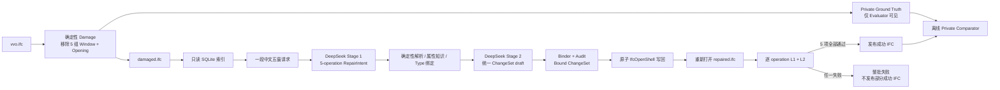

# Phase 10.3 五窗批量修复与大型 IFC 验证报告

## 结论

Phase 10.3 已完成。系统已经在 `vvo.ifc` 上完成一次真实的五窗批量修复：

- 从同一份 IFC 中一次性移除 5 组 Window/Opening，生成 damaged IFC；
- 用一段中文文本描述 5 个修复目标；
- DeepSeek Stage 1 调用 1 次，生成包含 5 个 operation 的 RepairIntent；
- DeepSeek Stage 2 调用 1 次，生成一个统一 ChangeSet；
- 五个 operation 作为一个事务写入，不产生部分成功 IFC；
- 修复结果重新打开后，5 项 L1、5 项 L2 全部通过并发布；
- 离线 Ground Truth Comparator 也对五项修复全部判定通过；
- 另外三份 24.9 MB 至 52.7 MB 的 IFC 完成只读兼容性与索引测试。

这证明当前单窗链路已经扩展为“一个请求、一个 ChangeSet、多个 Window
operation”的原子批量链路。它还不是 Door、Opening-only、Beam 或 Column
能力；这些仍属于后续独立 operation。

## 本阶段做了什么

### 1. 整理 dataset 和 benchmark 身份

本阶段没有删除或移动任何数据集文件。新增的只读审计会检查：

- manifest 记录路径是否存在；
- 文件 SHA-256 是否与 manifest 一致；
- IFC schema 是否一致；
- 同一个数据身份是否重复或冲突；
- `dataset/processed` 下的目录属于 `retain`、`regenerable` 还是
  `review_before_delete`。

四个明确进入本阶段验证范围的 IFC 被写入版本化 benchmark manifest：

| IFC | 大小 | 实体数 | Window | 有效 Window/Opening/Wall 链 | 本阶段角色 |
|---|---:|---:|---:|---:|---|
| `vvo.ifc` | 2.41 MB | 48,935 | 23 | 23 | 五窗完整链路 |
| `px4_1.ifc` | 24.87 MB | 501,401 | 20 | 19 | 中型兼容性 |
| `AdvancedProject.ifc` | 44.34 MB | 770,172 | 263 | 263 | 大型压力测试 |
| `BasicHouse.ifc` | 52.70 MB | 1,026,311 | 19 | 19 | 大型可选压力测试 |

外部 corpus 仍然保持 `linked-not-admitted`。这意味着“文件在本地”不等于
“已经成为正式 benchmark”；只有带固定 hash、schema、指标和用途的记录
才进入可复现验证。

## 五窗案例

源文件：

```text
dataset/ifc/train/vvo.ifc
SHA-256:
b6c435be955aeb6b2998f42a62f4ebf8c3f91eb7d373ca71a2dcedfeb95b3fdc
```

选取目标时要求每项都具备完整 Window → Opening → Wall 关系、直线墙、
可计算局部坐标、可观察的 Window Type，并且不与保留的洞口冲突。其中第
4、5 项故意放在同一面墙上，用来验证共享宿主墙的批量体积和关系计算。

| # | 楼层 | 宿主墙 | 洞口宽 × 高 | 窗台高 | 复用 Type |
|---:|---|---|---:|---:|---|
| 1 | 标高2 | `基本墙:240:224905` | 1180 × 500 mm | 2670.83 mm | `500x1180` |
| 2 | 标高2 | `基本墙:240:226415` | 870 × 2370 mm | 610 mm | `870x2370` |
| 3 | 标高0 | `基本墙:600:239145` | 4500 × 2950 mm | 131.397 mm | `4500x2950` |
| 4 | 标高2 | `基本墙:240:227677` | 600 × 1600 mm | 532.987 mm | `1600x600` |
| 5 | 标高2 | `基本墙:240:227677` | 600 × 1600 mm | 533.5 mm | `1600x600` |

本次 Damage 删除的原始 Window 名称：

| # | 原始 Window.Name |
|---:|---|
| 1 | `固定:500x1180:279940` |
| 2 | `固定:870x2370:255906` |
| 3 | `四开落地窗:4500x2950:253321` |
| 4 | `固定:1600x600:287667` |
| 5 | `固定:1600x600:287848` |

批量 Damage 的 `mutation_report.json` 现在会输出按 `target_id`
排列的 `removed_windows[].name`，供报告和人工检查直接引用。

每项文本还明确要求写入：

```text
Pset_WindowCommon.IsExternal = true
Pset_WindowCommon.Reference  = <对应窗型名称>
```

原始 Window 和 Opening 的 GUID 只保存在 evaluator-only private manifest
中，不进入用户请求、Stage 1 Prompt 或 Stage 2 Prompt。

## 完整输入输出链路



链路中的职责是分开的：

| Part | 输入 | 输出 | 作用 |
|---|---|---|---|
| Damage | 原始 IFC + private case manifest | damaged IFC + private evidence | 构造可重复的五窗缺失案例 |
| Stage 1 | 用户文本 + 公共 operation contract | RepairIntent | 提取目标、几何、属性和 Type 意图 |
| Resolver | RepairIntent + damaged IFC 索引 | 唯一目标及权威语义事实 | 不让 LLM 自己搜索整个 IFC |
| Stage 2 | 已绑定的有界公共事实 | ChangeSet draft | 组织五个语义 operation |
| Binder/Audit | draft + 确定性事实 | Bound ChangeSet | 校验目标、权限、指纹、冲突和范围 |
| Applicator | damaged IFC + Bound ChangeSet | candidate IFC | 一次事务完成五项写回 |
| Evaluator | 重开 IFC + 生产证据 | L1/L2 报告 | 决定能否发布 |
| Private Comparator | 原始 IFC + repaired IFC | benchmark 报告 | 只用于离线 Ground Truth 验收 |

## 离线确定性验收

离线 Provider 不是 UAT 替代品，而是稳定的自动回归证明。结果如下：

| 项目 | 结果 |
|---|---|
| operation 数 | 5 |
| Bound ChangeSet 数 | 1 |
| apply 模式 | all-or-nothing |
| 五项 L1 | 全部 passed |
| 五项 L2 | 全部 passed |
| L3 | 全部 not_required |
| Production 发布 | passed |
| Private Ground Truth | passed |
| Provider Gold canary | 未发现 original Window/Opening GUID |
| repaired IFC | 2,442,391 bytes |
| repaired SHA-256 | `835b914608b1d67b2000d5c265214b5a0b37ec8743e8b5aa2b3153f14bc6ada6` |

同时执行了一个反例：把第 5 项移动到与第 4 项重叠的位置。Audit 在写 IFC
前拒绝这个 ChangeSet，整批没有 successful IFC，damaged 源文件字节保持
不变。这验证了批量链路不是逐窗写出五个局部结果后再拼接，而是真正的
原子事务。

## 真实 DeepSeek UAT

第一次在受限网络环境内调用时，Provider transport 无法建立连接。该次
结果被如实保留为 `provider_failed`：Stage 1 的合同重试发生 2 次，
Stage 2 为 0，没有生成成功 IFC。

随后在允许外部网络的同一代码和同一案例上重跑，真实 UAT 成功：

| 项目 | Stage 1 | Stage 2 |
|---|---:|---:|
| Provider 调用 | 1 | 1 |
| transport attempt | 1 | 1 |
| Prompt 文件大小 | 12,509 bytes | 11,310 bytes |
| Prompt tokens | 3,806 | 3,624 |
| Completion tokens | 5,431 | 3,866 |
| Total tokens | 9,237 | 7,490 |
| 模型 | `deepseek-v4-flash` | `deepseek-v4-flash` |

最终结果：

- RepairIntent 包含 `op1` 至 `op5`；
- 一个 Bound ChangeSet 包含 5 个 operation；
- 五项 L1 均为 `passed`；
- 五项 L2 均为 `passed`；
- L3 均为 `not_required`；
- `complete_repair_success = true`；
- `successful_artifact_publishable = true`；
- repaired IFC 为 2,441,976 bytes；
- repaired SHA-256 为
  `e24e7f1b0f34bad45cd8160799a28589d03eb954793d5c353fa1c3ce5420ef93`。

离线与 live IFC 的字节数和 hash 不要求相同。LLM 可使用不同 operation
ID，IfcOpenShell 新建实体的身份和 STEP 序列也不属于当前 L3 合同。发布
依据是重新打开后的 L1 物理/关系正确性和 L2 语义一致性，而不是文件
byte-identical。

## 大型 IFC 兼容性结果

四份 IFC 均只读打开，索引写入临时 SQLite，原始文件未修改：

| IFC | 能力扫描 | 索引构建 | 索引元素 | Type | 诊断 | 结果 |
|---|---:|---:|---:|---:|---:|---|
| `vvo.ifc` | 0.277 s | 1.492 s | 126 | 50 | 0 | passed |
| `px4_1.ifc` | 3.489 s | 4.752 s | 78 | 26 | 0 | passed |
| `AdvancedProject.ifc` | 6.162 s | 25.265 s | 787 | 67 | 0 | passed |
| `BasicHouse.ifc` | 7.095 s | 8.714 s | 40 | 11 | 0 | passed |

本阶段只在 `vvo.ifc` 上执行五窗完整 Provider 链路。其余三份文件用于证明
解析和索引在更大模型上可运行，不能将它们描述为已经通过五窗修复 UAT。

## 实施中发现并修复的问题

1. 多个 operation 可以合法共享同一宿主墙。原先的重复 target 防护会误杀
   这种批量请求；现在由 operation-specific conflict checker 判断，只有
   洞口真正重叠时才拒绝。
2. 同一宿主墙的几何变化必须比较“该墙上本批所有洞口体积之和”，不能让
   每个 operation 单独拿整面墙的差值比较。
3. 多个 operation 共享关系或共享被修改 root 时，必须验证声明角色、
   IFC class、端点和 union delta 一致，不能简单放宽 preservation。
4. 删除某个 Type 的唯一 occurrence 后，`IfcWindowStyle` 对象仍可能存在。
   索引现在会记录这种 orphan Type，因此可以按用户明确指定继续复用。
5. 非 ASCII Pset/Property 名称原先可能归一化到同一个 fact key；现在使用
   稳定 hash token，避免中文或其他 Unicode 名称发生证据碰撞。

## 已知边界

- 只支持直线墙上的 Window + Opening；
- 当前批量验证为 5 项，公共 RepairIntent 上限仍是 16 项；
- 当前属性写入仍以 occurrence-direct `IfcPropertySingleValue` 为主；
- 不自动修改共享 Type；
- `vvo.ifc` 中少数原始 Window 的 storey 与宿主墙 storey 不一致，或与保留
  洞口存在空间重叠；这些源数据异常项没有被选入本案例；
- L3（原 GUID、STEP ID、表示图和字节级一致）仍然不做兼容承诺。

## 证据位置与复现

核心 manifest：

```text
dataset/manifests/ifc-repair-benchmarks.jsonl
dataset/manifests/ifc-repair-cases/vvo-five-window-001.private.json
```

离线证据：

```text
dataset/processed/ifc-repair/phase10.3-vvo-five-window-offline/
```

真实 DeepSeek 成功证据：

```text
dataset/processed/ifc-repair/
phase10.3-vvo-five-window-deepseek-uat-network/
```

大型 IFC 矩阵：

```text
dataset/processed/ifc-repair/phase10.3-compatibility-matrix.json
```

只读 dataset 审计：

```text
dataset/processed/ifc-repair/phase10.3-dataset-audit.json
```

复现命令：

```powershell
.venv\Scripts\python scripts\dataset\audit_dataset.py `
  --output dataset\processed\ifc-repair\phase10.3-dataset-audit.json

.venv\Scripts\python scripts\ifc_repair\run_phase10_3_vvo_offline.py `
  --output dataset\processed\ifc-repair\phase10.3-vvo-five-window-offline

.venv\Scripts\python scripts\ifc_repair\run_phase10_3_compatibility_matrix.py `
  --output dataset\processed\ifc-repair\phase10.3-compatibility-matrix.json

.venv\Scripts\python scripts\ifc_repair\run_phase10_3_vvo_live.py `
  --prepare-fixture `
  --output dataset\processed\ifc-repair\phase10.3-vvo-five-window-deepseek-uat-network
```

## 下一阶段

Phase 10.3 已经证明同类 Window operation 可以批量、原子、可验证地执行。
按照 roadmap，下一步进入 Phase 11：

1. 独立实现 `add_opening_to_wall`，允许只有洞口而没有填充构件；
2. 独立实现 `add_door_with_opening_to_wall`；
3. 使用同一个 Operation Registry、ChangeSet envelope、事务和 L1/L2
   总框架；
4. 增加 Window + Door 混合批次，确认异构 operation 仍然整批原子执行。

Door 和 Opening 必须拥有自己的参数、关系和 L2 合同，不能只把 Window
字段改名复用。
