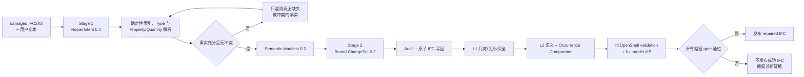

# Phase 10.5 Window Occurrence Fidelity 与验证加速报告

> 日期：2026-07-26
> 状态：通过
> 最终真实 Provider 证据：DeepSeek r21，无 synthetic fallback

## 1. 结论

Phase 10.5 已完成 Window 参考链路的三个收敛目标：

1. 用户可以通过文本直接给出 occurrence 标量 Property、Window/Opening
   Quantity，或明确授权复用 surviving occurrence / 一致的 Type cohort。
2. 私有 Ground Truth comparator 可以区分有效值、未授权事实、writer
   不支持、错误值和仅 authoring graph 不同。
3. AdvancedProject 的完整 Production validation 与 full-model diff 在不缩小
   检查范围的前提下进入 180 秒、4 GiB 门槛。

最终 r21 从 damaged IFC 和用户文本开始，真实调用 DeepSeek Stage 1、Stage 2，
生成 RepairIntent 0.4、Bound ChangeSet 0.3 和新的 IFC2X3。Production 与私有
benchmark 的 L1/L2 均通过，occurrence fidelity 通过，成功 IFC 已发布。

## 2. 完整链路



整个过程仍使用一个统一 ChangeSet。多窗任务可包含多个 operation，但只能形成
一个原子事务；任何 operation 失败都会阻止整份 IFC 发布。

## 3. 输入与授权边界

### 3.1 RepairIntent 0.4

公开输入支持：

- 精确或自然语言标量 `IfcPropertySingleValue`；
- Window/Opening occurrence 的标量 Quantity；
- operation-local 属性和共享 semantic bundle；
- 指定一个 surviving occurrence 的授权复用；
- 指定同 Type cohort 的一致值复用；
- GUID、名称、Type、楼层、方向等已有 target selector。

Stage 1 若把“新增窗 + 给新窗写属性/数量”合法地拆成两个 operation，系统只在
第二项没有自身 GUID、唯一对应同一宿主墙上的新建窗、且不存在冲突语义时做
确定性归并。显式修改已有窗或同墙多窗歧义不会被归并。

### 3.2 合法语义来源

最终 assignment 必须来自以下来源之一：

- `explicit_value`
- `deterministic_derived`
- `type_inherited`
- `approved_occurrence_prototype`
- `authorized_type_cohort`

检索结果和 LLM 输出本身不是授权。私有 Ground Truth 永远不会进入 Provider
上下文。

### 3.3 单位规则

- 用户显式给出单位时，value/type/unit 三者必须严格匹配。
- 用户没有声明单位时，不凭空增加单位约束。
- r21 对原文件中采用项目单位的面积、体积显式使用 `mm2`、`mm3`，对
  Opening 长度 Quantity 使用 `mm`。

## 4. IFC authoring 与 scope

Window 和 Opening 的语义写入分别绑定到自己的 occurrence：

- Window Pset/Quantity 使用 `semantic_*` application roles；
- Opening Quantity 使用独立的 `semantic_opening_*` roles；
- 两个 scope 使用不同的确定性 GUID 命名，避免 application role 冲突；
- 默认不修改 shared Type 和 surviving occurrence；
- 复用 Type 可以满足有效的 inherited 值，但 occurrence-direct ownership
  是否相同留给 authoring exactness 诊断。

Orchestrator 写出的 Semantic Manifest 使用可重新解析的规范 0.2 JSON；authoring
和 Production evaluator 消费同一份 canonical authority。

## 5. Comparator 门控语义

Comparator 对目标 Window 和绑定 Opening 建立 effective occurrence 快照。

| 分类 | 含义 | Phase 10.5 gate |
|---|---|---:|
| `matched` | value/type/unit 与 Ground Truth 一致 | 通过 |
| `not_in_user_text` | Gold 有事实，但文本、推导或授权没有覆盖 | 完整 benchmark 的受支持必需事实阻塞；其他仅报告 |
| `unsupported_authoring` | 已授权，但 writer 无法按授权 ownership/scope 写入 | 阻塞 |
| `wrong_value` | value/type/unit 不同 | 阻塞 |
| `ownership_only` | 有效值一致，GUID、owner 或关系图不同 | 不阻塞，进入 L3 诊断 |

Phase 10.5 的完整复刻必需边界是：

- Window occurrence 标量 Pset；
- Window/Opening Quantity；
- 由几何确定的 `OverallWidth` / `OverallHeight`。

Name、Tag、ObjectType、GUID、STEP、owner_ref 和关系对象身份属于
`authoring_exactness`，不伪装成 L2。

四个独立结果为：

- `geometry_relationship_success`
- `semantic_fidelity_success`
- `occurrence_fidelity_success`
- `authoring_exactness`

前三项决定当前发布；`authoring_exactness` 仍是非阻塞诊断。

## 6. 最终真实 DeepSeek UAT

### 6.1 输入

模型：`deepseek-v4-flash`
Provider：`deepseek-openai-compatible`
输入/输出 guard：65,536 / 65,536 tokens
Source：`LargeBuilding.ifc`

公开文本包含：

- 目标 IfcWall GlobalId；
- 915 mm × 1830 mm Window、305 mm sill、3042.5 mm center offset；
- 已存在 Window Type 名称；
- 16 个 occurrence-direct 标量 Property；
- Opening `BaseQuantities.Depth/Height/Width`；
- 每项 value type、unit 与 public provenance。

不包含原始 Window/Opening 映射、mutation manifest、benchmark Gold 或 `.env`
密钥。

### 6.2 Provider 与合同结果

| 项目 | 结果 |
|---|---|
| Stage 1 attempts | 1 |
| Stage 2 attempts | 1 |
| RepairIntent | `text2ifc/ifc-repair-intent/0.4` |
| Bound ChangeSet | `text2ifc/ifc-repair-changeset/0.3` |
| Production L1 / L2 | passed / passed |
| Private benchmark L1 / L2 | passed / passed |
| synthetic fallback | false |
| UAT wall time | 83.781 s |

### 6.3 Occurrence 结果

| 状态 | 结果 |
|---|---|
| geometry relationship | true |
| semantic fidelity | true |
| occurrence fidelity | true |
| authoring exactness | false（预期的 L3 差异） |

72 个 Ground Truth facts 的分类：

| 分类 | 数量 |
|---|---:|
| matched | 28 |
| ownership_only | 37 |
| not_in_user_text | 7 |
| unsupported_authoring | 0 |
| wrong_value | 0 |

`not_in_user_text` 的 7 项均不属于本阶段受支持的阻塞语义边界。

### 6.4 文件与哈希

| 文件 | SHA-256 |
|---|---|
| LargeBuilding source | `102f8123f85eae5e237d7f6a9dcbc364bd5f1c0cfb94b40a7eeb2d7eac9bb725` |
| damaged IFC | `ca703845ddf4a434eea0317498fb29893877f87d66047cf6c890a61cd2844933` |
| repaired IFC | `a528679a97f917e45e5e6172f0595f673bfb419ffb9c856675186a3e7df1328d` |

原始 Window GUID：`2cXV28XOjE6f6irgi0CO4t`
新 Window GUID：`1z$byJEH9MsuBq7BQYUQ8x`

repaired 文件可由 IfcOpenShell 重新打开，schema 为 IFC2X3。有效属性比较
`complete_match=true`；直接 ownership 和 Name/Tag 不要求与原 authoring 工具
相同。

最终证据目录：

`dataset/processed/ifc-repair/phase10.5-window-fidelity-live-20260726-r21`

## 7. 离线接受矩阵

冻结 manifest：

`dataset/manifests/ifc-repair-cases/phase10.5-window-fidelity-cases.json`

| Case | IFC | 目的 |
|---|---|---|
| complete explicit | LargeBuilding | 完整属性与 Quantity 输入 |
| exact occurrence | LargeBuilding | 精确 occurrence 授权复用 |
| same-Type consensus | vvo | 只复用 cohort 一致事实 |
| same-Type conflict | vvo | 冲突时澄清且不发布 |
| five-Window bundle | AdvancedProject | 一个 ChangeSet、五 operation、原子回滚 |

最终 runner：37 passed in 30.44 s，无 fallback。

## 8. AdvancedProject 完整性能

最终证据目录：

`dataset/processed/ifc-repair/phase10.5-window-fidelity-final-20260726`

| 温度 | Cache | Validation | Full diff | Wall | Peak RSS | 结果 |
|---|---|---:|---:|---:|---:|---|
| cold | miss / miss | 43.406 s | 13.093 s | 62.687 s | 2,240,729,088 B | passed |
| warm | hit / hit | 4.375 s | 13.031 s | 23.562 s | 2,246,299,648 B | passed |

两次均低于 180 秒和 4 GiB。冷启动执行两份 IFC 的完整 validation；热启动只
复用五维 cache key 完全一致且 payload hash 有效的 diagnostics。两次都重新
执行 full-model diff，没有减少 root、L1、L2 或 validation rule。

## 9. 自动测试

```text
Phase 10.5 offline runner: 37 passed
相关回归预检: 103 passed
完整 tests/ifc_repair: 583 passed, 1 skipped
```

跳过项是既有条件测试，不是本阶段失败。

## 10. UAT 收敛记录

| 运行 | 发现 | 处理 |
|---|---|---|
| r17 | Stage 1 将新建窗和属性拆成两个 operation | 增加有界、可审计的确定性归并 |
| r18 | Production 通过，但私有 comparator 未收到 canonical authority | runner 传递同一授权事实；修正 L2/L3 边界 |
| r19 | Window/Opening Quantity 使用重复 application role | 增加 `semantic_opening_*` scope roles 与 L1 授权 |
| r20 | 省略面积/体积单位触发 `CUSTOM_UNIT_REQUIRED` | 文本明确使用 IFC 项目单位 `mm2/mm3` |
| r21 | 全链路通过 | 最终接受证据 |

所有失败运行都 fail closed，没有伪造成功 IFC。

## 11. 阶段结论与后续

WFID-01 至 WFID-06 全部完成。Window 链路现在具备：

- 完整、有界、可追溯的 occurrence 输入；
- Type、occurrence 和 cohort 授权复用；
- Window/Opening 分 scope authoring；
- Ground Truth occurrence comparator；
- 不可变 validation cache 与安全加速；
- 单窗、多窗、Large IFC 和真实 DeepSeek 证据。

下一阶段可进入 Phase 11：用同一 Registry、ChangeSet、authoring 和 evaluation
接口扩展 opening-only 与 Door operation。L3 authoring identity、曲墙、Beam、
Column 和 128k 上下文仍按 Roadmap 独立推进。
