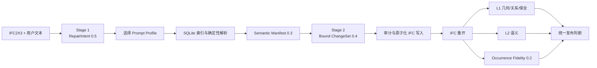

# Phase 11 Door / Opening 验证报告

> 日期：2026-07-30
> 当前结论：离线实现与真实 IFC 验证通过；真实 DeepSeek UAT 尚未执行。  
> 外部阻塞：Codex 执行额度层拒绝网络命令，Provider 实际调用数为 0。

## 1. 阶段目标

Phase 11 将已经验证过的 Window 修复链路扩展到三类操作：

1. 只在直墙上创建 Opening；
2. 在直墙上同时创建 Opening 和 Door；
3. 向一个已存在、尚未填充的 Opening 中安装 Door。

三类有洞口的构件共用一个 wall-local hosted-opening 核心，同时保留各自的
参数、Type、语义与验证策略，没有复制一套 Window 管线。

## 2. 完整链路



LLM 负责理解请求并生成受约束的意图或草稿。以下工作由程序完成：

- IFC GlobalId 与文件指纹绑定；
- Target、Opening、Wall、Storey 和 Type 的确定性解析；
- Door/Opening 的几何与 IFC 关系创建；
- 生成 Type 的模板摘要校验；
- ChangeSet 审计、IFC 重开、L1/L2 和全局 preservation；
- 不支持能力的拒绝与原子回滚。

## 3. Prompt 路由

RepairIntent 0.5 的每个 operation 包含 `component_family`、`action` 和
`operation_profile`。

| Profile | 用途 |
|---|---|
| `window.add-with-opening` | Window 与新 Opening |
| `opening.add-to-wall` | 只创建墙洞 |
| `door.add-with-opening` | Door 与新 Opening |
| `door.fill-existing-opening` | Door 填入已有 Opening |
| `occurrence.set-properties` | 修改既有 occurrence 标量属性 |

Stage 1 只看到紧凑 Profile 目录；Stage 2 只加载本次 operation 选中的
contract 和 few-shot，避免把所有构件操作与例子一次性放入 Prompt。

## 4. Door 输入边界

当前阻塞参数是：

- 目标 Wall 或已有 Opening；
- Door 总宽与总高；
- Opening 宽、高与 sill；
- wall-local 中心位置；
- 支持的开启语义；
- 明确复用的 DoorStyle，或允许系统使用受控模板生成 Type。

材料、五金、上亮、门框细节和自定义 Pset 不是默认必需事实：

- 用户没有要求时，系统不生成；
- 用户明确要求且系统支持时，进入 semantic assignment；
- 用户要求但系统不支持时，由确定性能力检查拒绝；
- 不把不支持的细节交给 LLM 临时编造。

## 5. IFC 写入

### 5.1 Opening-only

`add_opening_to_wall` 创建一个 `IfcOpeningElement` 和一个
`IfcRelVoidsElement`。

它不会创建 Door、Window、`IfcRelFillsElement`、Door/Window Type 或
`IfcRelSpaceBoundary`。

### 5.2 Door + 新 Opening

`add_door_with_opening_to_wall` 创建或更新：

- Opening 与 void 关系；
- Door 与 fill 关系；
- Door 的 wall/opening-relative placement；
- Door 的 Storey containment；
- DoorStyle 绑定；
- 用户明确授权的 occurrence Pset/Quantity。

### 5.3 Door 填入已有 Opening

`fill_existing_opening_with_door` 要求：

- Opening 存在；
- Opening 只有一个宿主；
- Opening 尚未被填充；
- 请求或解析得到的 Wall 与实际宿主一致。

该操作保留原 Opening 与 void GlobalId，不创建第二个 Opening。

## 6. DoorStyle 策略

### 精确复用

用户明确指定且唯一解析到既有 DoorStyle 时：

- 新 Door 绑定该 Type；
- 复用 Type 的 RepresentationMap；
- 不修改 Type 的 formal attributes；
- 不复制其他 Door occurrence 的直接 Pset/Quantity；
- 不把源 occurrence 的错误 Storey 关系一并复制。

### 受控生成

没有复用 Type 时，当前只支持 `SINGLE_SWING_LEFT`、
`SINGLE_SWING_RIGHT` 和明确的 `NOTDEFINED`。

生成内容使用 `text2ifc-door-single-swing-template/0.1`。模板包含独立摘要；
若 formal operation、模板正文或摘要被篡改，应用阶段失败且不发布 IFC。

生成几何是可重复的简化 type-owned mapped panel，不代表门框、五金或材料事实。

## 7. 语义 scope

| Scope | 目标 occurrence |
|---|---|
| `window_occurrence` | `IfcWindow` |
| `door_occurrence` | `IfcDoor` |
| `opening_occurrence` | `IfcOpeningElement` |

公共写入器不再固定假设 Window。未知 scope、重复 scope 映射或缺少目标 role
会失败关闭。

真实 LargeBuilding 输出验证了：

- `Custom_Asset.AssetCode = D-001` 只写入 Door；
- `BaseQuantities.Width = 915 mm` 只写入 Opening；
- Type 复用没有复制源 Door 的 occurrence 属性包。

## 8. 验证门禁

### L1

Door L1 检查：

- Door 恰好填充一个 Opening；
- Opening 恰好 void 一个 Wall；
- Door 宽高与授权参数一致；
- Door 进入 Opening 实际基准标高对应的 Storey；多楼层贯通墙不得用墙体
  direct containment 的基准楼层替代；
- Door 绑定 DoorStyle；
- 实际 IFC Root 变化均在授权角色内；
- IFC 可重开且不新增 validation diagnostics；
- damaged IFC 指纹保持不变。

关系存在本身不能证明 Door 填入洞口。Door L1 还必须以 Opening 局部坐标系
测量实际几何，并同时满足：

- 投影重叠率不低于 `0.95`；
- 授权名义宽高包络中心偏差不超过 `5 mm`；
- 轴向角偏差不超过 `0.1°`；
- 宽高偏差不超过 `1 mm`；
- Door 与 Opening 各自恰好参与一条互相一致的
  `IfcRelFillsElement`，Opening 恰好 void 一个 Wall。

任一几何测量不可用、关系重复或 Storey 不一致均 fail closed。

### L2

Door L2 必需事实是 Type、host Wall、Storey、OverallWidth 和 OverallHeight。

显式 Pset、Quantity、Material 和 Classification 只有在用户文本或确定性策略
建立事实时才成为检查项。未请求事实报告 `not_required`。

### Occurrence Fidelity

新增 `text2ifc/ifc-occurrence-comparison/0.2`，记录 IFC class、scope、
application role、related Opening、attributes、effective scalar Psets、
quantities 与单位。Window 旧版 0.1 comparator 保持兼容。

## 9. 真实 IFC 离线结果

固定命令：

```powershell
.venv\Scripts\python.exe scripts\ifc_repair\run_phase11_offline.py
```

结果目录：

```text
dataset/processed/ifc-repair/phase11-door-audit-fix-final-2/
```

### 七案例矩阵

| 案例 | 操作 | operation 数 | 结果 |
|---|---|---:|---|
| LargeBuilding 保留 Opening | 精确复用 DoorStyle | 1 | 通过 |
| vvo 保留 Opening | 精确复用 DoorStyle | 1 | 通过 |
| AdvancedProject 保留 Opening | 大模型完整门禁 | 1 | 通过 |
| LargeBuilding 完整重建 | 受控生成 DoorStyle | 1 | 通过 |
| vvo 五门 | 一个 ChangeSet 批量修复 | 5 | 通过 |
| vvo 两门两窗 | Door/Window 混合 ChangeSet | 4 | 通过 |
| Dental Clinic 两门两窗 | 无 GUID/Name 几何定位、完整墙体重开洞 | 4 | 通过 |

审计前的 supplied vvo 失败 candidate 没有被删除或覆盖为“成功”。它固定保存在
`tests/fixtures/ifc_repair/phase11-door-known-failure/`，SHA-256 为
`0d30005fa91360f186a6c539206aa1c229db03f69ac4d2e183a42c53db91a76e`。
回归测试直接重开该二进制，复现 800×2480 Door 的
`[+800,+160,0] mm` 世界几何偏移和两个 Door 的 `标高2→标高0` 错误，并确认
新严格 L1 将它判为不可发布。

五门案例还注入了一个重复 Opening operation。审计拒绝整个 ChangeSet，
`published=false`，且目标 IFC 不存在，证明不是逐项提交或部分成功。

混合案例在同一个 ChangeSet 中包含两个
`add_window_with_opening_to_wall` 与两个
`fill_existing_opening_with_door`，四个 operation 分别通过 L1/L2 后只发布
一份 IFC。

### 两门两窗无 GUID 定位补充验收

该混合案例已改为更严格的公共输入边界：用户文本和 RepairIntent 都不包含
Wall、Opening、Door、Window 或 Type 的 IFC GlobalId。四个 operation 使用：

- Window：楼层名 + 墙名称 + `wall_local_start` 中心偏移 + 洞口尺寸；
- Door：楼层名 + 墙名称 + 保留 Opening 名称 + 墙局部中心偏移 + 洞口尺寸；
- Type：Type 名称；Door Type 同名时再使用用户已给出的 formal
  `OperationType` 收窄，不要求用户输入 Type GlobalId。

Stage 1 的公开 `target_query` 只保存 `names`、`storey_name` 和几何能力条件。
程序先在 damaged IFC 的 SQLite 索引中解析出两面墙和两个空 Opening，并验证
位置、尺寸与私有测试真值一致；只有解析成功后，内部 Bound ChangeSet 才写入
GlobalId。任何目标或 Type 不能唯一解析时均停止并返回澄清，不会按候选顺序猜测。

本次删除并恢复的 Door 是：

- `单扇 - 与墙齐:800x2480:255008`；
- `单扇 - 与墙齐:935x2400:275772`。

新增可审计产物为 `repair-intent.json` 和 `target-resolution.json`。公开请求经过
IFC GUID 正则扫描为 0 命中；解析结果为 4/4 resolved；最终一个 ChangeSet、
4 个 operation、一个 repaired IFC，application、L1、L2、preservation 和 IFC
重开全部通过。

### Dental Clinic 无 GUID/Name、无残留 Opening 补充验收

新增案例使用 `ifc-bench/projects/dental_clinic/arc.ifc`，模型包含 209,148 个
实体。它不沿用 LargeBuilding、vvo 或 AdvancedProject，并进一步收紧公共定位
边界：

- request 和 RepairIntent 不包含 IFC GlobalId、Wall/Opening/Door/Window
  Name、Type Name 或楼层 Name；
- 四面宿主墙只由楼层标高、东/北朝向、墙长、墙高、墙厚组成的有界几何签名
  唯一解析；开洞位置继续使用 `wall_local_start` 中心偏移；
- damage 同时删除 2 个 Window、2 个 Door 及其 4 个 Opening，使宿主恢复为
  不带目标洞口的正常墙体；
- ChangeSet 只包含 2 个 `add_window_with_opening_to_wall` 和 2 个
  `add_door_with_opening_to_wall`，不包含
  `fill_existing_opening_with_door`；
- 未指定复用 Type，因此使用受控生成的 WindowStyle/DoorStyle；Window 的
  `IsExternal` 从 damaged IFC 中 surviving Wall 的 `Pset_WallCommon`
  确定性派生，不由 LLM 猜测。

Dental Clinic 使用米作为项目长度单位。ChangeSet 公共合同仍统一使用毫米；
IFC 边界在写入 `OverallWidth`、`OverallHeight` 和 placement 时换算为项目单位，
读取与 L1/L2 比较时再归一化为毫米。该模型也没有 `Body/MODEL_VIEW`
SubContext，几何写入按确定性优先级回退到三维 `Model` Context。两项兼容均有
回归测试，防止生成可打开但尺寸或位置放大 1000 倍的伪成功。

本次删除并恢复的 Door 是：

- `M_Single-Flush:0915 x 2134mm:0915 x 2134mm:229736`；
- `M_Single-Flush:0915 x 2134mm:0915 x 2134mm:237881`。

独立复跑和 Proof 校验均为 `passed`：4/4 target resolved、4/4 application、
4/4 L1/L2、全局 preservation、三份 IFC2X3 重开和所有文件 SHA-256 均通过。

### LargeBuilding 单门

| 项目 | 值 |
|---|---|
| 原门 | `M_Single-Flush:Inside Door:353172` |
| Door GlobalId | `2cXV28XOjE6f6irgi0COhu` |
| Opening GlobalId | `2cXV28XOjE6f6irhW0COhu` |
| Type GlobalId | `2cXV28XOjE6f6irhu0COgZ` |
| OperationType | `SINGLE_SWING_RIGHT` |
| Damage | 删除 Door/fill，保留 Opening/void |
| 结果 | IFC2X3 重开、L1、L2、preservation 通过 |

### vvo 单门

| 项目 | 值 |
|---|---|
| 原门 | `单扇 - 与墙齐:800x2480:255008` |
| Door GlobalId | `2IUEnGd5v4Yfg1ZlPtd0qa` |
| Opening GlobalId | `2IUEnGd5v4Yfg1ZkLtd0qa` |
| Type GlobalId | `2Bp10QP5H0qx3NLxP020qy` |
| OperationType | `SINGLE_SWING_LEFT` |
| Damage | 删除 Door/fill，保留 Opening/void |
| 结果 | IFC2X3 重开、L1、L2、preservation 通过 |

vvo 的宿主墙跨越多个楼层，墙体 direct containment 在标高 0，但目标 Opening
基准标高和原 Door 都在标高 2。旧 Applicator 错把墙体基准楼层赋给新 Door；
现实现依据 retained Opening 的实际世界标高，在同一 Building 内唯一解析到
标高 2。Type 仍精确复用。

每个案例包含 original、damaged、repaired IFC、request、ChangeSet、
application、evaluation、comparison、manifest 和人工阅读 README。

### AdvancedProject 性能

AdvancedProject 保持完整 validation 与 full-model comparator 范围，没有使用
抽样、放宽容差或缩小保全范围。修复器和 Evaluator 复用已经独立重开的模型，
并行执行候选 schema validation 与 full diff；缓存键仍包含 IFC SHA-256、
Schema、IfcOpenShell 版本和验证策略。全新缓存目录的最终冷启动实测为：

| 阶段 | 时间 |
|---|---:|
| application | 36.876 s |
| cold evaluation | 129.931 s |
| cold request-to-publication | 166.807 s |
| warm evaluation | 43.516 s |
| 冻结上限 | 180 s |

优化过程中两个全新冷启动曾诚实失败于 `216.671 s` 和 `181.776 s`。最终结果
通过消除重复 IFC 打开、并行独立重开与并行执行完整 validation/diff 获得，
180 秒门槛和所有验证范围均未改变。

### 独立 Proof

离线案例通过以下命令独立收录：

```powershell
.venv\Scripts\python.exe scripts\ifc_repair\curate_phase11_door_proof.py
.venv\Scripts\python.exe scripts\ifc_repair\validate_success_cases.py --json
```

当前成功案例集合共有 14 个案例、43 个 operation、211 个受哈希保护的文件，
42 次 IFC2X3 独立重开，校验结果为 `passed`。其中本轮权威复审新增 2 个
生产隔离案例、9 个 operation。离线证据明确标记
`offline_bound_deterministic`，不会冒充真实 DeepSeek 证据。

每个 Phase 11 案例新增：

- `validation/three-way-audit.json`；
- `validation/release-decision.json`；
- `validation/AUDIT-REPORT.md`。

三方审计分别保存 original→damaged 私有 mutation audit、
damaged→repaired production evidence 和 original→repaired 私有 comparator，
三者不得互相充当事实来源。

## 10. 测试结果

- Plan 11-01：60 个聚焦测试通过；
- Plan 11-02：81 个聚焦测试通过；
- Plan 11-03：29 个聚焦测试通过；
- Plan 11-04：218 个语义/评估回归通过；
- Plan 11-04 最终矩阵：86 个测试通过；
- Plan 11-05 mutation/dataset/live contract：9 个测试通过；
- Phase 11 batch/mixed/AdvancedProject 聚焦矩阵：17 个测试通过；
- 无 GUID 门窗混合、Target/Type 解析与 Door 澄清回归：56 个测试通过；
- 更新后的成功案例集合测试：2 个测试通过，11 个案例、137 个文件、33 次
  IFC2X3 重开；
- 首次完整 IFC repair suite：632 passed、1 skipped、6 failed。

6 个失败来自新增 operation 后的历史 fixture 假设：

- 把目录第一个 operation 当成 Window；
- 旧 RepairIntent fixture 缺少 0.5 routing/semantic 空字段；
- 旧 occurrence property assignment 没有显式 scope。

这些兼容问题修复后，最终完整 IFC repair suite 为：

```text
643 passed, 1 skipped in 660.14s
```

2026-07-30 Door 严格几何/Storey 修复后，新增的几何回归、三方审计、
release decision 与 validation acceleration 聚焦测试共 243 项通过；成功案例
集合独立校验为
`14 cases / 43 operations / 211 files / 42 IFC reopened`。

全部修改收敛后的最终完整 IFC repair suite 为：

```text
681 passed, 1 skipped in 1005.60s
```

其中耗时最大的 Dental Clinic 与 AdvancedProject 端到端测试均在未降低
几何阈值、preservation 范围或发布标准的前提下通过。
完整命令、stdout、stderr 与退出结果保存在
[phase11-door-final-test-output.txt](phase11-door-final-test-output.txt)。

### 独立审阅发现与处理

首次独立审阅没有直接接受修复，而是提出四项问题：

1. benchmark runner 中私有 Ground Truth 准备与生产执行仍处于同一进程路径；
2. 大模型并行验证曾出现 `BrokenProcessPool`；
3. 多楼层贯通墙的 Door Storey 规则与旧规范文字冲突；
4. 旋转、镜像/180° placement convention、墙厚变化和左右 DoorStyle 的
   几何回归覆盖不足。

仅增加 `_execute_public_production` helper 后，独立审阅仍正确地拒绝放行：
外层 benchmark runner 会在修复前读取 original 和删除对象信息来生成请求，
helper 内部的干净签名不能证明完整调用链隔离。最终实现新增独立
`run_phase11_public_triplet_repair.py` 进程；其命令行和函数签名只接收
damaged IFC、冻结的公开请求包与输出目录。该进程生成 repaired IFC 并完成
Production L1/L2 后，私有审计命令才复制/打开 original 和 mutation mapping。

其余问题分别通过 `production-boundary.json`、独立 validation worker 子进程、冻结的
[Door Storey policy erratum](phase11-door-storey-policy-erratum.md) 和新增
C2 几何回归解决。生产边界仅接收 damaged IFC、用户请求、规范化
ChangeSet 和由 damaged IFC 推导的 expected facts；original IFC、删除对象
GUID 与 mutation ground truth 只能出现在边界之外的私有 benchmark
comparator 中，并且只能在 repaired IFC 已经生成并完成 Production
L1/L2 后读取。独立复审结论记录在本报告最终验收部分。

复跑新链路时还发现生成 WindowStyle 的新 `IfcRelDefinesByType` 被 Applicator
错误标成 `modified`，导致两个新增 Root 未被声明。当前 Applicator 将新关系
报告为 `created.window_type_relationship`；三方审计也新增
`UNDECLARED_ADDED_ROOTS` 阻塞项，不能再靠遗漏角色通过 preservation。

权威复审的两个最终案例为：

- `vvo-authority-triplet-public-repair`：两窗两门、4 个纯几何目标；
- `vvo-five-door-authority-public-repair`：5 个保留 Opening，5/5 Door
  `projected_overlap_ratio = 1.0`，Opening 数量变化为 0。

两案均不在公开请求或 RepairIntent 中使用 GlobalId、对象 Name、楼层 Name
或 host GUID；Door Opening 由宽、高、深度、墙局部中心和门槛高度的联合
几何签名唯一解析。

最终独立复审实际重跑两案三方 audit 与 30 项聚焦回归，结论为：

- 新入口已关闭 Ground Truth 泄漏 Blocker；
- 两案均为 `L0=true / L1=true / L2=true / publishable=true`；
- 未声明 Root、旧 Door 错位和 Storey 错配均没有剩余发布 Blocker；
- 没有通过放宽几何容差、削减 full-model preservation 或降低 L2 门禁获得
  通过。

Storey 合同保留一项已采用的 IFC authoring 例外/合同风险：vvo 宿主墙的
direct containment 客观上是 `标高0`，但 retained Opening 与 original Door
的世界基准对应 `标高2`。本实现将 B3 的 host context 解释为多楼层贯通墙下
的 Opening-height contextual Storey，因此选择 `标高2`；不得声称宿主墙
direct container 本身是 `标高2`。缺失、冲突与等距候选仍 fail closed。

### 权威审计任务交付物对照

| 要求 | 权威证据 |
|---|---|
| 旧假阳性复现与根因 | `tests/fixtures/ifc_repair/phase11-door-known-failure/README.md`、`failure-evidence.json` |
| Comparator / Evaluator 设计与实现 | 本报告第 8 节、`benchmark_evaluation.py`、`evaluation.py`、`release_decision.py` |
| Door placement / containment 修复 | `door_geometry.py`、`operations/door.py`、`spatial.py` |
| 失败优先回归与 fail-closed 测试 | `test_door_geometry_regression.py`、`test_door_triplet_audit.py`、`test_release_decision.py` |
| 完整测试命令与输出 | `phase11-door-final-test-output.txt` |
| 新 repaired IFC | `vvo-five-door-authority-public-repair/03-repaired.ifc`，SHA-256 `a7e085…0270e03` |
| 三方机器/人工报告 | `validation/three-way-audit.json`、`validation/AUDIT-REPORT.md` |
| L0/L1/L2 发布判定 | `validation/release-decision.json` |
| 非目标 preservation | `three-way-audit.json.production_damaged_to_repaired.model_diff`，未声明新增 Root 为 0 |
| Roadmap / 状态 | `.planning/ROADMAP.md`、`.planning/STATE.md`、`11-SPEC.md`、`11-VALIDATION.md` |
| 独立复审 | 本节“独立审阅发现与处理”及最终复审结论 |

## 11. 真实 DeepSeek UAT

配置检查已通过：

| 项目 | 值 |
|---|---|
| Provider | `deepseek-openai-compatible` |
| Model | `deepseek-v4-flash` |
| 最大输入 | 65,536 tokens |
| 最大输出 | 65,536 tokens |
| Secret | 仅报告 redacted 状态 |

计划用例是完整 Door 输入、不完整输入加一次合并澄清，以及复杂双扇门在
Stage 2 前被能力层拒绝。

```powershell
.venv\Scripts\python.exe scripts\ifc_repair\run_phase11_live_uat.py --live
```

本次命令在进入 Provider 前被 Codex 执行额度层拒绝，提示最早可在
2026-08-03 10:34 后重新尝试。因此本轮证据是：

```text
Stage 1 calls = 0
Stage 2 calls = 0
DeepSeek success = not executed
synthetic fallback = false
```

这不是 Provider、Prompt 或 schema 失败；没有真实网络请求发生。Phase 11
不会在该证据补齐前标记 complete。

## 12. 剩余验收

1. 额度恢复后运行三组真实 DeepSeek UAT；
2. 对 live 产物执行独立重开、L1/L2、occurrence 与 proof 校验；
3. 将真实成功案例以 `live` 证据模式单独纳入
   `ifc-repair-success-cases/door`；
4. 更新 OPS-01/OPS-02、ROADMAP 和 STATE 为 complete；
5. 创建 Phase 11 最终 Git checkpoint。

## 13. 可复现命令

```powershell
.venv\Scripts\python.exe -m pytest tests/ifc_repair/test_door_mutation.py -q
.venv\Scripts\python.exe scripts/ifc_repair/run_phase11_offline.py
.venv\Scripts\python.exe scripts/ifc_repair/run_phase11_public_triplet_repair.py --damaged-ifc <02-damaged.ifc> --public-request-bundle <public-request.json> --output-root <production-output>
.venv\Scripts\python.exe scripts/ifc_repair/audit_door_repair_triplet.py <post-repair-private-audit-root>
.venv\Scripts\python.exe scripts/ifc_repair/curate_phase11_door_proof.py
.venv\Scripts\python.exe scripts/ifc_repair/validate_success_cases.py --json
.venv\Scripts\python.exe scripts/ifc_repair/run_phase11_live_uat.py --check-config
.venv\Scripts\python.exe scripts/ifc_repair/run_phase11_live_uat.py --live
```

## 14. 结论

Opening-only、Door+Opening、Door 填入已有 Opening 的合同、解析、IFC 写入、
Type 策略、语义 scope、L1/L2 与通用 occurrence comparator 已实现。

LargeBuilding、vvo 与 AdvancedProject 的单门、生成 Type、五门批量和两门两窗
混合链路均已重新生成可重开的修复 IFC，并通过严格几何、Opening 实际楼层、
生产 L1/L2 和三方独立 Proof 验证。旧 repaired IFC 的
“有 fill 关系但门板未填入洞口”现在必定被 L1 拒绝。真实 DeepSeek UAT 仍是
Phase 11 最终关闭前的独立外部证据；本报告结论为“Door 离线确定性目标通过，
live UAT 尚未关闭”。
