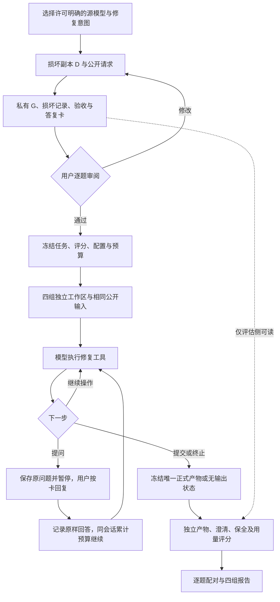

# IFC Repair 四组小规模对比实验计划

> 更新：2026-10-07｜版本：v0.2｜文档类型：实验实施计划。
> 依据：v0.1 讨论稿、用户六项修订及《v0.2 修订记录》。用户已确认的实验方向与尚未完成的实施工作分开记录。
> 同步状态：2026-09-28 已合并至仓库原路径；本文件是唯一现行实验计划，不另存 v0.1／v0.2 并行正文。
> 当前状态：两 demo 的四组接线和开发阶段准入已完成，真实尝试及失败保留；首批五题已制成完整待审材料，只做离线检查。用户重新批准 20M 开发预算，并批准两种 B 窗题澄清答复对照。重启后的镜像与 B 状态正在恢复复核；正式 20 题、指标及 80 任务未冻结或运行。最新结果统一见 [demo-results.md](demo-results.md)。

## 1. 实验目标与文档分工

实验比较四种配置在相同 IFC2X3 局部修复任务中的完成质量、交互表现和运行代价。采用 **20 个源 IFC、每个一个任务、四组各一次独立任务会话**，完整实验为 80 次任务级运行；任务内部的工具调用、澄清、继续和重试均归入同一次任务，不增加样本数。

核心比较为：A 与 B 比较相同 DeepSeek 底座下通用执行方式和领域 Harness；A 与 C 在相同通用工具下比较两个 API 模型；B 与 D 比较我们的领域系统与 DeepSeek 原生执行框架。执行框架（Harness）指模型调用循环、工具、上下文、交互和运行状态组织，不等于模型权重。

本轮不做 UI、不训练模型、不扩成大型 benchmark，不增加完整 Codex 产品对照。日常 Codex 用于开发实验程序，C 组通过 GPT API 运行。

| 文件 | 维护内容 |
|---|---|
| 本文 | 四组运行、公共输入、20 题准备与人工审查、交互、预算和开发阶段 |
| [指标规范](metrics.md) | 数量、构件、关系、整任务、IFC 校验、保全、澄清及资源的计算 |
| [DSH 接入与隔离](deepseek-harness-integration.md) | 渐进调研、运行环境、会话继续、推理记录、网络和停止条件 |
| [Codex 开发启动提示词](development-start-prompt.md) | 读取仓库现行文档并审查代码，再提交可执行开发建议；不另立研究方案 |
| [代码核对与首批开发建议](development-readiness.md) | 本次实际代码／环境、DSH 固定版本依据，以及拟创建文件和聚焦验收 |
| [研究登记](../../reports/repair-demo/claims-and-experiments.md) | Claim、批准状态和真实结果；不重复维护技术公式 |

## 2. 已明确的决定与未完成事项

### 2.1 用户已确定的方向

| 项目 | v0.2 决定 |
|---|---|
| 规模 | 20 个 IFC、20 个任务、四组；每题可以包含多个构件 |
| A/C 输入 | 中性操作句＋四组共用请求＋当前 IFC；不提示采用哪个库或修复流程 |
| A/C 方法 | 由被测系统自行决定；公开输入不加入库名、实现路线、教程或修复步骤等内容引导 |
| B/C/D 定位 | B 使用现有领域 Harness；C 用 API、不运行日常完整 Codex；D 按官方 DSH 调研接入 |
| 制题验收 | 正式实验前人工逐一审查全部 20 个损坏 IFC、请求和任务材料 |
| 指标 | 保留数量、完整构件、关系修复比例、整任务、IFC 校验和资源；记录附带错误 |
| 推理记录 | 保留 DeepSeek 接口实际返回的推理内容、失败和重试，不额外诱导输出思考 |
| DSH | 从调研逐步接入；Docker 是优先隔离候选，不是已实施环境 |
| 预算 | 按任务分配并允许事先规定的动态调整；同题四组规则一致，不按结果偏向某组 |
| 澄清 | 20 题内安排 2–4 题，先按 3 题准备；所有组、所有题都可正常询问用户 |

ZCode 保留为未启用备选，不新增第五组，不因 DSH 某一道题失败而切换系统。GPT 的目标型号沿用用户指定的 GPT‑6 Sol；官方 ID `gpt-6-sol` 和既有最小网关请求记录见[本次核对](development-readiness.md)。账号当前可用性、工具往返与冻结参数仍须后续获准联调，不由旧连通记录放行本实验。

### 2.2 实施者应先核实的事项

本版不再向用户重复询问已经明确的研究范围。2026-09-29 已核对分支、文件增量、代码与数据入口、Python／IfcOpenShell、Docker／WSL、磁盘和已配置服务器入口；完成 DSH 官方固定源码与发行元数据调研，未连接服务器或运行 DSH。详见[就绪审查](development-readiness.md)。

两题形式确认后已实施A/C通用执行器、B薄适配、持久问答／预算和两题范围的独立评分离线入口，见[当前实现](development-readiness.md#65-按确认的形式继续离线实验基础2026-09-29)。尚未完成：选定并审查20题；正式任务预算及费用批准；真实Provider协议、隔离和D原生运行验证；评分对多目标／等价几何的扩展；阶段准入。B原题离线链路发现的米制尺寸写回缺陷已另经用户批准修复，在原D上重验；不以毫米制对照的成功代替原题结果。

## 3. 现有代码依据与合并时的核对

以下职责已于 2026-09-29 对照当前代码复核；确切函数、适用范围和缺口见[代码复用表](development-readiness.md)。旧 benchmark 依赖生产记录；旧 IFC validator 只比较新增诊断且不执行 EXPRESS，均不能直接充当四组最终评分器。后续制题实施只补跑了直接复用的单窗／单门损坏器5项回归，均通过；没有执行全仓测试。

| 已核对的入口 | 可复用职责 | 后续开发需要解决的问题 |
|---|---|---|
| `src/text2ifc_ifc_repair/api.py` | B 组的 `RepairAPI`、澄清和结果读取 | 用薄适配对接实验，不复制生产修复流程 |
| `run_models.py`、`run_store.py` | 原生阶段、状态版本、运行证据 | 将等待用户映射为中间状态，而非失败终态 |
| `benchmark_evaluation.py` | 生产输入基础上的私有比较 | 旧输入依赖生产记录，不能要求外部组伪造 application record |
| `operations/__init__.py` | 已注册的窗、门、洞口、梁、柱、属性操作 | 按实际操作前提选题；不扩称任意 IFC 修复 |
| `text2ifc_agent` 的 Provider 与 trace | 已有模型传输和日志 | 查明 DeepSeek 推理是否完整保留，避免重复重写 |
| [现有实验准入协议](../agent-capability-evaluation.md) | 离线验证、真实调用、声明范围 | 普通开发做聚焦测试，Full Preflight 不自动升级 |

保持 B 的生产约束，包括源 IFC 不原地修改和正式发布规则；**不得把“B 不允许模型直接写 STEP”扩展成 A/C 的禁令**。外部基线属于明确隔离的实验路径，不据此放开生产接口。

## 4. 四组运行合同

### 4.1 配置矩阵

| 组别 | 配置 | 运行与提交 |
|---|---|---|
| A / `deepseek_direct` | DeepSeek Flash API＋通用执行器 | 自主读取、编辑、执行、询问和提交 IFC |
| B / `ours_deepseek` | 同底座 DeepSeek＋当前 repair Harness | 调用公开 RepairAPI，保留原生阶段和发布检查 |
| C / `gpt_direct` | GPT API＋与 A 相同的通用执行器 | 只在 API 协议适配处与 A 不同，不加载 Codex 个人技能 |
| D / `deepseek_native` | 同底座 DeepSeek＋官方 DSH | 原生运行时及工具在独立环境执行，保留自身编排 |

A/C 的通用用户输入、工具语义、文件可见性和工具反馈口径保持一致。B/D 固有的内部提示、检索与编排属于方法差异，照实记录；统一用户输入不是删除这些内部机制。

A/B/D 尽可能使用可核对的同一底座与推理配置；记录 requested model、实际返回标识、Provider 路由、wire protocol、参数和日期。浮动别名不能冒充不可变快照；不同协议下参数无法等价时披露差异，不在看到结果后为某组单独调整。

### 4.2 A/C 的任务文本

用户任务模板仅包含以下信息，具体路径由调度程序在本题环境中提供：

```text
请按以下要求操作这个 IFC 文件：

{四组共用的公开任务请求}

IFC 文件：{当前任务工作副本路径}
```

模板中的占位项由本题公开数据替换。不得附加“使用 IfcOpenShell”“先索引”“先审计后修复”“生成 ChangeSet”等解题方法，不放 BIM 专家角色、few-shot、修复脚本、内部 Schema 或评分检查代码。

工具名称、参数、路径、资源权限、向用户提问的通道和提交方式是中性的运行协议，A/C 使用相同内容。不要在运行协议里夹带操作顺序或暗示必须提问；公开文件名和请求中不标注“澄清测试”。

公开请求写成真实用户会说的话，默认不出现 GUID，无必要也不出现构件 Name、类型全名或 Tag。优先用楼层、方位、相邻构件、所在房间和相对位置定位。方向必须能由 D 的北向或事先公开的视图约定支持；未声明北向时不用猜测的东南西北。位置仍不唯一且无法从公开输入确定时，应保留必要的自然语言澄清，不用内部身份替模型完成定位。当前两题的请求完全无 GUID、构件名和方法提示；IFC 本身的身份字段保留。

### 4.3 通用能力，不主动提供解题资料

A/C 可以使用通用文件读取、写入、补丁／搜索替换、命令执行、普通问答和提交能力。`run_python` 可以是便利工具，但不能成为唯一可用的修改方法；Shell／通用执行工具也必须允许模型直接编辑文本。

本节只规定开发侧能力，不作为给模型的解题说明；不把实现路线清单、可选库或操作示例附到公共请求中。

固定环境可预装 Python、IfcOpenShell 和项目已需要的依赖。模型可以自行检查已安装包及帮助，但不主动将库名、API 教程、示例或额外 reference 包送进初始上下文。任务已有的参照需求写入共同公开请求，或由模型从当前 IFC 查找。

以下是拟议的能力合同，不是已实现函数名：

| 能力 | 最低结果与约束 |
|---|---|
| 文件读取／查询 | 支持分页、偏移、明确截断，不读取宿主私有路径 |
| 文件写入／补丁 | 可修改本题工作副本及工作目录；保存真实操作反馈 |
| 通用执行 | 返回退出状态、stdout、stderr、耗时；执行在本题隔离环境 |
| 用户问答 | 原样转发问题和经过认可的回答，不代替模型发现缺失字段 |
| 最终提交 | 冻结唯一指定文件，不运行私有评分后再允许模型挑结果 |

允许模型自行运行环境中已安装的通用校验器；私有评分器不作为工具暴露。收集器可以检查文件是否存在及路径有效，但不以隐藏正确性反馈帮某组继续修复。

### 4.4 B/D 保留原生能力

B 保留当前公开链、受支持的纠正和澄清路径。没有正式发布时，不从 staging 中挑一个结果代替成功提交。独立评分不会将 B 的生产失败提升为可发布。

D 的 SDK 驱动、运行时、文件工具、Shell 和子 Agent 一起隔离；不把 DSH 改成 A/C 的 loop。完整 profile 与具体入口先调研再冻结，不用精简组合冒充完整原生 Harness。

D 的一次 API／SDK 轮次结束不一定意味着任务结束。产生用户问题时，应进入本题 `awaiting_user`；收到回答后继续原任务，具体继续方式需要验证。

## 5. 冻结输入、工作副本与外部评分

实验端保留未被修改的 D；被测侧可以直接编辑分配给它的可写工作副本。比较时始终使用冻结 D，不读取已经被模型改写的副本充当“修复前”。G、D 和删除记录只由任务制作者／审阅者／评分器管理。

被测环境建议采用以下中性布局：

```text
/workspace/
  task.md             # 相同公开请求
  model.ifc           # 当前任务的可写 IFC 工作副本
  work/               # 自行编写的代码和临时文件
  output/             # 显式另存产物；也可以提交 model.ifc
```

该布局不限制保存算法。显式提交工作副本或另存文件都可以，收集器记录真正提交路径；不能无论是否修改都默认将原始副本视为成功结果。每组只有一个最终提交，冻结后不再用私有评分选择其他版本。

外部控制侧分别保存公共包、冻结 D、G／评分合同、受控用户答复卡、各组运行记录和独立评分输出。答复卡不是完整原始模型，用户问到哪些事实才提供哪些事实；未问到的事实不预发给模型。

代码可以在 Text2IFC 仓库中维护，正式运行通过白名单打包必要部分，不需要给每题新建 GitHub 仓库。A/C/D 不看到开发仓库或 B 的领域实现；B 只携带生产包与必要公共资源，不带 benchmark Gold、开发测试答案和整个 dataset。

## 6. 20 个任务：准备、人工审查与冻结

### 6.1 源模型选择

总体保持用户要求的约 20 个不同源 IFC，优先许可明确、不同建筑／场景族。正式方案暂按 20 个 IFC2X3、80 个任务单元保留；两道开发题独立登记并排除于正式未见样本，按此暂定数量合计为 22 个源 IFC，不能只报正式数而隐藏开发用量。冻结清单同时列开发数、正式数和合计；若后续将总量严格收至 20，应先修订正式题数与任务分母，不重用开发题冒充未见样本。

不同 SHA 不必然是不同建筑：同模型的导出版本、损坏副本、修复副本和专业变体均不能用来凑独立样本。记录 asset、场景族、来源、许可证据、使用条件、实际大小、构件分布、既有错误、开发使用记录和能否公开分发。许可不清的候选先不进入首批题目；优先从可注明 MIT、CC BY 等许可及归属的既有登记中筛选，不把可下载等同于获许可。文件合规与任务适用性分别核对：有门不代表满足当前门操作的几何前提。

不重复全面扫描已有 dataset，不为本轮新增大规模采集。遇到源文件缺失或不适合，在冻结前登记并选择替代；冻结后不能因为某组成绩不好换题。

### 6.2 操作覆盖与信息状态

操作配额沿用 v0.1 建议，可在实际选模时审核调整；不是已经选好的文件清单。

| 操作族 | 建议任务数 |
|---|---:|
| 窗补全 | 6 |
| 门补全 | 6 |
| 梁补全 | 2 |
| 柱补全 | 2 |
| 实例属性恢复 | 2 |
| 2–3 项混合修复 | 2 |
| 总计 | 20 |

在这些任务内部安排 **2–4 个需要澄清的案例，先按 3 个准备**；即建议 17 个信息充分＋3 个信息不足。澄清是与操作族并列的信息维度，不另加题、不挤掉总数。至少少量题包含多个主目标，让构件完成率能反映部分完成。

损伤规模与组合另作私有标签，先从简单局部缺失开始：

| 规模 | 示例 | 计数方式 |
|---|---|---|
| S1 单目标 | 缺一扇窗，或一扇门 | 1个主目标 |
| S2 双目标，同类 | 缺两扇窗，或两扇门 | 2个主目标，same_type |
| S2 双目标，混合 | 缺一扇窗和一扇门 | 2个主目标，mixed |
| S3 三个及以上目标 | 如两扇窗和一扇门；首轮只考虑3个 | 按实际主目标数，不按关系实体数 |

这些标签表示工作量，不预判混合题一定比同类题困难；实际定位、几何与依赖复杂度另记。窗附带的洞口和 void/fill 计入关系义务，不再充作第二个主目标。分级与澄清状态不发给模型，不因等级为同一源模型复制多题来凑约20个不同 IFC。当前实际两题均为S1；工具已记录分级，双目标／混合损坏的生成尚未实施，下一批再按不同源 IFC 准备。

### 6.3 G–D 准备与公开信息来源

制题者先确认 G 满足本题目标，再构造 D，证明哪些构件和关系真实受损。公开请求来自独立用户要求、事前任务规格或 D 中仍然存在的参照；不由删除脚本把全部隐藏参数转换成完整答案文本。

恢复要求必须可以由初始公开信息和必要的用户补充确定。无法从二者确定的原始材料、样式或隐藏尺寸，不强迫模型猜回。允许的新 GUID 与等价几何／关系表达在评分合同中写清，不要求 STEP 逐字一致。

本轮损伤只移除正确关联的构件，不损坏 IFC 文件格式。G 和最终写出、重开的 D 均必须通过本地 IfcOpenShell validator 的 schema＋EXPRESS 校验，零诊断才可交付。保留文件哈希、校验器版本和完整结果；“相对G无新增诊断”只是附加对照，不能放行本身已有错误的D。格式通过与构件缺失并不矛盾，前者是制题条件，后者才是修复任务。

### 6.4 全部 20 题逐一人工审查

每题提供 G、D、公开请求、损坏说明、目标构件和应修关系清单；澄清题再提供受控的用户答复卡供审阅者检查。建议采用以下审查卡内容：

| 审查字段 | 内容 |
|---|---|
| 任务身份 | task_id、asset_id、scene_family、版本 |
| 损坏是否正确 | 删除／破坏了什么，是否命中预定目标 |
| 意外变化 | 是否误伤其他构件、几何或关系 |
| 分母 | 应补数量、目标构件数、应修关系数及逐项依据 |
| 可解性 | 普通题信息是否充分；澄清题是否真实缺少必要信息 |
| 合法结果 | 可接受替代、允许连带变化、保全要求和数值规则 |
| 人工结论 | `pending_human_review`／`accepted`／`needs_revision`／`rejected`，意见、审阅者与日期 |

生成程序只能填写提取结果和待审状态，不能代替用户标记 accepted。20 题未全部审查通过前不得进行正式运行。评分器开发和审查材料准备可并行，但不能用几个开发样例替代全部人审。

## 7. 澄清与同题继续

### 7.1 什么时候属于真实信息不足

必须存在至少两个与初始请求及当前 IFC 相容、结果又不同的有效选择，例如目标楼层／宿主不唯一、多个类型需要选择、必要尺寸无唯一来源。文中省略但可从现存洞口或明确参照唯一确定的事实，不作为强制澄清义务；不知道 API 用法不是缺少用户意图。

优先选“到底是哪一处／哪一层”或确实不可推导的必需尺寸等缺项。普通门的左右开向若均能满足公开需求，就列为允许替代，不为凑澄清题数而强设偏好；只有事前明确、影响功能或验收的开向约束才可能成为必要事实。当前门题撤销开向必答卡，按自然语言定位改为信息充分题。两道开发题暂不承担真实语义澄清验收；后续需选择合适的位置歧义案例，离线假问答测试也不能替代这一语义检查。

### 7.2 答复卡与对等信息

用户意图及补充事实在制题阶段记录并人工认可，答复端只保留这些内容，不在运行后查 G／删除映射生成答案。同一事实向四组提供相同内容，只回答实际问题，不顺带给方法、测试答案或未来需要的其他参数。

初版可由同一位人工按卡回复，不默认另加用户模拟 LLM。问题超出卡片时标记待处理或“不知道”，不能临场编造；确属任务缺陷时对四组一致处理并保留记录。

B 的 clarification_id、候选 token 和 state_version 由适配器机械对接当前公开候选；不得从私有映射自动代替用户选对象。D 要验证原生同题继续接口。A/C 使用相同的普通问答工具或消息协议，不增加专属澄清提示。

### 7.3 中间状态与终态

采用统一语义而非强行改写原生状态机：`running → awaiting_user → running` 是同一 task_id／run_id 下的活动区间，必要时包含多个原生 turn。token、调用、失败、预算和历史全部累计。

正常明确提交、预算终止、用户取消、不可恢复运行错误、预定等待规则到期才是终态。仅仅“提出一个问题”或 SDK 一轮结束，不能直接记 needs_input 失败。等待期间停止主动执行；若后台仍在调用模型或执行代码，其用量和活动时间继续计入。

## 8. 任务预算与过程记录

### 8.1 按任务分配与动态调整

每题建立 budget_profile：输入规模、主目标数、操作复杂度、几何条件及交互需要作为依据。不同题可有不同 token、活动执行时间、单次工具时限；同题四组使用相同上限与调整规则。

运行中允许增加预算的条件、增加额度、单题最大累计额度应事先登记。不得依据私有评分、“这组快成功了”或“我们落后了”单独增加。澄清不清零；目录或会话重启也不清零。跨题剩余额度不自动奖励某一个组。

原 v0.1 的统一 128,000 token／900 秒已被本节取代，不作为默认执行参数。具体数值先用非正式开发样例校准；本轮不凭空给出一套新的统一数值。整批付费总上限、开发与正式额度分开确认。

外部账本应反映实际用量；对并发、在途和缺失 usage 的处理先验证。不能只在请求完成后统计，再声称具有精确硬累计限额。无法硬控时记录精度和过冲，提出可执行配置，不暗中改变公平口径。

### 8.2 时间、重试和唯一提交

至少保存 `active_elapsed_s`、`human_wait_s`、`wall_elapsed_s`，环境准备和最终外部评分另计。活动时间包含方法初始化、B 的索引、API 等待、代码执行、摘要和自检；确认等待人工且无继续活动的区间单记等待时间。

正式不反复重开会话挑最佳；预算内各系统原生重试和纠正允许并累计。无输出、超时和失败不从分母删除。评分器故障优先使用原提交重算，不重新调用模型；评分语义改变则四组全部同版重算。

### 8.3 DeepSeek 推理轨迹

A/B/D 的 DeepSeek 调用保留接口实际返回的推理内容，和 content、工具调用、工具结果、usage 分开。保留可获得的失败、重试、摘要和子 Agent；按 request_id、父会话、阶段、attempt、模型、协议、时间建立对应。

`reasoning_status` 区分 available、empty、not_returned、truncated、redacted。保留实际协议要求的往返字段，不为了日志简化丢弃必要历史；不额外提示“展示思维链”，不补写未返回内容。C 只记录其接口实际可获得的数据，不尝试还原隐藏推理。

原始记录用于受控事后分析，不成为下一题或其他组的经验。敏感数据和认证信息不进入公开报告；实际评分仍以 IFC 与交互证据为准，不能仅依据模型自述归因。

## 9. 独立评分与评分程序基本自检

独立评分器是实验结束后的计分程序，不是修复 LLM；读取最终 R、冻结 D 和人工认可的任务合同，需要时由评估侧使用 G。它不能把被测模型自己的 RepairIntent 当作四组任务真值。

复用已有 L0/L1/L2 及几何、语义、关系、保全 helper，但建立方法无关的最终 IFC 入口。外部组不生成本项目 ChangeSet、application record 或 Proof JSON 也可评分；B 原生发布状态与外部成绩分别保存。

“评分程序基本自检”指少量已知对错结果的开发测试，不是另外让用户手工修好 20 题。复用 1–2 个非正式样例及既有测试，检验未修 D、正确结果、错尺寸、错宿主、重复构件、误改他处与无产物等情况。不得扩大成第二套正式 benchmark。

人审确认题目和分母，程序自检确认计算正确；两者作用不同，均不能由另一方代替。具体公式、异常与澄清分项见[指标规范](metrics.md)。

## 10. 开发阶段与可验收产物

按用户批准的0–9阶段执行。旧W1–W5仅保留为就绪报告中的技术工作包代号。阶段1形式已认可，阶段2–3接线与两demo的阶段5准入已完成；阶段4首批五题材料待人审，不做模型试跑。用户已批准阶段6真实开发联调，约20M token目标、超出无需重复审批；正式80任务仍须完成各自冻结与准入。最新证据见就绪报告§6.11。

| 阶段 | 自动完成的工作 | 用户参与 | 完成标志／当前状态 |
|---|---|---|---|
| 0 就绪核对 | 代码、环境、DSH 调研和复用入口 | 阅读建议 | 已完成；不是 Stage Admission |
| 1 两道开发题 | 选模、损坏副本、自然语言请求、私有验收与检查工具 | 审阅损坏、可解性、材料形式和验收条件 | 已按反馈改为两道简单信息充分题；待复核修订文本，澄清开发案例另选必要位置等缺项 |
| 2 离线实验基础 | 同题状态、问答、预算账本；A/C 通用执行器、B 薄适配、独立评分；fake 响应测试 | 确认题包形式及这一范围，处理语义歧义 | 两题走通离线完整流程，fake 不计模型成绩 |
| 3 DSH 与隔离 | 提交具体方案，获准后固定版本、隔离环境及原生工具／问答／停止验证 | 确认独立安装／构建、Docker 启动和网络范围，必要时填写凭据 | 真实 DSH＋假模型传输通过；不能模拟整个 DSH 代替 |
| 4 正式题准备 | 按来源、不同场景族和许可筛选；制作完整题包 | 每批 5 题逐题接受或修改，暂按四批 | 全部题有真实人审，冻结前完成修改或替换 |
| 5 离线全链路准入 | 四组入口、隔离、恢复、评分、预算及异常检查 | 通常无需操作；研究要求冲突由用户决定 | 本实验阶段适用检查全部通过，缺失或失败阻断真实调用 |
| 6 真实开发联调 | 提交费用方案；获准后两开发题×四组，保留工具、澄清、用量与失败，提出预算 | 批准开发费用上限，按答复卡回答实际问题 | 四组实际链路成立；结果不进入正式成绩 |
| 7 冻结正式实验 | 冻结任务、规则、模型、版本、顺序及预算，检查审后变更 | 确认正式费用上限；重审题意／答复／验收变化 | 题目、配置、预算及人审全部满足条件 |
| 8 正式运行 | 按冻结顺序运行、暂停／恢复、收集唯一产物和评分，保留失败 | 按卡答复；卡外问题和有效性异常需决定 | 暂定 80 个单元均有明确状态，未知用量不丢弃 |
| 9 分析报告 | 指标、逐题配对、费用、澄清与失败原因，链接证据 | 审阅争议语义及研究解释 | 结论与实际样本、证据范围一致 |

阶段 1 形式确认后，2、3、4 可交错；评分器和 DSH 接入不必等正式 20 题审完。阶段 5 通过且开发费用获准才能进入 6；正式人审可与 6 交错，但必须在 7 前完成。四组全满足条件才进入正式比较，单组开发成功不能充当完整四组实验。

当前代码位于`scripts/ifc_repair/repair_comparison/`，测试位于`tests/ifc_repair/repair_comparison/`。已实现题包准备、公共导出、持久账本、A/C通用执行器、B薄适配和两题范围独立评分；实际边界和验证见[离线交付](development-readiness.md#65-按确认的形式继续离线实验基础2026-09-29)。

### 10.1 完整 workflow



公开包仅含损坏 IFC 副本、共同请求与中性工具／提交说明；私有侧保存 G、冻结 D、损坏记录、分母、允许替代、保全、人审与答复卡；运行后才产生正式 IFC／终态、原样问答、工具轨迹、实际返回推理及用量。评分入口读取 D＋R／终态＋人工任务条件＋问答证据，必要时评估侧读取 G，不要求 A/C/D 生成 ChangeSet。

### 10.2 人工等待、运行顺序与失败

初版单个活动任务；逐题轮换 `A→B→C→D`、`B→C→D→A`、`C→D→A→B`、`D→A→B→C` 并事前冻结。提问保存会话与累计预算，确认所有后台活动已停止才暂停活动计时。首版由用户按预审答复卡回复；适配器只呈现与记录，不代问、不整卡注入，卡外问题不临时查 G 作答。

模型失败、无输出、预算耗尽照实保留，不重开挑答案。确定性执行器／环境缺陷暂停受影响运行，回到离线修复及相关验证，正式任务不擅自补跑。评分器故障使用冻结产物重算，不重新请求模型；若评分语义变更，四组同版重算。常规修正在已获准范围内自动完成，安装范围、费用或题意的实质变化另交用户决定。

## 11. 后续需要用户参与的具体节点

开发题形式、DSH安装范围和开发费用已经确认，按§10继续推进。首批五题完整材料已交付，保留正式测试用途；需要用户逐题审阅，以及确认真实运行的卡外澄清事实。正式批次的费用、预算和评分规则在阶段7冻结。无需重复选择四组、API方式、关系公式或再次批准开发调用。

部署平台由环境检查先给出结果。Docker 不可用、会影响日常 Codex、需要安装全局工具、改变网络／权限或存在相互冲突的评分要求时，提交问题、证据、建议及影响；不要把所有技术参数都交给用户凭空填写。

## 12. 依据与修订记录

2026-09-29 最新实施：阶段2离线基础、另行批准的单位写回修复、§13批准的DSH构建／安装及原生离线探针已完成，首批5个不同源候选已筛选；边界与验证见就绪报告§6.5–6.10。以下同日早期记录按当时范围理解，不再代表当前安装状态。

2026-09-29 题包审阅修订：公开请求默认无GUID和无必要的Name，使用可核对的空间描述；A/C不额外获得方法提示；新增S1/S2/S3损伤规模与同类／混合子类；撤销普通门开向强制澄清，优先必要位置／尺寸缺项；损坏IFC须通过独立原生schema＋EXPRESS，不以无新增错误替代格式通过。仅修改实验制题代码与本目录正文，不改生产修复行为。

2026-09-29 后续实施：按用户批准的阶段安排交付两道开发题和最小准备／检查工具，25 项聚焦测试通过；两题均未人工接受。补入约 20 个不同且优先有许可 IFC 的选取口径、0–9 阶段与完整 workflow。保留原路径 v0.2；未安装软件、修改生产代码或调用模型。

v0.1 的已读取路径与约定来自前轮代码阅读；v0.2 以用户六项决定和会话修订记录为依据。2026-09-28 在仓库原路径合并正文及开发提示词，当日未重核上游与环境。2026-09-29 完成代码／环境只读核对和官方调研，并在同一目录加入就绪审查；未安装、执行代码阶段或调用实验模型，不复制更新包或建立并行版本目录。

2026-09-28 / v0.2：改为方法中立的 A/C 输入与直接编辑；增加 20 题全量人工审查；明确基本自检不替代人审；保留 DeepSeek 返回推理；DSH 渐进调研与 Docker 候选；任务级动态预算；20 题内 2–4 个澄清任务及同题继续。替代 v0.1 中默认附送教程、仅 Python 路径、统一预算和默认无交互的相应条款，其余研究／生产约束保留。
